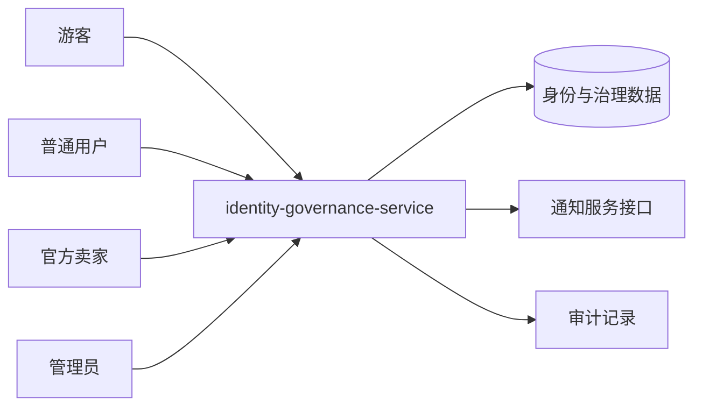

# UC01–UC05 系统级设计总览

## 用例级系统交互图

各用例的系统级顺序图已经分别嵌入对应的设计文档，不再依赖外部 MMD 源文件。

| 用例 | 系统级图所在设计文档 |
|---|---|
| UC01 注册、登录和角色鉴权 | UC01-注册登录与角色鉴权-设计.md |
| UC02 用户资料和地址 | UC02-用户资料与地址-设计.md |
| UC03 商家申请、通过和拒绝 | UC03-商家申请与审核-设计.md |
| UC04 用户封禁、解禁及审计 | UC04-用户封禁解禁与审计-设计.md |
| UC05 举报、拉黑、信用分和审计 | UC05-举报拉黑与信用治理-设计.md |

## 系统边界和外部参与者

## 六服务目标划分

A-E 是交付与测试域，不强制一域一个部署服务。经当前代码和依赖复核，目标为 6 个业务微服务；完整依据见 [微服务划分与依赖设计](architecture/microservice-boundaries.md)。

~~~mermaid
flowchart TB
    Gateway[前端/Nginx/API 入口]
    Identity[identity-governance-service\nUC01-UC05\nuser/address/merchant_application/user_report/user_block/audit/credit]
    Catalog[catalog-shop-service\nUC06-UC10\ncatalog/shop/risk/behavior 内部模块]
    Order[order-service\nUC11-UC15 + UC20]
    Secondhand[secondhand-service\nUC16-UC19]
    Benefits[benefits-finance-service\nUC21-UC23]
    Messaging[messaging-service\nUC24-UC25]
    MySQL[(MySQL 实例)]
    SchemaA[(identity_governance_db)]
    SchemaB[(catalog_shop_db)]
    SchemaC[(order_db)]
    SchemaD[(secondhand_db)]
    SchemaE[(benefits_finance_db)]
    SchemaF[(messaging_db)]
    Gateway --> Identity & Catalog & Order & Secondhand & Benefits & Messaging
    Identity --> SchemaA
    Catalog --> SchemaB
    Order --> SchemaC
    Secondhand --> SchemaD
    Benefits --> SchemaE
    Messaging --> SchemaF
    SchemaA & SchemaB & SchemaC & SchemaD & SchemaE & SchemaF --> MySQL
    Order -. 库存预留 API + idempotency .-> Catalog
    Order -. 支付/退款 API + idempotency .-> Benefits
    Secondhand -. 幂等创建成交订单 .-> Order
    Order & Secondhand & Identity -. 领域事件 .-> Messaging
    Identity -. 签发 JWT；其他服务本地验签 .-> Catalog & Order & Secondhand & Benefits & Messaging
~~~

## 接口契约约束

- 所有修改操作使用对应 HTTP 方法，并保留 `{code,message,data}` 响应格式。
- 登录接口是匿名接口；资料、地址、申请、举报、拉黑、信用查询需要登录。
- 管理员用户、商家申请审核、举报审核、信用调整和审计日志接口需要 `ADMIN` 权限。
- UC01 登录是受保护业务的业务前置，但其他服务本地校验 JWT，不在每次请求中同步调用身份治理服务。
- 修改数据的接口不依赖自动重试；跨服务通知失败不能回滚已经完成的核心审核/治理结果，必须留下日志或待补发状态。
- 具体接口清单、代码位置和测试编号见 `04_tests/UC01-UC05-公开接口与测试映射.md` 和 `02_docs/UC01-UC05-追溯矩阵.md`。
