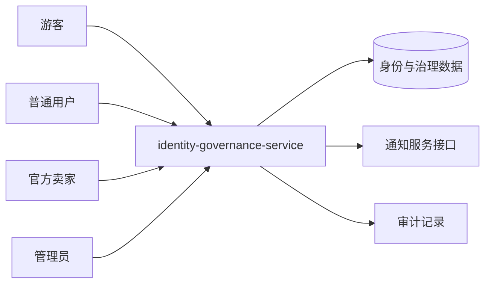

# UC01–UC05 系统级设计

## 编号与图源

| 用例 | 系统级图 | 图源文件 |
|---|---|---|
| UC01 注册、登录和角色鉴权 | SYS01 | `diagrams/UC01-SYS01.mmd` |
| UC02 用户资料和地址 | SYS02 | `diagrams/UC02-SYS02.mmd` |
| UC03 商家申请、通过和拒绝 | SYS03 | `diagrams/UC03-SYS03.mmd` |
| UC04 用户封禁、解禁及审计 | SYS04 | `diagrams/UC04-SYS04.mmd` |
| UC05 举报、拉黑、信用分和审计 | SYS05 | `diagrams/UC05-SYS05.mmd` |

## 系统边界和外部参与者

## 接口契约约束

- 所有修改操作使用对应 HTTP 方法，并保留 `{code,message,data}` 响应格式。
- 登录接口是匿名接口；资料、地址、申请、举报、拉黑、信用查询需要登录。
- 管理员用户、商家申请审核、举报审核、信用调整和审计日志接口需要 `ADMIN` 权限。
- 修改数据的接口不依赖自动重试；跨服务通知失败不能回滚已经完成的核心审核/治理结果，必须留下日志或待补发状态。
- 具体接口清单、代码位置和测试编号见 `04_tests/UC01-UC05-公开接口与测试映射.md` 和 `02_docs/UC01-UC05-追溯矩阵.md`。
