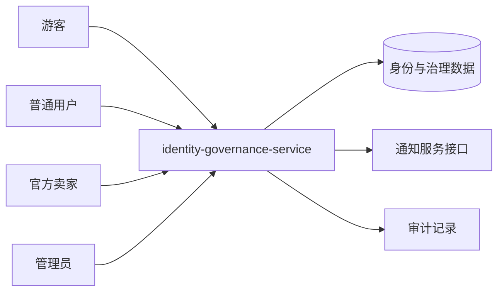

# UC01–UC05 系统级设计总览

## 用例级系统交互图

各用例的系统级顺序图已经分别嵌入对应的设计文档，不再依赖外部 MMD 源文件。

| 用例 | 系统级图所在设计文档 |
|---|---|
| UC01 注册、登录和角色鉴权 | UC01-注册登录与角色鉴权-设计.md |
| UC02 用户资料和地址 | UC02-用户资料与地址-设计.md |
| UC03 商家申请、通过和拒绝 | UC03-商家申请与审核-设计.md |
| UC04 用户封禁、解禁及审计 | UC04-用户封禁解禁与审计-设计.md |
| UC05 举报、拉黑、信用分和审计 | UC05-举报拉黑与信用治理-设计.md |

## 系统边界和外部参与者

## 服务候选划分

~~~mermaid
flowchart TB
    Gateway[前端/Nginx/API 入口]
    Identity[identity-governance-service\nUC01-UC05\nuser/address/merchant_application/user_report/user_block/audit/credit]
    Catalog[catalog-shop-service\nUC06-UC10]
    Order[order-fulfillment-service\nUC11-UC15]
    Secondhand[secondhand-trade-service\nUC16-UC20]
    Engagement[engagement-finance-service\nUC21-UC25]
    MySQL[(MySQL 实例)]
    SchemaA[(identity schema)]
    SchemaB[(catalog schema)]
    SchemaC[(order schema)]
    SchemaD[(secondhand schema)]
    SchemaE[(engagement schema)]
    Gateway --> Identity & Catalog & Order & Secondhand & Engagement
    Identity --> SchemaA
    Catalog --> SchemaB
    Order --> SchemaC
    Secondhand --> SchemaD
    Engagement --> SchemaE
    SchemaA & SchemaB & SchemaC & SchemaD & SchemaE --> MySQL
    Order -. HTTP/Mock + requestId .-> Catalog
    Order -. HTTP + idempotency .-> Engagement
    Secondhand -. create settlement order .-> Order
    Identity -. user summary/JWT contract .-> Catalog & Order & Secondhand & Engagement
~~~

## 接口契约约束

- 所有修改操作使用对应 HTTP 方法，并保留 `{code,message,data}` 响应格式。
- 登录接口是匿名接口；资料、地址、申请、举报、拉黑、信用查询需要登录。
- 管理员用户、商家申请审核、举报审核、信用调整和审计日志接口需要 `ADMIN` 权限。
- 修改数据的接口不依赖自动重试；跨服务通知失败不能回滚已经完成的核心审核/治理结果，必须留下日志或待补发状态。
- 具体接口清单、代码位置和测试编号见 `04_tests/UC01-UC05-公开接口与测试映射.md` 和 `02_docs/UC01-UC05-追溯矩阵.md`。
