# UC06-UC10 用例说明与三层模型

## UC06 商品搜索筛选与详情

| 项目 | 内容 |
|---|---|
| 参与者 | 访客、已登录买家 |
| 触发条件 | 用户输入关键词或打开商品列表 |
| 前置条件 | 商品目录服务可访问；至少存在一个在售商品 |
| 主成功流程 | 输入关键词与筛选条件；系统返回匹配商品；用户选择商品；系统返回在售商品详情 |
| 备选/异常流程 | 无结果时返回空列表；筛选参数非法时返回 400；商品已下架时详情返回不存在 |
| 可验证结果 | 结果仅含 `ON_SALE` 商品，且分类、价格区间、排序条件正确 |

### UC06 系统级图

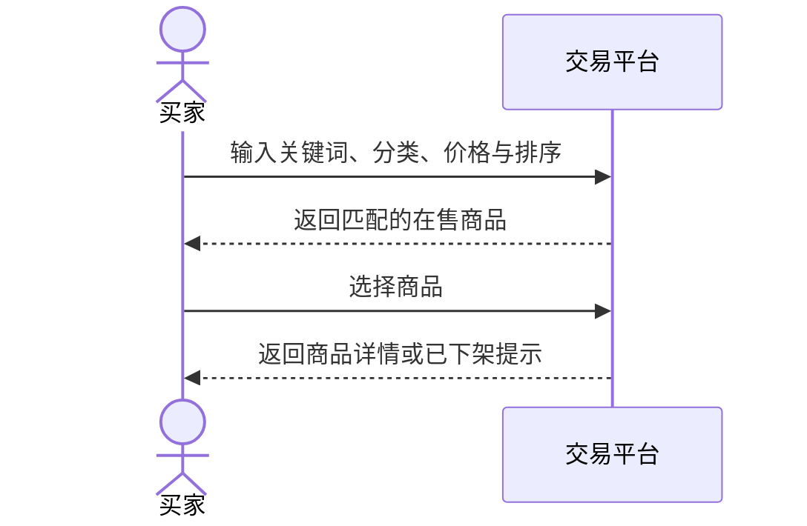

### UC06 组件级图

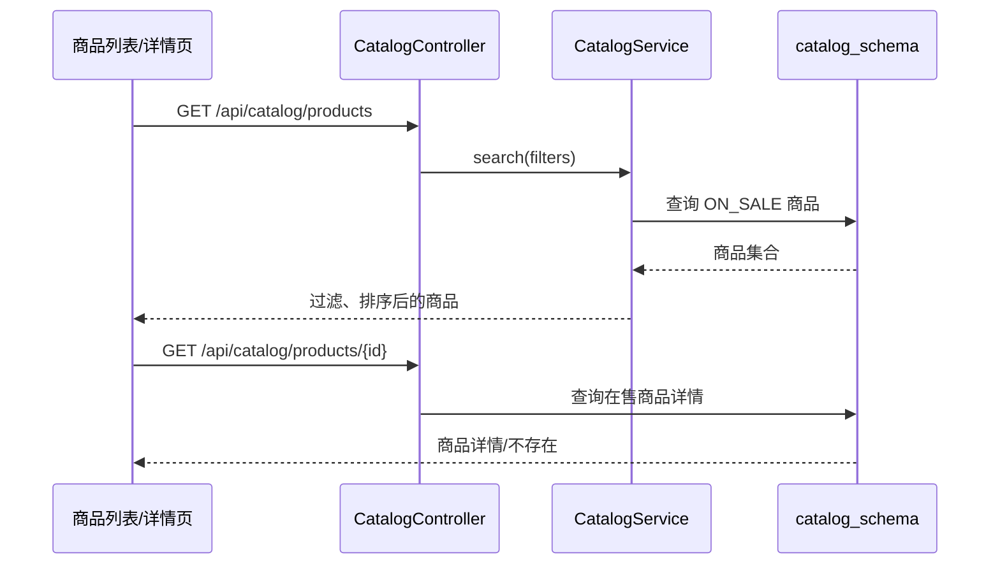

### UC06 对象级图

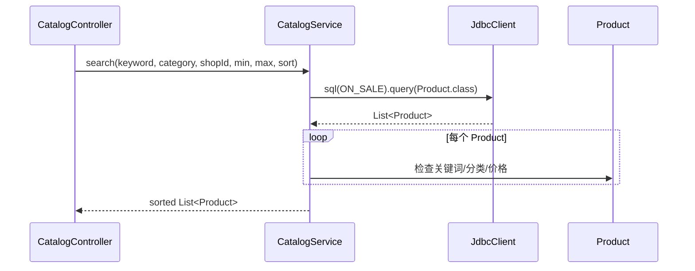

## UC07 卖家商品生命周期

| 项目 | 内容 |
|---|---|
| 参与者 | 卖家；商品风控系统 |
| 触发条件 | 卖家新增、编辑、提交审核、下架或归档商品 |
| 前置条件 | 卖家身份有效且只能操作自己的商品 |
| 主成功流程 | 新建草稿；编辑；提交审核；审核通过后上架；卖家下架或归档 |
| 备选/异常流程 | 非法状态转换被拒绝；风控服务不可用时商品保持待审核并写入 Outbox；审核驳回后可修改重提 |
| 可验证结果 | 状态只按既定状态机变化，越权操作失败，跨服务失败事件可重试 |

### UC07 系统级图

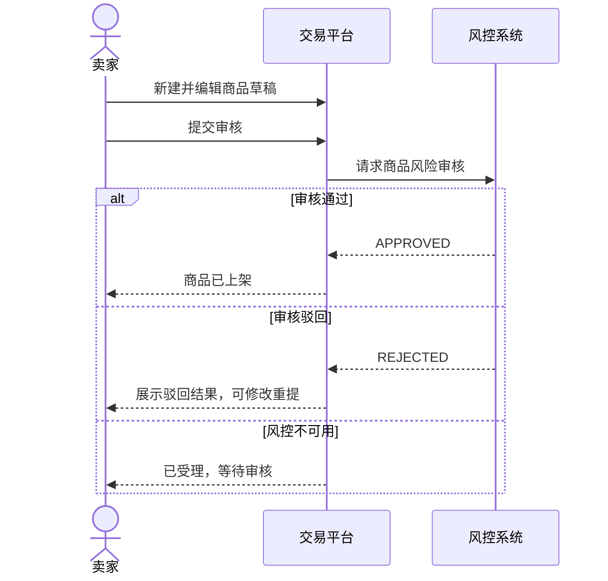

### UC07 组件级图

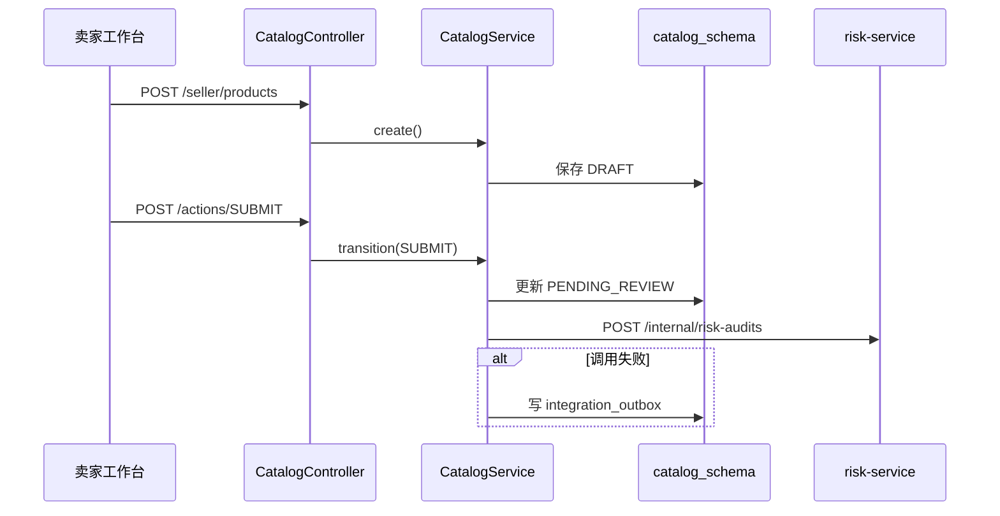

### UC07 对象级图

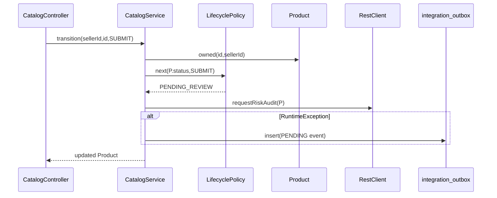

## UC08 店铺查看、设置和装修

| 项目 | 内容 |
|---|---|
| 参与者 | 访客、卖家 |
| 触发条件 | 访客查看店铺；卖家修改店铺信息或装修 |
| 前置条件 | 店铺存在；卖家只能维护本人店铺 |
| 主成功流程 | 访客查看公开店铺和商品；卖家设置名称、公告、营业状态；选择模板并保存 JSON 装修内容 |
| 备选/异常流程 | 店铺关闭时不可公开查看；商品目录不可用时仍返回店铺主体并标注降级；非法模板或装修内容被拒绝 |
| 可验证结果 | 店铺设置持久化；公开页反映最新配置；目录故障不会拖垮店铺服务 |

### UC08 系统级图

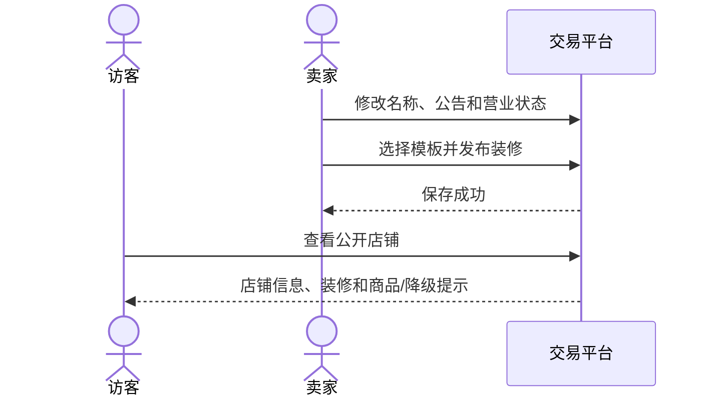

### UC08 组件级图

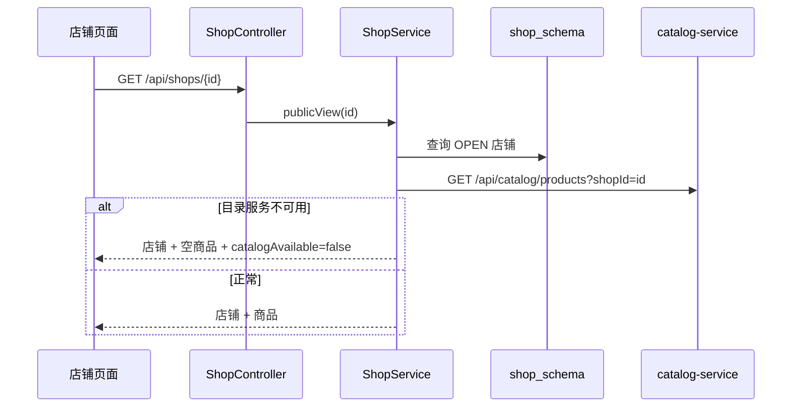

### UC08 对象级图

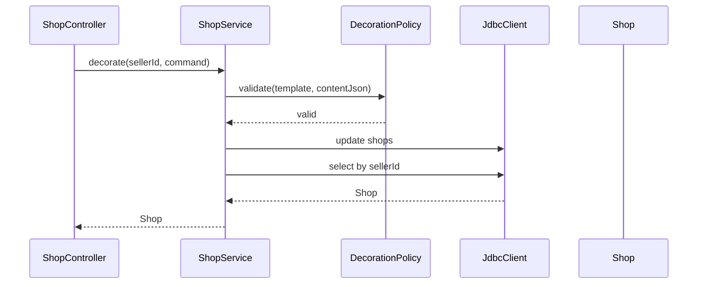

## UC09 商品风险审核

| 项目 | 内容 |
|---|---|
| 参与者 | 风控管理员；商品目录服务 |
| 触发条件 | 商品提交审核 |
| 前置条件 | 商品处于待审核状态；快照包含名称与描述 |
| 主成功流程 | 规则扫描并生成审核单；管理员查看待审列表；通过或填写原因驳回；结果回传商品目录 |
| 备选/异常流程 | 重复决定被拒绝；驳回未填原因被拒绝；回调目录失败时写 Outbox 等待重试 |
| 可验证结果 | 审核单记录风险等级、命中词、管理员、决定和时间，商品最终状态一致 |

### UC09 系统级图

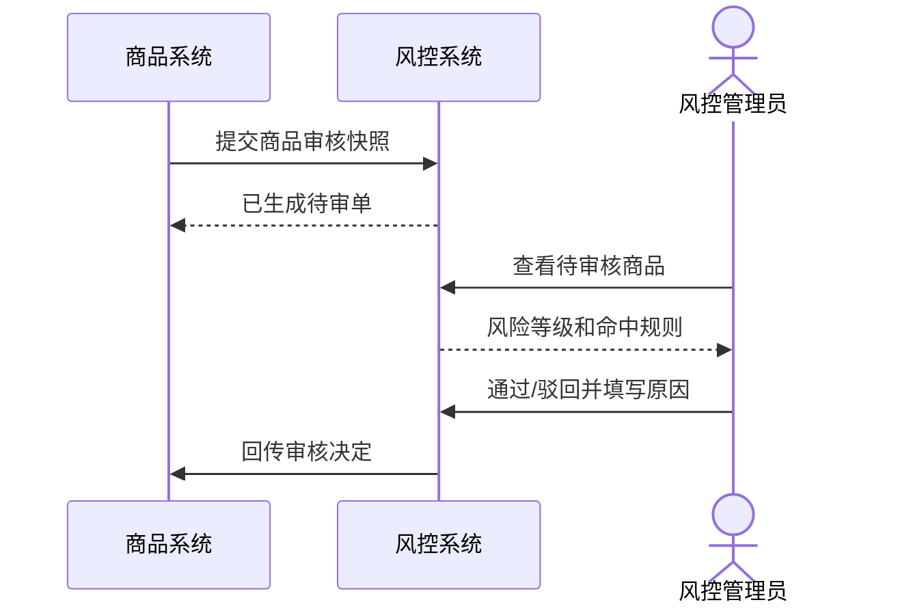

### UC09 组件级图

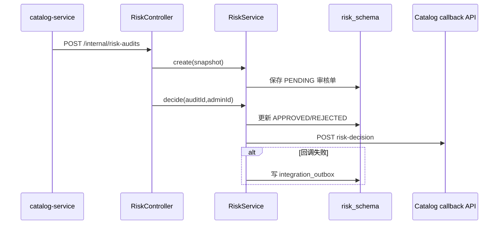

### UC09 对象级图

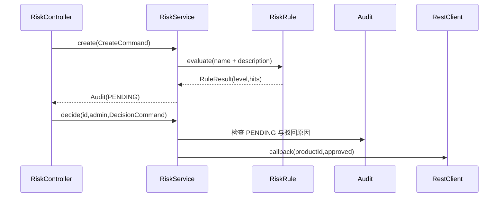

## UC10 浏览记录、搜索历史和热词

| 项目 | 内容 |
|---|---|
| 参与者 | 已登录买家；访客（查看热词） |
| 触发条件 | 用户浏览商品、执行搜索、查看或删除历史 |
| 前置条件 | 记录个人历史时具有用户标识 |
| 主成功流程 | 记录/合并浏览行为；记录并规范化搜索词；查询个人历史；聚合并返回热词；删除或清空浏览记录 |
| 备选/异常流程 | 空白或超长关键词被拒绝；用户不能删除他人的记录；重复浏览移动到最新位置 |
| 可验证结果 | 个人历史按时间倒序；热词按次数排序；删除操作限定当前用户 |

### UC10 系统级图

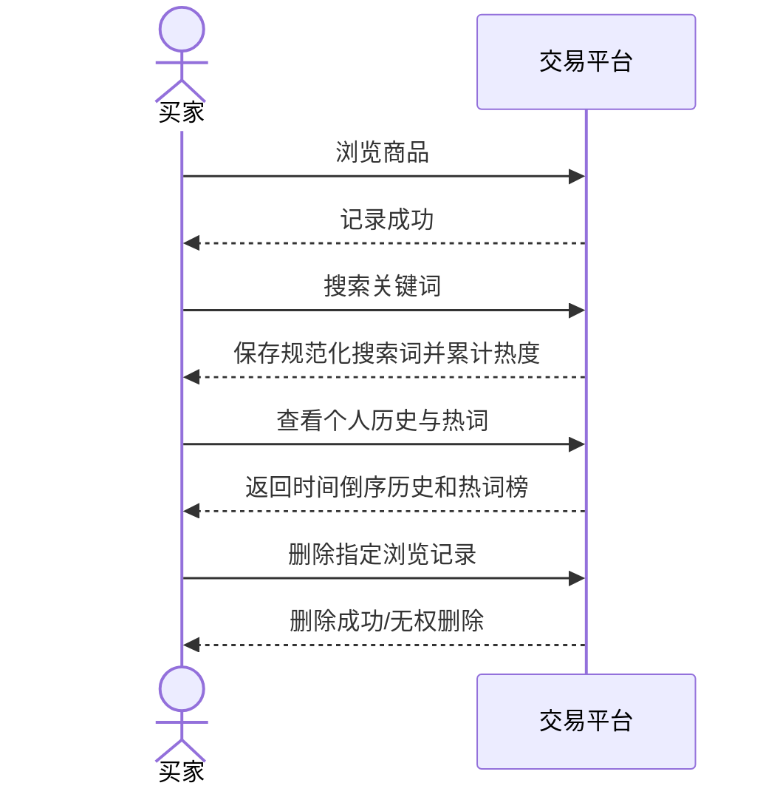

### UC10 组件级图

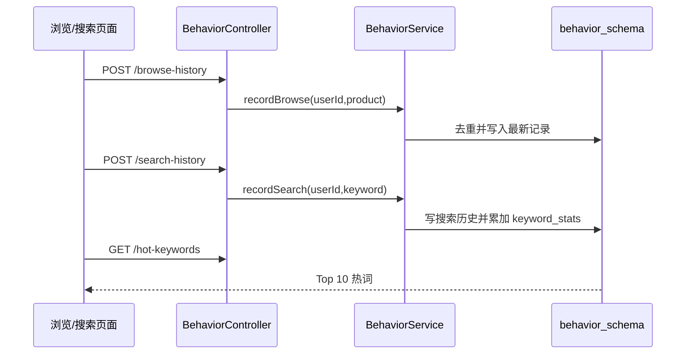

### UC10 对象级图

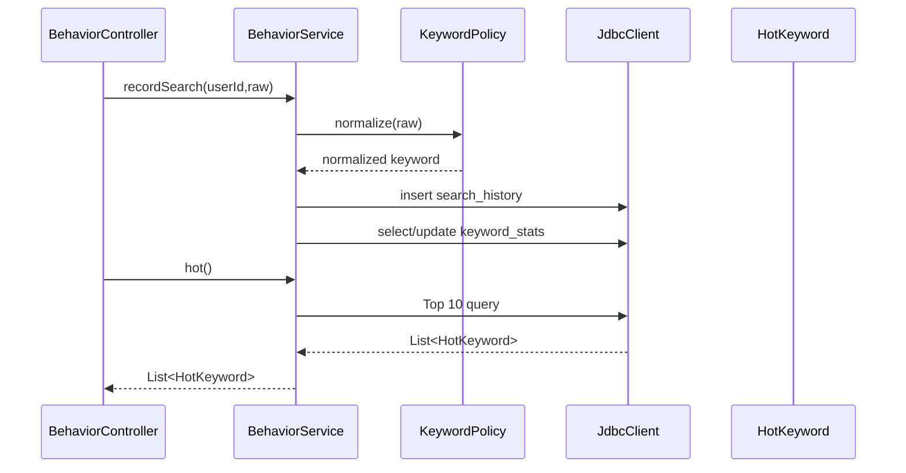
