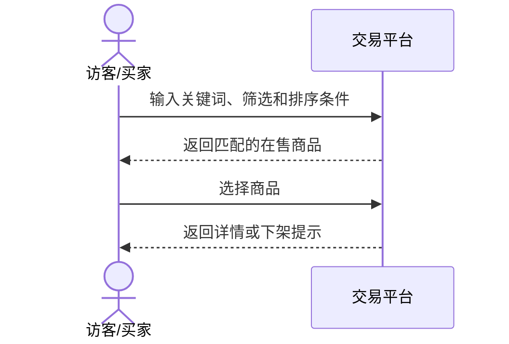
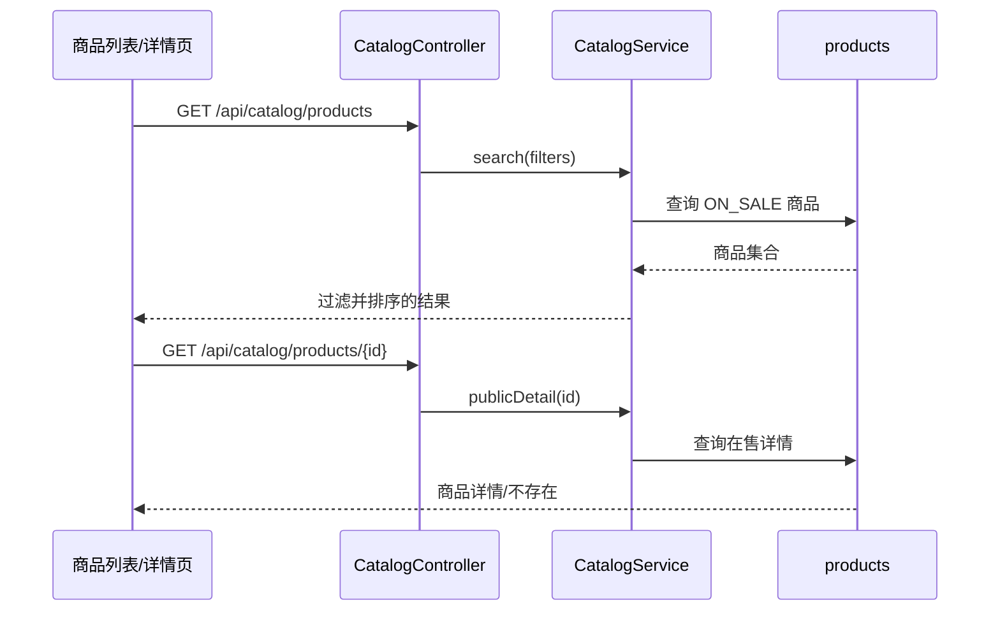

# UC06 商品搜索筛选与详情设计

## 接口设计

| 方法 | 路径 | 参数 | 结果 |
|---|---|---|---|
| GET | `/api/catalog/products` | `keyword`、`category`、`shopId`、`minPrice`、`maxPrice`、`sort` | 匹配的在售商品数组 |
| GET | `/api/catalog/products/{id}` | 商品 ID | 在售商品详情或 `PRODUCT_NOT_FOUND` |

数据由 `catalog-service` 独占，表为 `products`。公开查询必须包含 `status='ON_SALE'` 约束。

## 系统级交互

## 组件级交互

## 对象与规则

- `CatalogController`：解析 HTTP 参数并返回响应。
- `CatalogService.search`：规范化关键词，执行分类、店铺、价格筛选和排序。
- `CatalogService.publicDetail`：只返回 `ON_SALE` 商品。
- `Product`：商品查询结果对象。
- `CatalogErrorHandler`：将领域异常转换为稳定错误码。
