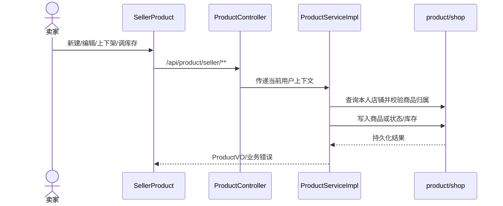

# UC07 卖家商品生命周期设计

- 需求：`REQ07 / UC07`
- 所属领域：Domain B
- 当前实现边界：单体后端 `ProductController` + `ProductServiceImpl`。历史分支中的独立 CatalogLifecycle 微服务材料不作为当前设计来源。

## 系统级流程

## 组件职责

| 组件 | 责任 |
| --- | --- |
| `ProductController` | 提供卖家列表、详情、新建、编辑、删除、状态和库存接口。 |
| `ProductServiceImpl` | 校验当前卖家店铺、商品归属、分类关系、价格和库存，再执行写操作。 |
| `ShopMapper` | 将当前用户解析为店铺，作为所有权边界。 |
| `ProductMapper` | 查询和持久化商品；失败校验不得调用写操作。 |
| `CategoryService` | 验证主分类/子分类关系。 |

## 接口与状态

| 方法 | 路径 | 作用 |
| --- | --- | --- |
| GET | `/api/product/seller/list` | 查询当前卖家商品分页。 |
| GET | `/api/product/seller/{productId}` | 查询本人商品详情。 |
| POST | `/api/product/seller` | 创建并绑定当前店铺。 |
| PUT | `/api/product/seller/{productId}` | 编辑本人商品。 |
| DELETE | `/api/product/seller/{productId}` | 删除本人商品。 |
| POST | `/api/product/seller/{productId}/status` | 切换 `ON_SHELF/OFF_SHELF`。 |
| POST | `/api/product/seller/{productId}/stock/adjust` | 按增量调整库存，结果不得小于零。 |

## 验证与证据

当前单元测试 `ProductServiceImplTest` 5 条通过，覆盖价格区间、公开下架详情、创建店铺绑定、负库存拒绝和卖家分页隔离。真实浏览器流程文件虽存在，本轮不以其作为新 E2E 结果。
