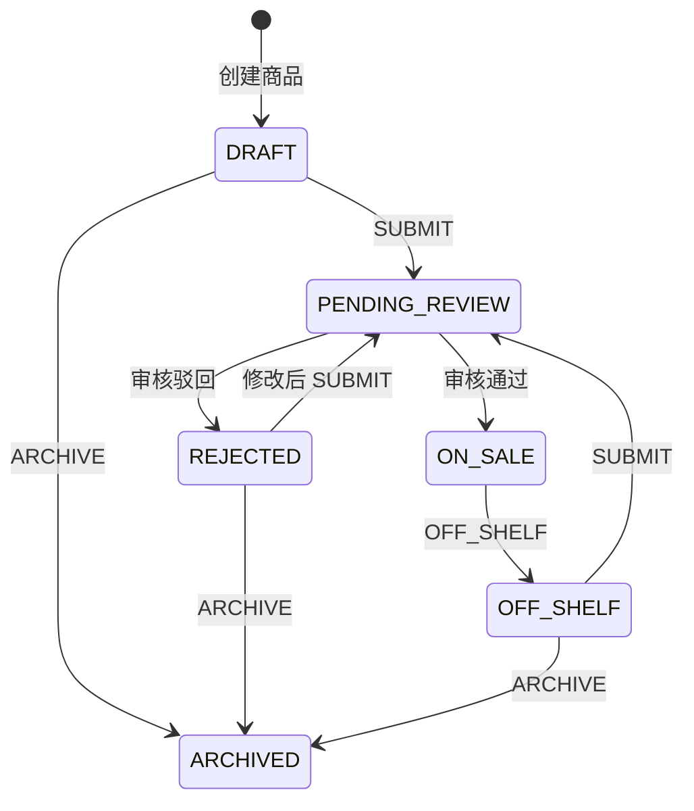
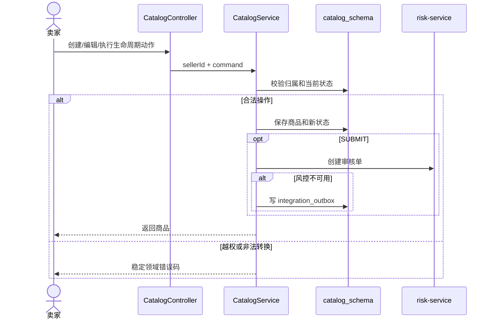

# UC07 卖家商品生命周期设计

## 接口设计

| 方法 | 路径 | 作用 |
|---|---|---|
| GET | `/api/catalog/seller/products` | 查询当前卖家的商品 |
| POST | `/api/catalog/seller/products` | 创建 `DRAFT` 商品 |
| PUT | `/api/catalog/seller/products/{id}` | 编辑允许状态下的本人商品 |
| POST | `/api/catalog/seller/products/{id}/actions/{action}` | 执行 `SUBMIT`、`OFF_SHELF`、`ARCHIVE` |
| POST | `/api/catalog/internal/products/{id}/risk-decision` | 应用审核通过或驳回结果 |

卖家接口通过 `X-Seller-Id` 接收网关传递的受信身份。生产环境必须阻止公网直接访问内部审核决定接口。

## 状态模型

## 组件交互

## 核心对象与规则

- `CatalogController`：卖家 HTTP 接口、参数校验和身份头解析。
- `CatalogService`：商品归属校验、创建、编辑、状态持久化和 Outbox 降级。
- `LifecyclePolicy`：集中定义允许的状态转换。
- `ProductCommand`：创建和编辑商品的命令对象。
- `integration_outbox`：风控调用失败时保存待重试事件。
