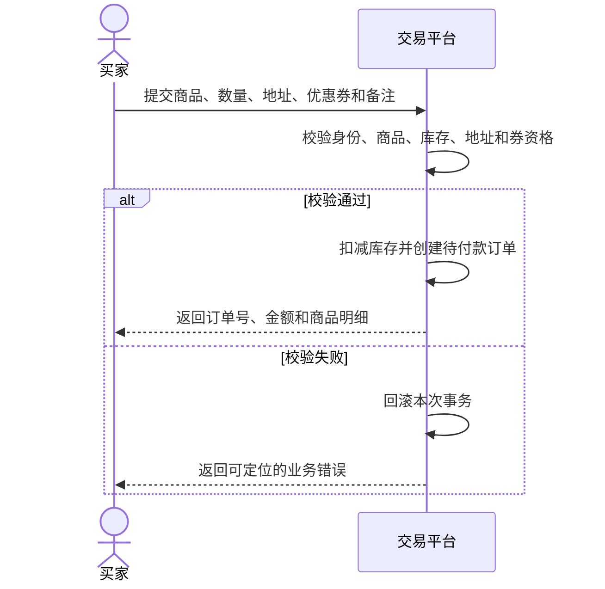
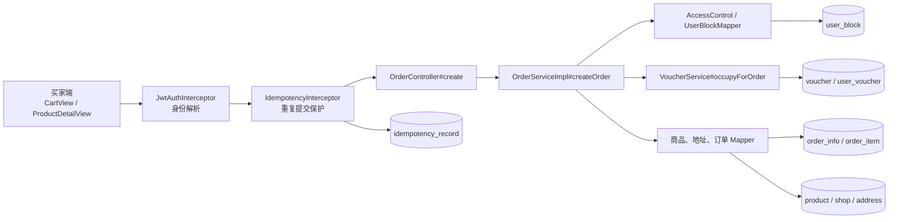

# UC11 购物车结算与创建订单——组件级设计

## 设计范围

本文对应 `REQ11 / UC11`，覆盖新品购物车或立即购买创建待付款订单。支付、取消和支付后拆单归 `UC12`。

## 业务流程

## 组件图

独立 Mermaid 源文件：[diagrams/UC11-COMP11.mmd](diagrams/UC11-COMP11.mmd)。

## 组件职责与归属

| 层级 | 组件 | 职责 | 归属 |
|---|---|---|---|
| 前端 | `CartView.vue`、`ProductDetailView.vue`、`AddressManager.vue` | 采集商品、数量、地址、优惠券和备注，展示服务端计算结果 | 订单结算前端 |
| API | `OrderController#create` | 接收并校验 `CreateOrderRequest`，调用订单服务，返回 `Result<OrderVO>` | 订单域 |
| 横切 | `JwtAuthInterceptor`、`IdempotencyInterceptor`、`TraceIdInterceptor` | 身份解析、重复提交保护和链路标识 | 平台基础设施 |
| 领域服务 | `OrderServiceImpl#createOrder` | 合并商品项、读取服务端价格、校验库存与权限、扣库存、创建订单主从记录 | 订单域 |
| 协作服务 | `VoucherService#occupyForOrder` | 校验并占用优惠券，计算商家/平台承担额与应付金额 | 优惠券域 |
| 数据访问 | `ProductMapper`、`ShopMapper`、`AddressMapper`、`OrderInfoMapper`、`OrderItemMapper`、`UserBlockMapper` | 访问商品、店铺、地址、订单和屏蔽关系 | 各实体所属域 |

## 数据表归属

| 表 | 所属组件 | UC11 中的职责 |
|---|---|---|
| `order_info`、`order_item` | 订单域 | 保存待付款订单聚合与明细 |
| `product`、`shop` | 商品/店铺域 | 提供可信价格、库存和卖家归属；扣减库存 |
| `address` | 用户域 | 校验收货地址属于当前买家并复制快照 |
| `voucher`、`user_voucher` | 优惠券域 | 校验、占用优惠券并保存折扣分摊 |
| `user_block` | 访问控制 | 拒绝被屏蔽的买卖关系 |
| `idempotency_record` | 平台基础设施 | 保存幂等键执行状态和首次响应 |

## API 合约

| 方法与路径 | 请求 | 成功结果 | 主要失败 |
|---|---|---|---|
| `POST /api/order/create` | `items[]`、可选 `addressId`、`voucherId`、`remark` | `code=0`；订单为 `PENDING_PAY(0)`、`payStatus=0`，金额和明细来自服务端 | 参数非法、商品不存在/下架、库存不足、地址越权、本人商品、屏蔽关系、优惠券不可用 |

## 事务与安全约束

- `createOrder` 使用 `@Transactional(rollbackFor = Exception.class)`；库存、订单主从记录和优惠券占用必须共同提交或回滚。
- 前端价格不进入可信计算，服务端以 `product.price` 和合并后的数量重新计价。
- `addressId` 必须属于当前用户；卖家归属和屏蔽关系由服务端查询确定。
- 相同 `Idempotency-Key` 的重复请求只允许产生一个订单和一次库存扣减。

## 测试接口

独立计划见 [../04_tests/UC11-API测试计划.md](../04_tests/UC11-API测试计划.md)，需求映射见 [UC11-追溯矩阵.md](UC11-追溯矩阵.md)。
