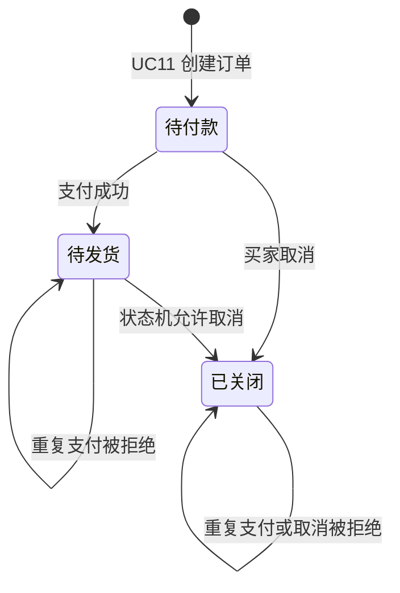
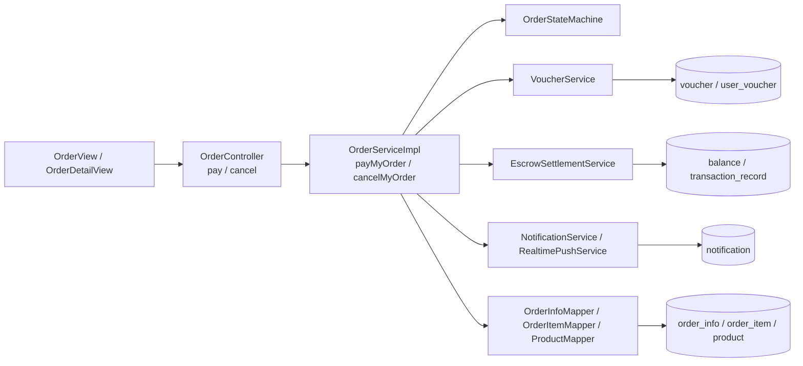

# UC12 订单支付与取消——组件级设计

## 设计范围

本文对应 `REQ12 / UC12`，覆盖本人订单支付、支付后按商品拆单以及允许阶段的订单取消和资源回滚。

## 状态流程

## 组件图

独立 Mermaid 源文件：[diagrams/UC12-COMP12.mmd](diagrams/UC12-COMP12.mmd)。

## 组件职责与归属

| 层级 | 组件 | 职责 | 归属 |
|---|---|---|---|
| 前端 | `OrderView.vue`、`OrderDetailView.vue` | 发起支付/取消并按状态控制按钮 | 订单前端 |
| API | `OrderController#pay`、`cancel` | 暴露支付和取消 HTTP 合约 | 订单域 |
| 领域服务 | `OrderServiceImpl#payMyOrder`、`cancelMyOrder`、`splitPaidOrderByItem`、`restoreStockForNewItems` | 校验归属和版本、更新状态、拆单、回滚库存 | 订单域 |
| 规则组件 | `OrderStateMachine` | 约束支付/取消允许的订单状态 | 订单域 |
| 协作服务 | `VoucherService` | 支付后核销、未支付取消时释放优惠券 | 优惠券域 |
| 资金服务 | `EscrowSettlementService` | 商城币扣款与交易流水 | 结算域 |
| 消息组件 | `NotificationService`、`RealtimePushService` | 通知卖家并推送状态变化 | 通知域 |

## 数据表归属

| 表 | 所属组件 | UC12 中的职责 |
|---|---|---|
| `order_info`、`order_item` | 订单域 | 保存支付/取消状态、版本和支付后拆分结果 |
| `product` | 商品域 | 未支付订单取消时回补库存并按需重新上架 |
| `voucher`、`user_voucher` | 优惠券域 | 支付核销或取消释放 |
| `balance`、`transaction_record` | 结算域 | 商城币扣款和可审计流水 |
| `notification` | 通知域 | 保存订单支付或取消通知 |
| `idempotency_record` | 平台基础设施 | 防止重复支付或取消产生二次副作用 |

## API 合约

| 方法与路径 | 成功结果 | 主要失败 |
|---|---|---|
| `POST /api/order/{id}/pay` | `orderStatus=1`、`payStatus=1`，按商品形成独立履约订单 | 非买家、非待付款、余额不足、空订单、版本冲突 |
| `POST /api/order/{id}/cancel` | `orderStatus=9`；未支付订单回补库存并释放券 | 非买家、不允许取消的状态、版本冲突 |

## 一致性约束

- `order_status + version` 参与条件更新，重复或并发请求最多一次成功。
- 支付拆分后，子订单总额、优惠额、商家承担额和平台承担额分别守恒。
- 只有 `pay_status=0` 的取消才回补库存和释放优惠券。
- 余额、流水、订单、优惠券和通知中的持久化失败必须触发事务回滚。

## 测试接口

独立报告见 [../04_tests/UC12/UC12-订单支付与取消-测试报告.md](../04_tests/UC12/UC12-订单支付与取消-测试报告.md)，需求映射见 [UC12-订单支付与取消-追溯矩阵.md](UC12-订单支付与取消-追溯矩阵.md)。
