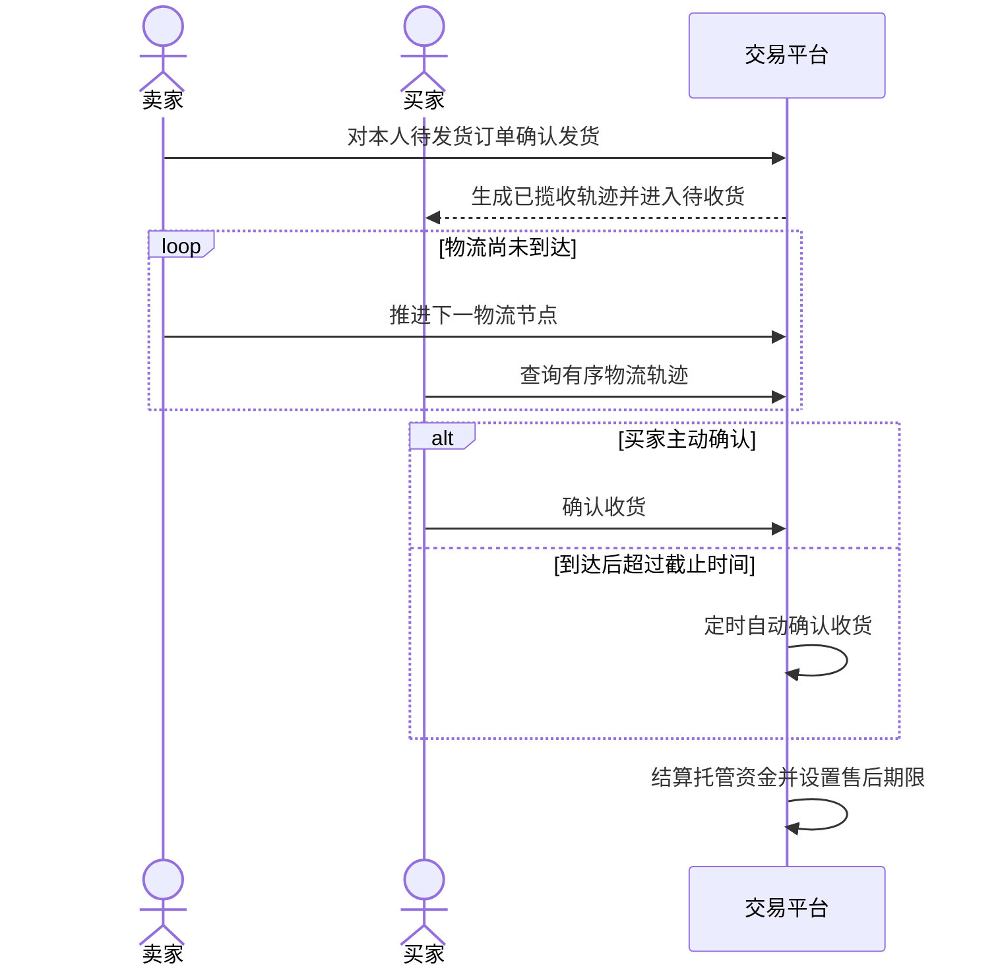
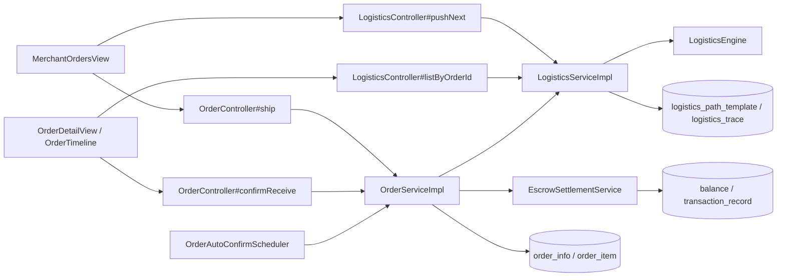

# UC13 订单发货、物流与收货——组件级设计

## 设计范围

本文对应 `REQ13 / UC13`，覆盖新品订单的卖家发货、物流初始化/推进/查询、买家确认收货和超时自动确认结算。

## 业务流程

## 组件图

独立 Mermaid 源文件：[diagrams/UC13-COMP13.mmd](diagrams/UC13-COMP13.mmd)。

## 组件职责与归属

| 层级 | 组件 | 职责 | 归属 |
|---|---|---|---|
| 前端 | `MerchantOrdersView.vue`、`OrderView.vue`、`OrderDetailView.vue`、`OrderTimeline.vue` | 发货、推进、展示轨迹和确认收货 | 订单/物流前端 |
| API | `OrderController#ship`、`confirmReceive` | 发货和人工确认 HTTP 合约 | 订单域 |
| API | `LogisticsController#pushNext`、`listByOrderId` | 物流推进和轨迹查询 HTTP 合约 | 物流域 |
| 订单服务 | `OrderServiceImpl#shipSellerOrder`、`confirmReceiveMyOrder`、`autoConfirmReceiveForSystem` | 权限、状态更新、人工/自动确认与结算编排 | 订单域 |
| 物流服务 | `LogisticsServiceImpl`、`LogisticsEngine` | 路径模板生成/复用、首轨迹、节点推进和可见性校验 | 物流域 |
| 定时任务 | `OrderAutoConfirmScheduler` | 扫描已到达且超过截止时间的订单 | 订单调度 |
| 资金服务 | `EscrowSettlementService` | 按商品类型释放托管资金并写流水 | 结算域 |

## 数据表归属

| 表 | 所属组件 | UC13 中的职责 |
|---|---|---|
| `order_info`、`order_item` | 订单域 | 保存发货、到达、自动确认和收货状态/时间 |
| `logistics_path_template`、`logistics_trace` | 物流域 | 保存路径模板和按时间排序的轨迹 |
| `product`、`shop`、`secondhand_product` | 商品域 | 解析实际卖家、仓库地址和结算主体 |
| `balance`、`transaction_record` | 结算域 | 确认收货后的资金结算 |
| `notification` | 通知域 | 保存发货、收货和自动确认通知 |

## API 合约

| 方法与路径 | 成功结果 | 主要失败 |
|---|---|---|
| `POST /api/order/{id}/ship` | `orderStatus=2`，生成首条“已揽收”轨迹 | 非卖家、非待发货、遗留合并订单 |
| `POST /api/logistics/push-next` | 返回新轨迹；到终点时标记 `ARRIVED` | 非卖家、无模板、已到终点 |
| `GET /api/logistics/order/{id}/trace` | 买家或卖家获得有序轨迹 | 无关用户越权 |
| `POST /api/order/{id}/confirm-receive` | `orderStatus=3`，资金只结算一次 | 非买家、非待收货、版本冲突 |

## 一致性约束

- 首次发货只接受拆分后的单商品待发货订单；重复发货只补齐物流初始化。
- 物流轨迹按时间和 ID 排序，查询权限限买家和实际商品卖家。
- 人工确认和自动确认共享 `finalizeReceipt` 结算路径，并使用版本条件更新避免双结算。
- 轨迹写入、订单状态、余额和流水任何一项失败都不得留下部分成功。

## 测试接口

独立计划见 [../04_tests/UC13-API测试计划.md](../04_tests/UC13-API测试计划.md)，需求映射见 [UC13-追溯矩阵.md](UC13-追溯矩阵.md)。
