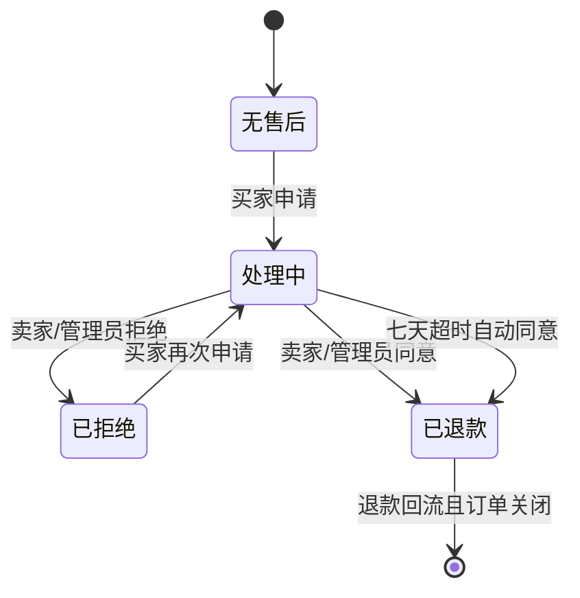
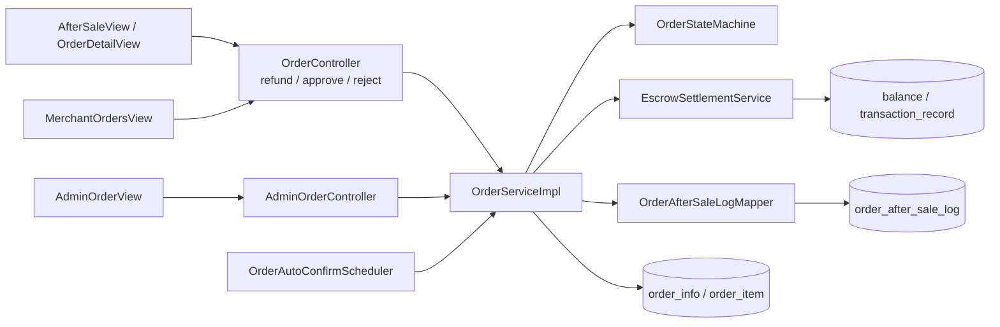

# UC14 订单售后退款——组件级设计

## 设计范围

本文对应 `REQ14 / UC14`，覆盖买家申请仅退款/退货退款，卖家或管理员处理，以及七天超时自动退款、资金回流和售后审计。

## 状态流程

## 组件图

独立 Mermaid 源文件：[diagrams/UC14-COMP14.mmd](diagrams/UC14-COMP14.mmd)。

## 组件职责与归属

| 层级 | 组件 | 职责 | 归属 |
|---|---|---|---|
| 前端 | `AfterSaleView.vue`、`OrderDetailView.vue`、`MerchantOrdersView.vue`、`AdminOrderView.vue` | 申请、处理、展示决定和日志 | 售后前端 |
| 买卖双方 API | `OrderController#refund`、`approveRefund`、`rejectRefund` | 买家申请、卖家同意或拒绝 | 订单售后域 |
| 管理 API | `AdminOrderController#approveRefund`、`rejectRefund`、售后日志查询 | 管理员处理和审计查询 | 管理/售后域 |
| 领域服务 | `OrderServiceImpl` 的退款申请、卖家/管理员决策、自动审批方法 | 状态条件更新、资金编排、日志和通知 | 订单售后域 |
| 规则组件 | `OrderStateMachine` | 订单状态和退款状态允许矩阵 | 订单域 |
| 定时任务 | `OrderAutoConfirmScheduler#autoApproveTimeoutRefundOrders` | 扫描超过七天的处理中申请 | 售后调度 |
| 资金服务 | `EscrowSettlementService` | 买家退款、已结算卖家扣回和流水 | 结算域 |
| 审计访问 | `OrderAfterSaleLogMapper` | 保存 `APPLY/APPROVE/REJECT` 动作 | 售后审计 |

## 数据表归属

| 表 | 所属组件 | UC14 中的职责 |
|---|---|---|
| `order_info`、`order_item` | 订单域 | 保存申请、决定、处理人/来源/说明/时间和版本 |
| `order_after_sale_log` | 售后审计 | 保存完整动作序列 |
| `balance`、`transaction_record` | 结算域 | 退款回流、卖家扣回和唯一流水 |
| `product`、`shop` | 商品/店铺域 | 校验卖家归属，未发货仅退款时回补库存 |
| `notification` | 通知域 | 保存申请和决定通知 |
| `idempotency_record` | 平台基础设施 | 避免重复申请或处理产生二次退款 |

## API 合约

| 方法与路径 | 成功结果 | 主要失败 |
|---|---|---|
| `POST /api/order/{id}/refund` | 一般申请 `refundStatus=1`；待发货仅退款可直接批准并关闭 | 非买家、未支付/已关闭、超过售后期、重复申请、方式不合法 |
| `POST /api/order/{id}/refund/approve|reject` | 卖家同意为 `refundStatus=2`/关闭；拒绝为 `refundStatus=3` | 非卖家、非处理中、版本冲突 |
| `POST /api/admin/orders/{id}/refund/approve|reject` | 管理员处理并记录来源和说明 | 非管理员、参数超长、非处理中 |
| `GET /api/admin/orders/{id}/after-sale-logs` | 返回按动作时间排序的审计日志 | 无权限、订单不存在 |

## 一致性约束

- 退款状态只允许 `NONE/REJECTED -> PROCESSING -> APPROVED/REJECTED`。
- 决定来源、操作者、说明、时间和售后日志必须在同一事务中保持一致。
- `refund_status + version` 参与条件更新，并发同意最多一次成功。
- 退款余额、卖家扣回、交易流水、订单关闭和库存回补不得出现部分成功。

## 测试接口

独立计划见 [../04_tests/UC14-API测试计划.md](../04_tests/UC14-API测试计划.md)，需求映射见 [UC14-追溯矩阵.md](UC14-追溯矩阵.md)。
