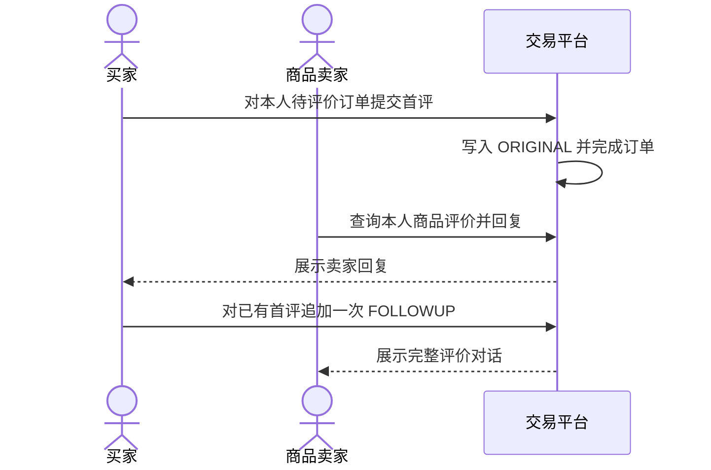
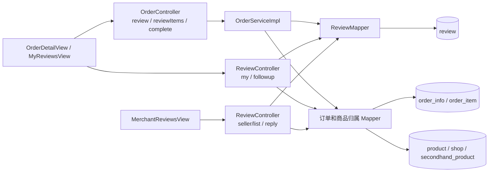

# UC15 订单评价、追评与商家回复——组件级设计

## 设计范围

本文对应 `REQ15 / UC15`，覆盖订单级/逐商品首评、订单完成、买家追评、卖家回复和双方分页查询。

## 业务流程

## 组件图

独立 Mermaid 源文件：[diagrams/UC15-COMP15.mmd](diagrams/UC15-COMP15.mmd)。

## 组件职责与归属

| 层级 | 组件 | 职责 | 归属 |
|---|---|---|---|
| 前端 | `OrderDetailView.vue`、`MyReviewView.vue`、`MyReviewsView.vue` | 首评、追评和买家查询 | 评价前端 |
| 前端 | `MerchantReviewView.vue`、`MerchantReviewsView.vue` | 卖家筛选、查看和回复 | 商家评价前端 |
| API | `OrderController#review`、`reviewItems`、`complete` | 首评和订单完成 HTTP 合约 | 订单域 |
| API | `ReviewController#pageMyReviews`、`pageSellerReviews`、`followup`、`reply` | 查询、追评和回复 | 评价域 |
| 领域服务 | `OrderServiceImpl#submitMyOrderReview`、`submitMyOrderItemReviews` | 首评写入和订单完成事务 | 订单/评价协作域 |
| 数据访问 | `ReviewMapper` | 保存/查询 `ORIGINAL`、`FOLLOWUP` 和回复字段 | 评价域 |
| 权限访问 | `OrderInfoMapper`、`OrderItemMapper`、`ProductMapper`、`ShopMapper`、`SecondhandProductMapper` | 校验买家、订单商品和实际卖家归属 | 订单/商品域 |

> 当前实现的追评、回复和评价查询逻辑直接位于 `ReviewController` 并访问多个 Mapper，尚无独立 `ReviewService`。这是现状归属，不应误写为已经存在的服务层；后续写操作应优先下沉到事务化评价服务。

## 数据表归属

| 表 | 所属组件 | UC15 中的职责 |
|---|---|---|
| `review` | 评价域 | 保存首评、追评、评分、内容、卖家回复及时间 |
| `order_info`、`order_item` | 订单域 | 校验待评价和订单商品，首评后原子完成订单 |
| `product`、`shop` | 新品域 | 校验新品评价对应店铺卖家 |
| `secondhand_product` | 二手域 | 校验二手商品卖家 |
| `notification` | 通知域 | 保存新评价通知 |

## API 合约

| 方法与路径 | 成功结果 | 主要失败 |
|---|---|---|
| `POST /api/order/{id}/review` | 为订单商品写 `ORIGINAL`，返回 `orderStatus=4` | 非买家、非待评价、重复首评、评分/内容非法 |
| `POST /api/order/{id}/review/items` | 按商品写不同评分和内容并完成订单 | 商品不属于订单、重复明细、任一参数非法 |
| `GET /api/review/my`、`GET /api/review/seller/list` | 返回权限范围内的分页评价 | 跨用户/跨卖家数据泄露必须被阻止 |
| `POST /api/review/followup` | 对已有首评写一条 `FOLLOWUP` | 无首评、重复追评、非订单买家 |
| `POST /api/review/{id}/reply` | 保存实际商品卖家的回复和时间 | 非商品所有者、评价不存在、内容非法 |

## 一致性与改进约束

- 首评批量写入与订单完成处于同一事务；任一评价插入失败时全部回滚。
- 每个订单商品最多一条 `ORIGINAL` 和一条依附它的 `FOLLOWUP`。
- 回复权限必须由商品实际所有权确定，不能只依赖前端角色。
- 在抽取 `ReviewService` 前，必须用 API/集成测试保护 Controller 直连 Mapper 的现有边界。

## 测试接口

独立计划见 [../04_tests/UC15/UC15-订单评价追评与回复-测试报告.md](../04_tests/UC15/UC15-订单评价追评与回复-测试报告.md)，需求映射见 [UC15-订单评价追评与回复-追溯矩阵.md](UC15-订单评价追评与回复-追溯矩阵.md)。
