# UC16-UC20 用例说明与三层模型

## UC16 二手商品发布和管理

| 项目 | 内容 |
|---|---|
| 参与者 | 已登录用户、二手商品卖家 |
| 触发条件 | 用户进入二手商城并发布、编辑、上下架或删除自己的闲置商品 |
| 前置条件 | 用户身份有效；二手分类可用；商品名称、价格、成色、图片等字段满足校验 |
| 主成功流程 | 用户填写闲置信息；系统保存二手商品；商品进入在售或待管理状态；卖家可查看、编辑、上下架和删除本人商品 |
| 备选/异常流程 | 分类缺失或必填项为空时拒绝发布；非卖家本人操作返回无权；已成交商品不允许再次上架 |
| 可验证结果 | `secondhand_product` 新增或更新正确；列表只展示有权限的数据；商品状态按规则变化 |

### UC16 系统级图

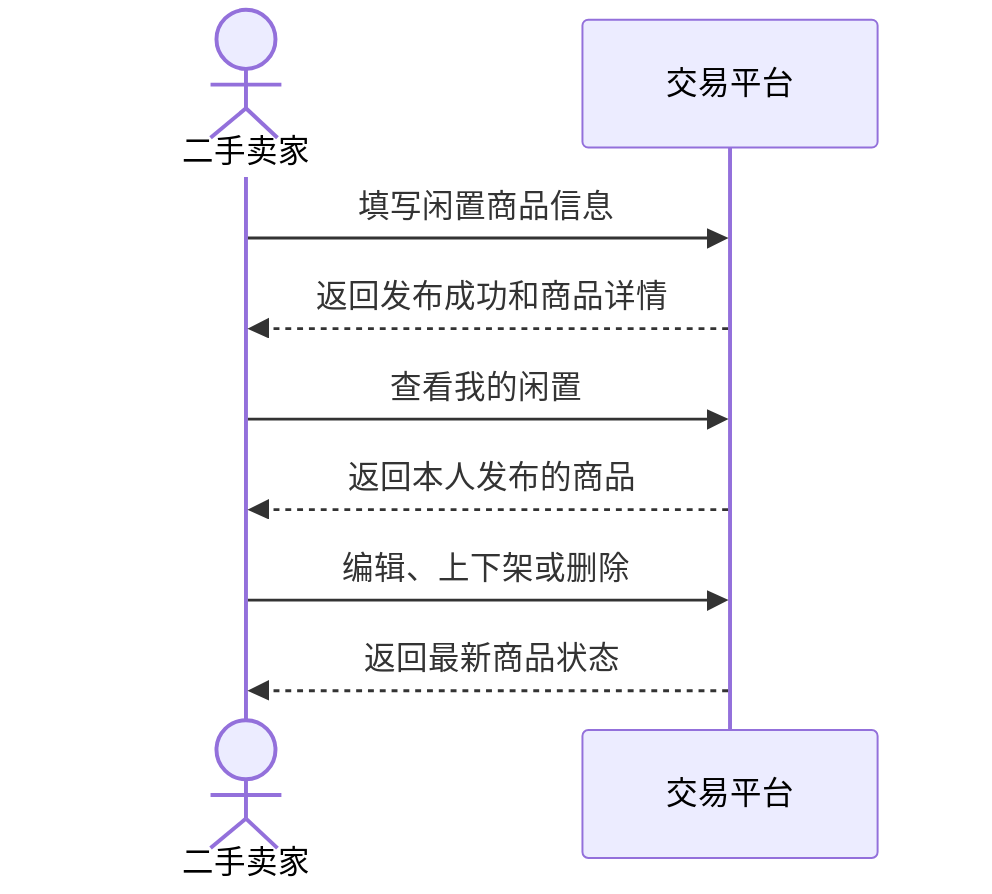

### UC16 组件级图

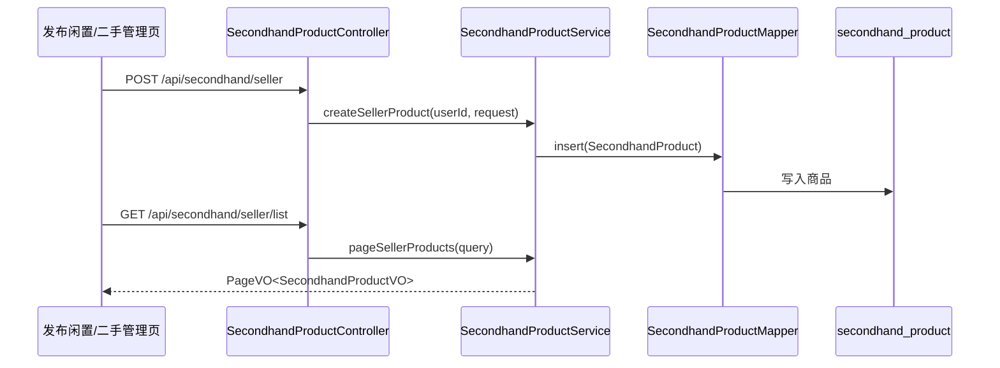

### UC16 对象级图

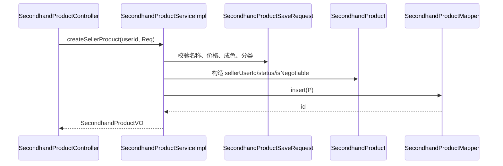

## UC17 二手直接购买

| 项目 | 内容 |
|---|---|
| 参与者 | 买家、二手卖家 |
| 触发条件 | 买家在二手商品详情页点击立即购买 |
| 前置条件 | 商品在售；买家不是卖家本人；买家有收货地址；商品未处于已成交状态 |
| 主成功流程 | 买家确认地址；系统创建二手订单；买家完成模拟支付；订单进入待发货 |
| 备选/异常流程 | 自买被拒绝；商品已下架或已成交时拒绝下单；付款前可取消订单 |
| 可验证结果 | 生成 `SECONDHAND` 订单；订单初始为待付款，支付后为待发货；商品与订单明细关联正确 |

### UC17 系统级图

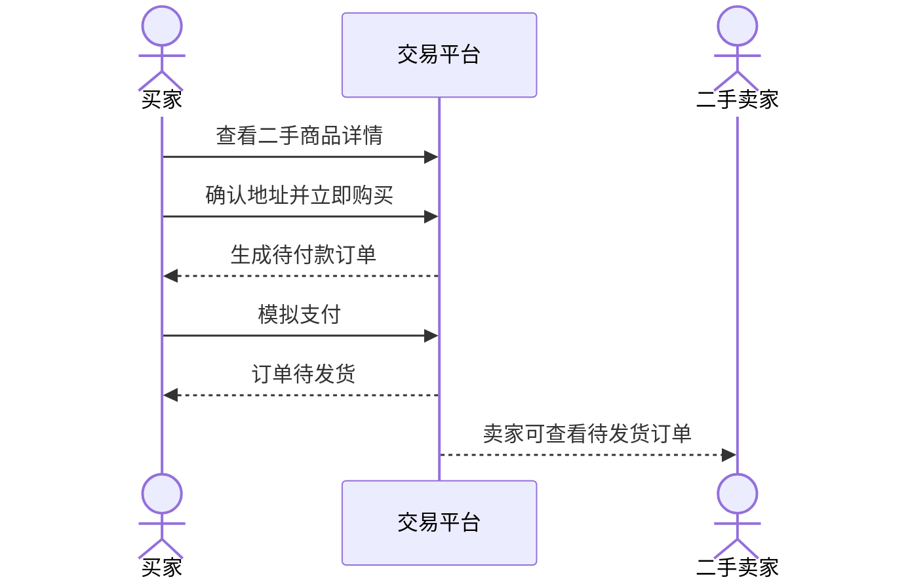

### UC17 组件级图

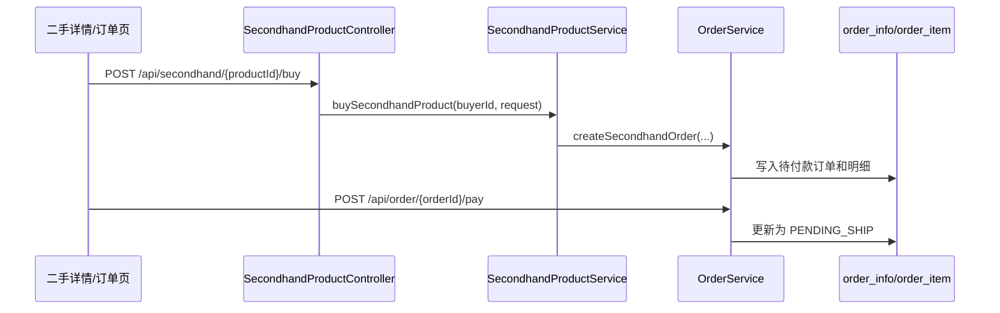

### UC17 对象级图

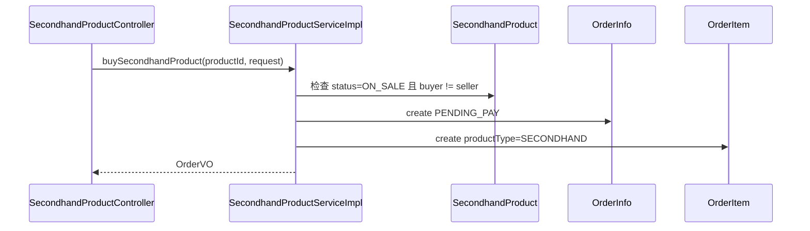

## UC18 二手议价

| 项目 | 内容 |
|---|---|
| 参与者 | 买家、二手卖家 |
| 触发条件 | 买家对支持议价的二手商品发起报价 |
| 前置条件 | 商品在售且允许议价；买家不是卖家本人；报价金额合法 |
| 主成功流程 | 买家提交议价；卖家在议价列表或聊天消息中查看；卖家同意后系统创建新价格待付款订单；卖家拒绝后议价结束 |
| 备选/异常流程 | 重复有效议价被限制；卖家拒绝或商品已下架时不生成订单；买家未付款时订单保持待付款 |
| 可验证结果 | `product_negotiation` 状态正确；同意义价生成 `PENDING_PAY` 二手订单，支付后才进入待发货 |

### UC18 系统级图

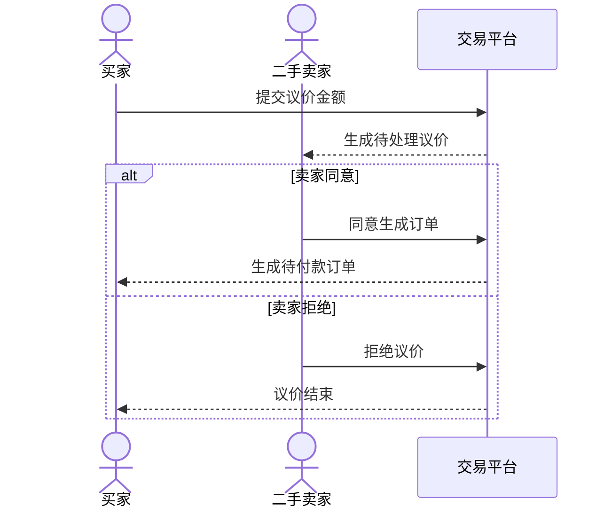

### UC18 组件级图

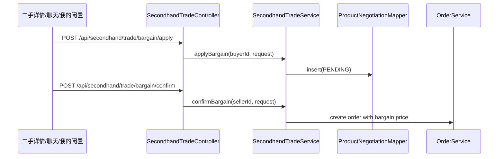

### UC18 对象级图

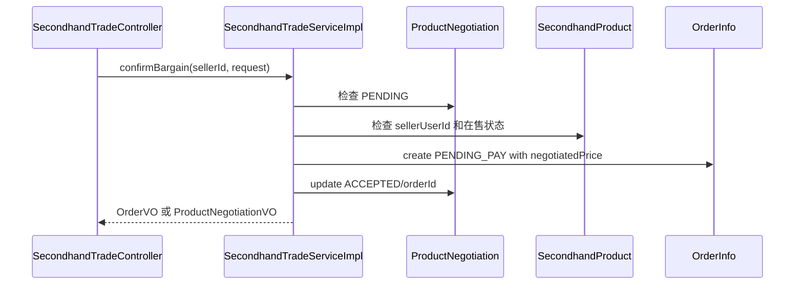

## UC19 二手拍卖和出价

| 项目 | 内容 |
|---|---|
| 参与者 | 二手卖家、竞拍买家 |
| 触发条件 | 卖家对自己的二手商品发起拍卖，买家参与出价 |
| 前置条件 | 商品在售；卖家本人发起；当前无进行中的同商品拍卖；出价满足最低加价幅度 |
| 主成功流程 | 卖家设置起拍价、加价幅度和时长；系统创建进行中拍卖；买家出价；当前价、领先买家和出价次数更新；卖家可查看拍卖监控 |
| 备选/异常流程 | 低于最低出价被拒绝；卖家不能给自己的商品出价；拍卖流拍或关闭后不可继续出价 |
| 可验证结果 | `product_auction` 和 `auction_log` 更新正确；卖家列表显示当前价、领先买家和出价次数 |

### UC19 系统级图

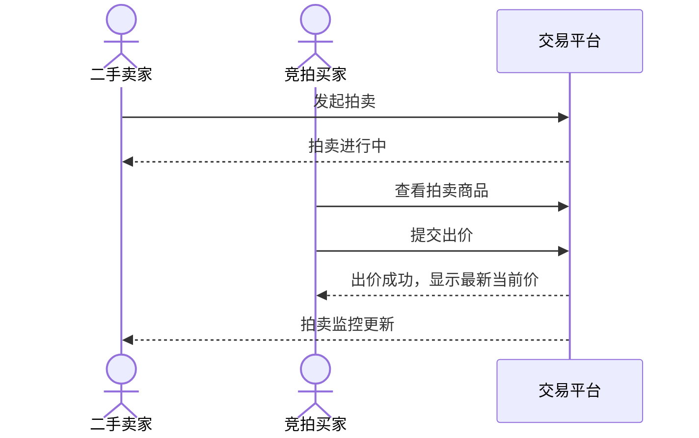

### UC19 组件级图

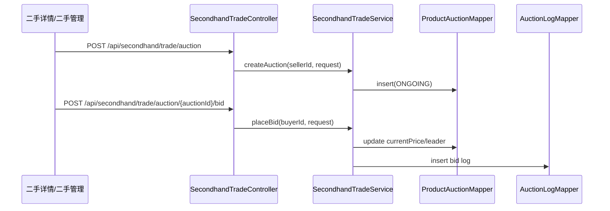

### UC19 对象级图

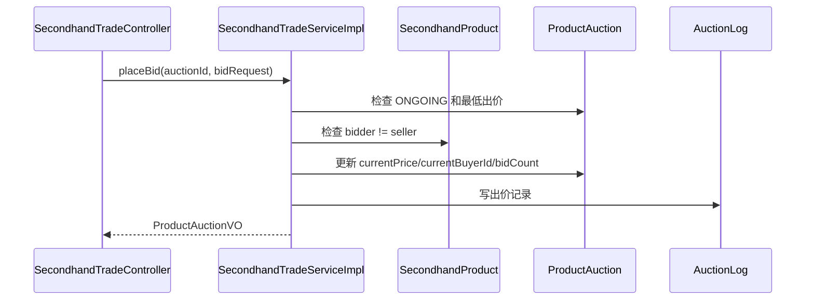

## UC20 二手订单履约

| 项目 | 内容 |
|---|---|
| 参与者 | 二手卖家、买家 |
| 触发条件 | 二手订单支付成功后进入待发货 |
| 前置条件 | 订单类型为 `SECONDHAND`；订单已支付且待发货；操作人是订单卖家或买家本人 |
| 主成功流程 | 卖家查看我卖出的闲置；确认发货并写入发货地；系统生成物流轨迹；买家查看待收货订单；买家确认收货后订单进入待评价 |
| 备选/异常流程 | 非卖家发货被拒绝；重复发货保持幂等；非买家确认收货被拒绝；售后退款状态按订单规则处理 |
| 可验证结果 | 状态链为 `待付款 -> 待发货 -> 待收货 -> 待评价 -> 已完成`；物流轨迹和通知正确生成 |

### UC20 系统级图

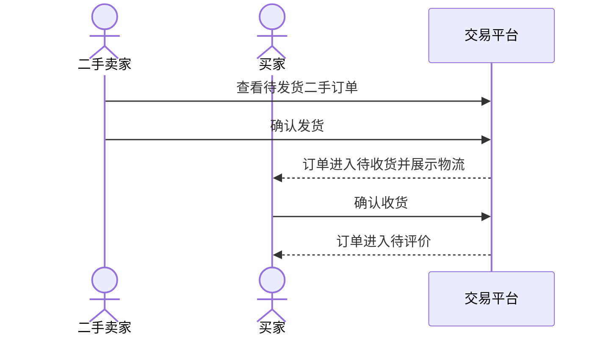

### UC20 组件级图

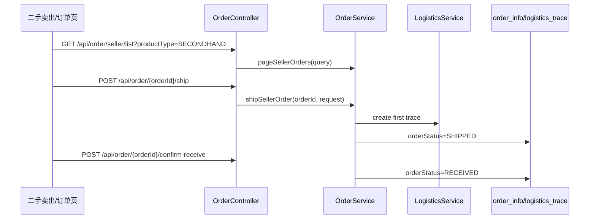

### UC20 对象级图

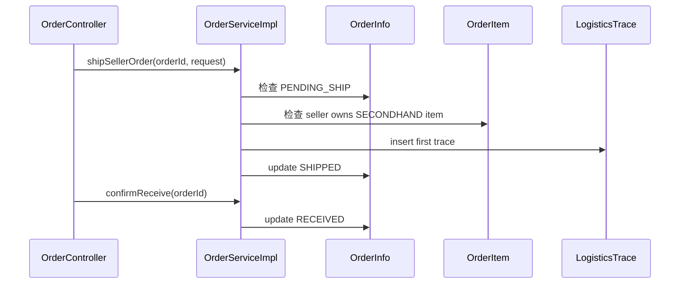
