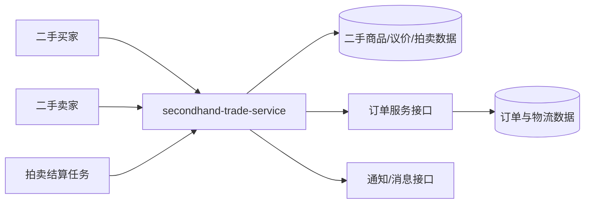

# UC16-UC20 系统级设计

## 编号与图源

| 用例 | 系统级图 | 图源文件 |
|---|---|---|
| UC16 二手商品发布和管理 | SYS16 | `diagrams/UC16-SYS16.mmd` |
| UC17 二手直接购买及禁止自购 | SYS17 | `diagrams/UC17-SYS17.mmd` |
| UC18 议价申请、确认和拒绝 | SYS18 | `diagrams/UC18-SYS18.mmd` |
| UC19 拍卖、出价和结束 | SYS19 | `diagrams/UC19-SYS19.mmd` |
| UC20 二手成交后的订单履约 | SYS20 | `diagrams/UC20-SYS20.mmd` |

## 系统边界和外部参与者

## 系统职责

- UC16 负责二手商品的发布、本人管理、分类与状态约束。
- UC17 负责在售校验、禁止自购和待付款二手订单创建。
- UC18 负责议价申请及同意/拒绝状态机；同意后只生成待付款订单。
- UC19 负责单商品拍卖、最低出价、领先买家、结束判定和幂等结算。
- UC20 负责支付后的卖家发货、物流轨迹、买家确认收货和履约权限。

## 接口契约约束

- 所有二手交易请求沿用 `{code, message, data}` 响应格式，失败分支必须可断言。
- 发布、购买、议价、竞拍和履约动作都需要当前用户身份；商品列表和拍卖详情可按现有公开规则读取。
- 买家不能购买、议价或竞拍自己的商品；卖家只能管理和发货自己的商品。
- 直接购买和同意义价创建 `PENDING_PAY` 订单，支付后才进入 `PENDING_SHIP`。
- 拍卖结算必须幂等；重复调度不能创建第二笔成交订单。
- 公开接口、代码位置和测试编号见 `04_tests/UC16-UC20-公开接口与测试映射.md` 和 `02_docs/UC16-UC20-设计与测试追溯矩阵.md`。
