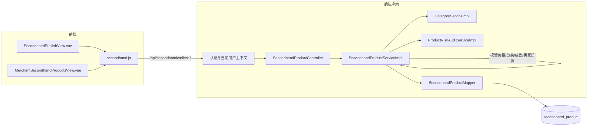

# UC16 二手商品发布和管理：组件级图

图号：`COMP-UC16-01`
需求：`REQ16`
用例：`UC16`
父用例：GitHub Issue #55



## 组件职责

| 组件 | 职责 | 失败结果 |
|---|---|---|
| 当前用户上下文 | 提供登录用户并限制卖家资源归属 | 未登录或非本人操作被拒绝 |
| `SecondhandProductController` | 参数绑定、校验和统一响应 | 返回可断言的 `{code,message,data}` |
| `SecondhandProductServiceImpl` | 校验字段、价格、状态和卖家数据隔离 | 业务错误且不写入非法商品 |
| `CategoryServiceImpl` | 提供二手分类并验证分类有效性 | 无效分类不能提交 |
| `SecondhandProductMapper` | 保存通过校验的二手商品变更 | 事务异常回滚 |

## 对应测试

- `API-UC16-001`：卖家发布接口校验请求并返回新商品。
- `API-UC16-002`：公开列表记录搜索词并委托分页查询。
- `UNIT-UC16-001`：原价低于售价时拒绝发布。
- `UNIT-UC16-002`：卖家列表只查询当前用户的二手商品。

复现命令：

```powershell
cd backend
mvn -B "-Dtest=SecondhandProductControllerUc16WebMvcTest,SecondhandProductServiceImplTest#pagePublicProducts_shouldThrowWhenPriceRangeInvalid+createSellerProduct_shouldThrowWhenOriginPriceLowerThanSalePrice+pageSellerProducts_shouldFilterByCurrentUser" test
```
