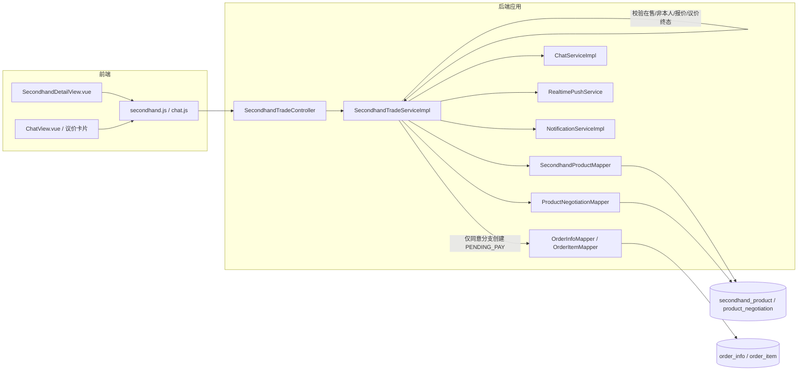

# UC18 议价申请、确认和拒绝：组件级图

图号：`COMP-UC18-01`
需求：`REQ18`
用例：`UC18`
父用例：GitHub Issue #57



## 状态与事务规则

- 买家提交合法报价后创建 `APPLIED` 议价记录，并向卖家产生可见消息或通知。
- 只有商品卖家可以处理待确认议价。
- 同意分支按确认价格创建 `PENDING_PAY` 二手订单，再把议价标记为已使用。
- 拒绝分支进入 `REJECTED`，发送结果消息但不创建订单。
- 已处理议价不能重复同意或拒绝，避免重复订单与终态覆盖。

## 对应测试

- `API-UC18-001`：申请、同意和拒绝三个稳定路由返回对应状态。
- `UNIT-UC18-001`：卖家同意后创建待付款订单。
- `UNIT-UC18-002`：拒绝后更新状态并通知买家。
- `UNIT-UC18-003`：重复处理已结束议价被拒绝。

复现命令：

```powershell
cd backend
mvn -B "-Dtest=SecondhandTradeControllerUc18WebMvcTest,SecondhandTradeServiceImplTest#confirmBargain_shouldCreatePendingPayOrderWhenSellerAccepts+rejectBargain_shouldUpdateStatusAndNotifyBuyer+rejectBargain_shouldThrowWhenAlreadyHandled" test
```
