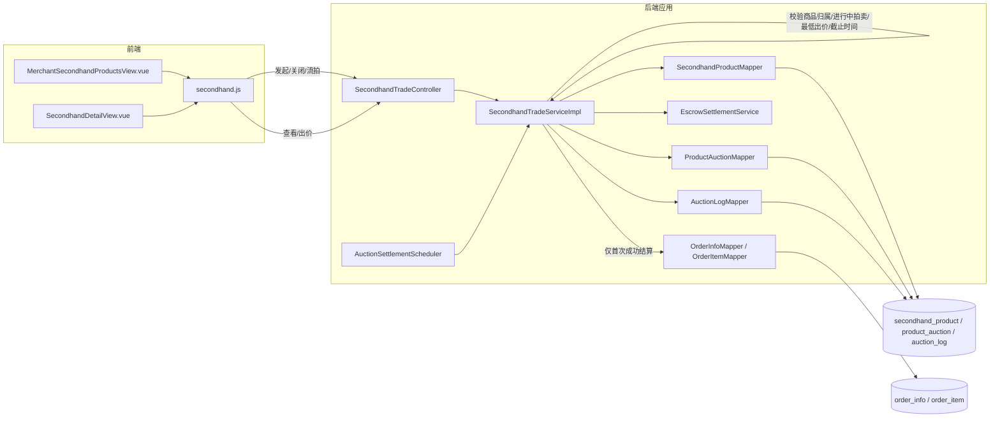

# UC19 拍卖、出价和结束：组件级图

图号：`COMP-UC19-01`
需求：`REQ19`
用例：`UC19`
父用例：GitHub Issue #58



## 关键规则

- 只有商品卖家可发起拍卖，同一商品只能有一个进行中的拍卖。
- 竞买人不能是商品卖家，出价不得低于当前价加加价幅度。
- 截止、关闭或流拍后不能继续出价；有效出价写入 `auction_log`。
- 结算任务有领先买家时创建一笔待付款订单，无出价时标记流拍。
- 结算必须幂等，重复调度不能创建第二笔订单。

## 对应测试

- `API-UC19-001`：发起、查询和出价接口返回最新拍卖状态。
- `UNIT-UC19-001`：低于最低加价的出价被拒绝。
- `UNIT-UC19-002`：结束后的拍卖拒绝继续出价。
- `UNIT-UC19-003`：已结算拍卖不会重复创建订单。
- `INT-UC19-001`：只有历史拍卖时可重新发起新拍卖。

复现命令：

```powershell
cd backend
mvn -B "-Dtest=SecondhandTradeControllerUc19WebMvcTest,SecondhandTradeServiceImplTest#placeBid_shouldRejectBidLowerThanMinimumIncrement+placeBid_shouldRejectEndedAuction+settleExpiredAuctions_shouldCreateOnlyOneOrderForAlreadySettledAuction,SecondhandAuctionIntegrationTest" test
```
