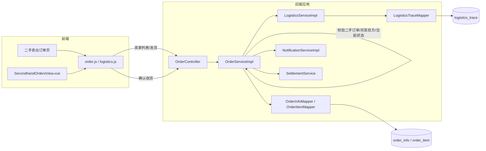

# UC20 二手成交后的订单履约：组件级图

图号：`COMP-UC20-01`
需求：`REQ20`
用例：`UC20`
父用例：GitHub Issue #59



## 状态与权限规则

- 二手订单创建后先处于待付款，买家支付后才进入待发货。
- 只有订单中的商品卖家能发货；未付款或非法状态订单不能发货。
- 发货将订单改为待收货，并初始化首条物流轨迹和买家通知。
- 只有订单买家能确认收货；确认后进入待评价并触发后续结算。
- 重复发货、重复收货和越权操作不能产生重复物流或结算副作用。

## 对应测试

- `API-UC20-001`：发货接口返回待收货状态和运输中物流状态。
- `API-UC20-002`：确认收货接口返回待评价状态。
- `INT-UC20-001`：二手卖家可查询订单、发货并生成物流轨迹。

复现命令：

```powershell
cd backend
mvn -B "-Dtest=OrderControllerUc20WebMvcTest,SecondhandOrderFlowIntegrationTest" test
```
