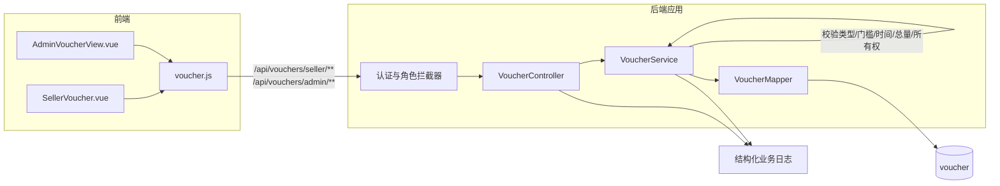

# UC21 卖家/管理员优惠券生命周期：组件级图

图号：`COMP-UC21-01`  
需求：`REQ21`  
用例：`UC21`

## 组件职责

| 组件 | 职责 | 失败结果 |
|---|---|---|
| 认证与角色拦截器 | 验证 JWT，区分卖家与管理员入口 | 401/403，不进入业务层 |
| `VoucherController` | 参数绑定、统一响应 | 返回 `{code,message,data}` |
| `VoucherService` | 校验优惠类型、门槛、时间、数量及券所有权 | 业务错误且不写库 |
| `VoucherMapper` | 仅持久化通过校验的变更 | 事务异常回滚 |

## 对应测试

- `UNIT-UC21-001`：有门槛券的优惠额不能超过门槛金额。
- `UNIT-UC21-002`：非法规则被拒绝时不调用 `VoucherMapper.insert`。
