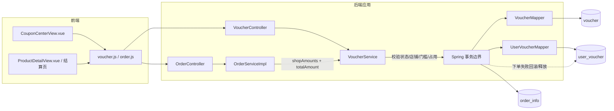

# UC22 领券及结算使用：组件级图

图号：`COMP-UC22-01`  
需求：`REQ22`  
用例：`UC22`

## 关键规则

- 店铺券以匹配店铺的小计作为门槛金额，不得使用整单其他店铺金额凑门槛。
- `eligibleAmount < minAmount` 时必须在占用用户券前失败。
- 用户券占用使用条件更新，避免并发订单重复占用。
- 下单事务失败时不遗留 `used_order_id`。

## 对应测试

- `UNIT-UC22-001`：店铺小计未达到门槛时拒绝核销。
- `UNIT-UC22-002`：门槛失败不更新 `user_voucher`。
