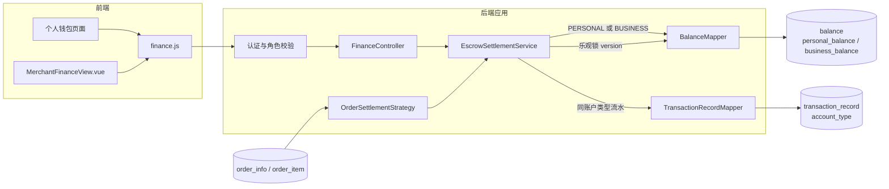

# UC23 充值、钱包、商家账户和结算：组件级图

图号：`COMP-UC23-01`  
需求：`REQ23`  
用例：`UC23`

## 隔离规则

- 充值只改变 `personal_balance`，流水必须为 `PERSONAL`。
- 商家结算只改变 `business_balance`，流水必须为 `BUSINESS`。
- 经营流水接口仅允许 `OFFICIAL_SELLER`，且始终限定当前 `user_id`。
- 余额更新与流水写入位于同一事务，失败整体回滚。

## 对应测试

- `UNIT-UC23-001`：个人充值不会改变经营余额。
- `UNIT-UC23-002`：商家入账不会改变个人余额。
- `UNIT-UC23-003`：两类变更生成匹配的 `account_type` 流水。
