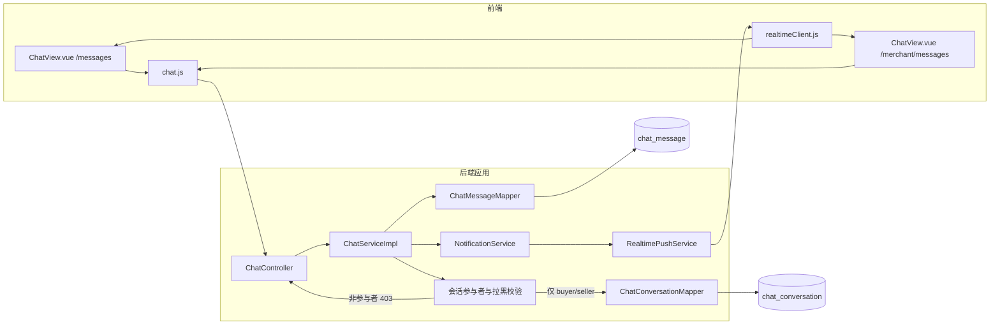

# UC24 会话和消息：组件级图

图号：`COMP-UC24-01`  
需求：`REQ24`  
用例：`UC24`

## 权限边界

- 只有 `buyer_user_id` 或 `seller_user_id` 能读取会话历史或发送消息。
- 权限校验必须发生在消息查询、已读更新和消息写入之前。
- 任一方向存在拉黑关系时拒绝发送。
- 空白消息和超过 1000 字的消息不持久化。

## 对应测试

- `UNIT-UC24-001`：非参与者读取会话返回 403。
- `UNIT-UC24-002`：非参与者发送消息返回 403 且不写消息表。
