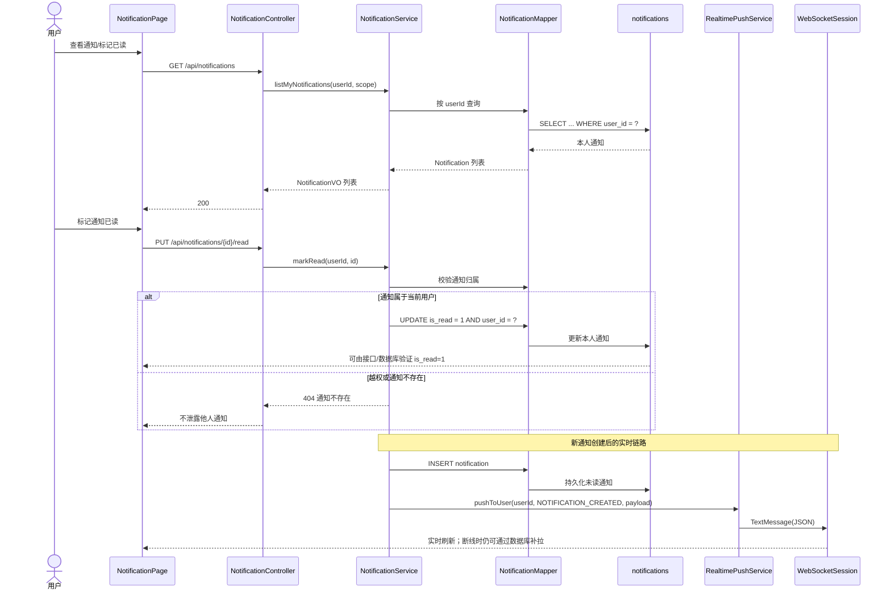

# UC25 通知、已读与实时推送组件级图

- 图编号：`COMP-UC25-01`
- 父用例：`UC25`（GitHub #64）
- 子任务：GitHub #95

## 可验证结果

- 接口：只能查询、更新当前登录用户的通知；越权标记返回 404。
- 数据库：`notification.user_id` 与登录用户一致，成功标记后 `is_read=1`。
- WebSocket：合法 JWT 握手后属性中写入 `uid`；缺失或非法 token 返回 401。
- 日志：推送失败不影响通知持久化，客户端重连后通过通知列表补偿。

