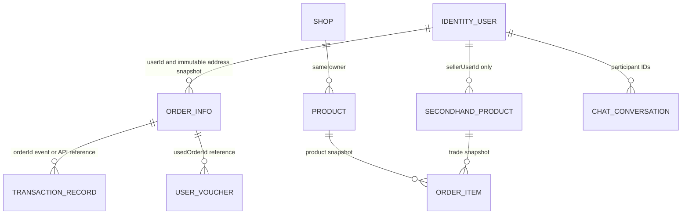

# 数据库表归属方案

## 1. 规则与当前状态

六个微服务各自拥有独立 schema 和应用账号。允许课程环境在同一个 MySQL 8 实例中承载多个 schema，但必须满足：

1. 一张业务表只有一个写入 owner，其他服务不得直接查询或修改其明细。
2. 跨服务只传稳定 ID、必要快照，或使用带版本的内部 API/事件；禁止跨 schema JOIN、外键和共享 Repository。
3. 每个账号只获得自身 schema 权限；生产权限和代表性的真实 MySQL 反例共同验证跨库访问被拒绝。
4. 本地事务只覆盖本服务数据；跨服务流程用幂等键、Outbox/Inbox、状态查询、重试和补偿。
5. `idempotency_record`、`outbox_event` 等同名技术表分别存在于各自 schema，不是共享表。

单体 `backend/src/main/resources/schema.sql` 仍是兼容回退和改造前性能基线。下表记录单体 33 张逻辑业务表的最终 owner，以及六个独立服务由 Flyway 管理的物理表；生产 Ingress 已将服务专属路由切到六个微服务，兼容后端不再被视为这些表的新增跨服务写入者。

## 2. 单体 33 张逻辑业务表的唯一归属

| 逻辑表 | 唯一 owner / schema | 跨服务使用方式 |
|---|---|---|
| `user` | identity-governance / `identity_governance_db` | JWT、用户摘要 API、`UserAccessChanged.v1` |
| `address` | identity-governance / `identity_governance_db` | 建单前校验 owner，并复制完整地址快照 |
| `merchant_application` | identity-governance / `identity_governance_db` | 审核事件通知 catalog-shop / messaging |
| `admin_audit_log` | identity-governance / `identity_governance_db` | 其他服务发布审计事件，禁止直写 |
| `credit_score_log` | identity-governance / `identity_governance_db` | 身份治理 API |
| `user_report` | identity-governance / `identity_governance_db` | 本服务内用户 ID 引用 |
| `user_block` | identity-governance / `identity_governance_db` | messaging 调用 block-check 或消费版本事件 |
| `report` | identity-governance / `identity_governance_db` | 旧举报兼容表；不可与 `user_report` 双写同一事实 |
| `category` | catalog-shop / `catalog_shop_db` | 目录 API；secondhand 只保存 categoryId |
| `shop` | catalog-shop / `catalog_shop_db` | 订单保存 shopId/必要快照 |
| `product` | catalog-shop / `catalog_shop_db` | 商品快照和库存预留 API |
| `product_risk_audit` | catalog-shop / `catalog_shop_db` | catalog-shop 内部模块使用 |
| `browse_history` | catalog-shop / `catalog_shop_db` | 本服务行为模块写入 |
| `user_search_history` | catalog-shop / `catalog_shop_db` | userId 仅为外部标识 |
| `search_keyword_stat` | catalog-shop / `catalog_shop_db` | 本服务行为模块聚合 |
| `order_info` | order / `order_db` | secondhand、finance 使用 orderId/API/事件 |
| `order_item` | order / `order_db` | 保存商品类型、ID、名称、价格快照 |
| `order_after_sale_log` | order / `order_db` | finance 只处理资金，不修改售后日志 |
| `review` | order / `order_db` | catalog-shop 订阅评价汇总，不读明细表 |
| `logistics_path_template` | order / `order_db` | 当前阶段归订单域 |
| `logistics_trace` | order / `order_db` | 当前阶段归订单域 |
| `idempotency_record` | 每个服务各自 schema | 同名独立技术表，绝非共享表 |
| `secondhand_product` | secondhand / `secondhand_db` | order 保存成交快照 |
| `product_negotiation` | secondhand / `secondhand_db` | orderId 是外部引用，无跨库 FK |
| `product_auction` | secondhand / `secondhand_db` | orderId 是外部引用，按 tradeId 恢复 |
| `auction_log` | secondhand / `secondhand_db` | 仅 secondhand 写入 |
| `voucher` | benefits-finance / `benefits_finance_db` | shopId/productId 仅为适用范围标识 |
| `user_voucher` | benefits-finance / `benefits_finance_db` | 用券核销和规则同事务 |
| `balance` | benefits-finance / `benefits_finance_db` | 唯一余额真相，order 禁止直接更新 |
| `transaction_record` | benefits-finance / `benefits_finance_db` | orderId 为外部引用 |
| `chat_conversation` | messaging / `messaging_db` | 参与者来自 JWT/最小用户投影 |
| `chat_message` | messaging / `messaging_db` | 仅 messaging 读写 |
| `notification` | messaging / `messaging_db` | 由幂等事件/内部 API 创建 |

## 3. 六个服务当前 Flyway 物理表

以下清单以六个微服务合并后的迁移脚本为准。2026-09-02 在 `main` 重新扫描全部 `CREATE TABLE`，六个服务分别为 10、10、8、11、8、8 张，共 55 张物理表，与本表逐项一致；同时扫描六个服务的生产源码，未发现其他五个 schema 的限定名访问。相比 33 张单体逻辑表，增加的是服务自治所需的预留、Saga、Inbox/Outbox、幂等、投影、报价和支付请求等表。

| 服务 / schema | 当前物理表 | 归属结论 |
|---|---|---|
| identity-governance / `identity_governance_db` | `user`, `address`, `merchant_application`, `report`, `user_report`, `user_block`, `credit_score_log`, `admin_audit_log`, `idempotency_record`, `outbox_event` | 全部归身份治理；`outbox_event.last_error` 仅用于投递诊断 |
| order / `order_db` | `order_info`, `order_item`, `order_after_sale_log`, `review`, `logistics_path_template`, `logistics_trace`, `idempotency_record`, `order_saga`, `outbox_event`, `inbox_event` | 全部归订单；`inbox_event` 去重 catalog 库存事件 |
| secondhand / `secondhand_db` | `secondhand_product`, `category_projection`, `product_negotiation`, `product_auction`, `auction_log`, `trade_order_request`, `idempotency_record`, `outbox_event` | `category_projection` 是只读最小投影；地址不落本地明细表 |
| catalog-shop / `catalog_shop_db` | `category`, `shop`, `product`, `product_risk_audit`, `browse_history`, `user_search_history`, `search_keyword_stat`, `inventory_reservation`, `inventory_reservation_item`, `idempotency_record`, `outbox_event` | 库存预留及其明细只由 catalog-shop 写入 |
| messaging / `messaging_db` | `chat_conversation`, `chat_message`, `notification`, `user_access_projection`, `user_block_projection`, `inbox_event`, `idempotency_record`, `outbox_event` | 两张用户投影只读且可由版本事件重建 |
| benefits-finance / `benefits_finance_db` | `voucher`, `user_voucher`, `balance`, `transaction_record`, `checkout_quote`, `payment_request`, `idempotency_record`, `outbox_event` | 余额、流水、支付请求在本地事务中一致更新 |

旧 `catalog-service`、`shop-service`、`risk-service`、`behavior-service` 的复数表名原型只为切流兼容保留；最终 owner 是合并后的 `catalog-shop-service`。在完整回归和数据校验前不从父 POM 强行删除，切流完成后单独清理，禁止长期双写。

## 4. 服务账号权限

| 应用账号 | 允许访问 | 推荐的越界拒绝反例 |
|---|---|---|
| `identity_governance_app` | `identity_governance_db.*` | `SELECT * FROM order_db.order_info` |
| `catalog_shop_app` | `catalog_shop_db.*` | `SELECT * FROM identity_governance_db.user` |
| `order_app` | `order_db.*` | `UPDATE benefits_finance_db.balance ...` |
| `secondhand_app` | `secondhand_db.*` | `INSERT INTO order_db.order_info ...` |
| `benefits_finance_app` | `benefits_finance_db.*` | `UPDATE order_db.order_info ...` |
| `messaging_app` | `messaging_db.*` | `SELECT * FROM identity_governance_db.user_block` |

Identity、Catalog、Order、Secondhand、Finance 已保留真实 MySQL 越界拒绝测试；Messaging 由独立 schema 账号、Flyway 迁移和源码无跨 schema SQL 扫描验证。H2、MockMvc 或只读文档不能代替数据库运行验证，但不把文档/hash 检查加入普通代码门禁。

## 5. 跨服务一致性与失败恢复

| 流程 | 本地真相与调用 | 失败处理 | 一致性证据 |
|---|---|---|---|
| 商家审核建店 | identity 提交审核与 Outbox；catalog 幂等消费 | 有界重试，超限 `DEAD`，保留 `last_error` 对账 | applicationId、eventId、店铺结果 |
| 普通订单库存 | order 用幂等键调用 catalog 预留；双方各自提交 | 不确定结果先查状态；预留过期/释放事件进入 order `inbox_event`，仅取消仍待支付订单 | reservationId、requestId、补偿日志 |
| 二手订单地址 | secondhand 调 identity 校验 buyer/address，再把完整快照发给 order | identity 不可用时建单重试/最终失败；禁止占位地址和跨库读取 | buyerId、addressId、冻结后的地址快照 |
| 二手建单 | secondhand 冻结交易资格；order 强校验 `Idempotency-Key=tradeType:tradeId` 后幂等创建 | 超时先按 business key 查询；只有查询明确返回不存在才进入有上限重试，查询本身不可用时保持冻结与 `RETRY`，禁止把不确定结果误判为失败 | tradeId、orderId、稳定幂等头、恢复测试 |
| 支付/退款 | finance 原子更新余额、流水、用券和 payment_request | 按 paymentRequestId 查询不确定结果，禁止重复扣款 | 唯一请求号、正反流水、余额版本 |
| 用户封禁传播 | identity 状态与 Outbox 同事务；messaging 维护版本投影 | 高风险写操作在投影不确定时失败关闭，事件按 accessVersion 去旧留新 | accessVersion、Inbox、重放记录 |
| 通知投递 | 各生产者发送完整 `EventEnvelope`；messaging Inbox 去重 | 通知失败不回滚已完成业务；Outbox 重试并记录错误 | eventId、producer、dedupeKey |

统一事件信封至少包含 `eventId`、`eventType`、`eventVersion`、`producer`、`aggregateType`、`aggregateId`、`occurredAt`、`traceId` 和对象型 `payload`。HTTP 内部调用统一携带 `X-Internal-Service-Token`、`X-Request-Id`；写操作同时携带 `X-Idempotency-Key`（兼容阶段可并发发送 `Idempotency-Key`）。

2026-09-02 合并后契约审计已统一 producer 侧行为：Order→Catalog/Finance、Catalog/Finance/Secondhand/Identity→Messaging 的写请求同时发送标准与兼容幂等头；Messaging→Identity 的同一逻辑调用在有界重试期间复用同一个请求 ID 和幂等键。二手建单仍以 `tradeType:tradeId` 为唯一业务键，查询失败代表结果不确定，不能解冻商品或发布失败事件。Finance 不反向同步调用 Order，因此已从 Helm 删除未被代码读取的 `ORDER_SERVICE_URL`，调用方向与故障影响说明保持一致。

## 6. 数据关系图

图中的跨服务关系都是业务引用，不是数据库外键。真实外键只允许出现在同一 owner/schema 内，例如 `order_item.order_id → order_info.id`、`chat_message.conversation_id → chat_conversation.id`。
