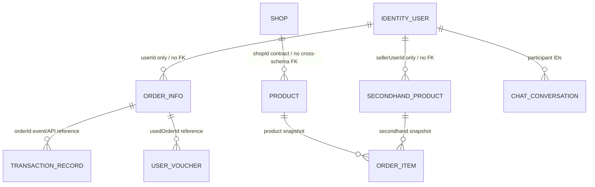

# 数据库表归属方案

## 1. 当前事实与目标规则

当前生产路径仍由单体 `backend/src/main/resources/schema.sql` 初始化一个 MySQL schema。下面的“目标 owner”用于微服务迁移；在真正拆库、独立启动和回归通过之前，不得宣称已经实现物理隔离。

冻结规则：

1. 一张业务表只有一个写入服务，也只有该服务可以直接查询其明细；
2. 其他服务只保存稳定 ID、必要快照或通过版本化 API/事件获取数据；
3. 跨服务不建立数据库外键，不共享 Mapper/Repository，不执行跨 schema JOIN；
4. 一个 MySQL 实例可以承载多个 schema，但账号权限必须限制到本服务 schema；
5. 资金、余额、资金流水必须由同一个服务在本地事务中更新；
6. 跨服务流程使用幂等、outbox、补偿和状态查询，不使用分布式数据库事务伪装原子性。

`identity-governance-service` 单独拆出后可以满足这些规则：它是 `user` 等身份治理表的唯一 owner，其他服务既不连接 `identity_governance_db`，也不复制一份可写用户表。其他服务需要用户信息时只能使用 JWT、内部 API、版本化事件或由事件生成的最小只读投影。

## 2. 单体 33 张逻辑业务表的唯一归属

| 当前表 | 目标 owner/schema | 主要 UC | 跨服务使用方式 |
|---|---|---|---|
| `user` | identity-governance / `identity_governance_db` | UC01-UC05 | JWT claims、用户摘要 API、`UserAccessChanged`；禁止其他服务读表 |
| `address` | identity-governance / `identity_governance_db` | UC02 | 下单时由用户选择并复制为订单地址快照 |
| `merchant_application` | identity-governance / `identity_governance_db` | UC03 | 审核成功发布事件给 catalog-shop/messaging |
| `admin_audit_log` | identity-governance / `identity_governance_db` | UC04/05/09/14/21/23 | 其他服务发送审计事件；身份治理服务集中持久化 |
| `credit_score_log` | identity-governance / `identity_governance_db` | UC05 | 查询走身份治理 API |
| `user_report` | identity-governance / `identity_governance_db` | UC05 | 用户 ID 为同服务引用 |
| `user_block` | identity-governance / `identity_governance_db` | UC05/24 | messaging 在建会话前调用批量 block-check 或消费缓存事件 |
| `report` | identity-governance / `identity_governance_db` | 旧管理举报兼容 | 迁移后合并规则或只读归档，不能与 `user_report` 双写 |
| `product_risk_audit` | catalog-shop / `catalog_shop_db` | UC09 | 与商品同一服务不同模块，禁止跨模块绕过 service 层写表 |
| `category` | catalog-shop / `catalog_shop_db` | UC06/07/16 | secondhand 只保存 categoryId 并使用目录 API 校验 |
| `product` | catalog-shop / `catalog_shop_db` | UC06/07/11 | order 保存名称、单价等成交快照；库存通过预留 API |
| `shop` | catalog-shop / `catalog_shop_db` | UC03/08 | product 可在同服务内引用；order 只保存 shopId 和快照 |
| `browse_history` | catalog-shop / `catalog_shop_db` | UC10 | behavior 模块拥有；productId 是同服务逻辑引用 |
| `user_search_history` | catalog-shop / `catalog_shop_db` | UC10 | userId 是外部标识 |
| `search_keyword_stat` | catalog-shop / `catalog_shop_db` | UC10 | 只由 behavior 模块更新 |
| `order_info` | order / `order_db` | UC11-UC14/20 | secondhand、finance 通过 orderId/API/事件协作 |
| `order_item` | order / `order_db` | UC11/15/20 | 保存商品类型、ID、名称、价格快照 |
| `order_after_sale_log` | order / `order_db` | UC14 | 退款完成事件引用 orderId，不由 finance 改表 |
| `review` | order / `order_db` | UC15 | 商品/店铺显示可订阅评价汇总事件，不直接读评价表 |
| `logistics_path_template` | order / `order_db` | UC13/20 | 当前规模不单拆 logistics-service |
| `logistics_trace` | order / `order_db` | UC13/20 | 轨迹随订单边界维护 |
| `idempotency_record` | 每服务各自 schema | 全局 | 不是共享表；各服务拥有自己的幂等记录表 |
| `secondhand_product` | secondhand / `secondhand_db` | UC16/17/19 | order 保存成交快照；状态通过交易 API/事件改变 |
| `product_negotiation` | secondhand / `secondhand_db` | UC18 | `used_order_id` 是外部引用，不建跨库 FK |
| `product_auction` | secondhand / `secondhand_db` | UC19 | `settled_order_id` 是外部引用；按 tradeId 幂等恢复 |
| `auction_log` | secondhand / `secondhand_db` | UC19 | 仅 secondhand 写入 |
| `voucher` | benefits-finance / `benefits_finance_db` | UC21/22 | shopId/productId 是适用范围标识，不跨库读 |
| `user_voucher` | benefits-finance / `benefits_finance_db` | UC22 | 使用和核销与券规则同一服务事务 |
| `balance` | benefits-finance / `benefits_finance_db` | UC23 | 唯一余额真相；禁止 order 直接更新 |
| `transaction_record` | benefits-finance / `benefits_finance_db` | UC12/14/23 | 与余额更新同事务，orderId 为外部引用 |
| `chat_conversation` | messaging / `messaging_db` | UC24 | 参与者 ID 来自 JWT；必要时调用治理 block-check |
| `chat_message` | messaging / `messaging_db` | UC24 | 仅 messaging 读写 |
| `notification` | messaging / `messaging_db` | UC25 | 由事件或幂等内部 API 创建 |

注意：`schema.sql` 中 `credit_score_log`、`user_report`、`user_block` 存在兼容性重复 `CREATE TABLE IF NOT EXISTS` 片段。迁移前应先整理成单一版本化 migration；本方案按逻辑表只计一次。

## 3. 当前已实现微服务的物理表

| 模块 | 当前独立 schema 表 | 目标归属 | 迁移注意事项 |
|---|---|---|---|
| `catalog-service` | `products` | catalog-shop 的 catalog 模块 | 与单体 `product` 字段/命名不一致，需要一次性迁移和契约适配，不能长期双写 |
| `shop-service` | `shops` | catalog-shop 的 shop 模块 | 与单体 `shop` 字段不完全一致，切流前做数据校验 |
| `risk-service` | `risk_audits`, `integration_outbox` | catalog-shop 的 risk 模块 | outbox 仍由该模块写入，统一部署后使用 `catalog_shop_db` |
| `behavior-service` | `browse_history`, `search_history`, `keyword_stats` | catalog-shop 的 behavior 模块 | 对应单体 `browse_history`, `user_search_history`, `search_keyword_stat` |

现有 H2/MockMvc 集成测试证明模块局部契约，不等于 MySQL 数据已经从单体迁移或流量已经切换。

## 4. 跨服务数据关系



图中的关系是业务引用，不是数据库外键。真实外键只允许出现在同一 owner 的 schema 内，例如 `order_item.order_id -> order_info.id`、`chat_message.conversation_id -> chat_conversation.id`。

## 5. 关键业务的数据流

### 下单与库存

1. order 使用幂等键请求 catalog 预留库存；
2. catalog 在本地事务写预留记录并返回 reservationId；
3. order 保存商品和收货地址快照并创建订单；
4. 成功后确认预留，失败则释放；超时由定时任务和状态查询补偿。

### 支付、优惠券和退款

1. order 请求 benefits-finance 生成带版本和有效期的结算报价；
2. benefits-finance 在同一事务核销券、更新余额、写 `transaction_record`；
3. 结果通过幂等响应和事件交给 order 更新状态；
4. 退款由 benefits-finance 写反向流水，order 不直接操作余额表。

### 二手成交

1. secondhand 在本地事务冻结商品/议价/拍卖成交资格；
2. 以 `tradeType + tradeId` 调用 order 的幂等创建接口；
3. order 返回 orderId，secondhand 保存外部引用；
4. 任一步骤超时均通过查询幂等结果恢复，不能跨库回滚另一服务。

## 6. 物理部署与权限

第一版可在同一 MySQL 8 实例创建多个 schema，以降低课程环境成本：

```text
identity_governance_db
catalog_shop_db
order_db
secondhand_db
benefits_finance_db
messaging_db
```

每个服务使用独立数据库账号，仅授予本 schema 的 DML/DDL 权限。CI 应为每个服务从空 schema 执行 migration、运行集成测试，并用权限测试证明跨 schema 查询被拒绝。

## 7. 每个服务允许的数据库权限

| 服务账号 | 允许访问 | 必须拒绝的示例 |
|---|---|---|
| `identity_governance_app` | `identity_governance_db.*` | `SELECT * FROM order_db.order_info` |
| `catalog_shop_app` | `catalog_shop_db.*` | `SELECT * FROM identity_governance_db.user` |
| `order_app` | `order_db.*` | `UPDATE benefits_finance_db.balance ...` |
| `secondhand_app` | `secondhand_db.*` | `INSERT INTO order_db.order_info ...` |
| `benefits_finance_app` | `benefits_finance_db.*` | `UPDATE order_db.order_info ...` |
| `messaging_app` | `messaging_db.*` | `SELECT * FROM identity_governance_db.user_block` |

CI 权限测试必须使用真实服务账号执行上述反例并确认被 MySQL 拒绝；仅在文档中声明“不会跨库”不算完成。

## 8. 跨服务失败处理矩阵

| 操作 | 本地事务 owner | 远端失败时的处理 | 一致性证据 |
|---|---|---|---|
| 商家审核后创建店铺 | identity-governance | 本地提交审核和 outbox；catalog-shop 幂等消费，失败重试/DLQ/对账 | applicationId 唯一、outbox 状态、店铺创建结果 |
| 下单预留库存 | catalog-shop + order 各自事务 | 预留成功但订单失败时释放；超时按 idempotency key 查询后再决定，不盲重试 | reservationId、订单请求 ID、补偿日志 |
| 二手成交创建订单 | secondhand + order 各自事务 | secondhand 冻结成交；order 以 tradeId 幂等创建；失败重试或解除冻结 | tradeId 唯一、orderId 外部引用、恢复测试 |
| 支付/退款 | benefits-finance | 余额和流水同事务；调用超时按 paymentRequestId 查询，禁止重复扣款 | 唯一请求号、正反流水、余额版本 |
| 用户封禁传播 | identity-governance | 用户状态与 outbox 同事务；消费者重试，权限缓存不确定的高风险写操作失败关闭 | accessVersion、DLQ、重放记录 |
| 通知/实时推送 | messaging | 业务事件已完成则不回滚；消息消费重试，WebSocket 失败保留持久通知 | dedupeKey、通知记录、重试日志 |
| 管理审计汇聚 | 各源服务 outbox → identity-governance | 核心业务提交后异步汇聚；积压告警和重放，禁止其他服务直写审计表 | eventId、来源服务、审计消费偏移 |

每个服务可以拥有同名的技术表，如 `outbox_event`、`idempotency_record`、`schema_version`，但它们分别位于本服务 schema，由本服务独占，不是跨服务共享表。
