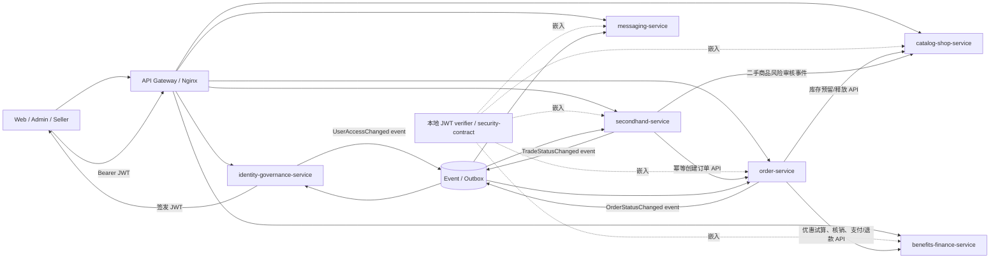
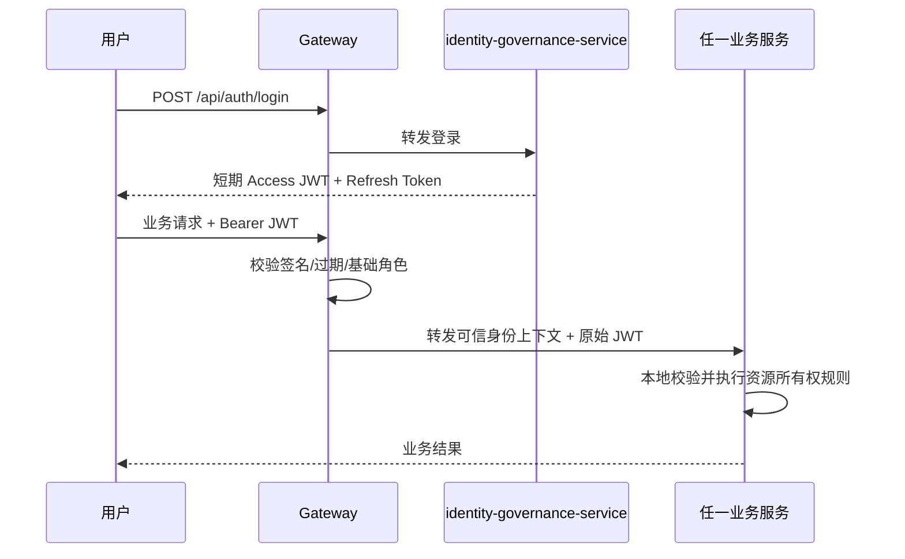

# 微服务划分与依赖设计

## 1. 结论

当前 A-E 划分适合五人 Epic、需求追踪和测试统计，但不适合简单地做成五个运行时微服务：

- Domain A 的登录是多数受保护用例的**业务前置条件**，但其他服务不应在每次请求时同步调用 Domain A；
- Domain B 已经实际拆成 `catalog-service`、`shop-service`、`risk-service`、`behavior-service`，说明一个交付域可以包含多个微服务；
- Domain E 同时包含优惠券、钱包、聊天、通知，把它们部署为一个服务会混合资金强一致逻辑与消息最终一致逻辑；
- Domain D 的二手商品/议价/拍卖是一个内聚边界，但成交后的订单、支付、物流仍应由订单服务拥有。

因此冻结为“5 个交付域、6 个目标业务微服务、1 个入口与 1 个支撑组件”。Domain B 现有四个 Spring Boot 模块保留为内部模块和迁移原型，但课程目标架构只把它们作为一个 `catalog-shop-service` 部署单元，避免为了形式上的细粒度拆分承担过高运维成本。

## 2. 当前实现与目标边界

| 目标服务 | 主要 UC | 唯一职责 | 当前源码位置 | 当前状态 |
|---|---|---|---|---|
| `identity-governance-service` | UC01-UC05 | 注册登录、JWT、账号/资料/地址/商家申请、举报拉黑、信用和管理审计 | 单体 Domain A 控制器 | `TARGET` |
| `catalog-shop-service` | UC06-UC10 | 分类、商品、库存、店铺、商品风险审核、浏览/搜索行为 | `microservices/catalog-service`、`shop-service`、`risk-service`、`behavior-service` 与单体对应控制器 | 四个可独立测试的迁移原型已实现；统一部署单元为 `TARGET` |
| `order-service` | UC11-UC15、UC20 | 下单、支付状态、退款、履约、物流、评价；拥有所有订单 | 单体订单、物流、评价控制器 | `TARGET` |
| `secondhand-service` | UC16-UC19 | 二手商品、直接购买意向、议价、拍卖；不拥有订单履约 | 单体二手商品与交易控制器 | `TARGET` |
| `benefits-finance-service` | UC21-UC23 | 优惠券、领券核销、余额和资金流水 | 单体优惠券与财务控制器 | `TARGET` |
| `messaging-service` | UC24-UC25 | 会话、消息、持久通知、WebSocket 推送 | 单体聊天、通知和 realtime 包 | `TARGET` |
| API Gateway / Nginx | 全局 | TLS、路由、限流、统一认证入口、请求 ID；不持有业务表 | 当前 Nginx/Compose 入口 | `CURRENT`，能力待增强 |
| Media adapter | 全局 | 图片/媒体上传；只返回不可变资源地址 | 单体 `UploadController` | `CURRENT` 支撑组件，不计业务微服务 |

`microservices/security-contract` 是共享认证契约库，不是可部署业务服务，也不计入“至少三个业务微服务”。

### “一个服务”的验收定义

本设计中的 6 个服务都是独立部署单元，不是仅靠 Java package 命名进行逻辑分组。每个服务必须同时满足：

1. 有独立 Maven module 和可执行 Spring Boot JAR，可用 `mvn -pl <service> -am clean verify` 单独构建测试；
2. 有独立 Dockerfile、镜像名、配置、健康检查和端口；
3. 有独立 Helm Deployment/Service，可单独升级、回滚和扩缩容；
4. 有独立 schema migration、数据库账号和最小权限；
5. 只读写本服务归属表，不能注入另一服务的 Mapper/Repository；
6. 有公开/内部 API 契约测试、MySQL 集成测试和至少一个跨服务失败恢复测试。

目标目录约定如下；目录和命令是迁移验收目标，当前不存在的模块必须标记 `NOT_IMPLEMENTED`：

| 服务 | 目标 Maven module | 镜像 | Schema |
|---|---|---|---|
| identity-governance | `microservices/identity-governance-service` | `segroup8/identity-governance:<sha>` | `identity_governance_db` |
| catalog-shop | `microservices/catalog-shop-service` | `segroup8/catalog-shop:<sha>` | `catalog_shop_db` |
| order | `microservices/order-service` | `segroup8/order:<sha>` | `order_db` |
| secondhand | `microservices/secondhand-service` | `segroup8/secondhand:<sha>` | `secondhand_db` |
| benefits-finance | `microservices/benefits-finance-service` | `segroup8/benefits-finance:<sha>` | `benefits_finance_db` |
| messaging | `microservices/messaging-service` | `segroup8/messaging:<sha>` | `messaging_db` |

Domain B 现有四个 module 目前各自可构建，但不等于目标 `catalog-shop-service` 已完成。合并时可保留四个内部 Maven library module，另加一个唯一的 boot application 作为部署入口；CI 对这个部署入口执行独立构建、测试和镜像发布。

## 3. 交付域与运行时服务不是一一对应

| 交付域 | 主要协作服务 | 说明 |
|---|---|---|
| A：UC01-UC05 | identity-governance、messaging | A 的核心数据在同一服务；审核结果通知由 messaging 异步投递 |
| B：UC06-UC10 | catalog-shop | catalog/shop/risk/behavior 是同一部署服务内的模块，不跨库协作 |
| C：UC11-UC15 | order、catalog-shop、benefits-finance、messaging | order 编排库存、资金和通知，但不读取其他服务数据库 |
| D：UC16-UC20 | secondhand、order、messaging | secondhand 决定成交上下文；order 创建并履约订单 |
| E：UC21-UC25 | benefits-finance、messaging | 资金强一致边界和消息最终一致边界分开部署 |

## 4. 目标关系图

每个业务服务只连接自己的 schema。图中的调用箭头代表版本化 API 或事件，不代表跨库查询。

## 5. Domain A 到底是不是其他服务的前置条件

答案分两层：

1. **业务上是前置条件**：游客可以浏览公开商品；创建订单、发布商品、聊天、领券等受保护操作需要先通过 UC01 登录并取得 JWT。
2. **运行时不应成为逐请求同步前置服务**：登录成功后，业务服务应本地校验 JWT 的签名、有效期和角色，不应每次请求都调用 `identity-governance-service` 查询“这个 token 是否有效”。否则身份服务故障会扩散为全站故障。

当前代码已经具备这一方向的基础：单体使用 JWT，`microservices/security-contract` 能独立校验 `uid`、`username`、`role`。但当前仍使用共享对称密钥，默认 token 有效期为 24 小时；这是当前事实，不是最终安全设计。

### 推荐认证流程

### 封禁、解禁和角色变化

纯离线 JWT 会遇到“用户被封禁但旧 token 尚未过期”的窗口。迁移阶段采用：

- Access Token 缩短到 15-30 分钟，Refresh Token 只由 identity-governance-service 处理；
- `UserAccessChanged(userId, status, roles, version, occurredAt)` 通过 outbox 发布；
- Gateway 和业务服务维护本地 denylist/权限版本缓存；
- 高风险操作可以在缓存缺失时调用一次 introspection，但不能让所有请求都依赖它；
- 消费失败重试，按 `eventId` 幂等，缓存不可用时高风险写操作应失败关闭，公开只读接口不受影响。

### identity-governance 调用失败怎么处理

| 场景 | 是否同步依赖身份服务 | 失败策略 |
|---|---|---|
| 普通受保护请求验 JWT | 否 | Gateway 和业务服务本地验签；身份服务暂时不可用不影响未过期 token 的普通请求 |
| 用户被封禁/角色改变 | 事件传播 | identity 在本地事务同时写用户状态和 outbox；消费者按 eventId 重试，进入 DLQ 后告警和人工/定时重放；高风险接口在权限版本不确定时失败关闭 |
| 查询用户昵称/头像 | 可避免同步 | 消费 `UserProfileChanged` 建本服务最小只读投影；投影滞后时展示旧资料，不读取 `user` 表 |
| 创建会话前检查拉黑 | 批量内部 API或本地投影 | 优先本地 block 投影；无缓存且治理接口不可用时拒绝创建会话，不能绕过拉黑规则 |
| 商家审核后创建店铺 | 事件 | 审核事务写 `MerchantApproved` outbox；catalog-shop 幂等创建店铺；失败重试并显示 `APPROVED_PENDING_PROVISION`，不得让两个服务双写对方表 |
| 其他服务写管理审计 | 事件 | 源服务在自身事务写本地 outbox；identity-governance 消费后写 `admin_audit_log`；核心业务不跨库回滚，积压必须告警和补偿 |

因此 identity-governance 是登录和用户事实的 owner，但不是全站同步单点。真正需要同步身份事实且无法安全降级的高风险操作才失败关闭。

## 6. 跨服务一致性规则

- 订单服务保存商品名、成交价、收货地址等快照，不回查 catalog/identity 表生成历史订单。
- catalog 的库存预留和释放使用幂等键；订单创建失败必须释放预留。
- secondhand 先冻结成交资格，再幂等请求 order 创建订单；超时通过查询幂等结果恢复，不能直接写 `order_info`。
- benefits-finance 在自己的事务内写余额与资金流水；order 只保存支付结果和外部交易号。
- messaging 订阅业务事件生成通知；通知失败不能回滚已经完成的订单、审核或拍卖事务。
- 任何服务不得连接或读取另一服务 schema；跨服务只传稳定 ID、快照、API DTO 或事件。

## 7. 迁移顺序

1. 冻结当前单体 tag 和 API 回归测试，Gateway 保持原 `/api/**` 路径。
2. 将现有 catalog/shop/risk/behavior 作为 `catalog-shop-service` 的四个内部模块，统一 JWT 校验、配置、数据库和容器入口，停止信任客户端直接传入的 `X-User-Id` 等头。
3. 抽取 identity-governance-service；先迁移登录签发，再迁移资料、地址、账号状态、商家申请和用户治理。
4. 抽取 order-service，并通过库存/资金适配器替换跨表访问。
5. 抽取 secondhand-service，使用幂等订单创建契约恢复 UC17-UC20。
6. 抽取 benefits-finance 与 messaging，恢复 UC21-UC25。
7. 对每次迁移执行契约测试、服务 API 测试、Compose E2E、故障注入和性能对比；没有运行证据时标记 `NOT_RUN`。

## 8. 当前是否已经满足独立交付要求

| 检查项 | 当前证据 | 结论 |
|---|---|---|
| identity-governance 可单独构建/测试/部署 | 尚无独立 module、Dockerfile、Helm Deployment 和独立 schema 运行记录 | `NOT_IMPLEMENTED` |
| catalog/shop/risk/behavior 原型可独立测试 | `microservices/` 下已有四个 module 和测试 | `PARTIAL`；与目标单部署服务仍需整合 |
| order、secondhand、benefits-finance、messaging 独立部署 | 仍在单体 | `NOT_IMPLEMENTED` |
| 六个 schema 权限隔离和禁止跨库 | 目前主路径仍为单体 schema | `NOT_RUN` |

助教验收时应展示每个已迁移服务的单独构建命令、测试报告、镜像 SHA、Helm release、健康检查和数据库权限证明，而不是只展示总仓库一次构建成功。
