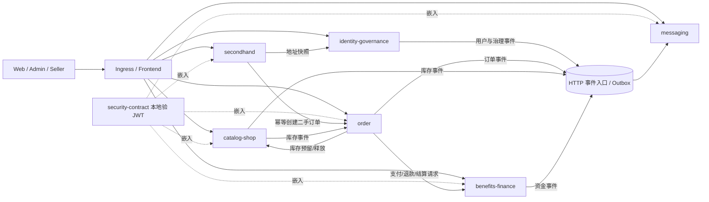

# 微服务划分与依赖设计

## 1. 最终划分

系统使用 5 个需求交付域、6 个业务微服务、1 个统一入口和 1 个媒体支撑能力。Domain E 拆成资金与消息两个服务，避免把资金强一致和实时消息混成一个事务边界；Domain B 合并为一个 catalog-shop 部署单元，避免无业务收益的过细拆分。

| 服务 | UC | 唯一职责 | 源码 | 数据库 | 状态 |
|---|---|---|---|---|---|
| identity-governance-service | UC01–UC05 | 登录、用户、地址、商家审核、举报拉黑、信用、审计 | `microservices/identity-governance-service` | `identity_governance_db` | 已实现/已部署 |
| catalog-shop-service | UC06–UC10 | 分类、商品、店铺、搜索、库存、风险与行为 | `microservices/catalog-shop-service` | `catalog_shop_db` | 已实现/已部署 |
| order-service | UC11–UC15、UC20 | 订单、支付状态、履约、售后、物流、评价 | `microservices/order-service` | `order_db` | 已实现/已部署 |
| secondhand-service | UC16–UC19 | 二手发布、直购、议价、拍卖与建单补偿 | `microservices/secondhand-service` | `secondhand_db` | 已实现/已部署 |
| benefits-finance-service | UC21–UC23 | 优惠券、钱包、资金流水、支付退款结算 | `microservices/benefits-finance-service` | `benefits_finance_db` | 已实现/已部署 |
| messaging-service | UC24–UC25 | 会话、通知、WebSocket、事件 Inbox/Outbox | `microservices/messaging-service` | `messaging_db` | 已实现/已部署 |

兼容后端继续承载未彻底移除的回退实现，用于改造前后比较和迁移安全，不拥有已经切到微服务的新增写入规则。

## 2. 服务关系图

箭头代表版本化 HTTP API 或事件，不代表跨库查询。每个服务只连接自己的 schema。

## 3. 调用方式与一致性

| 链路 | 方式 | 失败策略 |
|---|---|---|
| 客户端 → identity | 同步 HTTP | 登录失败明确返回；已签发 JWT 由业务服务本地验证 |
| order → catalog-shop | 同步库存 API + 幂等键 | 超时不直接重试未知写入；按请求键查询/释放 |
| order → finance | 同步资金请求 + 请求 ID | 资金结果按业务请求幂等；未知结果先查询 |
| secondhand → order | 同步建单 + 本地补偿任务 | 失败进入 `RETRY`，恢复后用同一 business key 自动补建 |
| secondhand → identity | 同步地址快照 | 不可用时建单等待，不写占位地址 |
| 业务服务 → messaging | Outbox/事件入口 | 核心事务不因通知失败回滚；重试、Inbox 去重和 DLQ |
| catalog-shop → order | Outbox 库存事件 | Order 不可用时积压并按退避重试 |

共同规则：

- 订单保存商品、成交价和收件地址快照，历史查询不回查其他服务数据库；
- 所有跨服务写请求使用业务幂等键，HTTP 超时不能等同于业务失败；
- 资金变更与流水在 Finance 自身事务完成，Order 只保存结果和外部交易号；
- 通知失败不能回滚已完成的订单、审核或拍卖；
- 只有不可逆、跨系统、安全或正式发布边界设置阻断门禁，普通前置检查不得替代真实代码、模拟和测量。

## 4. 身份服务是否是同步单点

登录是受保护业务的前置条件，但普通业务请求不逐次同步调用身份服务。登录后，Gateway 和业务服务用共享验证库本地校验 JWT；地址快照、封禁状态和高风险权限等确实需要最新身份事实的操作，才调用内部 API或消费治理事件。

因此 identity-governance 暂时不可用时：公开浏览和未过期 JWT 的普通低风险请求仍可继续；登录、地址快照和无法安全降级的高风险写操作明确失败或等待，不能绕过权限。

## 5. Order 停机影响

| 服务 | 进程/探针 | 业务影响 |
|---|---|---|
| identity-governance | 正常 | 无直接依赖 |
| catalog-shop | 正常 | 浏览搜索正常；新建单无法完成，发往 Order 的库存事件等待重试 |
| benefits-finance | 正常 | 自身接口可用；没有新的 Order 支付、退款、结算请求 |
| messaging | 正常 | 聊天和已有通知可用；不产生新的订单事件通知 |
| secondhand | 正常 | 浏览发布可用；直购/拍卖结算进入 `RETRY`，Order 恢复后补建单 |

正式故障实验只暂停隔离命名空间中的 Order；生产 Order 和其他生产服务全部保持 1/1 Ready，详见 `04_tests/cloud-native-experiments/20260902-order-fault-b622e6bb/`。

## 6. 验收定义

每个业务服务必须具备：独立可执行 JAR、Dockerfile、镜像、配置、Service/Deployment、Flyway 与数据库账号；只访问本服务表；公开 API 测试、真实 MySQL 测试、独立 E2E、完整系统路由 E2E；日志、liveness、readiness、version；流水线发布不可变 `sha-<commit>` 镜像并用 Helm 原子部署。当前六个服务均按此结构实现，实际运行结论见 `02_docs/test-summary.md`。
