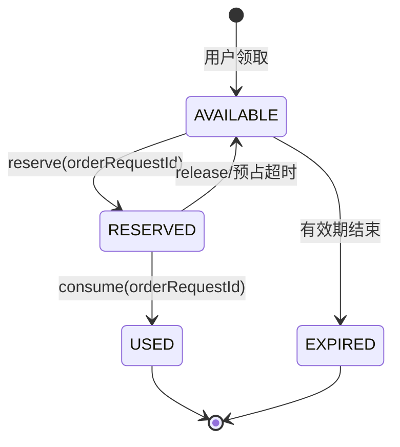
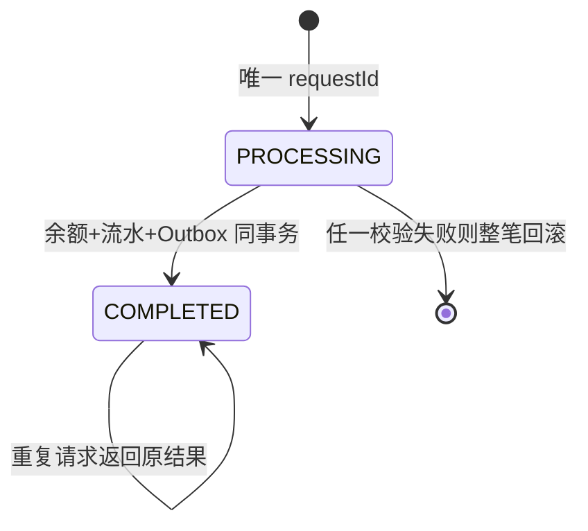

# 服务边界与状态机

## 负责

- 优惠券规则、发行、领取、预占、核销、释放与过期回收。
- 个人钱包、商家经营账户、充值、扣款、退款、结算和不可删除流水。
- 有版本及有效期的结算报价、资金请求幂等状态、可靠事件 Outbox。

## 不负责

- 用户、角色和 JWT 签发：identity-governance-service。
- 商品/店铺主数据：catalog-shop-service；本服务只保存 `shopId`、`productId`。
- 订单状态：order-service；本服务只保存 `orderId` 和请求 ID。
- 通知投递：messaging-service；通知失败不回滚资金事实。

## 优惠券状态

状态迁移使用条件更新；相同 `orderRequestId` 返回原状态，其他订单不能占用已预占的券。

## 资金状态

金额统一为 `DECIMAL(19,2)`、币种默认 `CNY`。不允许负余额，不通过删除流水修正余额。
