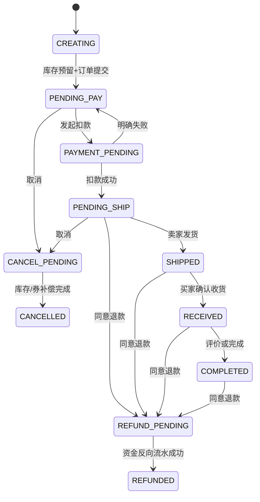
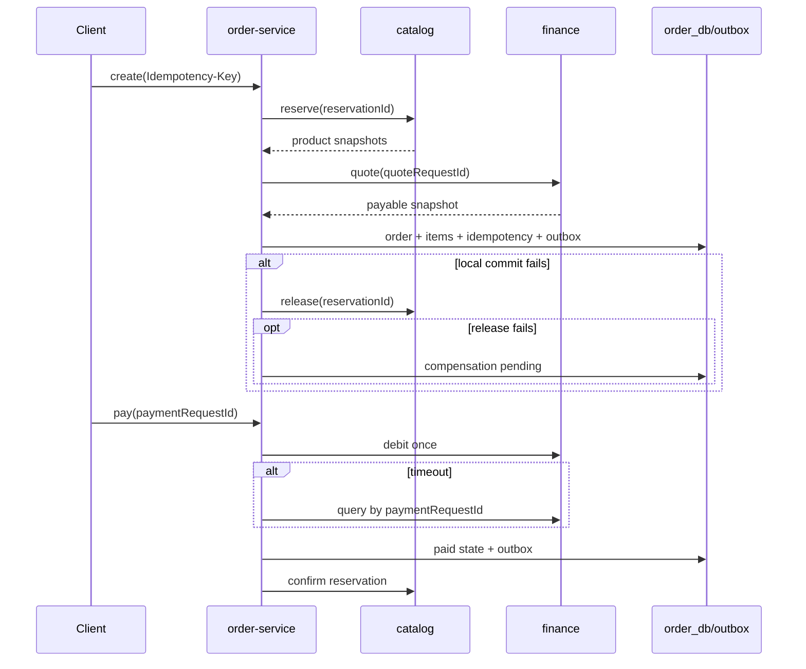

# 服务边界、状态机与 Saga

## 边界

服务独占新品及二手订单、订单明细快照、售后轨迹、评价、物流轨迹、幂等记录、Saga 和 outbox。商品、地址、店铺、优惠券和余额只通过版本化契约取得快照或执行命令；代码中不含 `ProductMapper`、`SecondhandProductMapper`、`BalanceMapper`、`VoucherMapper`、`AddressMapper`、`NotificationMapper`。

公开请求校验 identity 签发的 JWT；内部接口校验 `X-Internal-Service-Token`。写接口要求 `Idempotency-Key`，支付和退款超时后按原 requestId 查询，不做无条件重试。

## 状态机

退款申请先在 `refund_status` 进入 `REQUESTED`，卖家或管理员决定后进入 `REFUND_PENDING/REFUNDED` 或 `REJECTED`，不破坏履约状态的审计语义。

## Saga

