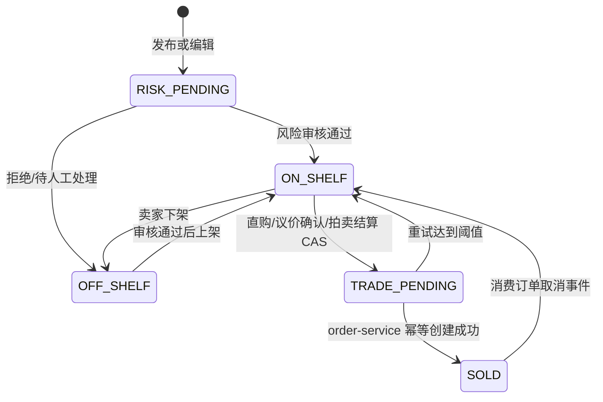

# 服务边界

## 负责范围

| 能力 | 用例 | 强一致数据 |
|---|---|---|
| 二手发布、编辑、上下架、删除和公开查询 | UC16 | `secondhand_product` |
| 直接购买成交资格和商品冻结 | UC17 | `secondhand_product`、`trade_order_request` |
| 议价申请、拒绝、确认和成交资格 | UC18 | `product_negotiation`、`trade_order_request` |
| 拍卖创建、并发出价、流拍和赢家结算 | UC19 | `product_auction`、`auction_log`、`trade_order_request` |
| 订单状态本地投影 | 协作 UC20 | `trade_order_request.order_status` |

## 不负责范围

- 不拥有或写入 `order_info`、`order_item`、支付、余额、优惠券、物流和通知表。
- 不提供 `/api/order/**` 或 `/api/logistics/**`。
- 不包含 `OrderMapper`、`BalanceMapper`、`VoucherMapper`、`NotificationMapper`。
- 不以客户端 `X-User-Id` 作为身份来源；公网 API 使用 identity 服务签发的 JWT。

## 状态与一致性

商品冻结和 `trade_order_request` 写入同一本地事务。远端订单创建不参与本地数据库事务，以 business key 查询和重试完成最终一致性。
