# Kinda Goods 中期检查总报告

## 1. 报告范围

1. 课程要求对照和 Git 基线；
2. 前端、后端、MySQL 启动与健康状态；
3. 25 个确认用例总体运行情况；
4. 逐用例 API/集成测试与真实浏览器 E2E；
5. 四份权威文档及需求、图模型、追溯位置；
6. CI/CD 构建、测试、制品、镜像和部署；
7. 微服务边界、服务接口和数据库归属；
8. 中期结论。

## 2. 课程中期要求对照

| 课程检查项 | 当前结论 | 可核验证据 |
|---|---|---|
| 原系统能够启动并保留基线 | `PASS`（已有基线证据） | Git 标签 `monolith-start`；源码与基线说明|
| 确认后的 UC01–UC25 均有运行入口 | `PASS`（静态范围） | 用例总清单；25/25 Playwright spec 覆盖门禁 |
| 全部用例真实浏览器运行 | `PASS`（已核验 main CI）| main 全 UC E2E job|
| 全部用例的需求、系统级图、组件级图、对象级图和追溯表 | `PASS`（文档） | 四份权威文档；25 个 UC 目录；156 份可编辑 Mermaid 源码 |
| 前端、后端、数据库容器能够启动 | `PASS`（已核验 main CI） | Compose；main CI |
| CI 自动构建和测试 | `PASS` | 前端、后端、Domain A–E、覆盖门禁、Compose Playwright 均在流水线内 |
| 微服务划分图、服务接口清单、数据表归属 | `PASS`（设计交付） | [微服务边界](#appendix-microservice-boundaries)、[API 清单](#appendix-service-api-catalog)、[表归属](#appendix-database-ownership) |


结论：**中期要求中的文档、用例入口、已核验 main 流水线和目标微服务设计已形成可交付材料；但不能宣称“全部工程任务完成”**。主要缺口是 UC06–UC10 缺仓库内逐 UC Playwright JSON，以及 6 个目标业务微服务尚未全部独立实现、拆库和部署。


## 3. 前端、后端和数据库启动情况

当前单体全栈由 compose.yml 定义，并由 compose.e2e.yml 为浏览器测试补充配置。

| 组件 | 镜像/实现 | 对外入口 | 健康检查与依赖 | 结论 |
|---|---|---|---|---|
| MySQL | `mysql:8.4.6` | `localhost:3307` | `mysqladmin ping`；先装载 `schema.sql`，再装载测试种子 | `PASS` |
| 后端 | Spring Boot，`segroup8/backend:1.0.0` | `localhost:8089` | `/actuator/health` 返回 `UP`；等待 MySQL healthy | Maven 233/233 `PASS` |
| 前端 | Vue 3 + Nginx，`segroup8/frontend:1.0.0` | `http://localhost:8088` | `/health`；等待后端 healthy | `build:real` `PASS` |


## 4. 用例运行情况（总体）

| Domain | 用例范围 | Playwright 入口 |  已核验 main CI |
|---|---:|---:|---|
| A：账户与用户治理 | UC01–UC05 | 5/5 | `PASS` |
| B：商品与店铺 | UC06–UC10 | 5/5 | `PASS` |
| C：订单与履约 | UC11–UC15 | 5/5  | `PASS` |
| D：二手交易 | UC16–UC20 | 5/5  | `PASS` |
| E：互动与财务 | UC21–UC25 | 5/5  | `PASS` |
| 合计 | UC01–UC25 | 25/25 | `PASS` |


## 5. 分用例需求、模型和测试情况


### 5.1 API/集成测试与 E2E 逐用例表

| 用例 |  API/集成测试 | 真实浏览器 E2E |
|---|---|---|
| UC01 注册、登录和鉴权 |  `PASS`：服务、Token/权限分支证据 | `LOCAL_E2E_PASS`，1/1；main CI `PASS` |
| UC02 资料和地址 |  `PASS`：资料、默认地址、越权分支 | `LOCAL_E2E_PASS`，1/1；main CI `PASS` |
| UC03 商家申请 |  `PASS`：申请审批、角色升级与通知 | `LOCAL_E2E_PASS`，1/1；main CI `PASS` |
| UC04 封禁解禁审计 | `PASS`：封禁、解禁、登录阻断和审计 | `LOCAL_E2E_PASS`，1/1；main CI `PASS` |
| UC05 举报拉黑信用 | `PASS`：举报审核、拉黑权限和信用分 | `LOCAL_E2E_PASS`，1/1；main CI `PASS` |
| UC06 搜索筛选详情 | `PASS`：搜索详情及筛选/异常路径 | `LOCAL_E2E_PASS`，1/1；main CI `PASS` |
| UC07 卖家商品生命周期 |  `PASS`：API 场景及服务规则证据 | `LOCAL_E2E_PASS`，1/1；main CI `PASS` |
| UC08 店铺设置装修 |  `PASS`：店铺 API 主流程和权限场景 | `LOCAL_E2E_PASS`，1/1；main CI `PASS` |
| UC09 商品风险审核 |  `PASS`：审核 API、通过/驳回及确定性降级 | `LOCAL_E2E_PASS`，1/1；main CI `PASS` |
| UC10 浏览搜索热词 |  `PASS`：行为 API、历史与热词场景 | `LOCAL_E2E_PASS`，1/1；main CI `PASS` |
| UC11 购物车结算拆单 |  `PASS`：结算、拆单与库存规则 | `LOCAL_E2E_PASS`，1/1；main CI `PASS` |
| UC12 支付取消 |  `PASS`：支付、取消、库存恢复和幂等 | `LOCAL_E2E_PASS`，1/1；main CI `PASS` |
| UC13 发货物流收货 |  `PASS`：发货、轨迹、收货和自动确认 | `LOCAL_E2E_PASS`，1/1；main CI `PASS` |
| UC14 退款退货仲裁 |  `PASS`：申请、仲裁、退款拆分及超时 | `LOCAL_E2E_PASS`，1/1；main CI `PASS` |
| UC15 评价追评回复 |  `PASS`：首评、追评、回复及非法操作 | `LOCAL_E2E_PASS`，1/1；main CI `PASS` |
| UC16 二手发布管理 | `PASS`：字段校验、本人管理和 MySQL 集成 | `LOCAL_E2E_PASS`，1/1；main CI `PASS` |
| UC17 二手直接购买 |  `PASS`：禁止自购、建单和状态一致性 | `LOCAL_E2E_PASS`，1/1；main CI `PASS` |
| UC18 二手议价 | `PASS`：同意、拒绝和重复处理 | `LOCAL_E2E_PASS`，1/1；main CI `PASS` |
| UC19 二手拍卖 |  `PASS`：低价/超时拒绝、结算幂等 | `LOCAL_E2E_PASS`，1/1；main CI `PASS` |
| UC20 二手履约 |  `PASS`：二手卖家发货、物流与收货 | `LOCAL_E2E_PASS`，1/1；main CI `PASS` |
| UC21 优惠券生命周期 |  `PASS`：卖家/管理员创建、编辑、关闭 | `LOCAL_E2E_PASS`，1/1；main CI `PASS` |
| UC22 领券核销 |  `PASS`：领取、门槛、结算核销 | `LOCAL_E2E_PASS`，1/1；main CI `PASS` |
| UC23 钱包账户结算 |  `PASS`：充值、账户隔离、结算和流水 | `LOCAL_E2E_PASS`，1/1；main CI `PASS` |
| UC24 会话消息 |  `PASS`：会话创建、消息持久化和权限 | `LOCAL_E2E_PASS`，1/1；main CI `PASS` |
| UC25 通知实时推送 | `PASS`：列表、已读、Token 和推送场景 | `LOCAL_E2E_PASS`，1/1；main CI `PASS` |


## 6. 文档内容

| 文档 | 中期检查内容 | 当前状态 |
|---|---|---|
| [软件需求说明书](#appendix-software-requirements) | 统一编号规则、参与者和总体用例图；25 组用户故事、用例说明、前后置条件、基本/备选/异常流、特殊需求、验收标准；逐 UC 系统行为图和概念类图入口 | `PASS` |
| [软件概要设计说明书](#appendix-software-architecture-design) | 当前单体与目标架构、组件边界、逐 UC 组件结构和组件顺序模型、跨组件失败处理 | `PASS` |
| [软件详细设计说明书](#appendix-software-detailed-design) | 核心类图、状态与事务约束、逐 UC 对象/类模型和对象顺序图、异常幂等日志和定时任务 | `PASS` |
| [需求追溯矩阵](#appendix-requirements-traceability) | 25 个用例的需求编号、模型编号、代码位置、测试编号、结果与缺口 | `PASS` |


## 7. CI/CD 构建、测试和部署

流水线定义：ci-cd.yml；说明：PIPELINE.md。

| 阶段 | 自动化内容 | 已记录结论 |
|---|---|---|
| 前端 | `npm ci`、`build:real`、上传 `frontend-dist` | `PASS` |
| 后端 | JWT 契约、Maven 测试、打包并上传 JAR | `PASS` |
| Domain A–E | 复用工作流执行五域 API/集成测试并上传结构化证据 | A、B、C、D、E 均 `PASS` |
| E2E 覆盖门禁 | 要求 UC01–UC25 各有且位于正确 Domain 的 Playwright spec | 25/25 `PASS` |
| 全栈 E2E | 下载已验证前后端制品，启动 Compose/MySQL，先 smoke，再运行全部 Domain Playwright | `PASS` |
| Helm | lint 和 template 校验生产 chart | `PASS` |
| 镜像发布 | 仅 main 通过全部门禁后，以不可变 `sha-<Git SHA>` 推送前后端镜像 | 已记录 main job `PASS` |
| K3s 部署 | Helm `--atomic --wait` 部署并检查公开健康端点 | 已记录 main job `PASS` |
| GitHub Release | 仅 `v*` 标签触发 | 本次非发布触发，`SKIPPED` |

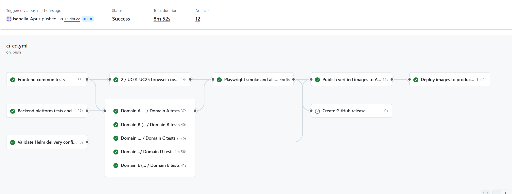

## 8. 微服务划分、接口清单和数据库归属

### 8.1 微服务划分

微服务划分图和依赖已经完整收录在[微服务划分与依赖设计](#appendix-microservice-boundaries)，目标边界为“5 个交付域、6 个业务微服务、1 个入口和 1 个支撑组件”：

| 目标业务服务 | 主要 UC |
|---|---|
| `identity-governance-service` | UC01–UC05 |
| `catalog-shop-service` | UC06–UC10 |
| `order-service` | UC11–UC15、UC20 |
| `secondhand-service` | UC16–UC19 |
| `benefits-finance-service` | UC21–UC23 |
| `messaging-service` | UC24–UC25 |


### 8.2 服务接口清单

[服务 API 清单](#appendix-service-api-catalog)按当前 Controller、现有微服务 Controller 和 WebSocket 配置盘点公开接口，并冻结迁移后的唯一 owner。当前清单包含约 100 个接口记录行；组合方法展开后对应更多路由。公开路径继续使用 `/api/**`，内部契约使用 `/internal/**`；受保护接口使用 Bearer JWT，客户端自报的 `X-User-Id` 等身份头不可信。

清单还定义了库存预留、结算报价/支付/退款、二手成交建单、身份状态传播、通知等内部 API/事件契约，以及超时、幂等、重试、DLQ、outbox 和补偿策略。

### 8.3 数据库归属

[数据库表归属方案](#appendix-database-ownership)冻结了单体 33 张逻辑业务表的唯一目标 owner：

| Owner/schema | 主要数据 |
|---|---|
| `identity-governance / identity_governance_db` | 用户、地址、商家申请、举报拉黑、信用和审计 |
| `catalog-shop / catalog_shop_db` | 分类、商品、店铺、风险审核、浏览与搜索行为 |
| `order / order_db` | 订单、明细、售后、评价和物流 |
| `secondhand / secondhand_db` | 二手商品、议价、拍卖和出价日志 |
| `benefits-finance / benefits_finance_db` | 优惠券、用户券、余额和资金流水 |
| `messaging / messaging_db` | 会话、消息和通知 |

冻结规则是一张业务表只有一个写入服务；其他服务只保存稳定 ID/快照或通过版本化 API、事件读取；禁止跨 schema 外键、JOIN、共享 Mapper/Repository；资金余额与流水必须在同一 owner 的本地事务内更新。当前主运行路径仍是单体 MySQL schema。


## 9. 中期交付结论

**25 个最新用例已建立完整需求/图模型/追溯和规范的 E2E 入口；已核验 main CI 的全 UC Compose E2E、镜像发布和 K3s 部署通过；本分支构建与 API/集成回归通过。**


## 附录：报告引用文档全文

以下文档为本报告正文引用的当前分支版本，现将原文直接附于报告末尾，正文链接均已改为指向对应附录。

## 附录 A：软件需求说明书

<a id="appendix-software-requirements"></a>
# Kinda Goods 软件需求说明书

> 文档基线：2026-08-28
> 验收范围：`REQ01`–`REQ25` / `US01`–`US25` / `UC01`–`UC25`
> 单用例入口：单用例材料位于 `../UC01/`–`../UC25/`。

## 1 编号和写作规则

- `REQxx`：稳定需求编号，表示必须交付的业务能力；
- `USxx`：用户故事编号，采用“作为……我希望……以便……”格式说明价值；
- `UCxx`：完整业务用例编号，一个用例从参与者触发到产生可验证结果；
- `ACxx-yyy`：验收标准编号，必须能追到测试编号和运行结果；
- `SYS-*xx / COMP-*xx / OBJ-*xx`：系统级、组件级和对象级模型编号。

页面、按钮、单个 API 或数据库操作不是独立业务用例。备选和异常路径使用与基本事件流对应的步骤号，例如 `2a`、`3a`。

## 2 项目范围与参与者

Kinda Goods 面向校园和社区交易，包含官方商城、个人闲置交易、卖家工作台和管理后台。主要参与者为游客、普通用户/买家、官方卖家/二手卖家和管理员；系统时钟、支付/结算和实时通道作为协作系统或外部事件源。

## 3 系统用例图


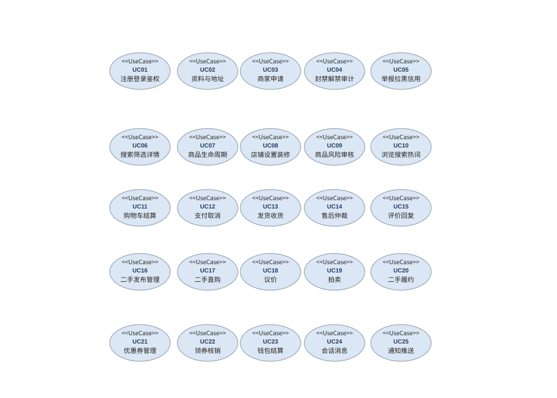

## 4 需求、用户故事与用例索引

| 需求编号 | 用户故事编号 | 用例编号 | 主要参与者 | 用例名称与说明 |
|---|---|---|---|---|
| `REQ01` | `US01` | `UC01` | 游客 | [注册、登录和角色鉴权](../UC01/requirement.md) |
| `REQ02` | `US02` | `UC02` | 已登录用户 | [用户资料和地址](../UC02/requirement.md) |
| `REQ03` | `US03` | `UC03` | 普通用户 | [商家申请、通过和拒绝](../UC03/requirement.md) |
| `REQ04` | `US04` | `UC04` | 管理员 | [用户封禁、解禁及审计](../UC04/requirement.md) |
| `REQ05` | `US05` | `UC05` | 普通用户 | [举报、拉黑、信用分和审计](../UC05/requirement.md) |
| `REQ06` | `US06` | `UC06` | 游客 | [商品列表、搜索筛选和详情](../UC06/requirement.md) |
| `REQ07` | `US07` | `UC07` | 官方卖家 | [卖家商品新增、编辑、上下架和库存调整](../UC07/requirement.md) |
| `REQ08` | `US08` | `UC08` | 游客 | [店铺查看、设置和装修](../UC08/requirement.md) |
| `REQ09` | `US09` | `UC09` | 卖家 | [商品风险审核](../UC09/requirement.md) |
| `REQ10` | `US10` | `UC10` | 已登录用户 | [浏览记录、搜索历史和热词](../UC10/requirement.md) |
| `REQ11` | `US11` | `UC11` | 买家 | [购物车结算和订单拆分](../UC11/requirement.md) |
| `REQ12` | `US12` | `UC12` | 买家 | [支付和取消](../UC12/requirement.md) |
| `REQ13` | `US13` | `UC13` | 买家 | [发货、物流、收货和完成](../UC13/requirement.md) |
| `REQ14` | `US14` | `UC14` | 买家 | [退款、退货及仲裁](../UC14/requirement.md) |
| `REQ15` | `US15` | `UC15` | 买家 | [评价、追评和卖家回复](../UC15/requirement.md) |
| `REQ16` | `US16` | `UC16` | 已登录用户 | [二手商品发布和管理](../UC16/requirement.md) |
| `REQ17` | `US17` | `UC17` | 二手买家 | [二手直接购买及禁止自购](../UC17/requirement.md) |
| `REQ18` | `US18` | `UC18` | 买家 | [议价申请、确认和拒绝](../UC18/requirement.md) |
| `REQ19` | `US19` | `UC19` | 二手卖家 | [拍卖、出价和结束](../UC19/requirement.md) |
| `REQ20` | `US20` | `UC20` | 二手卖家 | [二手成交后的订单履约](../UC20/requirement.md) |
| `REQ21` | `US21` | `UC21` | 官方卖家 | [卖家/管理员优惠券生命周期](../UC21/requirement.md) |
| `REQ22` | `US22` | `UC22` | 买家 | [领券及结算使用](../UC22/requirement.md) |
| `REQ23` | `US23` | `UC23` | 买家 | [充值、个人钱包、商家账户和结算](../UC23/requirement.md) |
| `REQ24` | `US24` | `UC24` | 买家 | [会话和消息](../UC24/requirement.md) |
| `REQ25` | `US25` | `UC25` | 登录用户 | [通知、已读和实时推送](../UC25/requirement.md) |

## 5 详细用例说明

## REQ01 / US01 / UC01 注册、登录和角色鉴权

## 用户故事与用例标识

| 项目 | 内容 |
|---|---|
| 需求编号 | `REQ01` |
| 用户故事编号 | `US01` |
| 用户故事 | 作为访客或已注册用户，我希望完成注册、登录并按角色访问系统，以便安全使用授权功能。 |
| 用例编号 | `UC01` |
| 用例名称 | 注册、登录和角色鉴权 |

## 用例说明

| 项目 | 内容 |
|---|---|
| 主要参与者 | 游客 |
| 次要参与者/协作系统 | 普通用户、官方卖家、管理员 |
| 基本描述 | 完成注册、登录并按角色访问系统，从而安全使用授权功能。 |
| 触发条件 | 用户提交注册或登录 |

### 前置条件

- 系统和数据库可用。

### 后置条件

- 返回用户与 Token。
- 密码不明文保存。
- 越权接口返回 401/403。

### 基本事件流

1. 游客 触发用例：用户提交注册或登录。
2. 系统校验参与者身份、角色、输入参数、资源归属和用例前置条件。
3. 注册时校验用户名并保存密码摘要。
4. 登录时校验凭据、签发 JWT。
5. 受保护请求解析身份和角色。
6. 系统提交有效变更，返回业务结果和可追踪状态。

### 备选/异常事件流

- **2a.** 用户名重复、密码错误、Token 缺失或角色不匹配时拒绝请求；系统返回明确原因，不保留不一致的业务变更。

### 特殊需求

- 安全性：所有受保护操作必须校验 JWT、角色和资源归属；禁止仅信任客户端传入的用户标识。
- 一致性与幂等：写操作在事务边界内完成；重复请求、并发冲突和下游超时不得造成重复写入或半完成状态。
- 可追溯性：关键状态变化必须保留操作者、时间、结果和 traceId，失败也要留下可定位记录。

### 验收标准

| 验收编号 | 可验证结果 |
|---|---|
| `AC01-001` | 返回用户与 Token |
| `AC01-002` | 密码不明文保存 |
| `AC01-003` | 越权接口返回 401/403 |

## 系统级模型

- 模型编号：`SYS-BEH01`
- 系统行为模型：[system.mmd](../UC01/system.mmd)
- 概念类图：[concept.mmd](../UC01/concept.mmd)
- 组件结构图：[component.mmd](../UC01/component.mmd)
- 组件顺序图：[component-sequence.mmd](../UC01/component-sequence.mmd)
- 详细设计类图：[object.mmd](../UC01/object.mmd)
- 对象顺序图：[object-sequence.mmd](../UC01/object-sequence.mmd)
- 追溯矩阵：[traceability.md](../UC01/traceability.md)


---

## REQ02 / US02 / UC02 用户资料和地址

## 用户故事与用例标识

| 项目 | 内容 |
|---|---|
| 需求编号 | `REQ02` |
| 用户故事编号 | `US02` |
| 用户故事 | 作为已登录用户，我希望维护个人资料和收货地址，以便使用准确身份和配送信息完成交易。 |
| 用例编号 | `UC02` |
| 用例名称 | 用户资料和地址 |

## 用例说明

| 项目 | 内容 |
|---|---|
| 主要参与者 | 已登录用户 |
| 次要参与者/协作系统 | 官方卖家 |
| 基本描述 | 维护个人资料和收货地址，从而使用准确身份和配送信息完成交易。 |
| 触发条件 | 用户进入个人资料或地址管理 |

### 前置条件

- JWT 有效。

### 后置条件

- 用户资料和地址持久化。
- 同一用户最多一个默认地址。
- 他人地址不可访问。

### 基本事件流

1. 已登录用户 触发用例：用户进入个人资料或地址管理。
2. 系统校验参与者身份、角色、输入参数、资源归属和用例前置条件。
3. 查询或修改本人资料。
4. 新增、修改、删除地址。
5. 设置默认地址。
6. 系统提交有效变更，返回业务结果和可追踪状态。

### 备选/异常事件流

- **2a.** 字段不合法或地址不属于当前用户时拒绝；系统返回明确原因，不保留不一致的业务变更。
- **3b.** 删除默认地址后重新确定默认项；系统返回明确原因，不保留不一致的业务变更。

### 特殊需求

- 安全性：所有受保护操作必须校验 JWT、角色和资源归属；禁止仅信任客户端传入的用户标识。
- 一致性与幂等：写操作在事务边界内完成；重复请求、并发冲突和下游超时不得造成重复写入或半完成状态。
- 可追溯性：关键状态变化必须保留操作者、时间、结果和 traceId，失败也要留下可定位记录。

### 验收标准

| 验收编号 | 可验证结果 |
|---|---|
| `AC02-001` | 用户资料和地址持久化 |
| `AC02-002` | 同一用户最多一个默认地址 |
| `AC02-003` | 他人地址不可访问 |

## 系统级模型

- 模型编号：`SYS-BEH02`
- 系统行为模型：[system.mmd](../UC02/system.mmd)
- 概念类图：[concept.mmd](../UC02/concept.mmd)
- 组件结构图：[component.mmd](../UC02/component.mmd)
- 组件顺序图：[component-sequence.mmd](../UC02/component-sequence.mmd)
- 详细设计类图：[object.mmd](../UC02/object.mmd)
- 对象顺序图：[object-sequence.mmd](../UC02/object-sequence.mmd)
- 追溯矩阵：[traceability.md](../UC02/traceability.md)


---

## REQ03 / US03 / UC03 商家申请、通过和拒绝

## 用户故事与用例标识

| 项目 | 内容 |
|---|---|
| 需求编号 | `REQ03` |
| 用户故事编号 | `US03` |
| 用户故事 | 作为普通用户，我希望提交商家申请并获知审核结果，以便在获批后经营店铺。 |
| 用例编号 | `UC03` |
| 用例名称 | 商家申请、通过和拒绝 |

## 用例说明

| 项目 | 内容 |
|---|---|
| 主要参与者 | 普通用户 |
| 次要参与者/协作系统 | 管理员 |
| 基本描述 | 提交商家申请并获知审核结果，从而在获批后经营店铺。 |
| 触发条件 | 普通用户提交商家申请 |

### 前置条件

- 管理员已登录。

### 后置条件

- 申请状态、拒绝原因、用户角色、店铺和审计记录一致。

### 基本事件流

1. 普通用户 触发用例：普通用户提交商家申请。
2. 系统校验参与者身份、角色、输入参数、资源归属和用例前置条件。
3. 用户提交资料。
4. 管理员查询待审申请。
5. 管理员通过后创建店铺并升级角色。
6. 系统提交有效变更，返回业务结果和可追踪状态。

### 备选/异常事件流

- **2a.** 管理员拒绝并填写原因；系统返回明确原因，不保留不一致的业务变更。
- **3b.** 重复审核、资料缺失或非管理员操作时拒绝；系统返回明确原因，不保留不一致的业务变更。

### 特殊需求

- 安全性：所有受保护操作必须校验 JWT、角色和资源归属；禁止仅信任客户端传入的用户标识。
- 一致性与幂等：写操作在事务边界内完成；重复请求、并发冲突和下游超时不得造成重复写入或半完成状态。
- 可追溯性：关键状态变化必须保留操作者、时间、结果和 traceId，失败也要留下可定位记录。

### 验收标准

| 验收编号 | 可验证结果 |
|---|---|
| `AC03-001` | 申请状态、拒绝原因、用户角色、店铺和审计记录一致 |

## 系统级模型

- 模型编号：`SYS-BEH03`
- 系统行为模型：[system.mmd](../UC03/system.mmd)
- 概念类图：[concept.mmd](../UC03/concept.mmd)
- 组件结构图：[component.mmd](../UC03/component.mmd)
- 组件顺序图：[component-sequence.mmd](../UC03/component-sequence.mmd)
- 详细设计类图：[object.mmd](../UC03/object.mmd)
- 对象顺序图：[object-sequence.mmd](../UC03/object-sequence.mmd)
- 追溯矩阵：[traceability.md](../UC03/traceability.md)


---

## REQ04 / US04 / UC04 用户封禁、解禁及审计

## 用户故事与用例标识

| 项目 | 内容 |
|---|---|
| 需求编号 | `REQ04` |
| 用户故事编号 | `US04` |
| 用户故事 | 作为管理员，我希望封禁或解禁违规用户并保留审计记录，以便控制账号风险。 |
| 用例编号 | `UC04` |
| 用例名称 | 用户封禁、解禁及审计 |

## 用例说明

| 项目 | 内容 |
|---|---|
| 主要参与者 | 管理员 |
| 次要参与者/协作系统 | 普通用户 |
| 基本描述 | 封禁或解禁违规用户并保留审计记录，从而控制账号风险。 |
| 触发条件 | 管理员选择目标用户 |

### 前置条件

- 目标用户存在。

### 后置条件

- 用户状态和登录结果一致。
- 封禁、解禁各有审计日志。

### 基本事件流

1. 管理员 触发用例：管理员选择目标用户。
2. 系统校验参与者身份、角色、输入参数、资源归属和用例前置条件。
3. 管理员封禁用户并记录原因。
4. 封禁用户不能登录。
5. 管理员解禁后用户恢复登录。
6. 系统提交有效变更，返回业务结果和可追踪状态。

### 备选/异常事件流

- **2a.** 普通用户调用管理接口、目标为管理员或状态重复时拒绝；系统返回明确原因，不保留不一致的业务变更。

### 特殊需求

- 安全性：所有受保护操作必须校验 JWT、角色和资源归属；禁止仅信任客户端传入的用户标识。
- 一致性与幂等：写操作在事务边界内完成；重复请求、并发冲突和下游超时不得造成重复写入或半完成状态。
- 可追溯性：关键状态变化必须保留操作者、时间、结果和 traceId，失败也要留下可定位记录。

### 验收标准

| 验收编号 | 可验证结果 |
|---|---|
| `AC04-001` | 用户状态和登录结果一致 |
| `AC04-002` | 封禁、解禁各有审计日志 |

## 系统级模型

- 模型编号：`SYS-BEH04`
- 系统行为模型：[system.mmd](../UC04/system.mmd)
- 概念类图：[concept.mmd](../UC04/concept.mmd)
- 组件结构图：[component.mmd](../UC04/component.mmd)
- 组件顺序图：[component-sequence.mmd](../UC04/component-sequence.mmd)
- 详细设计类图：[object.mmd](../UC04/object.mmd)
- 对象顺序图：[object-sequence.mmd](../UC04/object-sequence.mmd)
- 追溯矩阵：[traceability.md](../UC04/traceability.md)


---

## REQ05 / US05 / UC05 举报、拉黑、信用分和审计

## 用户故事与用例标识

| 项目 | 内容 |
|---|---|
| 需求编号 | `REQ05` |
| 用户故事编号 | `US05` |
| 用户故事 | 作为平台用户和管理员，我希望完成举报、拉黑、审核与信用治理，以便降低恶意交互风险。 |
| 用例编号 | `UC05` |
| 用例名称 | 举报、拉黑、信用分和审计 |

## 用例说明

| 项目 | 内容 |
|---|---|
| 主要参与者 | 普通用户 |
| 次要参与者/协作系统 | 卖家、管理员 |
| 基本描述 | 完成举报、拉黑、审核与信用治理，从而降低恶意交互风险。 |
| 触发条件 | 存在两个可交互用户 |

### 前置条件

- 举报对象和证据有效。

### 后置条件

- 举报状态、拉黑关系、信用分日志和管理员审计记录一致。

### 基本事件流

1. 普通用户 触发用例：存在两个可交互用户。
2. 系统校验参与者身份、角色、输入参数、资源归属和用例前置条件。
3. 用户提交举报或拉黑。
4. 管理员审核举报。
5. 成立时调整信用分并写日志。
6. 系统提交有效变更，返回业务结果和可追踪状态。

### 备选/异常事件流

- **2a.** 重复拉黑保持幂等；系统返回明确原因，不保留不一致的业务变更。
- **3b.** 越权审核、无效目标或重复审核时拒绝；系统返回明确原因，不保留不一致的业务变更。

### 特殊需求

- 安全性：所有受保护操作必须校验 JWT、角色和资源归属；禁止仅信任客户端传入的用户标识。
- 一致性与幂等：写操作在事务边界内完成；重复请求、并发冲突和下游超时不得造成重复写入或半完成状态。
- 可追溯性：关键状态变化必须保留操作者、时间、结果和 traceId，失败也要留下可定位记录。

### 验收标准

| 验收编号 | 可验证结果 |
|---|---|
| `AC05-001` | 举报状态、拉黑关系、信用分日志和管理员审计记录一致 |

## 系统级模型

- 模型编号：`SYS-BEH05`
- 系统行为模型：[system.mmd](../UC05/system.mmd)
- 概念类图：[concept.mmd](../UC05/concept.mmd)
- 组件结构图：[component.mmd](../UC05/component.mmd)
- 组件顺序图：[component-sequence.mmd](../UC05/component-sequence.mmd)
- 详细设计类图：[object.mmd](../UC05/object.mmd)
- 对象顺序图：[object-sequence.mmd](../UC05/object-sequence.mmd)
- 追溯矩阵：[traceability.md](../UC05/traceability.md)


---

## REQ06 / US06 / UC06 商品列表、搜索筛选和详情

## 用户故事与用例标识

| 项目 | 内容 |
|---|---|
| 需求编号 | `REQ06` |
| 用户故事编号 | `US06` |
| 用户故事 | 作为游客或买家，我希望搜索、筛选并查看商品详情，以便快速找到可购买商品。 |
| 用例编号 | `UC06` |
| 用例名称 | 商品列表、搜索筛选和详情 |

## 用例说明

| 项目 | 内容 |
|---|---|
| 主要参与者 | 游客 |
| 次要参与者/协作系统 | 已登录买家 |
| 基本描述 | 搜索、筛选并查看商品详情，从而快速找到可购买商品。 |
| 触发条件 | 用户打开商品列表、输入筛选条件或选择商品 |

### 前置条件

- 目录服务可访问。

### 后置条件

- 结果只含符合条件的在售商品。
- 排序和详情字段正确。

### 基本事件流

1. 游客 触发用例：用户打开商品列表、输入筛选条件或选择商品。
2. 系统校验参与者身份、角色、输入参数、资源归属和用例前置条件。
3. 系统按关键词、分类、店铺、价格区间和排序方式查询在售商品。
4. 用户查看公开详情。
5. 系统提交有效变更，返回业务结果和可追踪状态。

### 备选/异常事件流

- **2a.** 无匹配项返回空数组；系统返回明确原因，不保留不一致的业务变更。
- **3b.** 非法数字参数返回 400；系统返回明确原因，不保留不一致的业务变更。
- **4c.** 不存在或下架商品返回明确错误；系统返回明确原因，不保留不一致的业务变更。

### 特殊需求

- 安全性：所有受保护操作必须校验 JWT、角色和资源归属；禁止仅信任客户端传入的用户标识。
- 性能与可用性：查询应分页或限制结果规模；实时能力失败时保留可回读数据，不丢失已提交事实。
- 可追溯性：关键状态变化必须保留操作者、时间、结果和 traceId，失败也要留下可定位记录。

### 验收标准

| 验收编号 | 可验证结果 |
|---|---|
| `AC06-001` | 结果只含符合条件的在售商品 |
| `AC06-002` | 排序和详情字段正确 |

## 系统级模型

- 模型编号：`SYS-BEH06`
- 系统行为模型：[system.mmd](../UC06/system.mmd)
- 概念类图：[concept.mmd](../UC06/concept.mmd)
- 组件结构图：[component.mmd](../UC06/component.mmd)
- 组件顺序图：[component-sequence.mmd](../UC06/component-sequence.mmd)
- 详细设计类图：[object.mmd](../UC06/object.mmd)
- 对象顺序图：[object-sequence.mmd](../UC06/object-sequence.mmd)
- 追溯矩阵：[traceability.md](../UC06/traceability.md)


---

## REQ07 / US07 / UC07 卖家商品新增、编辑、上下架和库存调整

## 用户故事与用例标识

| 项目 | 内容 |
|---|---|
| 需求编号 | `REQ07` |
| 用户故事编号 | `US07` |
| 用户故事 | 作为官方卖家，我希望管理商品的新增、编辑、审核、上下架和库存，以便持续经营商品。 |
| 用例编号 | `UC07` |
| 用例名称 | 卖家商品新增、编辑、上下架和库存调整 |

## 用例说明

| 项目 | 内容 |
|---|---|
| 主要参与者 | 官方卖家 |
| 次要参与者/协作系统 | 管理员 |
| 基本描述 | 管理商品的新增、编辑、审核、上下架和库存，从而持续经营商品。 |
| 触发条件 | 卖家有有效店铺并进入商品管理 |

### 前置条件

- 参与者身份、相关资源和依赖服务处于可用状态。

### 后置条件

- 商品所属店铺、状态、库存和修改内容与操作一致。

### 基本事件流

1. 官方卖家 触发用例：卖家有有效店铺并进入商品管理。
2. 系统校验参与者身份、角色、输入参数、资源归属和用例前置条件。
3. 卖家新增或编辑商品。
4. 提交审核。
5. 审核通过后上下架。
6. 按增减量调整库存。
7. 系统提交有效变更，返回业务结果和可追踪状态。

### 备选/异常事件流

- **2a.** 非店主修改、负库存、非法状态转换或待审商品编辑时拒绝；系统返回明确原因，不保留不一致的业务变更。

### 特殊需求

- 安全性：所有受保护操作必须校验 JWT、角色和资源归属；禁止仅信任客户端传入的用户标识。
- 一致性与幂等：写操作在事务边界内完成；重复请求、并发冲突和下游超时不得造成重复写入或半完成状态。
- 可追溯性：关键状态变化必须保留操作者、时间、结果和 traceId，失败也要留下可定位记录。

### 验收标准

| 验收编号 | 可验证结果 |
|---|---|
| `AC07-001` | 商品所属店铺、状态、库存和修改内容与操作一致 |

## 系统级模型

- 模型编号：`SYS-BEH07`
- 系统行为模型：[system.mmd](../UC07/system.mmd)
- 概念类图：[concept.mmd](../UC07/concept.mmd)
- 组件结构图：[component.mmd](../UC07/component.mmd)
- 组件顺序图：[component-sequence.mmd](../UC07/component-sequence.mmd)
- 详细设计类图：[object.mmd](../UC07/object.mmd)
- 对象顺序图：[object-sequence.mmd](../UC07/object-sequence.mmd)
- 追溯矩阵：[traceability.md](../UC07/traceability.md)


---

## REQ08 / US08 / UC08 店铺查看、设置和装修

## 用户故事与用例标识

| 项目 | 内容 |
|---|---|
| 需求编号 | `REQ08` |
| 用户故事编号 | `US08` |
| 用户故事 | 作为店主和访客，我希望维护并查看店铺信息与装修，以便展示和识别真实店铺。 |
| 用例编号 | `UC08` |
| 用例名称 | 店铺查看、设置和装修 |

## 用例说明

| 项目 | 内容 |
|---|---|
| 主要参与者 | 游客 |
| 次要参与者/协作系统 | 买家、官方卖家 |
| 基本描述 | 维护并查看店铺信息与装修，从而展示和识别真实店铺。 |
| 触发条件 | 店铺存在 |

### 前置条件

- 维护操作要求当前用户为店主。

### 后置条件

- 公开页与店铺状态一致。
- 合法设置和装修 JSON 可持久化。

### 基本事件流

1. 游客 触发用例：店铺存在。
2. 系统校验参与者身份、角色、输入参数、资源归属和用例前置条件。
3. 访客查看公开店铺。
4. 店主修改名称、简介和装修配置。
5. 重新查询显示保存内容。
6. 系统提交有效变更，返回业务结果和可追踪状态。

### 备选/异常事件流

- **2a.** 店铺关闭时不公开；系统返回明确原因，不保留不一致的业务变更。
- **3b.** 非店主、未知模板或超大装修数据时拒绝；系统返回明确原因，不保留不一致的业务变更。

### 特殊需求

- 安全性：所有受保护操作必须校验 JWT、角色和资源归属；禁止仅信任客户端传入的用户标识。
- 性能与可用性：查询应分页或限制结果规模；实时能力失败时保留可回读数据，不丢失已提交事实。
- 可追溯性：关键状态变化必须保留操作者、时间、结果和 traceId，失败也要留下可定位记录。

### 验收标准

| 验收编号 | 可验证结果 |
|---|---|
| `AC08-001` | 公开页与店铺状态一致 |
| `AC08-002` | 合法设置和装修 JSON 可持久化 |

## 系统级模型

- 模型编号：`SYS-BEH08`
- 系统行为模型：[system.mmd](../UC08/system.mmd)
- 概念类图：[concept.mmd](../UC08/concept.mmd)
- 组件结构图：[component.mmd](../UC08/component.mmd)
- 组件顺序图：[component-sequence.mmd](../UC08/component-sequence.mmd)
- 详细设计类图：[object.mmd](../UC08/object.mmd)
- 对象顺序图：[object-sequence.mmd](../UC08/object-sequence.mmd)
- 追溯矩阵：[traceability.md](../UC08/traceability.md)


---

## REQ09 / US09 / UC09 商品风险审核

## 用户故事与用例标识

| 项目 | 内容 |
|---|---|
| 需求编号 | `REQ09` |
| 用户故事编号 | `US09` |
| 用户故事 | 作为管理员，我希望审核商品风险并回写处理结果，以便阻止不合规商品进入交易。 |
| 用例编号 | `UC09` |
| 用例名称 | 商品风险审核 |

## 用例说明

| 项目 | 内容 |
|---|---|
| 主要参与者 | 卖家 |
| 次要参与者/协作系统 | 管理员、风险审核模块 |
| 基本描述 | 审核商品风险并回写处理结果，从而阻止不合规商品进入交易。 |
| 触发条件 | 商品进入待审核 |

### 前置条件

- 规则审核可用，LLM 可选。

### 后置条件

- 审核记录、商品状态、回调结果和审计日志可追溯。

### 基本事件流

1. 卖家 触发用例：商品进入待审核。
2. 系统校验参与者身份、角色、输入参数、资源归属和用例前置条件。
3. 系统执行规则审核。
4. 管理员查看风险信息并通过或驳回。
5. 结果回写商品。
6. 系统提交有效变更，返回业务结果和可追踪状态。

### 备选/异常事件流

- **2a.** 无 LLM Key 时使用确定性规则；系统返回明确原因，不保留不一致的业务变更。
- **3b.** 回调失败记录待处理；系统返回明确原因，不保留不一致的业务变更。
- **4c.** 重复决策或缺少驳回原因时拒绝；系统返回明确原因，不保留不一致的业务变更。

### 特殊需求

- 安全性：所有受保护操作必须校验 JWT、角色和资源归属；禁止仅信任客户端传入的用户标识。
- 一致性与幂等：写操作在事务边界内完成；重复请求、并发冲突和下游超时不得造成重复写入或半完成状态。
- 可追溯性：关键状态变化必须保留操作者、时间、结果和 traceId，失败也要留下可定位记录。

### 验收标准

| 验收编号 | 可验证结果 |
|---|---|
| `AC09-001` | 审核记录、商品状态、回调结果和审计日志可追溯 |

## 系统级模型

- 模型编号：`SYS-BEH09`
- 系统行为模型：[system.mmd](../UC09/system.mmd)
- 概念类图：[concept.mmd](../UC09/concept.mmd)
- 组件结构图：[component.mmd](../UC09/component.mmd)
- 组件顺序图：[component-sequence.mmd](../UC09/component-sequence.mmd)
- 详细设计类图：[object.mmd](../UC09/object.mmd)
- 对象顺序图：[object-sequence.mmd](../UC09/object-sequence.mmd)
- 追溯矩阵：[traceability.md](../UC09/traceability.md)


---

## REQ10 / US10 / UC10 浏览记录、搜索历史和热词

## 用户故事与用例标识

| 项目 | 内容 |
|---|---|
| 需求编号 | `REQ10` |
| 用户故事编号 | `US10` |
| 用户故事 | 作为已登录用户和运营人员，我希望管理浏览/搜索历史并统计热词，以便改善检索和运营分析。 |
| 用例编号 | `UC10` |
| 用例名称 | 浏览记录、搜索历史和热词 |

## 用例说明

| 项目 | 内容 |
|---|---|
| 主要参与者 | 已登录用户 |
| 次要参与者/协作系统 | 统计模块 |
| 基本描述 | 管理浏览/搜索历史并统计热词，从而改善检索和运营分析。 |
| 触发条件 | 用户浏览商品或执行搜索 |

### 前置条件

- 参与者身份、相关资源和依赖服务处于可用状态。

### 后置条件

- 历史按时间排序、同类记录去重、用户数据隔离、热词排名正确。

### 基本事件流

1. 已登录用户 触发用例：用户浏览商品或执行搜索。
2. 系统校验参与者身份、角色、输入参数、资源归属和用例前置条件。
3. 系统记录浏览与关键词。
4. 查询最近记录。
5. 统计时间窗口内热词。
6. 用户可删除或清空本人历史。
7. 系统提交有效变更，返回业务结果和可追踪状态。

### 备选/异常事件流

- **2a.** 重复浏览或搜索更新最新时间；系统返回明确原因，不保留不一致的业务变更。
- **3b.** 空白和超长关键词拒绝；系统返回明确原因，不保留不一致的业务变更。
- **4c.** 用户不能删除他人记录；系统返回明确原因，不保留不一致的业务变更。

### 特殊需求

- 安全性：所有受保护操作必须校验 JWT、角色和资源归属；禁止仅信任客户端传入的用户标识。
- 性能与可用性：查询应分页或限制结果规模；实时能力失败时保留可回读数据，不丢失已提交事实。
- 可追溯性：关键状态变化必须保留操作者、时间、结果和 traceId，失败也要留下可定位记录。

### 验收标准

| 验收编号 | 可验证结果 |
|---|---|
| `AC10-001` | 历史按时间排序、同类记录去重、用户数据隔离、热词排名正确 |

## 系统级模型

- 模型编号：`SYS-BEH10`
- 系统行为模型：[system.mmd](../UC10/system.mmd)
- 概念类图：[concept.mmd](../UC10/concept.mmd)
- 组件结构图：[component.mmd](../UC10/component.mmd)
- 组件顺序图：[component-sequence.mmd](../UC10/component-sequence.mmd)
- 详细设计类图：[object.mmd](../UC10/object.mmd)
- 对象顺序图：[object-sequence.mmd](../UC10/object-sequence.mmd)
- 追溯矩阵：[traceability.md](../UC10/traceability.md)


---

## REQ11 / US11 / UC11 购物车结算和订单拆分

## 用户故事与用例标识

| 项目 | 内容 |
|---|---|
| 需求编号 | `REQ11` |
| 用户故事编号 | `US11` |
| 用户故事 | 作为买家，我希望从购物车结算并生成正确拆分的订单，以便购买新品或二手商品。 |
| 用例编号 | `UC11` |
| 用例名称 | 购物车结算和订单拆分 |

## 用例说明

| 项目 | 内容 |
|---|---|
| 主要参与者 | 买家 |
| 次要参与者/协作系统 | 商品模块、订单模块 |
| 基本描述 | 从购物车结算并生成正确拆分的订单，从而购买新品或二手商品。 |
| 触发条件 | 购物车含可售商品 |

### 前置条件

- 买家有有效地址。

### 后置条件

- 订单拆分、金额、库存预留和订单项类型正确。

### 基本事件流

1. 买家 触发用例：购物车含可售商品。
2. 系统校验参与者身份、角色、输入参数、资源归属和用例前置条件。
3. 买家选择商品并调整数量。
4. 系统重算价格和库存。
5. 新品按店铺、二手按单件拆分订单。
6. 事务提交。
7. 系统提交有效变更，返回业务结果和可追踪状态。

### 备选/异常事件流

- **2a.** 库存不足、商品下架、地址越权或任一子订单失败时回滚，不留下半成品订单；系统返回明确原因，不保留不一致的业务变更。

### 特殊需求

- 安全性：所有受保护操作必须校验 JWT、角色和资源归属；禁止仅信任客户端传入的用户标识。
- 一致性与幂等：写操作在事务边界内完成；重复请求、并发冲突和下游超时不得造成重复写入或半完成状态。
- 可追溯性：关键状态变化必须保留操作者、时间、结果和 traceId，失败也要留下可定位记录。

### 验收标准

| 验收编号 | 可验证结果 |
|---|---|
| `AC11-001` | 订单拆分、金额、库存预留和订单项类型正确 |

## 系统级模型

- 模型编号：`SYS-BEH11`
- 系统行为模型：[system.mmd](../UC11/system.mmd)
- 概念类图：[concept.mmd](../UC11/concept.mmd)
- 组件结构图：[component.mmd](../UC11/component.mmd)
- 组件顺序图：[component-sequence.mmd](../UC11/component-sequence.mmd)
- 详细设计类图：[object.mmd](../UC11/object.mmd)
- 对象顺序图：[object-sequence.mmd](../UC11/object-sequence.mmd)
- 追溯矩阵：[traceability.md](../UC11/traceability.md)


---

## REQ12 / US12 / UC12 支付和取消

## 用户故事与用例标识

| 项目 | 内容 |
|---|---|
| 需求编号 | `REQ12` |
| 用户故事编号 | `US12` |
| 用户故事 | 作为买家，我希望安全支付或取消待付款订单，以便完成交易或及时撤销未付款订单。 |
| 用例编号 | `UC12` |
| 用例名称 | 支付和取消 |

## 用例说明

| 项目 | 内容 |
|---|---|
| 主要参与者 | 买家 |
| 次要参与者/协作系统 | 订单模块、财务模块 |
| 基本描述 | 安全支付或取消待付款订单，从而完成交易或及时撤销未付款订单。 |
| 触发条件 | 存在属于买家的待付款订单 |

### 前置条件

- 参与者身份、相关资源和依赖服务处于可用状态。

### 后置条件

- 订单状态、余额、流水和库存一致。
- 重复支付不重复扣款。

### 基本事件流

1. 买家 触发用例：存在属于买家的待付款订单。
2. 系统校验参与者身份、角色、输入参数、资源归属和用例前置条件。
3. 买家支付。
4. 系统扣款并写流水。
5. 订单进入待发货。
6. 未支付订单可取消并恢复库存。
7. 系统提交有效变更，返回业务结果和可追踪状态。

### 备选/异常事件流

- **2a.** 余额不足、订单越权、非法状态或重复请求时拒绝或回放幂等结果；系统返回明确原因，不保留不一致的业务变更。

### 特殊需求

- 安全性：所有受保护操作必须校验 JWT、角色和资源归属；禁止仅信任客户端传入的用户标识。
- 一致性与幂等：写操作在事务边界内完成；重复请求、并发冲突和下游超时不得造成重复写入或半完成状态。
- 可追溯性：关键状态变化必须保留操作者、时间、结果和 traceId，失败也要留下可定位记录。

### 验收标准

| 验收编号 | 可验证结果 |
|---|---|
| `AC12-001` | 订单状态、余额、流水和库存一致 |
| `AC12-002` | 重复支付不重复扣款 |

## 系统级模型

- 模型编号：`SYS-BEH12`
- 系统行为模型：[system.mmd](../UC12/system.mmd)
- 概念类图：[concept.mmd](../UC12/concept.mmd)
- 组件结构图：[component.mmd](../UC12/component.mmd)
- 组件顺序图：[component-sequence.mmd](../UC12/component-sequence.mmd)
- 详细设计类图：[object.mmd](../UC12/object.mmd)
- 对象顺序图：[object-sequence.mmd](../UC12/object-sequence.mmd)
- 追溯矩阵：[traceability.md](../UC12/traceability.md)


---

## REQ13 / US13 / UC13 发货、物流、收货和完成

## 用户故事与用例标识

| 项目 | 内容 |
|---|---|
| 需求编号 | `REQ13` |
| 用户故事编号 | `US13` |
| 用户故事 | 作为买卖双方，我希望完成发货、物流跟踪和确认收货，以便闭环履约。 |
| 用例编号 | `UC13` |
| 用例名称 | 发货、物流、收货和完成 |

## 用例说明

| 项目 | 内容 |
|---|---|
| 主要参与者 | 买家 |
| 次要参与者/协作系统 | 卖家、物流模块 |
| 基本描述 | 完成发货、物流跟踪和确认收货，从而闭环履约。 |
| 触发条件 | 订单已支付并处于待发货 |

### 前置条件

- 操作者拥有订单资源。

### 后置条件

- 订单状态、物流轨迹、自动确认截止时间、通知和结算结果一致。

### 基本事件流

1. 买家 触发用例：订单已支付并处于待发货。
2. 系统校验参与者身份、角色、输入参数、资源归属和用例前置条件。
3. 卖家发货并生成物流轨迹。
4. 物流推进至到达。
5. 买家确认收货或系统到期确认。
6. 订单进入待评价。
7. 系统提交有效变更，返回业务结果和可追踪状态。

### 备选/异常事件流

- **2a.** 非卖家发货、重复发货、非买家收货或非法状态转换时拒绝；系统返回明确原因，不保留不一致的业务变更。

### 特殊需求

- 安全性：所有受保护操作必须校验 JWT、角色和资源归属；禁止仅信任客户端传入的用户标识。
- 一致性与幂等：写操作在事务边界内完成；重复请求、并发冲突和下游超时不得造成重复写入或半完成状态。
- 可追溯性：关键状态变化必须保留操作者、时间、结果和 traceId，失败也要留下可定位记录。

### 验收标准

| 验收编号 | 可验证结果 |
|---|---|
| `AC13-001` | 订单状态、物流轨迹、自动确认截止时间、通知和结算结果一致 |

## 系统级模型

- 模型编号：`SYS-BEH13`
- 系统行为模型：[system.mmd](../UC13/system.mmd)
- 概念类图：[concept.mmd](../UC13/concept.mmd)
- 组件结构图：[component.mmd](../UC13/component.mmd)
- 组件顺序图：[component-sequence.mmd](../UC13/component-sequence.mmd)
- 详细设计类图：[object.mmd](../UC13/object.mmd)
- 对象顺序图：[object-sequence.mmd](../UC13/object-sequence.mmd)
- 追溯矩阵：[traceability.md](../UC13/traceability.md)


---

## REQ14 / US14 / UC14 退款、退货及仲裁

## 用户故事与用例标识

| 项目 | 内容 |
|---|---|
| 需求编号 | `REQ14` |
| 用户故事编号 | `US14` |
| 用户故事 | 作为买家、卖家或管理员，我希望处理退款、退货和争议仲裁，以便解决售后问题。 |
| 用例编号 | `UC14` |
| 用例名称 | 退款、退货及仲裁 |

## 用例说明

| 项目 | 内容 |
|---|---|
| 主要参与者 | 买家 |
| 次要参与者/协作系统 | 卖家、管理员、财务模块 |
| 基本描述 | 处理退款、退货和争议仲裁，从而解决售后问题。 |
| 触发条件 | 订单满足售后期限和状态条件 |

### 前置条件

- 参与者身份、相关资源和依赖服务处于可用状态。

### 后置条件

- 订单退款状态、资金回流、处理人、审核意见和售后日志一致。

### 基本事件流

1. 买家 触发用例：订单满足售后期限和状态条件。
2. 系统校验参与者身份、角色、输入参数、资源归属和用例前置条件。
3. 买家申请仅退款或退货退款。
4. 卖家处理。
5. 争议由管理员仲裁。
6. 同意后退款并写售后日志。
7. 系统提交有效变更，返回业务结果和可追踪状态。

### 备选/异常事件流

- **2a.** 申请条件不符、重复处理、备注超长或越权审核时拒绝；系统返回明确原因，不保留不一致的业务变更。
- **3b.** 超时规则可触发自动处理；系统返回明确原因，不保留不一致的业务变更。

### 特殊需求

- 安全性：所有受保护操作必须校验 JWT、角色和资源归属；禁止仅信任客户端传入的用户标识。
- 一致性与幂等：写操作在事务边界内完成；重复请求、并发冲突和下游超时不得造成重复写入或半完成状态。
- 可追溯性：关键状态变化必须保留操作者、时间、结果和 traceId，失败也要留下可定位记录。

### 验收标准

| 验收编号 | 可验证结果 |
|---|---|
| `AC14-001` | 订单退款状态、资金回流、处理人、审核意见和售后日志一致 |

## 系统级模型

- 模型编号：`SYS-BEH14`
- 系统行为模型：[system.mmd](../UC14/system.mmd)
- 概念类图：[concept.mmd](../UC14/concept.mmd)
- 组件结构图：[component.mmd](../UC14/component.mmd)
- 组件顺序图：[component-sequence.mmd](../UC14/component-sequence.mmd)
- 详细设计类图：[object.mmd](../UC14/object.mmd)
- 对象顺序图：[object-sequence.mmd](../UC14/object-sequence.mmd)
- 追溯矩阵：[traceability.md](../UC14/traceability.md)


---

## REQ15 / US15 / UC15 评价、追评和卖家回复

## 用户故事与用例标识

| 项目 | 内容 |
|---|---|
| 需求编号 | `REQ15` |
| 用户故事编号 | `US15` |
| 用户故事 | 作为买家和卖家，我希望提交评价、追评和回复，以便形成可信的交易反馈。 |
| 用例编号 | `UC15` |
| 用例名称 | 评价、追评和卖家回复 |

## 用例说明

| 项目 | 内容 |
|---|---|
| 主要参与者 | 买家 |
| 次要参与者/协作系统 | 卖家 |
| 基本描述 | 提交评价、追评和回复，从而形成可信的交易反馈。 |
| 触发条件 | 订单已完成或处于待评价 |

### 前置条件

- 操作者是订单相关方。

### 后置条件

- 评价与订单项关联。
- 追评和回复次数受限。
- 店铺评分汇总正确。

### 基本事件流

1. 买家 触发用例：订单已完成或处于待评价。
2. 系统校验参与者身份、角色、输入参数、资源归属和用例前置条件。
3. 买家提交评分和评价。
4. 在规则期限内追评。
5. 卖家回复本人商品评价。
6. 系统提交有效变更，返回业务结果和可追踪状态。

### 备选/异常事件流

- **2a.** 未完成订单、重复首评、重复追评、非相关卖家回复或非法评分时拒绝；系统返回明确原因，不保留不一致的业务变更。

### 特殊需求

- 安全性：所有受保护操作必须校验 JWT、角色和资源归属；禁止仅信任客户端传入的用户标识。
- 一致性与幂等：写操作在事务边界内完成；重复请求、并发冲突和下游超时不得造成重复写入或半完成状态。
- 可追溯性：关键状态变化必须保留操作者、时间、结果和 traceId，失败也要留下可定位记录。

### 验收标准

| 验收编号 | 可验证结果 |
|---|---|
| `AC15-001` | 评价与订单项关联 |
| `AC15-002` | 追评和回复次数受限 |
| `AC15-003` | 店铺评分汇总正确 |

## 系统级模型

- 模型编号：`SYS-BEH15`
- 系统行为模型：[system.mmd](../UC15/system.mmd)
- 概念类图：[concept.mmd](../UC15/concept.mmd)
- 组件结构图：[component.mmd](../UC15/component.mmd)
- 组件顺序图：[component-sequence.mmd](../UC15/component-sequence.mmd)
- 详细设计类图：[object.mmd](../UC15/object.mmd)
- 对象顺序图：[object-sequence.mmd](../UC15/object-sequence.mmd)
- 追溯矩阵：[traceability.md](../UC15/traceability.md)


---

## REQ16 / US16 / UC16 二手商品发布和管理

## 用户故事与用例标识

| 项目 | 内容 |
|---|---|
| 需求编号 | `REQ16` |
| 用户故事编号 | `US16` |
| 用户故事 | 作为二手卖家，我希望发布并管理自己的闲置商品，以便控制商品可售状态。 |
| 用例编号 | `UC16` |
| 用例名称 | 二手商品发布和管理 |

## 用例说明

| 项目 | 内容 |
|---|---|
| 主要参与者 | 已登录用户 |
| 次要参与者/协作系统 | 二手商品卖家 |
| 基本描述 | 发布并管理自己的闲置商品，从而控制商品可售状态。 |
| 触发条件 | 用户发布、编辑、上下架或删除自己的闲置商品 |

### 前置条件

- 字段满足校验。

### 后置条件

- `secondhand_product` 数据和状态正确。
- 列表只展示有权限的数据。

### 基本事件流

1. 已登录用户 触发用例：用户发布、编辑、上下架或删除自己的闲置商品。
2. 系统校验参与者身份、角色、输入参数、资源归属和用例前置条件。
3. 用户填写闲置信息。
4. 系统保存商品。
5. 卖家查看并管理本人商品。
6. 系统提交有效变更，返回业务结果和可追踪状态。

### 备选/异常事件流

- **2a.** 分类缺失、价格非法、非本人操作或已成交商品再次上架时拒绝；系统返回明确原因，不保留不一致的业务变更。

### 特殊需求

- 安全性：所有受保护操作必须校验 JWT、角色和资源归属；禁止仅信任客户端传入的用户标识。
- 一致性与幂等：写操作在事务边界内完成；重复请求、并发冲突和下游超时不得造成重复写入或半完成状态。
- 可追溯性：关键状态变化必须保留操作者、时间、结果和 traceId，失败也要留下可定位记录。

### 验收标准

| 验收编号 | 可验证结果 |
|---|---|
| `AC16-001` | `secondhand_product` 数据和状态正确 |
| `AC16-002` | 列表只展示有权限的数据 |

## 系统级模型

- 模型编号：`SYS-BEH16`
- 系统行为模型：[system.mmd](../UC16/system.mmd)
- 概念类图：[concept.mmd](../UC16/concept.mmd)
- 组件结构图：[component.mmd](../UC16/component.mmd)
- 组件顺序图：[component-sequence.mmd](../UC16/component-sequence.mmd)
- 详细设计类图：[object.mmd](../UC16/object.mmd)
- 对象顺序图：[object-sequence.mmd](../UC16/object-sequence.mmd)
- 追溯矩阵：[traceability.md](../UC16/traceability.md)


---

## REQ17 / US17 / UC17 二手直接购买及禁止自购

## 用户故事与用例标识

| 项目 | 内容 |
|---|---|
| 需求编号 | `REQ17` |
| 用户故事编号 | `US17` |
| 用户故事 | 作为二手买家，我希望直接购买他人正在出售的商品，以便快速形成待履约订单。 |
| 用例编号 | `UC17` |
| 用例名称 | 二手直接购买及禁止自购 |

## 用例说明

| 项目 | 内容 |
|---|---|
| 主要参与者 | 二手买家 |
| 次要参与者/协作系统 | 二手卖家 |
| 基本描述 | 直接购买他人正在出售的商品，从而快速形成待履约订单。 |
| 触发条件 | 商品在售 |

### 前置条件

- 买家不是卖家本人。
- 买家有地址。

### 后置条件

- 生成 `SECONDHAND` 订单。
- 商品不可重复购买。
- 订单与商品状态一致。

### 基本事件流

1. 二手买家 触发用例：商品在售。
2. 系统校验参与者身份、角色、输入参数、资源归属和用例前置条件。
3. 买家确认地址并购买。
4. 系统原子锁定商品并生成二手订单。
5. 买家支付后订单待发货。
6. 系统提交有效变更，返回业务结果和可追踪状态。

### 备选/异常事件流

- **2a.** 自买、商品下架、已售出、拍卖中或并发购买失败时拒绝；系统返回明确原因，不保留不一致的业务变更。

### 特殊需求

- 安全性：所有受保护操作必须校验 JWT、角色和资源归属；禁止仅信任客户端传入的用户标识。
- 一致性与幂等：写操作在事务边界内完成；重复请求、并发冲突和下游超时不得造成重复写入或半完成状态。
- 可追溯性：关键状态变化必须保留操作者、时间、结果和 traceId，失败也要留下可定位记录。

### 验收标准

| 验收编号 | 可验证结果 |
|---|---|
| `AC17-001` | 生成 `SECONDHAND` 订单 |
| `AC17-002` | 商品不可重复购买 |
| `AC17-003` | 订单与商品状态一致 |

## 系统级模型

- 模型编号：`SYS-BEH17`
- 系统行为模型：[system.mmd](../UC17/system.mmd)
- 概念类图：[concept.mmd](../UC17/concept.mmd)
- 组件结构图：[component.mmd](../UC17/component.mmd)
- 组件顺序图：[component-sequence.mmd](../UC17/component-sequence.mmd)
- 详细设计类图：[object.mmd](../UC17/object.mmd)
- 对象顺序图：[object-sequence.mmd](../UC17/object-sequence.mmd)
- 追溯矩阵：[traceability.md](../UC17/traceability.md)


---

## REQ18 / US18 / UC18 议价申请、确认和拒绝

## 用户故事与用例标识

| 项目 | 内容 |
|---|---|
| 需求编号 | `REQ18` |
| 用户故事编号 | `US18` |
| 用户故事 | 作为二手买卖双方，我希望发起并处理议价，以便按双方确认价格成交。 |
| 用例编号 | `UC18` |
| 用例名称 | 议价申请、确认和拒绝 |

## 用例说明

| 项目 | 内容 |
|---|---|
| 主要参与者 | 买家 |
| 次要参与者/协作系统 | 二手卖家 |
| 基本描述 | 发起并处理议价，从而按双方确认价格成交。 |
| 触发条件 | 商品在售并支持议价 |

### 前置条件

- 报价合法。
- 买家不是卖家本人。

### 后置条件

- `product_negotiation` 状态正确。
- 同意后订单金额使用确认价。

### 基本事件流

1. 买家 触发用例：商品在售并支持议价。
2. 系统校验参与者身份、角色、输入参数、资源归属和用例前置条件。
3. 买家提交议价。
4. 卖家同意后系统按确认价创建待付款订单，或卖家拒绝后结束议价。
5. 系统提交有效变更，返回业务结果和可追踪状态。

### 备选/异常事件流

- **2a.** 重复有效议价、已处理议价、商品下架或报价非法时拒绝；系统返回明确原因，不保留不一致的业务变更。

### 特殊需求

- 安全性：所有受保护操作必须校验 JWT、角色和资源归属；禁止仅信任客户端传入的用户标识。
- 一致性与幂等：写操作在事务边界内完成；重复请求、并发冲突和下游超时不得造成重复写入或半完成状态。
- 可追溯性：关键状态变化必须保留操作者、时间、结果和 traceId，失败也要留下可定位记录。

### 验收标准

| 验收编号 | 可验证结果 |
|---|---|
| `AC18-001` | `product_negotiation` 状态正确 |
| `AC18-002` | 同意后订单金额使用确认价 |

## 系统级模型

- 模型编号：`SYS-BEH18`
- 系统行为模型：[system.mmd](../UC18/system.mmd)
- 概念类图：[concept.mmd](../UC18/concept.mmd)
- 组件结构图：[component.mmd](../UC18/component.mmd)
- 组件顺序图：[component-sequence.mmd](../UC18/component-sequence.mmd)
- 详细设计类图：[object.mmd](../UC18/object.mmd)
- 对象顺序图：[object-sequence.mmd](../UC18/object-sequence.mmd)
- 追溯矩阵：[traceability.md](../UC18/traceability.md)


---

## REQ19 / US19 / UC19 拍卖、出价和结束

## 用户故事与用例标识

| 项目 | 内容 |
|---|---|
| 需求编号 | `REQ19` |
| 用户故事编号 | `US19` |
| 用户故事 | 作为二手卖家和竞拍买家，我希望创建拍卖、合法出价并自动结算，以便公平完成竞价交易。 |
| 用例编号 | `UC19` |
| 用例名称 | 拍卖、出价和结束 |

## 用例说明

| 项目 | 内容 |
|---|---|
| 主要参与者 | 二手卖家 |
| 次要参与者/协作系统 | 竞拍买家 |
| 基本描述 | 创建拍卖、合法出价并自动结算，从而公平完成竞价交易。 |
| 触发条件 | 商品在售 |

### 前置条件

- 当前无进行中拍卖。
- 出价处于有效时间窗。

### 后置条件

- 拍卖主表、出价日志、冻结金额和成交订单一致。

### 基本事件流

1. 二手卖家 触发用例：商品在售。
2. 系统校验参与者身份、角色、输入参数、资源归属和用例前置条件。
3. 卖家创建拍卖。
4. 买家合法出价。
5. 系统更新当前价和领先人。
6. 到期后成交或流拍。
7. 系统提交有效变更，返回业务结果和可追踪状态。

### 备选/异常事件流

- **2a.** 低价出价、卖家自投、拍卖结束、余额不足或重复结算时拒绝；系统返回明确原因，不保留不一致的业务变更。

### 特殊需求

- 安全性：所有受保护操作必须校验 JWT、角色和资源归属；禁止仅信任客户端传入的用户标识。
- 一致性与幂等：写操作在事务边界内完成；重复请求、并发冲突和下游超时不得造成重复写入或半完成状态。
- 可追溯性：关键状态变化必须保留操作者、时间、结果和 traceId，失败也要留下可定位记录。

### 验收标准

| 验收编号 | 可验证结果 |
|---|---|
| `AC19-001` | 拍卖主表、出价日志、冻结金额和成交订单一致 |

## 系统级模型

- 模型编号：`SYS-BEH19`
- 系统行为模型：[system.mmd](../UC19/system.mmd)
- 概念类图：[concept.mmd](../UC19/concept.mmd)
- 组件结构图：[component.mmd](../UC19/component.mmd)
- 组件顺序图：[component-sequence.mmd](../UC19/component-sequence.mmd)
- 详细设计类图：[object.mmd](../UC19/object.mmd)
- 对象顺序图：[object-sequence.mmd](../UC19/object-sequence.mmd)
- 追溯矩阵：[traceability.md](../UC19/traceability.md)


---

## REQ20 / US20 / UC20 二手成交后的订单履约

## 用户故事与用例标识

| 项目 | 内容 |
|---|---|
| 需求编号 | `REQ20` |
| 用户故事编号 | `US20` |
| 用户故事 | 作为二手买卖双方，我希望完成成交后的发货、物流和收货，以便闭环二手订单。 |
| 用例编号 | `UC20` |
| 用例名称 | 二手成交后的订单履约 |

## 用例说明

| 项目 | 内容 |
|---|---|
| 主要参与者 | 二手卖家 |
| 次要参与者/协作系统 | 买家、订单与物流模块 |
| 基本描述 | 完成成交后的发货、物流和收货，从而闭环二手订单。 |
| 触发条件 | 二手订单已支付并待发货 |

### 前置条件

- 操作者是订单相关方。

### 后置条件

- 状态链、物流轨迹、通知和二手卖家结算可追踪。

### 基本事件流

1. 二手卖家 触发用例：二手订单已支付并待发货。
2. 系统校验参与者身份、角色、输入参数、资源归属和用例前置条件。
3. 卖家发货。
4. 系统生成物流。
5. 买家查看并确认收货。
6. 订单进入待评价。
7. 系统提交有效变更，返回业务结果和可追踪状态。

### 备选/异常事件流

- **2a.** 非卖家发货、重复发货、非买家收货或跨模块创建失败时拒绝或补偿；系统返回明确原因，不保留不一致的业务变更。

### 特殊需求

- 安全性：所有受保护操作必须校验 JWT、角色和资源归属；禁止仅信任客户端传入的用户标识。
- 一致性与幂等：写操作在事务边界内完成；重复请求、并发冲突和下游超时不得造成重复写入或半完成状态。
- 可追溯性：关键状态变化必须保留操作者、时间、结果和 traceId，失败也要留下可定位记录。

### 验收标准

| 验收编号 | 可验证结果 |
|---|---|
| `AC20-001` | 状态链、物流轨迹、通知和二手卖家结算可追踪 |

## 系统级模型

- 模型编号：`SYS-BEH20`
- 系统行为模型：[system.mmd](../UC20/system.mmd)
- 概念类图：[concept.mmd](../UC20/concept.mmd)
- 组件结构图：[component.mmd](../UC20/component.mmd)
- 组件顺序图：[component-sequence.mmd](../UC20/component-sequence.mmd)
- 详细设计类图：[object.mmd](../UC20/object.mmd)
- 对象顺序图：[object-sequence.mmd](../UC20/object-sequence.mmd)
- 追溯矩阵：[traceability.md](../UC20/traceability.md)


---

## REQ21 / US21 / UC21 卖家/管理员优惠券生命周期

## 用户故事与用例标识

| 项目 | 内容 |
|---|---|
| 需求编号 | `REQ21` |
| 用户故事编号 | `US21` |
| 用户故事 | 作为官方卖家或管理员，我希望创建和管理优惠券规则，以便开展可控营销活动。 |
| 用例编号 | `UC21` |
| 用例名称 | 卖家/管理员优惠券生命周期 |

## 用例说明

| 项目 | 内容 |
|---|---|
| 主要参与者 | 官方卖家 |
| 次要参与者/协作系统 | 管理员、系统时钟 |
| 基本描述 | 创建和管理优惠券规则，从而开展可控营销活动。 |
| 触发条件 | 操作者管理优惠券 |

### 前置条件

- 角色、店铺、时间和金额规则有效。

### 后置条件

- 所有者、规则、时间、状态、领取数和审计依据一致。

### 基本事件流

1. 官方卖家 触发用例：操作者管理优惠券。
2. 系统校验参与者身份、角色、输入参数、资源归属和用例前置条件。
3. 查询可管理券。
4. 创建或编辑规则。
5. 关闭券。
6. 在无领取约束时删除。
7. 系统提交有效变更，返回业务结果和可追踪状态。

### 备选/异常事件流

- **2a.** 跨卖家越权、非法时间金额、关闭后领取或存在关联记录时拒绝；系统返回明确原因，不保留不一致的业务变更。

### 特殊需求

- 安全性：所有受保护操作必须校验 JWT、角色和资源归属；禁止仅信任客户端传入的用户标识。
- 一致性与幂等：写操作在事务边界内完成；重复请求、并发冲突和下游超时不得造成重复写入或半完成状态。
- 可追溯性：关键状态变化必须保留操作者、时间、结果和 traceId，失败也要留下可定位记录。

### 验收标准

| 验收编号 | 可验证结果 |
|---|---|
| `AC21-001` | 所有者、规则、时间、状态、领取数和审计依据一致 |

## 系统级模型

- 模型编号：`SYS-BEH21`
- 系统行为模型：[system.mmd](../UC21/system.mmd)
- 概念类图：[concept.mmd](../UC21/concept.mmd)
- 组件结构图：[component.mmd](../UC21/component.mmd)
- 组件顺序图：[component-sequence.mmd](../UC21/component-sequence.mmd)
- 详细设计类图：[object.mmd](../UC21/object.mmd)
- 对象顺序图：[object-sequence.mmd](../UC21/object-sequence.mmd)
- 追溯矩阵：[traceability.md](../UC21/traceability.md)


---

## REQ22 / US22 / UC22 领券及结算使用

## 用户故事与用例标识

| 项目 | 内容 |
|---|---|
| 需求编号 | `REQ22` |
| 用户故事编号 | `US22` |
| 用户故事 | 作为买家，我希望领取并在结算时使用符合条件的优惠券，以便获得正确优惠。 |
| 用例编号 | `UC22` |
| 用例名称 | 领券及结算使用 |

## 用例说明

| 项目 | 内容 |
|---|---|
| 主要参与者 | 买家 |
| 次要参与者/协作系统 | 优惠券模块、订单模块 |
| 基本描述 | 领取并在结算时使用符合条件的优惠券，从而获得正确优惠。 |
| 触发条件 | 买家领取或结算选券 |

### 前置条件

- 券有效、库存充足且规则匹配。

### 后置条件

- 用户券状态、券使用数、订单优惠额和实付金额一致。

### 基本事件流

1. 买家 触发用例：买家领取或结算选券。
2. 系统校验参与者身份、角色、输入参数、资源归属和用例前置条件。
3. 买家领取。
4. 系统生成用户券。
5. 结算时校验门槛和范围。
6. 核销并保存优惠后订单。
7. 系统提交有效变更，返回业务结果和可追踪状态。

### 备选/异常事件流

- **2a.** 重复领取、过期关闭、门槛不足、范围不符、重复核销或下单失败时拒绝或回滚；系统返回明确原因，不保留不一致的业务变更。

### 特殊需求

- 安全性：所有受保护操作必须校验 JWT、角色和资源归属；禁止仅信任客户端传入的用户标识。
- 一致性与幂等：写操作在事务边界内完成；重复请求、并发冲突和下游超时不得造成重复写入或半完成状态。
- 可追溯性：关键状态变化必须保留操作者、时间、结果和 traceId，失败也要留下可定位记录。

### 验收标准

| 验收编号 | 可验证结果 |
|---|---|
| `AC22-001` | 用户券状态、券使用数、订单优惠额和实付金额一致 |

## 系统级模型

- 模型编号：`SYS-BEH22`
- 系统行为模型：[system.mmd](../UC22/system.mmd)
- 概念类图：[concept.mmd](../UC22/concept.mmd)
- 组件结构图：[component.mmd](../UC22/component.mmd)
- 组件顺序图：[component-sequence.mmd](../UC22/component-sequence.mmd)
- 详细设计类图：[object.mmd](../UC22/object.mmd)
- 对象顺序图：[object-sequence.mmd](../UC22/object-sequence.mmd)
- 追溯矩阵：[traceability.md](../UC22/traceability.md)


---

## REQ23 / US23 / UC23 充值、个人钱包、商家账户和结算

## 用户故事与用例标识

| 项目 | 内容 |
|---|---|
| 需求编号 | `REQ23` |
| 用户故事编号 | `US23` |
| 用户故事 | 作为用户、卖家和结算模块，我希望充值、查询流水并完成账户结算，以便保证资金账实一致。 |
| 用例编号 | `UC23` |
| 用例名称 | 充值、个人钱包、商家账户和结算 |

## 用例说明

| 项目 | 内容 |
|---|---|
| 主要参与者 | 买家 |
| 次要参与者/协作系统 | 官方卖家、订单结算模块 |
| 基本描述 | 充值、查询流水并完成账户结算，从而保证资金账实一致。 |
| 触发条件 | 用户充值、查询流水或订单触发结算 |

### 前置条件

- 金额和订单状态合法。

### 后置条件

- 个人与经营余额隔离。
- 余额变化和资金流水一一对应。

### 基本事件流

1. 买家 触发用例：用户充值、查询流水或订单触发结算。
2. 系统校验参与者身份、角色、输入参数、资源归属和用例前置条件。
3. 增加个人余额并写充值流水。
4. 完成订单后按商品类型结算到个人或经营账户。
5. 系统提交有效变更，返回业务结果和可追踪状态。

### 备选/异常事件流

- **2a.** 零负金额、越权查询、重复结算或任一记账步骤失败时拒绝或回滚；系统返回明确原因，不保留不一致的业务变更。

### 特殊需求

- 安全性：所有受保护操作必须校验 JWT、角色和资源归属；禁止仅信任客户端传入的用户标识。
- 一致性与幂等：写操作在事务边界内完成；重复请求、并发冲突和下游超时不得造成重复写入或半完成状态。
- 可追溯性：关键状态变化必须保留操作者、时间、结果和 traceId，失败也要留下可定位记录。

### 验收标准

| 验收编号 | 可验证结果 |
|---|---|
| `AC23-001` | 个人与经营余额隔离 |
| `AC23-002` | 余额变化和资金流水一一对应 |

## 系统级模型

- 模型编号：`SYS-BEH23`
- 系统行为模型：[system.mmd](../UC23/system.mmd)
- 概念类图：[concept.mmd](../UC23/concept.mmd)
- 组件结构图：[component.mmd](../UC23/component.mmd)
- 组件顺序图：[component-sequence.mmd](../UC23/component-sequence.mmd)
- 详细设计类图：[object.mmd](../UC23/object.mmd)
- 对象顺序图：[object-sequence.mmd](../UC23/object-sequence.mmd)
- 追溯矩阵：[traceability.md](../UC23/traceability.md)


---

## REQ24 / US24 / UC24 会话和消息

## 用户故事与用例标识

| 项目 | 内容 |
|---|---|
| 需求编号 | `REQ24` |
| 用户故事编号 | `US24` |
| 用户故事 | 作为买卖双方，我希望创建会话、保存并接收消息，以便围绕交易持续沟通。 |
| 用例编号 | `UC24` |
| 用例名称 | 会话和消息 |

## 用例说明

| 项目 | 内容 |
|---|---|
| 主要参与者 | 买家 |
| 次要参与者/协作系统 | 卖家、WebSocket 实时通道 |
| 基本描述 | 创建会话、保存并接收消息，从而围绕交易持续沟通。 |
| 触发条件 | 用户发起会话或发送消息 |

### 前置条件

- 双方有效且请求者是参与者。

### 后置条件

- 会话和消息持久化。
- 只有参与者可读写。
- 推送失败不删除消息。

### 基本事件流

1. 买家 触发用例：用户发起会话或发送消息。
2. 系统校验参与者身份、角色、输入参数、资源归属和用例前置条件。
3. 查找或创建会话。
4. 加载历史。
5. 保存非空消息。
6. 更新会话摘要。
7. 向接收方推送。
8. 系统提交有效变更，返回业务结果和可追踪状态。

### 备选/异常事件流

- **2a.** 相同来源复用会话；系统返回明确原因，不保留不一致的业务变更。
- **3b.** 离线用户查历史；系统返回明确原因，不保留不一致的业务变更。
- **4c.** 空消息、非参与者或非法会话时拒绝；系统返回明确原因，不保留不一致的业务变更。

### 特殊需求

- 安全性：所有受保护操作必须校验 JWT、角色和资源归属；禁止仅信任客户端传入的用户标识。
- 性能与可用性：查询应分页或限制结果规模；实时能力失败时保留可回读数据，不丢失已提交事实。
- 可追溯性：关键状态变化必须保留操作者、时间、结果和 traceId，失败也要留下可定位记录。

### 验收标准

| 验收编号 | 可验证结果 |
|---|---|
| `AC24-001` | 会话和消息持久化 |
| `AC24-002` | 只有参与者可读写 |
| `AC24-003` | 推送失败不删除消息 |

## 系统级模型

- 模型编号：`SYS-BEH24`
- 系统行为模型：[system.mmd](../UC24/system.mmd)
- 概念类图：[concept.mmd](../UC24/concept.mmd)
- 组件结构图：[component.mmd](../UC24/component.mmd)
- 组件顺序图：[component-sequence.mmd](../UC24/component-sequence.mmd)
- 详细设计类图：[object.mmd](../UC24/object.mmd)
- 对象顺序图：[object-sequence.mmd](../UC24/object-sequence.mmd)
- 追溯矩阵：[traceability.md](../UC24/traceability.md)


---

## REQ25 / US25 / UC25 通知、已读和实时推送

## 用户故事与用例标识

| 项目 | 内容 |
|---|---|
| 需求编号 | `REQ25` |
| 用户故事编号 | `US25` |
| 用户故事 | 作为登录用户，我希望接收、查询并标记实时通知，以便及时了解业务状态变化。 |
| 用例编号 | `UC25` |
| 用例名称 | 通知、已读和实时推送 |

## 用例说明

| 项目 | 内容 |
|---|---|
| 主要参与者 | 登录用户 |
| 次要参与者/协作系统 | 业务模块、WebSocket 实时通道 |
| 基本描述 | 接收、查询并标记实时通知，从而及时了解业务状态变化。 |
| 触发条件 | 业务事件生成通知或用户执行已读 |

### 前置条件

- 目标用户和身份有效。

### 后置条件

- 通知归属和已读状态正确。
- 重复已读幂等。
- 推送失败不回滚核心业务。

### 基本事件流

1. 登录用户 触发用例：业务事件生成通知或用户执行已读。
2. 系统校验参与者身份、角色、输入参数、资源归属和用例前置条件。
3. 通知服务持久化通知。
4. 在线用户接收实时事件。
5. 用户查询、单条已读或全部已读。
6. 系统提交有效变更，返回业务结果和可追踪状态。

### 备选/异常事件流

- **2a.** 离线后从列表补取；系统返回明确原因，不保留不一致的业务变更。
- **3b.** 非法 Token、他人通知已读或推送异常时拒绝或记录失败；系统返回明确原因，不保留不一致的业务变更。

### 特殊需求

- 安全性：所有受保护操作必须校验 JWT、角色和资源归属；禁止仅信任客户端传入的用户标识。
- 性能与可用性：查询应分页或限制结果规模；实时能力失败时保留可回读数据，不丢失已提交事实。
- 可追溯性：关键状态变化必须保留操作者、时间、结果和 traceId，失败也要留下可定位记录。

### 验收标准

| 验收编号 | 可验证结果 |
|---|---|
| `AC25-001` | 通知归属和已读状态正确 |
| `AC25-002` | 重复已读幂等 |
| `AC25-003` | 推送失败不回滚核心业务 |

## 系统级模型

- 模型编号：`SYS-BEH25`
- 系统行为模型：[system.mmd](../UC25/system.mmd)
- 概念类图：[concept.mmd](../UC25/concept.mmd)
- 组件结构图：[component.mmd](../UC25/component.mmd)
- 组件顺序图：[component-sequence.mmd](../UC25/component-sequence.mmd)
- 详细设计类图：[object.mmd](../UC25/object.mmd)
- 对象顺序图：[object-sequence.mmd](../UC25/object-sequence.mmd)
- 追溯矩阵：[traceability.md](../UC25/traceability.md)


---

## 附录 B：软件概要设计说明书

<a id="appendix-software-architecture-design"></a>
# Kinda Goods 软件概要设计说明书

> 文档基线：2026-08-28
> 覆盖范围：`UC01`–`UC25`
> 编号规则：组件结构图使用 `COMP-STRUCTxx`，组件顺序图使用 `COMP-SEQxx`。


## 1 架构与职责

前端使用 Vue 3，原系统后端使用 Spring Boot、MyBatis-Plus 和 MySQL。当前 `microservices/` 已实现 Domain B 的 `catalog-service`、`shop-service`、`risk-service` 和 `behavior-service` 四个独立原型模块；其他业务仍由单体承载。目标架构收敛为 6 个可独立构建、测试和部署的业务服务。API 网关、数据库和前端不计入业务微服务数量。

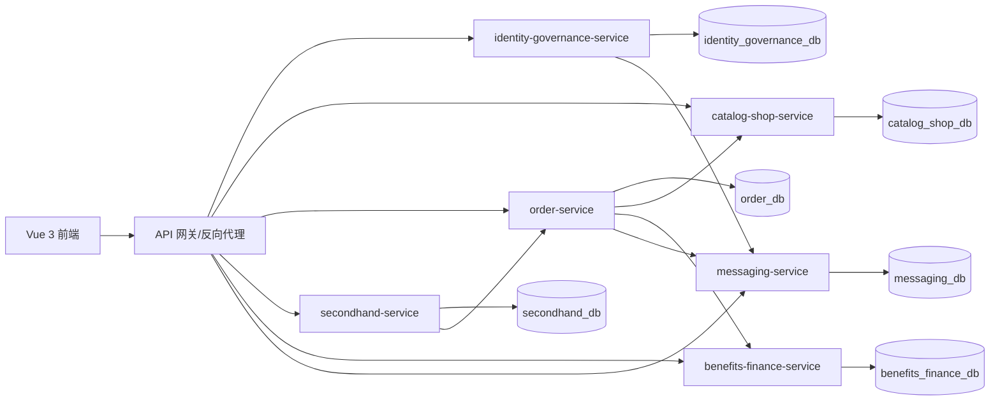

## 2 组件边界

| 组件 | 主要职责 | 核心数据 |
|---|---|---|
| `identity-governance-service` | UC01–UC05：身份、资料、商家申请、封禁、举报拉黑和信用治理 | 身份治理相关表 |
| `catalog-shop-service` | UC06–UC10：类目商品、店铺、风险审核和行为统计 | 目录、商品、店铺、风险与行为表 |
| `order-service` | UC11–UC15、UC20：新品订单、支付、物流、售后、评价和履约 | 订单、明细、售后、物流与评价表 |
| `secondhand-service` | UC16–UC19：二手发布、直购入口、议价与拍卖 | 二手商品、议价与拍卖表 |
| `benefits-finance-service` | UC21–UC23：优惠券、钱包和资金结算 | 券、余额与资金流水表 |
| `messaging-service` | UC24–UC25：会话、消息、通知与实时推送 | 会话、消息与通知表 |

服务只能写自己管理的表。跨服务读取使用 API，跨服务写操作使用 API 或事件；调用失败时由发起方回滚、重试或记录待补偿任务。详细边界、接口和表归属分别见 `../architecture/microservice-boundaries.md`、`../architecture/service-api-catalog.md` 和 `../architecture/database-ownership.md`。

## 3 分用例组件顺序模型

每个用例另有与本节顺序图配套的组件结构图，统一位于 `../UCxx/component.mmd`；顺序图的独立 Mermaid 源位于 `../UCxx/component-sequence.mmd`。结构图表达职责和依赖，顺序图表达一次场景交互。

## UC01 注册、登录和角色鉴权

### COMP-SEQ01

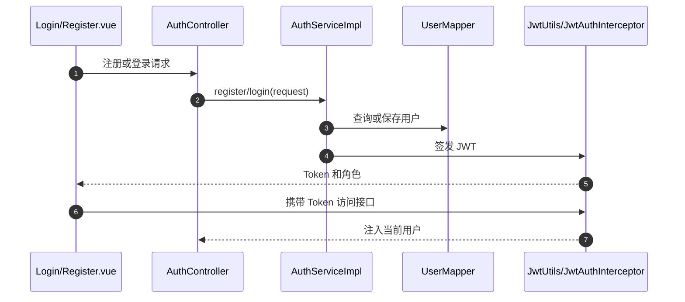

## UC02 用户资料和地址

### COMP-SEQ02

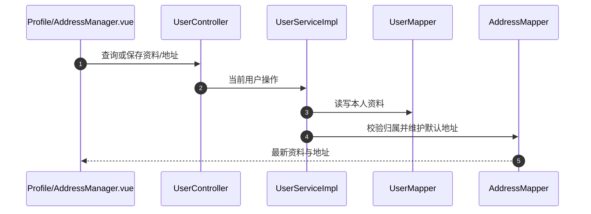

## UC03 商家申请、通过和拒绝

### COMP-SEQ03

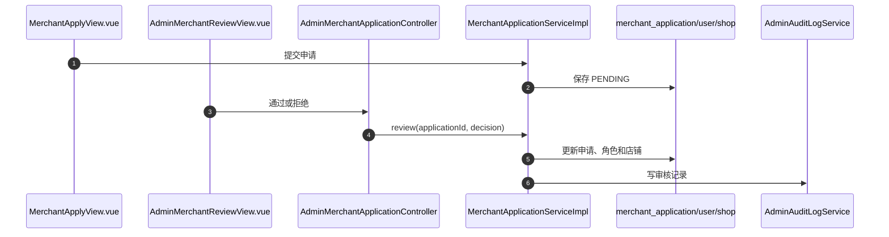

## UC04 用户封禁、解禁及审计

### COMP-SEQ04

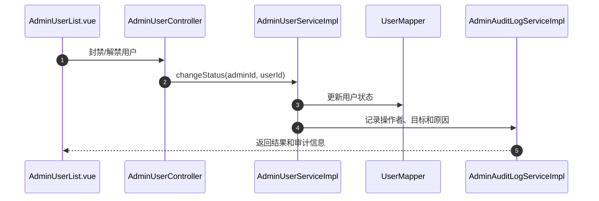

## UC05 举报、拉黑、信用分和审计

### COMP-SEQ05

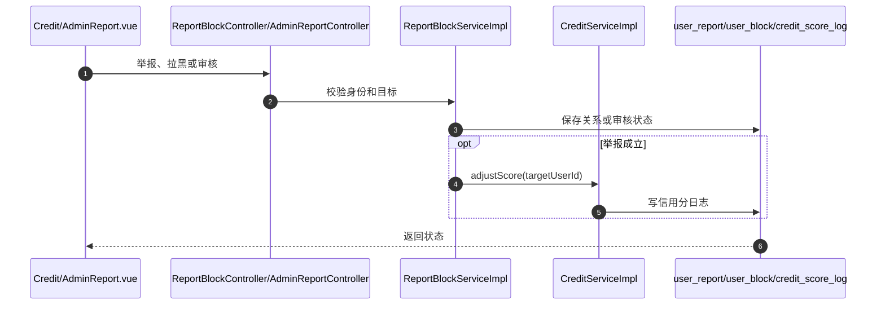

## UC06 商品列表、搜索筛选和详情

### COMP-SEQ06

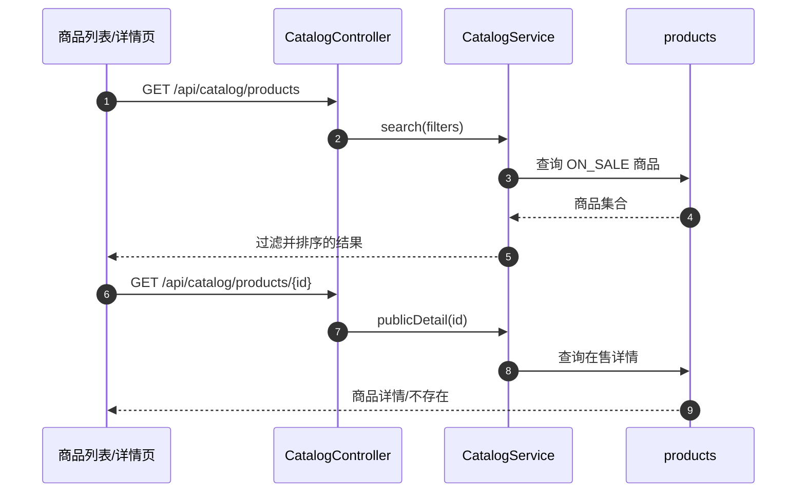

## UC07 卖家商品新增、编辑、上下架和库存调整

### COMP-SEQ07

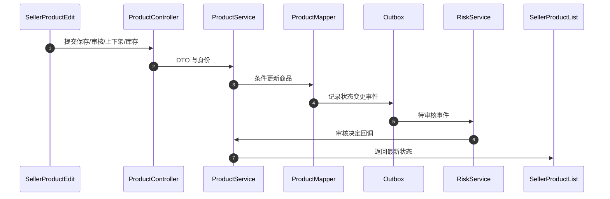

## UC08 店铺查看、设置和装修

### COMP-SEQ08

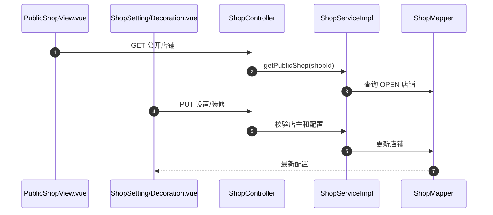

## UC09 商品风险审核

### COMP-SEQ09

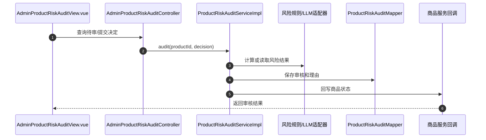

## UC10 浏览记录、搜索历史和热词

### COMP-SEQ10

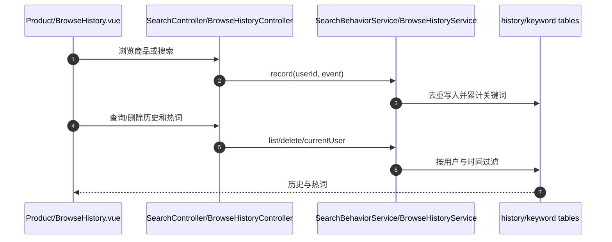

## UC11 购物车结算和订单拆分

### COMP-SEQ11

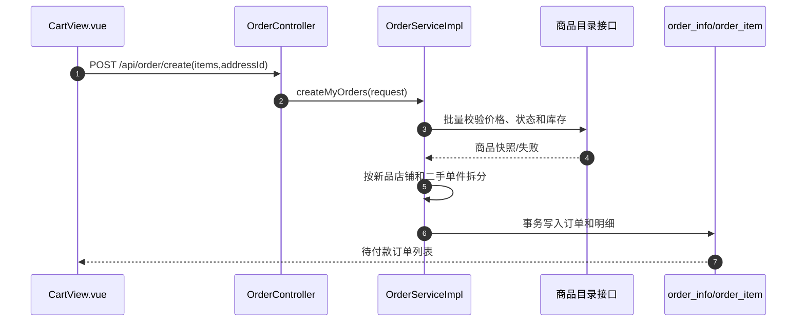

## UC12 支付和取消

### COMP-SEQ12

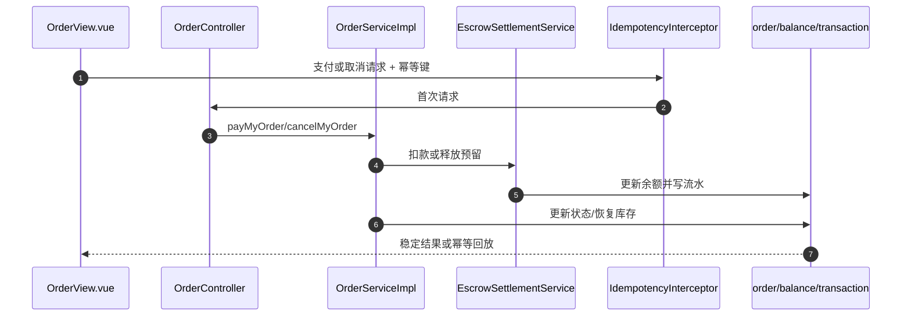

## UC13 发货、物流、收货和完成

### COMP-SEQ13

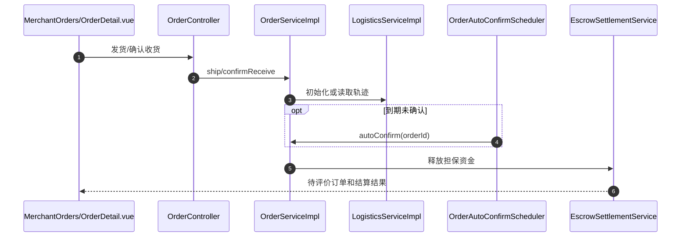

## UC14 退款、退货及仲裁

### COMP-SEQ14

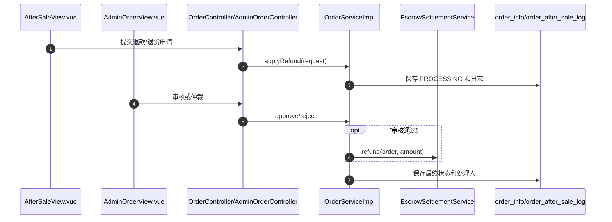

## UC15 评价、追评和卖家回复

### COMP-SEQ15

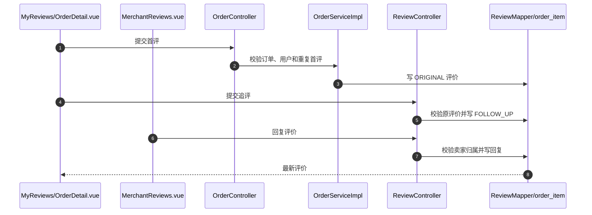

## UC16 二手商品发布和管理

### COMP-SEQ16

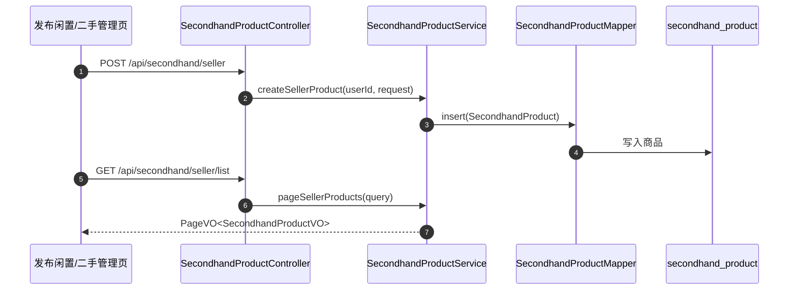

## UC17 二手直接购买及禁止自购

### COMP-SEQ17

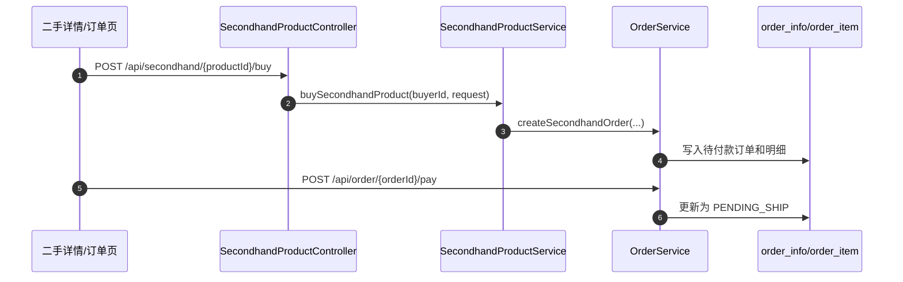

## UC18 议价申请、确认和拒绝

### COMP-SEQ18

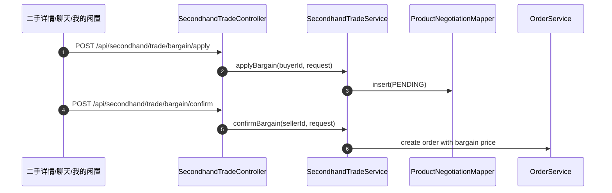

## UC19 拍卖、出价和结束

### COMP-SEQ19

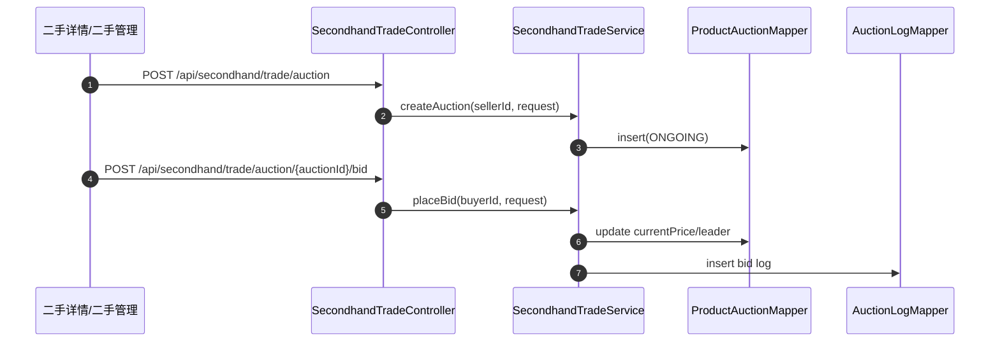

## UC20 二手成交后的订单履约

### COMP-SEQ20

```mermaid
sequenceDiagram
  autonumber
  participant UI as 二手卖出/订单页
  participant OrderAPI as OrderController
  participant OrderSvc as OrderService
  participant Logistics as LogisticsService
  participant DB as order_info/logistics_trace
  UI->>OrderAPI: GET /api/order/seller/list?productType=SECONDHAND
  OrderAPI->>OrderSvc: pageSellerOrders(query)
  UI->>OrderAPI: POST /api/order/{orderId}/ship
  OrderAPI->>OrderSvc: shipSellerOrder(orderId, request)
  OrderSvc->>Logistics: create first trace
  OrderSvc->>DB: orderStatus=SHIPPED
  UI->>OrderAPI: POST /api/order/{orderId}/confirm-receive
  OrderSvc->>DB: orderStatus=RECEIVED
```

## UC21 卖家/管理员优惠券生命周期

### COMP-SEQ21

```mermaid
sequenceDiagram
  autonumber
  participant UI as SellerVoucher/AdminVoucher.vue
  participant API as VoucherController
  participant Svc as VoucherService
  participant Shop as ShopMapper
  participant DB as VoucherMapper
  UI->>API: 创建/编辑/关闭/删除
  API->>Svc: 传入当前用户和请求
  Svc->>Shop: 解析卖家真实店铺
  Svc->>DB: 校验所有权并写入 voucher
  DB-->>UI: 最新优惠券状态
```

## UC22 领券及结算使用

### COMP-SEQ22

```mermaid
sequenceDiagram
  autonumber
  participant UI as CouponCenter/ProductDetail.vue
  participant API as VoucherController
  participant Voucher as VoucherService
  participant Order as OrderServiceImpl
  participant DB as voucher/user_voucher/order_info
  UI->>API: 领取优惠券
  API->>Voucher: claim(userId, voucherId)
  Voucher->>DB: 写 user_voucher
  UI->>Order: 提交订单(voucherId)
  Order->>Voucher: occupyForOrder(orderContext)
  Voucher->>DB: 校验并核销
  Order->>DB: 保存优惠金额和应付金额
```

## UC23 充值、个人钱包、商家账户和结算

### COMP-SEQ23

```mermaid
sequenceDiagram
  autonumber
  participant UI as Wallet/MerchantFinance.vue
  participant API as FinanceController
  participant Svc as EscrowSettlementService
  participant Balance as BalanceMapper
  participant Tx as TransactionRecordMapper
  participant Order as OrderServiceImpl
  UI->>API: 充值或查询账户
  API->>Svc: recharge/dashboard/records
  Svc->>Balance: 乐观锁更新个人余额
  Svc->>Tx: 写充值流水
  Order->>Svc: 订单完成后结算
  Svc->>Balance: 更新个人或经营余额
  Svc->>Tx: 写关联订单流水
```

## UC24 会话和消息

### COMP-SEQ24

```mermaid
sequenceDiagram
  autonumber
  participant UI as ChatView.vue
  participant API as ChatController
  participant Svc as ChatServiceImpl
  participant Conv as ChatConversationMapper
  participant Msg as ChatMessageMapper
  participant RT as RealtimePushService
  UI->>API: 创建/查询会话
  API->>Svc: 校验参与者和来源
  Svc->>Conv: 查询或插入会话
  UI->>API: 发送消息
  API->>Svc: sendMessage(currentUser, request)
  Svc->>Msg: 持久化消息
  Svc->>RT: 推送接收者
```

## UC25 通知、已读和实时推送

### COMP-SEQ25

```mermaid
sequenceDiagram
  autonumber
  participant Biz as 订单/议价/审核模块
  participant Svc as NotificationServiceImpl
  participant DB as NotificationMapper
  participant RT as RealtimePushService
  participant WS as RealtimeWebSocketHandler
  participant UI as NotificationView.vue
  Biz->>Svc: create(userId, event)
  Svc->>DB: INSERT notification
  Svc->>RT: pushToUser(userId)
  RT->>WS: 发送实时事件
  UI->>Svc: 查询/单条已读/全部已读
  Svc->>DB: 按当前用户更新
  DB-->>UI: 最新通知列表
```

## 4 跨组件失败处理

| 场景 | 处理方式 |
|---|---|
| 订单读取商品失败 | 终止下单并返回稳定错误码，不写订单 |
| 优惠券核销后订单保存失败 | 同一事务回滚；跨服务模式记录补偿任务并释放用户券 |
| 通知或 WebSocket 推送失败 | 核心业务继续提交，通知先落库并记录推送失败 |
| 风险审核回调商品服务失败 | 保留审核记录和回调状态，重试后按版本号更新商品 |
| 拍卖结算创建订单失败 | 保留待结算状态和冻结资金，定时任务按幂等键重试 |
| 服务超时或不可用 | 客户端收到明确的降级结果；调用方记录 TraceId 和依赖服务名 |


---

## 附录 C：软件详细设计说明书

<a id="appendix-software-detailed-design"></a>
# Kinda Goods 软件详细设计说明书

> 文档基线：2026-08-28
> 覆盖范围：`UC01`–`UC25`
> 编号规则：详细设计类图使用 `DESIGN-CLASSxx`，对象顺序图使用 `OBJ-SEQxx`。
> 维护说明：对象级模型按当前单体实现和已合入测试更新；目标微服务对象边界只在架构文档中描述。

## 1 分层与对象职责

- Controller 解析 HTTP 请求，读取当前用户并返回统一响应。
- Service/ServiceImpl 执行业务规则、权限判断和事务控制。
- Mapper 只访问所属业务表，不承载跨业务规则。
- DTO 承载输入，Entity 映射持久化数据，VO 承载对外结果。
- 定时任务处理自动确认、自动退款、拍卖结算和幂等记录清理。

## 2 核心类图

```mermaid
classDiagram
  class AuthController
  class AuthServiceImpl
  class UserController
  class UserServiceImpl
  class ProductController
  class ProductServiceImpl
  class OrderController
  class OrderServiceImpl
  class SecondhandProductController
  class SecondhandProductServiceImpl
  class SecondhandTradeController
  class SecondhandTradeServiceImpl
  class VoucherController
  class VoucherService
  class FinanceController
  class EscrowSettlementService
  class ChatController
  class ChatServiceImpl
  class NotificationController
  class NotificationServiceImpl
  AuthController --> AuthServiceImpl
  UserController --> UserServiceImpl
  ProductController --> ProductServiceImpl
  OrderController --> OrderServiceImpl
  SecondhandProductController --> SecondhandProductServiceImpl
  SecondhandTradeController --> SecondhandTradeServiceImpl
  SecondhandProductServiceImpl --> OrderServiceImpl
  SecondhandTradeServiceImpl --> OrderServiceImpl
  OrderServiceImpl --> VoucherService
  OrderServiceImpl --> EscrowSettlementService
  VoucherController --> VoucherService
  FinanceController --> EscrowSettlementService
  ChatController --> ChatServiceImpl
  NotificationController --> NotificationServiceImpl
  OrderServiceImpl --> NotificationServiceImpl
  SecondhandTradeServiceImpl --> NotificationServiceImpl
```

## 3 状态与事务约束

| 对象 | 主要状态/约束 |
|---|---|
| `OrderInfo` | `PENDING_PAY -> PENDING_SHIP -> SHIPPED -> RECEIVED -> COMPLETED`；取消和退款进入关闭分支；`version` 防并发覆盖 |
| `Product` | 草稿、待审核、在售、下架、驳回、归档；库存不得小于 0 |
| `SecondhandProduct` | 在售、下架、售出；条件更新避免重复购买 |
| `ProductNegotiation` | `APPLIED -> CONFIRMED/REJECTED -> USED`；确认价有有效期 |
| `ProductAuction` | `ONGOING -> ENDED/FLOW/CLOSED`；出价和结算按版本号及结算订单号幂等 |
| `UserVoucher` | 未使用、已占用/已使用、过期；订单失败需释放或回滚 |
| `Balance` | 个人余额与经营余额分列；更新与资金流水处于同一事务 |

## 4 分用例对象顺序模型

每个用例另有与本节顺序图配套的详细设计类图，统一位于 `../UCxx/object.mmd`；对象顺序图的独立 Mermaid 源位于 `../UCxx/object-sequence.mmd`。类图表达静态职责与依赖，顺序图表达对象协作。

## UC01 注册、登录和角色鉴权

### OBJ-SEQ01

```mermaid
sequenceDiagram
  autonumber
  participant C as AuthController
  participant S as AuthServiceImpl
  participant Req as RegisterRequest/LoginRequest
  participant U as User
  participant M as UserMapper
  participant P as PasswordUtils
  participant J as JwtUtils
  C->>S: register/login(Req)
  S->>M: selectByUsername
  S->>P: encode 或 matches
  alt 注册
    S->>U: 构造用户与默认角色
    S->>M: insert(U)
  else 登录
    S->>J: generateToken(userId, role)
  end
  S-->>C: UserVO/LoginVO
```

## UC02 用户资料和地址

### OBJ-SEQ02

```mermaid
sequenceDiagram
  autonumber
  participant C as UserController
  participant S as UserServiceImpl
  participant Req as UserProfileUpdateRequest/AddressSaveRequest
  participant U as User
  participant A as Address
  participant UM as UserMapper
  participant AM as AddressMapper
  C->>S: updateProfile/saveAddress(userId, Req)
  S->>UM: selectById(userId)
  S->>AM: 校验 address.userId
  opt 新默认地址
    S->>AM: clearDefaultByUserId(userId)
  end
  S->>AM: insertOrUpdate(A)
  S-->>C: UserVO/AddressVO
```

## UC03 商家申请、通过和拒绝

### OBJ-SEQ03

```mermaid
sequenceDiagram
  autonumber
  participant C as AdminMerchantApplicationController
  participant S as MerchantApplicationServiceImpl
  participant A as MerchantApplication
  participant U as User
  participant Shop as Shop
  participant N as NotificationService
  participant Audit as AdminAuditLogService
  C->>S: approve/reject(adminId, applicationId)
  S->>A: 检查 status=PENDING
  alt 通过
    S->>U: role=OFFICIAL_SELLER
    S->>Shop: createOrEnable
  else 拒绝
    S->>A: 保存 rejectReason
  end
  S->>N: 通知申请人
  S->>Audit: 记录审核动作
```

## UC04 用户封禁、解禁及审计

### OBJ-SEQ04

```mermaid
sequenceDiagram
  autonumber
  participant C as AdminUserController
  participant S as AdminUserServiceImpl
  participant U as User
  participant M as UserMapper
  participant A as AdminAuditLogServiceImpl
  C->>S: ban/unban(adminId, targetId, reason)
  S->>U: 校验目标存在且可管理
  S->>M: updateStatus(targetId, BANNED/ACTIVE)
  S->>A: record(adminId, targetId, action)
  S-->>C: UserVO
```

## UC05 举报、拉黑、信用分和审计

### OBJ-SEQ05

```mermaid
sequenceDiagram
  autonumber
  participant C as ReportBlockController/AdminReportController
  participant S as ReportBlockServiceImpl
  participant R as UserReport
  participant B as UserBlock
  participant Credit as CreditServiceImpl
  participant Log as CreditScoreLog
  C->>S: report/block/review(currentUser, request)
  S->>R: 新建或流转举报状态
  S->>B: insert/delete 拉黑关系
  opt 举报成立
    S->>Credit: adjustScore(targetId, delta)
    Credit->>Log: insert change record
  end
  S-->>C: 处理结果
```

## UC06 商品列表、搜索筛选和详情

### OBJ-SEQ06

```mermaid
sequenceDiagram
  autonumber
  participant C as CatalogController/ProductController
  participant S as CatalogService/ProductServiceImpl
  participant Q as ProductPageQueryRequest
  participant P as Product
  participant M as ProductMapper
  participant H as CatalogErrorHandler
  C->>S: search(Q)/publicDetail(id)
  S->>Q: 规范关键词、价格和排序
  S->>M: select ON_SALE products
  M-->>S: Product 集合或空
  alt 参数或详情无效
    S->>H: mapException(errorCode)
  else 有效
    S-->>C: PageVO<ProductVO>/ProductVO
  end
```

## UC07 卖家商品新增、编辑、上下架和库存调整

### OBJ-SEQ07

```mermaid
sequenceDiagram
  autonumber
  participant C as ProductController
  participant S as ProductServiceImpl
  participant Req as ProductSaveRequest/ProductStockAdjustRequest
  participant Shop as Shop
  participant P as Product
  participant M as ProductMapper
  C->>S: create/update/status/adjustStock(userId, Req)
  S->>Shop: 解析当前卖家店铺
  S->>Req: 校验分类、价格、库存和状态转换
  S->>P: 应用字段和版本号
  S->>M: insert/updateById/conditionalUpdate
  M-->>S: 受影响行数
  S-->>C: ProductVO
```

## UC08 店铺查看、设置和装修

### OBJ-SEQ08

```mermaid
sequenceDiagram
  autonumber
  participant C as ShopController
  participant S as ShopServiceImpl
  participant Req as ShopDecorationSaveRequest
  participant Shop as Shop
  participant M as ShopMapper
  C->>S: getPublic/updateSetting/saveDecoration
  S->>Shop: 校验 OPEN 或 ownerUserId
  S->>Req: 校验模板、组件和 JSON 大小
  S->>M: select/update Shop
  M-->>S: 持久化结果
  S-->>C: ShopPublicVO/ShopVO
```

## UC09 商品风险审核

### OBJ-SEQ09

```mermaid
sequenceDiagram
  autonumber
  participant C as AdminProductRiskAuditController
  participant S as ProductRiskAuditServiceImpl
  participant PB as ProductRiskAuditPromptBuilder
  participant R as ProductRiskAudit
  participant RM as ProductRiskAuditMapper
  participant PM as ProductMapper
  C->>S: audit(productId, decisionRequest)
  S->>PB: build(productContent)
  S->>R: 合并规则/LLM风险和管理员决定
  S->>RM: insert/update audit
  S->>PM: update product review status
  S-->>C: ProductRiskAuditVO
```

## UC10 浏览记录、搜索历史和热词

### OBJ-SEQ10

```mermaid
sequenceDiagram
  autonumber
  participant C as SearchController/BrowseHistoryController
  participant SS as SearchBehaviorServiceImpl
  participant BS as BrowseHistoryServiceImpl
  participant H as UserSearchHistory/SearchKeywordStat
  participant B as BrowseHistory
  participant HM as History/KeywordMapper
  C->>SS: recordSearch(userId, keyword)
  SS->>H: normalize/deduplicate/count
  SS->>HM: deleteOldAndInsert/latestStats
  C->>BS: record/list/delete(userId, product)
  BS->>B: 构造唯一浏览键
  BS->>HM: upsert/queryByUser
  HM-->>C: 历史与热词结果
```

## UC11 购物车结算和订单拆分

### OBJ-SEQ11

```mermaid
sequenceDiagram
  autonumber
  participant C as OrderController
  participant S as OrderServiceImpl
  participant Req as CreateOrderRequest
  participant P as Product/SecondhandProduct
  participant O as OrderInfo
  participant I as OrderItem
  participant OM as OrderInfoMapper/OrderItemMapper
  C->>S: createMyOrders(userId, Req)
  S->>Req: 合并商品项并校验地址
  S->>P: 读取价格、状态、库存和卖家
  S->>S: 按商品类型和店铺拆分
  loop 每个子订单
    S->>O: 构造 PENDING_PAY
    S->>I: 构造订单项快照
    S->>OM: insert order and items
  end
  S-->>C: List<OrderVO>
```

## UC12 支付和取消

### OBJ-SEQ12

```mermaid
sequenceDiagram
  autonumber
  participant Idem as IdempotencyInterceptor
  participant C as OrderController
  participant S as OrderServiceImpl
  participant O as OrderInfo
  participant F as EscrowSettlementService
  participant B as Balance
  participant T as TransactionRecord
  Idem->>C: pay/cancel + X-Idempotency-Key
  C->>S: payMyOrder/cancelMyOrder
  S->>O: 校验 owner/status/version
  alt 支付
    S->>F: debitBuyer(orderAmount)
    F->>B: optimistic update
    F->>T: insert payment record
    S->>O: update PENDING_SHIP
  else 取消
    S->>O: update CLOSED 并恢复库存
  end
  S-->>Idem: 保存并返回可回放结果
```

## UC13 发货、物流、收货和完成

### OBJ-SEQ13

```mermaid
sequenceDiagram
  autonumber
  participant C as OrderController
  participant S as OrderServiceImpl
  participant O as OrderInfo
  participant L as LogisticsServiceImpl
  participant T as LogisticsTrace
  participant F as EscrowSettlementService
  C->>S: shipSellerOrder/confirmReceive
  S->>O: 校验卖家/买家和状态版本
  S->>L: initializeOrAdvance(order)
  L->>T: insert trace nodes
  S->>O: update SHIPPED/RECEIVED
  opt 确认收货
    S->>F: settle(orderItems)
  end
  S-->>C: OrderVO
```

## UC14 退款、退货及仲裁

### OBJ-SEQ14

```mermaid
sequenceDiagram
  autonumber
  participant C as OrderController/AdminOrderController
  participant S as OrderServiceImpl
  participant Req as OrderRefundApplyRequest/AdminRefundDecisionRequest
  participant O as OrderInfo
  participant L as OrderAfterSaleLog
  participant F as EscrowSettlementService
  C->>S: apply/approve/reject(orderId, Req)
  S->>O: 校验售后期、状态、归属和 version
  S->>L: append action log
  alt 审核通过
    S->>F: refundBuyerAndRecoverSeller(order)
    S->>O: update REFUNDED/CLOSED
  else 驳回
    S->>O: update REJECTED and reason
  end
  S-->>C: OrderVO
```

## UC15 评价、追评和卖家回复

### OBJ-SEQ15

```mermaid
sequenceDiagram
  autonumber
  participant OC as OrderController
  participant OS as OrderServiceImpl
  participant RC as ReviewController
  participant Req as OrderReviewSubmitRequest/ReviewReplyRequest
  participant O as OrderInfo
  participant I as OrderItem
  participant R as Review
  participant M as ReviewMapper
  OC->>OS: submitMyOrderReview(orderId, Req)
  OS->>O: 校验订单完成和买家归属
  OS->>I: 定位订单项
  OS->>R: 构造 ORIGINAL 评价
  OS->>M: insert Review
  RC->>M: 校验原评价并写 FOLLOW_UP
  RC->>M: 校验卖家归属并写回复
  M-->>RC: 成功结果
```

## UC16 二手商品发布和管理

### OBJ-SEQ16

```mermaid
sequenceDiagram
  autonumber
  participant C as SecondhandProductController
  participant S as SecondhandProductServiceImpl
  participant Req as SecondhandProductSaveRequest
  participant P as SecondhandProduct
  participant M as SecondhandProductMapper
  C->>S: createSellerProduct(userId, Req)
  S->>Req: 校验名称、价格、成色、分类
  S->>P: 构造 sellerUserId/status/isNegotiable
  S->>M: insert(P)
  M-->>S: id
  S-->>C: SecondhandProductVO
```

## UC17 二手直接购买及禁止自购

### OBJ-SEQ17

```mermaid
sequenceDiagram
  autonumber
  participant C as SecondhandProductController
  participant S as SecondhandProductServiceImpl
  participant P as SecondhandProduct
  participant O as OrderInfo
  participant I as OrderItem
  C->>S: buySecondhandProduct(productId, request)
  S->>P: 检查 status=ON_SALE 且 buyer != seller
  S->>O: create PENDING_PAY
  S->>I: create productType=SECONDHAND
  S-->>C: OrderVO
```

## UC18 议价申请、确认和拒绝

### OBJ-SEQ18

```mermaid
sequenceDiagram
  autonumber
  participant C as SecondhandTradeController
  participant S as SecondhandTradeServiceImpl
  participant N as ProductNegotiation
  participant P as SecondhandProduct
  participant O as OrderInfo
  C->>S: confirmBargain(sellerId, request)
  S->>N: 检查 PENDING
  S->>P: 检查 sellerUserId 和在售状态
  S->>O: create PENDING_PAY with negotiatedPrice
  S->>N: update ACCEPTED/orderId
  S-->>C: OrderVO 或 ProductNegotiationVO
```

## UC19 拍卖、出价和结束

### OBJ-SEQ19

```mermaid
sequenceDiagram
  autonumber
  participant C as SecondhandTradeController
  participant S as SecondhandTradeServiceImpl
  participant P as SecondhandProduct
  participant A as ProductAuction
  participant L as AuctionLog
  C->>S: placeBid(auctionId, bidRequest)
  S->>A: 检查 ONGOING 和最低出价
  S->>P: 检查 bidder != seller
  S->>A: 更新 currentPrice/currentBuyerId/bidCount
  S->>L: 写出价记录
  S-->>C: ProductAuctionVO
```

## UC20 二手成交后的订单履约

### OBJ-SEQ20

```mermaid
sequenceDiagram
  autonumber
  participant C as OrderController
  participant S as OrderServiceImpl
  participant O as OrderInfo
  participant I as OrderItem
  participant L as LogisticsTrace
  C->>S: shipSellerOrder(orderId, request)
  S->>O: 检查 PENDING_SHIP
  S->>I: 检查 seller owns SECONDHAND item
  S->>L: insert first trace
  S->>O: update SHIPPED
  C->>S: confirmReceive(orderId)
  S->>O: update RECEIVED
```

## UC21 卖家/管理员优惠券生命周期

### OBJ-SEQ21

```mermaid
sequenceDiagram
  autonumber
  participant C as VoucherController
  participant S as VoucherService
  participant Req as VoucherSaveRequest
  participant Shop as Shop
  participant V as Voucher
  participant M as VoucherMapper
  C->>S: create/update/close/delete(userId, role, Req)
  S->>Shop: 解析 sellerUserId 对应 shopId
  S->>Req: 校验面额、门槛、数量和时间
  S->>V: 校验 issuer/scope/owner/status
  S->>M: insert/update/deleteById
  S-->>C: VoucherVO
```

## UC22 领券及结算使用

### OBJ-SEQ22

```mermaid
sequenceDiagram
  autonumber
  participant C as VoucherController
  participant VS as VoucherService
  participant V as Voucher
  participant UV as UserVoucher
  participant OS as OrderServiceImpl
  participant O as OrderInfo
  C->>VS: claim(userId, voucherId)
  VS->>V: 校验状态、时间、库存和范围
  VS->>UV: insert unique user-voucher
  OS->>VS: occupyForOrder(userId, voucherId, items)
  VS->>UV: 条件更新为已使用/占用
  VS-->>OS: discountAmount
  OS->>O: 保存优惠额和应付额
```

## UC23 充值、个人钱包、商家账户和结算

### OBJ-SEQ23

```mermaid
sequenceDiagram
  autonumber
  participant C as FinanceController
  participant S as EscrowSettlementService
  participant Req as FinanceRechargeRequest
  participant B as Balance
  participant BM as BalanceMapper
  participant T as TransactionRecord
  participant TM as TransactionRecordMapper
  C->>S: recharge/dashboard/settle(userId, Req/order)
  S->>Req: 校验金额精度和范围
  S->>B: 选择 personal 或 business 字段
  S->>BM: optimisticUpdate(balance, version)
  S->>T: 构造 tradeType/relatedOrderId
  S->>TM: insert(T)
  S-->>C: FinanceDashboardVO/FinanceRecordVO
```

## UC24 会话和消息

### OBJ-SEQ24

```mermaid
sequenceDiagram
  autonumber
  participant C as ChatController
  participant S as ChatServiceImpl
  participant Req as ChatConversationCreateRequest/ChatMessageSendRequest
  participant Conv as ChatConversation
  participant Msg as ChatMessage
  participant CM as ChatConversationMapper
  participant MM as ChatMessageMapper
  C->>S: createConversation/sendMessage(userId, Req)
  S->>Conv: 校验 user1/user2/source 和参与关系
  S->>CM: selectUnique 或 insert
  S->>Msg: 校验非空内容和接收者
  S->>MM: insert(Msg)
  S->>CM: update lastMessage/time
  S-->>C: ChatConversationVO/ChatMessageVO
```

## UC25 通知、已读和实时推送

### OBJ-SEQ25

```mermaid
sequenceDiagram
  autonumber
  participant C as NotificationController
  participant S as NotificationServiceImpl
  participant N as Notification
  participant M as NotificationMapper
  participant P as RealtimePushService
  participant W as RealtimeWebSocketHandler
  C->>S: list/read/readAll(currentUser)
  S->>M: query/update by userId
  S->>N: 创建业务通知并先持久化
  S->>P: pushToUser(userId, event)
  P->>W: sendMessage(sessionSet)
  alt 推送失败
    P-->>S: 记录失败，不回滚 N
  end
  S-->>C: NotificationVO/成功结果
```

## 5 异常、幂等与日志

| 机制 | 设计 |
|---|---|
| 统一异常 | `GlobalExceptionHandler` 把业务异常、参数错误、资源不存在和数据冲突转换为 `{code,message,data}` |
| 身份上下文 | `JwtAuthInterceptor` 解析 JWT，`UserContext` 保存当前请求用户；Service 继续校验资源归属 |
| 幂等 | `IdempotencyInterceptor` 使用用户、方法、路径和 `X-Idempotency-Key` 识别重复写请求；成功响应可回放 |
| 并发 | 订单、余额和拍卖使用版本号或条件更新；受影响行数为 0 时返回并发冲突 |
| TraceId | `TraceIdInterceptor` 接收或生成 `X-Trace-Id`，响应头和日志保持一致 |
| 日志脱敏 | 日志记录业务编号、错误码和 TraceId，不记录密码、JWT、密钥或聊天正文 |

## 6 定时任务

| 任务 | 扫描条件 | 幂等措施 |
|---|---|---|
| 自动确认收货 | 物流已到达且 `auto_confirm_deadline <= now` | 条件更新订单状态和版本号 |
| 售后超时处理 | 退款处理中且超过规则期限 | 检查退款状态后写一次售后日志 |
| 拍卖结算 | `ONGOING` 且 `end_time <= now` | 检查 `settled_order_id`，订单号和版本号防重复 |
| 幂等记录清理 | 幂等记录已过期 | 按过期时间批量删除 |


---

## 附录 D：需求追溯矩阵

<a id="appendix-requirements-traceability"></a>
# Kinda Goods 需求追溯矩阵

> 基线日期：2026-08-29
> 范围：`REQ01`–`REQ25` / `UC01`–`UC25`
> 说明：测试编号只登记仓库中可以定位到实际文件和方法的入口；`MVC` 是 Controller 的 MockMvc/API 契约测试，不等同于纯 Unit；`INT` 是 Spring Boot HTTP/数据库集成测试；`E2E` 是 Compose + MySQL + Playwright 真浏览器测试。

## 1 对应关系

```mermaid
flowchart LR
  REQ[REQxx 需求] --> UC[UCxx 用例]
  UC --> SYS[SYS-BEHxx 系统行为]
  UC --> CONCEPT[CONCEPT-CLASSxx 概念类图]
  UC --> COMP[COMP-STRUCT/SEQxx 组件模型]
  UC --> DESIGN[DESIGN-CLASSxx 详细类图]
  UC --> OBJ[OBJ-SEQxx 对象顺序]
  OBJ --> CODE[页面/Controller/Service/Mapper]
  CODE --> UNIT[UNIT-TCxx 单元测试]
  CODE --> MVC[MVC-TCxx API契约测试]
  CODE --> INT[INT-TCxx 集成/API测试]
  CODE --> E2E[E2E-TCxx 业务链路测试]
  UNIT --> RESULT[结果与原始证据]
  MVC --> RESULT
  INT --> RESULT
  E2E --> RESULT
```

## 2 全量追溯表

表中“测试明细”按 `编号：实际文件#方法；验证内容` 编写，因此可以从编号直接定位到源码，而不是只停留在“对应某个测试类”。

| 需求 / 用例 | 六类图模型 | 主要代码模块 | 测试明细（编号、入口、验证内容） | 结果 / 证据 |
|---|---|---|---|---|
| REQ01 / UC01 注册、登录和鉴权 | SYS-BEH01 / CONCEPT-CLASS01 / COMP-STRUCT01 / COMP-SEQ01 / DESIGN-CLASS01 / OBJ-SEQ01 | `LoginView.vue`、`Register.vue`；`AuthController`、`AuthServiceImpl`、`JwtAuthInterceptor` | `UNIT-TC01-001`：`backend/src/test/java/com/segroup8/platform/service/impl/AuthServiceImplTest.java#register_shouldEncodePasswordAndInsertUser`、`#login_shouldUpgradeLegacyPasswordAndReturnToken`、`#login_shouldThrowWhenPasswordInvalid`、`#register_shouldRejectDuplicateUsername`、`#login_shouldRejectBannedUser`；BCrypt、JWT、错误密码、重复用户名和封禁规则。<br>`MVC-TC01-001`：`backend/src/test/java/com/segroup8/platform/controller/AuthControllerWebMvcTest.java#register_shouldReturnUnifiedSuccess`、`#register_shouldRejectInvalidBody`、`#login_shouldReturnTokenAndRole`、`#login_shouldRejectInvalidBody`；响应和参数契约。<br>`INT-TC01-001`：`backend/src/test/java/com/segroup8/platform/integration/IdentityUc01IntegrationTest.java#registerLoginRoleBoundaryAndBanMustShareOnePersistedChain`、`#duplicateInvalidAndWrongPasswordRequestsMustNotCreateDirtyUsers`；注册、登录、越权、封禁/解禁和无脏数据。<br>`E2E-TC01-001`：`frontend/e2e/domain-a/uc01-auth.spec.ts#register, login, role boundary, ban and refresh persistence`。 | `LOCAL_E2E_PASS`；`../../04_tests/UC01/evidence/result-summary.json`、`../../04_tests/UC01/evidence/playwright-results.json`。共享 JWT 平台测试不重复计入 UC01。 |
| REQ02 / UC02 资料和地址 | SYS-BEH02 / CONCEPT-CLASS02 / COMP-STRUCT02 / COMP-SEQ02 / DESIGN-CLASS02 / OBJ-SEQ02 | `Profile.vue`、`AddressManager.vue`；`UserController`、`UserServiceImpl`、`AddressMapper` | `UNIT-TC02-001`：`backend/src/test/java/com/segroup8/platform/service/impl/UserServiceImplTest.java#getCurrentUserProfile_shouldMapUserInfo`、`#createAddress_whenDefault_shouldClearPreviousDefault`、`#deleteAddress_shouldThrowWhenAddressNotOwned`；资料映射、默认地址唯一性和所有权。<br>`MVC-TC02-001`：`backend/src/test/java/com/segroup8/platform/controller/UserControllerWebMvcTest.java#profile_shouldReturnCurrentUser`、`#me_shouldReturnCurrentUser`、`#updateProfile_shouldReturnSuccess`、`#createAddress_shouldReturnSuccess`、`#createAddress_shouldRejectInvalidPhone`、`#listAddresses_shouldReturnOnlyServiceResult`、`#deleteAddress_shouldReturnSuccess`、`#updateAddress_shouldReturnSuccess`；API 契约。<br>`INT-TC02-001`：`backend/src/test/java/com/segroup8/platform/integration/ProfileAddressUc02IntegrationTest.java#profileAndAddressCrudMustPersistAndKeepOneDefaultPerUser`、`#addressOwnershipMustPreventCrossUserUpdateAndDelete`；真实 CRUD、默认值和越权。<br>`E2E-TC02-001`：`frontend/e2e/domain-a/uc02-profile-address.spec.ts#updates profile, maintains one default address and isolates ownership`。 | `LOCAL_E2E_PASS`；`../../04_tests/UC02/evidence/result-summary.json`、`../../04_tests/UC02/evidence/playwright-results.json`。 |
| REQ03 / UC03 商家申请 | SYS-BEH03 / CONCEPT-CLASS03 / COMP-STRUCT03 / COMP-SEQ03 / DESIGN-CLASS03 / OBJ-SEQ03 | `MerchantApplyView.vue`、`AdminMerchantReviewView.vue`；`MerchantApplicationController`、`MerchantApplicationServiceImpl` | `UNIT-TC03-001`：`backend/src/test/java/com/segroup8/platform/service/impl/MerchantApplicationServiceImplTest.java#approve_shouldUpgradeRoleAndInsertNotification`、`#submit_shouldRejectDuplicatePendingApplication`、`#reject_shouldPersistReasonAndNotifyApplicant`；升级、重复申请、驳回和通知。<br>`MVC-TC03-001`：`backend/src/test/java/com/segroup8/platform/controller/MerchantApplicationControllerWebMvcTest.java#submit_shouldReturnSuccess`、`#getMyApplication_shouldReturnRecord`、`#page_shouldReturnAdminApplicationQueue`、`#reject_shouldRequireReason`、`#reject_shouldReturnSuccessAndRecordAudit`、`#approve_shouldReturnSuccessAndRecordAudit`。<br>`INT-TC03-001`：`backend/src/test/java/com/segroup8/platform/integration/MerchantApplicationUc03IntegrationTest.java#submitApproveUpgradeShopNotificationAndAuditMustBeConsistent`；申请、审核、角色/店铺、通知和审计一致。<br>`INT-TC03-002`：`backend/src/test/java/com/segroup8/platform/integration/MerchantApplicationNotificationFailureIntegrationTest.java#notificationStorageFailureMustNotRollbackApprovalCoreState`；通知失败不回滚审核核心状态。<br>`E2E-TC03-001`：`frontend/e2e/domain-a/uc03-merchant-application.spec.ts#submit, review, role/shop upgrade and rejection persistence`。 | `LOCAL_E2E_PASS`；`../../04_tests/UC03/evidence/result-summary.json`、`../../04_tests/UC03/evidence/playwright-results.json`。 |
| REQ04 / UC04 封禁解禁审计 | SYS-BEH04 / CONCEPT-CLASS04 / COMP-STRUCT04 / COMP-SEQ04 / DESIGN-CLASS04 / OBJ-SEQ04 | `AdminUserList.vue`；`AdminUserController`、`AdminUserServiceImpl`、`AdminAuditLogServiceImpl` | `UNIT-TC04-001`：`backend/src/test/java/com/segroup8/platform/service/impl/AdminUserServiceImplTest.java#banUser_shouldUpdateStatusToBanned`、`#banUser_shouldThrowWhenCurrentUserNotAdmin`、`#unbanUser_shouldRestoreNormalStatus`、`#banUser_shouldRejectSelfBan`；状态和权限边界。<br>`UNIT-TC04-002`：`backend/src/test/java/com/segroup8/platform/service/impl/AdminAuditLogServiceImplTest.java#record_shouldInsertAuditLog`。<br>`MVC-TC04-001`：`backend/src/test/java/com/segroup8/platform/controller/AdminUserControllerWebMvcTest.java#pageUsers_shouldReturnAdminUserPage`、`#pageAuditLogs_shouldReturnAdminAuditPage`、`#ban_shouldReturnSuccessAndRecordAudit`、`#unban_shouldReturnSuccessAndRecordAudit`。<br>`INT-TC04-001`：`backend/src/test/java/com/segroup8/platform/integration/UserGovernanceUc04IntegrationTest.java#banLoginFailureUnbanRecoveryPermissionAndAuditMustBeConsistent`；登录阻断/恢复和审计。<br>`E2E-TC04-001`：`frontend/e2e/domain-a/uc04-ban-unban.spec.ts#ban blocks login, unban restores login and audit is queryable`。 | `LOCAL_E2E_PASS`；`../../04_tests/UC04/evidence/result-summary.json`、`../../04_tests/UC04/evidence/playwright-results.json`。 |
| REQ05 / UC05 举报拉黑信用 | SYS-BEH05 / CONCEPT-CLASS05 / COMP-STRUCT05 / COMP-SEQ05 / DESIGN-CLASS05 / OBJ-SEQ05 | `CreditView.vue`、`AdminReportView.vue`；`ReportBlockController`、`ReportBlockServiceImpl`、`CreditServiceImpl` | `UNIT-TC05-001`：`backend/src/test/java/com/segroup8/platform/service/impl/ReportBlockServiceImplTest.java#submitReport_shouldRejectSelfReport`、`#submitReport_shouldInsertPendingReport`、`#submitReport_shouldRejectDuplicateActiveReport`、`#blockUser_shouldRejectSelfBlock`、`#blockUser_shouldRejectDuplicateBlock`、`#adminAuditReport_shouldRejectDuplicateReview`；举报/拉黑资格、重复和审核幂等。<br>`UNIT-TC05-002`：`backend/src/test/java/com/segroup8/platform/service/impl/CreditServiceImplTest.java#adminAdjust_shouldRejectUnsupportedRole`、`#adminAdjust_shouldWriteScoreLog`；信用角色和流水。<br>`MVC-TC05-001`：`backend/src/test/java/com/segroup8/platform/controller/ReportBlockControllerWebMvcTest.java#submitReport_shouldReturnSuccess`、`#block_shouldRejectMissingTarget`、`#block_shouldReturnSuccess`、`#reportAndBlockQueries_shouldReturnSuccess`、`#unblock_shouldReturnSuccess`、`#myCredit_shouldReturnSuccess`、`#userCredit_shouldReturnSuccess`、`#adminListReports_shouldReturnSuccess`、`#creditAdjust_shouldReturnSuccessAndDelegate`、`#auditReport_shouldRequireAdmin`、`#adminEndpoint_shouldRejectNonAdmin`。<br>`INT-TC05-001`：`backend/src/test/java/com/segroup8/platform/integration/ReportBlockCreditUc05IntegrationTest.java#reportBlockCredit_shouldPersistOwnershipAuditAndIdempotency`。<br>`E2E-TC05-001`：`frontend/e2e/domain-a/uc05-governance.spec.ts#report, bilateral block state, credit audit and refresh persistence`。 | `LOCAL_E2E_PASS`；`../../04_tests/UC05/evidence/result-summary.json`、`../../04_tests/UC05/evidence/playwright-results.json`。 |
| REQ06 / UC06 搜索筛选详情 | SYS-BEH06 / CONCEPT-CLASS06 / COMP-STRUCT06 / COMP-SEQ06 / DESIGN-CLASS06 / OBJ-SEQ06 | `ProductListView.vue`、`ProductDetailView.vue`；`microservices/catalog-service/CatalogController`、`CatalogService` | `INT-TC06-001`：`microservices/catalog-service/src/test/java/com/segroup8/catalog/CatalogApiIntegrationTest.java#combinedSearchAndPublicDetailUseTheDatabase`、`#filtersSortsEmptyAndExceptionPaths`；搜索、详情、过滤、空结果和异常分页。<br>`E2E-TC06-001`：`frontend/e2e/domain-b/uc06-catalog.spec.ts#searches, filters, opens matching detail and confirms persisted API fields`、`#shows a real empty result and rejects invalid pagination at the API boundary`。 | `CI_E2E_PASS / LOCAL_ARTIFACT_MISSING`；服务/API 原始结果已归档，CI 全量 E2E job 通过 |
| REQ07 / UC07 卖家商品生命周期 | SYS-BEH07 / CONCEPT-CLASS07 / COMP-STRUCT07 / COMP-SEQ07 / DESIGN-CLASS07 / OBJ-SEQ07 | `SellerProductList.vue`、`SellerProductEdit.vue`；`ProductController`、`ProductServiceImpl`、商品 Mapper | `UNIT-TC07-001`：`backend/src/test/java/com/segroup8/platform/service/impl/ProductServiceImplTest.java#createSellerProduct_shouldPersistWithCurrentSellerShopId`、`#adjustSellerProductStock_shouldThrowWhenResultNegative`、`#pageSellerProducts_shouldUseCurrentSellerShopIdAndReturnPageVO`；卖家归属、库存边界和工作台隔离。该类当前未声明 `UC07` tag，按方法语义登记为共享回归。<br>`E2E-TC07-001`：`frontend/e2e/domain-b/uc07-product-lifecycle.spec.ts#creates, edits, shelves, adjusts stock and deletes a product with persistence checks`; `#denies the buyer access to the seller workbench`；创建、编辑、库存、上下架、删除和买家越权。 | `CI_E2E_PASS / LOCAL_ARTIFACT_MISSING`；服务/API 结果已归档，CI 全量 E2E job 通过。 |
| REQ08 / UC08 店铺设置装修 | SYS-BEH08 / CONCEPT-CLASS08 / COMP-STRUCT08 / COMP-SEQ08 / DESIGN-CLASS08 / OBJ-SEQ08 | `PublicShopView.vue`、`SellerShopSetting.vue`、`SellerShopDecoration.vue`；`ShopController`、`ShopServiceImpl` | `INT-TC08-001`：`microservices/shop-service/src/test/java/com/segroup8/shop/ShopApiIntegrationTest.java#viewSettingsAndDecorationUseTheDatabase`、`#decorationRuleRejectsUnknownTemplate`、`#closedShopAndUnknownSellerAreRejected`、`#malformedAndOversizedDecorationAreRejected`；查看、装修、店铺状态、卖家归属和输入边界。<br>`E2E-TC08-001`：`frontend/e2e/domain-b/uc08-shop.spec.ts#publishes decoration, reloads it and confirms the persisted JSON`; `#keeps shop maintenance inaccessible to a different role`。 | `CI_E2E_PASS / LOCAL_ARTIFACT_MISSING`；Shop API 原始结果已归档，CI 全量 E2E job 通过。 |
| REQ09 / UC09 商品风险审核 | SYS-BEH09 / CONCEPT-CLASS09 / COMP-STRUCT09 / COMP-SEQ09 / DESIGN-CLASS09 / OBJ-SEQ09 | `AdminProductRiskAuditView.vue`；`ProductRiskAuditController`、`ProductRiskAuditServiceImpl`、outbox | `INT-TC09-001`：`microservices/risk-service/src/test/java/com/segroup8/risk/RiskApiIntegrationTest.java#submitReviewAndRejectUseTheDatabase`、`#forbiddenWordRuleIsDeterministicWithoutLlm`、`#approvalCreatesPendingOutboxDelivery`、`#rejectReasonAndSingleDecisionAreEnforced`；审核、敏感词、outbox、理由和单次决策。<br>`E2E-TC09-001`：`frontend/e2e/domain-b/uc09-risk-audit.spec.ts#lists and rejects a deterministic high-risk product, then persists the decision`; `#rejects a forged ordinary-user administrator request`。 | `CI_E2E_PASS / LOCAL_ARTIFACT_MISSING`；Risk API 原始结果已归档，CI 全量 E2E job 通过。 |
| REQ10 / UC10 浏览搜索热词 | SYS-BEH10 / CONCEPT-CLASS10 / COMP-STRUCT10 / COMP-SEQ10 / DESIGN-CLASS10 / OBJ-SEQ10 | `BrowseHistoryView.vue`；`SearchBehaviorServiceImpl`、`BrowseHistoryServiceImpl`、行为 API | `INT-TC10-001`：`microservices/behavior-service/src/test/java/com/segroup8/behavior/BehaviorApiIntegrationTest.java#browseSearchHotAndDeleteUseTheDatabase`、`#keywordRuleNormalizesAndRejectsBlank`、`#browseHistoryDeduplicatesAndOrdersNewestFirst`、`#historyDeletionIsUserScoped`、`#hotKeywordsAreRankedLimitedAndValidated`；浏览/搜索记录、规范化、去重排序、用户隔离和热词。<br>`E2E-TC10-001`：`frontend/e2e/domain-b/uc10-behavior.spec.ts#records browsing and search, views history/hot words, deletes history and persists the deletion`; `#isolates another user's history and requires authentication`。 | `CI_E2E_PASS / LOCAL_ARTIFACT_MISSING`；Behavior API 原始结果已归档，CI 全量 E2E job 通过。 |
| REQ11 / UC11 购物车结算拆单 | SYS-BEH11 / CONCEPT-CLASS11 / COMP-STRUCT11 / COMP-SEQ11 / DESIGN-CLASS11 / OBJ-SEQ11 | `CartView.vue`；`OrderController`、`OrderServiceImpl`、库存/优惠券 Mapper | `UNIT-TC11-001`：`backend/src/test/java/com/segroup8/platform/service/impl/OrderServiceImplTest.java#payMyOrder_shouldSplitCartItemsIntoIndependentPaidOrders`；共享 Domain-C 回归，按方法语义覆盖支付拆单。<br>`INT-TC11-001`：`backend/src/test/java/com/segroup8/platform/integration/OrderCreateUc11IntegrationTest.java#createsOrderFromServerPrice_mergesItems_andPersistsResponseConsistently`；服务端计价、重复项合并。<br>`INT-TC11-002`：`#rejectsInvalidProductAddressSelfPurchaseAndBlockRelationships_withoutSideEffects`；商品/地址/自购/拉黑边界。<br>`INT-TC11-003`：`#rejectsInvalidRequestParameters_beforeWritingBusinessData`；DTO 参数。<br>`INT-TC11-004`：`#appliesEligibleVoucher_andKeepsOrderInventoryAndVoucherConsistent`；合法店铺券。<br>`INT-TC11-005`：`#rejectsUnclaimedThresholdAndShopMismatchVouchers_andRollsBackEverything`；无资格券回滚。<br>`INT-TC11-006`：`#laterItemPersistenceFailure_rollsBackOrderInventoryAndOccupiedVoucher`；事务回滚。<br>`INT-TC11-007`：`#duplicateIdempotencyKey_replaysResponseAndCreatesOnlyOneOrder`；幂等回放。<br>`E2E-TC11-001`：`frontend/e2e/domain-c/uc11-checkout-order.spec.ts#persists cart checkout and renders the same order after refresh`。 | `LOCAL_E2E_PASS`；`../../04_tests/UC11/evidence/result-summary.json`、`../../04_tests/UC11/evidence/raw-reports/playwright/playwright-results.json`。 |
| REQ12 / UC12 支付取消 | SYS-BEH12 / CONCEPT-CLASS12 / COMP-STRUCT12 / COMP-SEQ12 / DESIGN-CLASS12 / OBJ-SEQ12 | `OrderView.vue`；`OrderServiceImpl`、`IdempotencyInterceptor`、账户/优惠券服务 | `UNIT-TC12-001`：`backend/src/test/java/com/segroup8/platform/service/impl/OrderServiceImplTest.java#cancelMyOrder_shouldRestoreStockWhenUnpaidEvenIfOrderStatusNotPendingPay`；未付款取消恢复库存。<br>`UNIT-TC12-002`：`backend/src/test/java/com/segroup8/platform/interceptor/IdempotencyInterceptorTest.java#shouldAllowFirstRequestAndReplayDuplicateResult`、`#shouldReturnSuccessEnvelopeWhenDuplicateStillProcessing`、`#shouldIgnoreWhenHeaderMissing`；幂等首请求、处理中回放和缺失 header。<br>`INT-TC12-001`：`backend/src/test/java/com/segroup8/platform/integration/OrderPayCancelUc12IntegrationTest.java#coinPaymentSplitsDiscountAndPreservesAccountAndLedgerConservation`、`#onlyPendingPaymentOrderCanBePaid`、`#insufficientBalanceRollsBackOrderBalanceVoucherAndLedger`、`#unpaidCancellationRestoresStockAndReleasesVoucher`、`#paidCancellationNeverUsesUnpaidRestoreRules_andCompletedOrderIsRejected`、`#nonBuyerCannotPayOrCancel_andNoStateChanges`、`#duplicatePaymentAndCancellationReplayWithoutDuplicateSideEffects`、`#concurrentPayAndCancelAllowsAtMostOneBusinessSideEffect`。<br>`E2E-TC12-001`：`frontend/e2e/domain-c/uc12-pay-cancel.spec.ts#pays and cancels persisted orders through the browser`。 | `LOCAL_E2E_PASS`；`../../04_tests/UC12/evidence/result-summary.json`、`../../04_tests/UC12/evidence/raw-reports/playwright/playwright-results.json`。 |
| REQ13 / UC13 发货物流收货 | SYS-BEH13 / CONCEPT-CLASS13 / COMP-STRUCT13 / COMP-SEQ13 / DESIGN-CLASS13 / OBJ-SEQ13 | `MerchantOrdersView.vue`、`OrderDetailView.vue`；`LogisticsServiceImpl`、`OrderServiceImpl` | `UNIT-TC13-001`：`backend/src/test/java/com/segroup8/platform/service/impl/OrderServiceImplTest.java#shipSellerOrder_shouldPersistNotificationForBuyer`；发货后通知买家。<br>`INT-TC13-001`：`backend/src/test/java/com/segroup8/platform/integration/NewProductFulfillmentUc13IntegrationTest.java#sellerShipsNewProduct_createsOneInitialTrace_andBothPartiesCanQuery`、`#nonSellerAndNonPendingShipAreRejected_andMergedOrderIsUnchanged`、`#receiveSettlesOnce_andConcurrentManualAutomaticConfirmationCannotDuplicateLedger`、`#repeatedShippingDoesNotCreateAnotherInitialTrace`；发货、物流、收货结算、权限和幂等。<br>`E2E-TC13-001`：`frontend/e2e/domain-c/uc13-fulfillment.spec.ts#seller ships, buyer views logistics and confirms receipt`。 | `LOCAL_E2E_PASS`；`../../04_tests/UC13/evidence/result-summary.json`、`../../04_tests/UC13/evidence/raw-reports/playwright/playwright-results.json`。 |
| REQ14 / UC14 退款退货仲裁 | SYS-BEH14 / CONCEPT-CLASS14 / COMP-STRUCT14 / COMP-SEQ14 / DESIGN-CLASS14 / OBJ-SEQ14 | `AfterSaleView.vue`、`AdminOrderView.vue`；`OrderServiceImpl`、`AdminOrderController`、退款/审计服务 | `UNIT-TC14-001`：`backend/src/test/java/com/segroup8/platform/service/impl/OrderServiceImplTest.java#approveRefundBySeller_shouldPersistDecisionUserAndRemark`；卖家审核记录。<br>`MVC-TC14-001`：`backend/src/test/java/com/segroup8/platform/controller/AdminOrderControllerWebMvcTest.java#approveRefund_shouldFailWhenRemarkTooLong`、`#afterSaleLogs_shouldReturnSuccessList`；备注校验和日志查询契约。<br>`INT-TC14-001`：`backend/src/test/java/com/segroup8/platform/integration/OrderRefundUc14IntegrationTest.java#buyerApply_sellerReject_reapply_adminApprove_recordsCompleteOrderedAuditLog`、`#adminReject_recordsDecisionWithoutRefundSideEffects`、`#pendingShipOnlyRefund_autoApproves_refundsBuyer_andRestoresStock`、`#refundModes_enforceOnlyRefundAndReturnRefundBoundaries_withoutMutatingRejectedRequests`、`#buyerSellerAndAdminPermissions_rejectUnrelatedActors_andLeaveStateUnchanged`、`#settledRefund_returnsBuyerFunds_debitsSeller_andKeepsRefundLedgerConserved`、`#concurrentSellerAndAdminApproval_producesExactlyOneRefundAndOneApprovalLog`；退款模式、权限、资金/库存和并发幂等。<br>`INT-TC14-002`：`backend/src/test/java/com/segroup8/platform/integration/OrderAfterSaleIntegrationTest.java#buyerApply_thenAdminApprove_thenLogsShouldExist`；兼容性审计回归。<br>`E2E-TC14-001`：`frontend/e2e/domain-c/uc14-after-sale.spec.ts#buyer applies and seller approves, then admin arbitrates`。 | `LOCAL_E2E_PASS`；`../../04_tests/UC14/evidence/result-summary.json`、`../../04_tests/UC14/evidence/raw-reports/playwright/playwright-results.json`。 |
| REQ15 / UC15 评价追评回复 | SYS-BEH15 / CONCEPT-CLASS15 / COMP-STRUCT15 / COMP-SEQ15 / DESIGN-CLASS15 / OBJ-SEQ15 | `MyReviewsView.vue`、`MerchantReviewsView.vue`；`ReviewController`、`ReviewService`、`ReviewMapper` | `UNIT-TC15-001`：`backend/src/test/java/com/segroup8/platform/service/impl/ReviewServiceTest.java#orderReview_writesOneOriginalForEveryOrderItem_andCompletesOrder`、`#duplicateOriginalReview_isRejected`、`#invalidItemInBatch_isRejectedBeforeAnyInsert_andOrderStaysPendingReview`；首评批量、重复和事务。<br>`MVC-TC15-001`：`backend/src/test/java/com/segroup8/platform/controller/ReviewControllerWebMvcTest.java#sellerReply_requiresOwnershipAndValidContent`、`#myReviews_areScopedToCurrentUser`、`#sellerReviews_withoutOwnedProducts_returnsEmptyWithoutQueryingUnscopedReviews`。<br>`INT-TC15-001`：`backend/src/test/java/com/segroup8/platform/integration/ReviewFlowIntegrationTest.java#buyerOriginal_sellerReply_buyerFollowup_persistsAndAllowsOnlyOneFollowup`、`#secondItemDatabaseFailure_rollsBackFirstReview_andLeavesOrderPendingReview`、`#buyerAndSellerPagination_filterBeforePaging_andNeverLeakOtherUsersData`。<br>`E2E-TC15-001`：`frontend/e2e/domain-c/uc15-review.spec.ts#buyer reviews, seller replies, buyer follows up and state persists`。 | `LOCAL_E2E_PASS`；`../../04_tests/UC15/evidence/result-summary.json`、`../../04_tests/UC15/evidence/raw-reports/playwright/playwright-results.json`。 |
| REQ16 / UC16 二手发布管理 | SYS-BEH16 / CONCEPT-CLASS16 / COMP-STRUCT16 / COMP-SEQ16 / DESIGN-CLASS16 / OBJ-SEQ16 | `SecondhandPublishView.vue`、`SecondhandSellerView.vue`；`SecondhandProductController`、`SecondhandProductServiceImpl` | `UNIT-TC16-001`：`backend/src/test/java/com/segroup8/platform/service/impl/SecondhandProductServiceImplTest.java#pagePublicProducts_shouldThrowWhenPriceRangeInvalid`、`#createSellerProduct_shouldThrowWhenOriginPriceLowerThanSalePrice`、`#pageSellerProducts_shouldFilterByCurrentUser`；字段、价格和本人列表。<br>`MVC-TC16-001`：`backend/src/test/java/com/segroup8/platform/controller/SecondhandProductControllerUc16WebMvcTest.java#sellerCreate_shouldValidateRequestAndReturnProduct`、`#publicList_shouldRecordKeywordAndDelegateQuery`。<br>`INT-TC16-001`：`backend/src/test/java/com/segroup8/platform/integration/SecondhandProductManagementIntegrationTest.java#realCategoryCreateEditShelfAndReload_arePersistedAcrossHttpAndDatabase`、`#nonOwnerCannotEditShelfOrDelete_andProductRemainsUnchanged`、`#soldProductCannotBeEditedRelistedOrDeleted`、`#ownerDeleteRemovesProductFromSellerPublicAndDetailQueries`、`#invalidNameImagesCategoryConditionNegotiableAndPrices_doNotWriteProducts`。<br>`E2E-TC16-001`：`frontend/e2e/domain-d/uc16-product-management.spec.ts#persists publish, edit, shelf changes and delete while rejecting a non-owner`。 | `LOCAL_E2E_PASS`；`../../04_tests/UC16/evidence/result-summary.json`、`../../04_tests/UC16/evidence/raw-reports/playwright/playwright-results.json`。 |
| REQ17 / UC17 二手直接购买 | SYS-BEH17 / CONCEPT-CLASS17 / COMP-STRUCT17 / COMP-SEQ17 / DESIGN-CLASS17 / OBJ-SEQ17 | `SecondhandDetailView.vue`、`SecondhandOrdersView.vue`；`SecondhandProductServiceImpl`、`OrderServiceImpl` | `UNIT-TC17-001`：`backend/src/test/java/com/segroup8/platform/service/impl/SecondhandProductServiceImplTest.java#buySecondhandProduct_shouldThrowWhenBuyerIsSeller`、`#buySecondhandProduct_shouldCreateOrderWhenSuccess`、`#buySecondhandProduct_shouldGenerateUniqueOrderNumbersForRapidPurchases`；自购、建单和订单号。<br>`MVC-TC17-001`：`backend/src/test/java/com/segroup8/platform/controller/SecondhandProductControllerUc17WebMvcTest.java#buy_shouldAcceptAddressAndReturnPendingOrder`。<br>`INT-TC17-001`：`backend/src/test/java/com/segroup8/platform/integration/SecondhandDirectPurchaseIntegrationTest.java#availableProductAndOwnedAddressCreateOnePendingOrderAtomically`、`#offShelfSoldAndSelfOwnedProductsAreRejectedWithoutOrders`、`#missingAndForeignAddressesAreRejectedBeforeProductReservation`、`#twoConcurrentBuyersProduceExactlyOneOrderAndOneWinner`、`#orderInsertFailureRollsBackReservedProduct`、`#unpaidCancellationRelistsProductWhilePaymentMovesOrderToPendingShipment`、`#duplicateClickCreatesOneDealAndNegotiatedPriceHonorsEffectiveWindow`。<br>`E2E-TC17-001`：`frontend/e2e/domain-d/uc17-direct-purchase.spec.ts#creates one pending order through the real UI and rejects a repeated purchase`。 | `LOCAL_E2E_PASS`；`../../04_tests/UC17/evidence/result-summary.json`、`../../04_tests/UC17/evidence/raw-reports/playwright/playwright-results.json`。 |
| REQ18 / UC18 二手议价 | SYS-BEH18 / CONCEPT-CLASS18 / COMP-STRUCT18 / COMP-SEQ18 / DESIGN-CLASS18 / OBJ-SEQ18 | `SecondhandDetailView.vue`、`ChatView.vue`；`SecondhandTradeController`、`SecondhandTradeServiceImpl` | `UNIT-TC18-001`：`backend/src/test/java/com/segroup8/platform/service/impl/SecondhandTradeServiceImplTest.java#confirmBargain_shouldCreatePendingPayOrderWhenSellerAccepts`、`#rejectBargain_shouldUpdateStatusAndNotifyBuyer`、`#rejectBargain_shouldThrowWhenAlreadyHandled`；确认、拒绝和重复处理。<br>`MVC-TC18-001`：`backend/src/test/java/com/segroup8/platform/controller/SecondhandTradeControllerUc18WebMvcTest.java#bargainApplyConfirmAndReject_shouldExposeStableRoutes`。<br>`INT-TC18-001`：`backend/src/test/java/com/segroup8/platform/integration/SecondhandNegotiationIntegrationTest.java#applicationPersistsAndBothParticipantsCanListIt`、`#invalidNonNegotiableSelfAndRepeatedApplicationsAreRejected`、`#unrelatedSellerCannotConfirmOrReject`、`#confirmationCreatesOnePendingPaymentOrderAtConfirmedPrice`、`#rejectionEndsApplicationWithoutCreatingOrder`、`#concurrentConfirmAndRejectProduceExactlyOneDecision`、`#chatAndNotificationFailuresDoNotRollbackCoreDecision`。<br>`E2E-TC18-001`：`frontend/e2e/domain-d/uc18-bargain.spec.ts#buyer applies, seller confirms in chat, and buyer receives a pending-payment order`。 | `LOCAL_E2E_PASS`；`../../04_tests/UC18/evidence/result-summary.json`、`../../04_tests/UC18/evidence/raw-reports/playwright/playwright-results.json`。 |
| REQ19 / UC19 二手拍卖 | SYS-BEH19 / CONCEPT-CLASS19 / COMP-STRUCT19 / COMP-SEQ19 / DESIGN-CLASS19 / OBJ-SEQ19 | `SecondhandDetailView.vue`、`SecondhandSellerView.vue`；`SecondhandTradeController`、`SecondhandTradeServiceImpl` | `UNIT-TC19-001`：`backend/src/test/java/com/segroup8/platform/service/impl/SecondhandTradeServiceImplTest.java#placeBid_shouldRejectBidLowerThanMinimumIncrement`、`#placeBid_shouldRejectEndedAuction`、`#settleExpiredAuctions_shouldCreateOnlyOneOrderForAlreadySettledAuction`；出价边界、结束状态和结算幂等。<br>`MVC-TC19-001`：`backend/src/test/java/com/segroup8/platform/controller/SecondhandTradeControllerUc19WebMvcTest.java#auctionCreateQueryAndBid_shouldExposeSellerAndBuyerRoutes`。<br>`INT-TC19-001`：`backend/src/test/java/com/segroup8/platform/integration/SecondhandAuctionLifecycleIntegrationTest.java#sellerCanCreateAfterHistoricalAuctionButDuplicateAndNonOwnerAreRejected`；创建和归属。<br>`INT-TC19-002`：`#legalBidsPersistLogsAndReleaseThePreviousBidderFunds`；合法竞价与退款。<br>`INT-TC19-003`：`#nonexistentFutureClosedExpiredAndSelfBidsAreRejected`；时间和自购边界。<br>`INT-TC19-004`：`#concurrentBidsLeaveExactlyOneLeaderAndOneFundHold`；并发只保留一个领先者和冻结。<br>`INT-TC19-005`：`#onlySellerCanCloseAndNoBidAuctionFlowsWithoutAnOrder`；结束权限和流拍。<br>`INT-TC19-006`：`#sellerCloseCreatesOnePaidPendingShipmentOrderAndItem`；成交订单。<br>`INT-TC19-007`：`#failedSettlementRollsBackAndCanRetryWithoutDuplicateOrder`；结算失败回滚与重试。<br>`E2E-TC19-001`：`frontend/e2e/domain-d/uc19-auction.spec.ts#seller creates an auction, two buyers bid, and the winner receives one settled order`。 | `LOCAL_E2E_PASS`；`../../04_tests/UC19/evidence/result-summary.json`、`../../04_tests/UC19/evidence/raw-reports/playwright/playwright-results.json`。 |
| REQ20 / UC20 二手履约 | SYS-BEH20 / CONCEPT-CLASS20 / COMP-STRUCT20 / COMP-SEQ20 / DESIGN-CLASS20 / OBJ-SEQ20 | `SecondhandSoldView.vue`、`SecondhandOrdersView.vue`；`OrderController`、`OrderServiceImpl`、`LogisticsServiceImpl` | `UNIT-TC20-001`：`backend/src/test/java/com/segroup8/platform/service/impl/OrderServiceImplTest.java#shipSellerOrder_shouldPersistNotificationForBuyer`、`#shipSellerOrder_shouldRejectLegacyMergedOrder`；共享 Domain-C 服务状态机/兼容性回归。<br>`MVC-TC20-001`：`backend/src/test/java/com/segroup8/platform/controller/OrderControllerUc20WebMvcTest.java#shipAndConfirmReceive_shouldExposeStableRoutes`。<br>`INT-TC20-001`：`backend/src/test/java/com/segroup8/platform/integration/SecondhandFulfillmentLifecycleIntegrationTest.java#shipmentRequiresSellerOwnershipPaymentAndPendingShipmentState`；发货前置条件。<br>`INT-TC20-002`：`#repeatedShipmentIsIdempotentAndCreatesOneInitialTrace`；发货幂等。<br>`INT-TC20-003`：`#onlyBuyerCanConfirmAndRepeatedReceiptSettlesExactlyOnce`；收货权限和一次结算。<br>`INT-TC20-004`：`#notificationFailuresDoNotRollbackShipmentOrReceipt`；通知故障隔离。<br>`INT-TC20-005`：`#settlementFailureRollsBackReceiptAndRetryDoesNotDuplicateCredit`；结算回滚与重试。<br>`INT-TC20-006`：`#bargainOrderCreationFailureRestoresNegotiationAndProduct`；议价建单失败回滚。<br>`INT-TC20-007`：`backend/src/test/java/com/segroup8/platform/integration/SecondhandOrderFlowIntegrationTest.java#secondhandSellerCanViewShipAndPushLogistics`；既有物流可见性回归。<br>`E2E-TC20-001`：`frontend/e2e/domain-d/uc20-fulfillment.spec.ts#seller ships, buyer sees logistics and confirms receipt with one settlement`。 | `LOCAL_E2E_PASS`；`../../04_tests/UC20/evidence/result-summary.json`、`../../04_tests/UC20/evidence/raw-reports/playwright/playwright-results.json`。 |
| REQ21 / UC21 优惠券生命周期 | SYS-BEH21 / CONCEPT-CLASS21 / COMP-STRUCT21 / COMP-SEQ21 / DESIGN-CLASS21 / OBJ-SEQ21 | `SellerVoucher.vue`、`AdminVoucherView.vue`；`VoucherController`、`VoucherService` | `UNIT-TC21-001`：`backend/src/test/java/com/segroup8/platform/service/UC21VoucherLifecycleRulesTest.java#unitUc21001_discountMustNotExceedThreshold`；优惠规则。<br>`UNIT-TC21-002`：`backend/src/test/java/com/segroup8/platform/service/VoucherServiceTest.java#create_shouldUseRealShopIdInsteadOfSellerUserId`；店铺归属。<br>`INT-TC21-001`：`backend/src/test/java/com/segroup8/platform/integration/VoucherLifecycleUc21IntegrationTest.java#sellerAndAdminManageOwnedVoucherLifecycle`、`#otherSellerCannotManageVoucherAndUsedVoucherCannotBeDeleted`、`#invalidRulesAreRejectedWithoutWritingVoucher`、`#closedVoucherCannotBeClaimed`；生命周期、权限、参数和关闭状态。<br>`E2E-TC21-001`：`frontend/e2e/domain-e/uc21-voucher-lifecycle.spec.ts#seller creates, edits and closes a voucher through the real UI`。 | `LOCAL_E2E_PASS`；`../../04_tests/UC21/evidence/result-summary.json`、`../../04_tests/UC21/evidence/raw-reports/playwright/playwright-results.json`。 |
| REQ22 / UC22 领券核销 | SYS-BEH22 / CONCEPT-CLASS22 / COMP-STRUCT22 / COMP-SEQ22 / DESIGN-CLASS22 / OBJ-SEQ22 | `CouponCenterView.vue`、`ProductDetailView.vue`；`VoucherService`、`OrderServiceImpl` | `UNIT-TC22-001`：`backend/src/test/java/com/segroup8/platform/service/UC22VoucherThresholdTest.java#unitUc22001_shopSubtotalBelowThresholdMustNotOccupyVoucher`；门槛失败不占券。<br>`UNIT-TC22-002`：`backend/src/test/java/com/segroup8/platform/service/VoucherServiceTest.java#occupyForOrder_shouldCalculateSellerDiscountFromMatchingShopSubtotal`；匹配店铺小计折扣。<br>`INT-TC22-001`：`backend/src/test/java/com/segroup8/platform/integration/VoucherClaimUc22IntegrationTest.java#claimIsPersistedAndDuplicateClaimIsRejected`、`#closedNotStartedEndedAndSoldOutVouchersDoNotCreateUserVoucher`；领券持久化、幂等和状态边界。<br>`INT-TC22-002`：`backend/src/test/java/com/segroup8/platform/integration/VoucherCheckoutUc22IntegrationTest.java#claimedVoucherIsUsedOnceByPaidOrder`、`#failedCheckoutDoesNotOccupyVoucherAndCanceledOrderReleasesIt`；支付核销、失败和取消释放。<br>`E2E-TC22-001`：`frontend/e2e/domain-e/uc22-claim-checkout.spec.ts#buyer claims and uses a voucher in a paid order through the real UI`。 | `LOCAL_E2E_PASS`；`../../04_tests/UC22/evidence/result-summary.json`、`../../04_tests/UC22/evidence/raw-reports/playwright/playwright-results.json`。 |
| REQ23 / UC23 钱包账户结算 | SYS-BEH23 / CONCEPT-CLASS23 / COMP-STRUCT23 / COMP-SEQ23 / DESIGN-CLASS23 / OBJ-SEQ23 | `MerchantFinanceView.vue`；`FinanceController`、`EscrowSettlementService`、账户/流水 Mapper | `UNIT-TC23-001`：`backend/src/test/java/com/segroup8/platform/service/settlement/UC23AccountIsolationTest.java#unitUc23001_personalAndBusinessAccountsRemainIsolated`；账户隔离。<br>`UNIT-TC23-002`：`backend/src/test/java/com/segroup8/platform/service/settlement/EscrowSettlementServiceTest.java#sellerVoucherCreditsSellerWithGrossAmountMinusDiscount`、`#platformVoucherCreditsSellerWithFullGrossAmount`；两类优惠券结算策略。<br>`MVC-TC23-001`：`backend/src/test/java/com/segroup8/platform/controller/FinanceControllerUc23WebMvcTest.java#dashboardReturnsBothIsolatedBalancesForCurrentUser`、`#rechargeCreditsOnlyThePersonalAccount`、`#invalidRechargeIsRejectedBeforeTheServiceWrites`、`#businessRecordsRequireOfficialSellerAndKeepTheirTradeMetadata`。<br>`INT-TC23-001`：`backend/src/test/java/com/segroup8/platform/integration/FinanceSettlementUc23IntegrationTest.java#walletInitializesRechargesAndReturnsOnlyTheOwnersPersonalRecords`、`#confirmedNewProductOrderSettlesOnceIntoTheSellerBusinessAccount`、`#transactionRecordFailureRollsBackTheBalanceUpdate`、`#concurrentPersonalCreditsDoNotLoseMoneyOrLedgerRows`、`#refundMovesTheSettledAmountBackWithoutChangingTheCombinedBalance`。<br>`E2E-TC23-001`：`frontend/e2e/domain-e/uc23-wallet-settlement.spec.ts#buyer recharges and seller receives one persisted business settlement`。 | `LOCAL_E2E_PASS`；`../../04_tests/UC23/evidence/result-summary.json`、`../../04_tests/UC23/evidence/raw-reports/playwright/playwright-results.json`。 |
| REQ24 / UC24 会话消息 | SYS-BEH24 / CONCEPT-CLASS24 / COMP-STRUCT24 / COMP-SEQ24 / DESIGN-CLASS24 / OBJ-SEQ24 | `ChatView.vue`；`ChatController`、`ChatServiceImpl`、消息/通知服务 | `UNIT-TC24-001`：`backend/src/test/java/com/segroup8/platform/service/impl/ChatServiceImplTest.java#createConversation_shouldAllowSecondhandSellerToContactBuyer`；合法会话创建。<br>`UNIT-TC24-002`：`backend/src/test/java/com/segroup8/platform/service/impl/UC24ChatAuthorizationTest.java#unitUc24001_nonParticipantCannotReadMessages`、`#unitUc24002_nonParticipantCannotSendMessage`；非参与者权限。<br>`MVC-TC24-001`：`backend/src/test/java/com/segroup8/platform/controller/ChatControllerUc24WebMvcTest.java#currentUserCreatesAndListsTheSameConversation`、`#participantReadsAndSendsMessageWithRealtimeDelivery`、`#realtimeFailureDoesNotTurnAPersistedMessageIntoAnApiFailure`、`#blankAndOversizedMessagesAreRejectedBeforeTheServiceWrites`。<br>`INT-TC24-001`：`backend/src/test/java/com/segroup8/platform/integration/ChatFlowUc24IntegrationTest.java#duplicateCreationReturnsOneConversationToBothParticipantsOnly`、`#bidirectionalHistoryReadStateNotificationsAndIsolationPersist`、`#invalidContentAndEitherDirectionBlockLeaveNoMessage`、`#realtimeFailureKeepsTheMessageAndNotificationCommitted`。<br>`E2E-TC24-001`：`frontend/e2e/domain-e/uc24-chat.spec.ts#buyer and seller exchange persisted messages while outsider and blocks are isolated`。 | `LOCAL_E2E_PASS`；`../../04_tests/UC24/evidence/result-summary.json`、`../../04_tests/UC24/evidence/raw-reports/playwright/playwright-results.json`。 |
| REQ25 / UC25 通知实时推送 | SYS-BEH25 / CONCEPT-CLASS25 / COMP-STRUCT25 / COMP-SEQ25 / DESIGN-CLASS25 / OBJ-SEQ25 | `NotificationView.vue`、`realtimeClient.js`；`NotificationController`、`NotificationServiceImpl`、`RealtimeHandshakeInterceptor`、`RealtimeWebSocketHandler` | `UNIT-TC25-001`：`backend/src/test/java/com/segroup8/platform/service/impl/UC25NotificationOwnershipAndPushTest.java#markRead_shouldRejectNotificationOwnedByAnotherUser`、`#createNotification_shouldPersistThenPushOnlyToOwner`；通知所有权、先持久化后推送。<br>`UNIT-TC25-002`：`backend/src/test/java/com/segroup8/platform/realtime/RealtimeHandshakeInterceptorTest.java#beforeHandshake_shouldAcceptValidTokenAndExposeUserId`、`#beforeHandshake_shouldRejectMissingToken`、`#beforeHandshake_shouldRejectTamperedToken`、`#beforeHandshake_shouldRejectExpiredToken`；WebSocket JWT 握手。<br>`MVC-TC25-001`：`backend/src/test/java/com/segroup8/platform/controller/NotificationControllerUc25WebMvcTest.java#list_shouldUseCurrentUserAndScope`、`#markRead_shouldUseCurrentUserAndNotificationId`、`#markAllRead_shouldPassOptionalScope`、`#foreignNotification_shouldKeepUnifiedNotFoundResponse`。<br>`INT-TC25-001`：`backend/src/test/java/com/segroup8/platform/integration/NotificationFlowUc25IntegrationTest.java#list_shouldIsolateCurrentUserAndApplyBuyerOrSellerScope`、`#markRead_shouldUpdateOwnedNotificationAndHideForeignOrMissingOnes`、`#markAllRead_shouldSupportScopedAndUnscopedUpdates`、`#create_shouldPushOnlyOwnerAndKeepRecordWhenPushFails`。<br>`E2E-TC25-001`：`frontend/e2e/domain-e/uc25-notification.spec.ts#buyer receives, reads and recovers missed notifications in real Edge`。 | `LOCAL_E2E_PASS`；`../../04_tests/UC25/evidence/result-summary.json`、`../../04_tests/UC25/evidence/raw-reports/playwright/playwright-results.json`。 |

## 3 测试证据汇总

| 范围 | 当前可核验证据 | 结论 |
|---|---|---|
| UC01–UC05 | 每个 UC 的 `result-summary.json`、Surefire/API 结果和独立 Playwright 结果 | 测试入口、方法级追溯和本地浏览器证据均可定位 |
| UC06–UC10 | 各微服务 API/数据库集成结果、 | 测试入口、方法级追溯和浏览器证据均可定位 |
| UC11–UC25 | 每个 UC 的 `result-summary.json`、后端测试结果和独立 Playwright 结果 | 测试入口、方法级追溯和本地浏览器证据均可定位 |
| 静态覆盖门禁 | `scripts/ci/verify-uc-e2e-coverage.mjs` 检查 UC01–UC25 的规范 spec | 只证明测试入口齐全，不单独证明测试运行通过 |
| 最新 main CI | `09db0eed` 对应的 Kinda Goods CI/CD run；后端、前端、Domain A–E、全 UC Playwright、镜像发布和 K3s jobs 的结果按现有报告记录 | CI 证据：<https://github.com/Isabella-Apus/SEGroup8/actions/runs/33185345952> |

---

## 附录 E：微服务划分与依赖设计

<a id="appendix-microservice-boundaries"></a>
# 微服务划分与依赖设计

## 1. 结论

当前 A-E 划分适合五人 Epic、需求追踪和测试统计，但不适合简单地做成五个运行时微服务：

- Domain A 的登录是多数受保护用例的**业务前置条件**，但其他服务不应在每次请求时同步调用 Domain A；
- Domain B 已经实际拆成 `catalog-service`、`shop-service`、`risk-service`、`behavior-service`，说明一个交付域可以包含多个微服务；
- Domain E 同时包含优惠券、钱包、聊天、通知，把它们部署为一个服务会混合资金强一致逻辑与消息最终一致逻辑；
- Domain D 的二手商品/议价/拍卖是一个内聚边界，但成交后的订单、支付、物流仍应由订单服务拥有。

因此冻结为“5 个交付域、6 个目标业务微服务、1 个入口与 1 个支撑组件”。Domain B 现有四个 Spring Boot 模块保留为内部模块和迁移原型，但课程目标架构只把它们作为一个 `catalog-shop-service` 部署单元，避免为了形式上的细粒度拆分承担过高运维成本。

## 2. 当前实现与目标边界

| 目标服务 | 主要 UC | 唯一职责 | 当前源码位置 | 当前状态 |
|---|---|---|---|---|
| `identity-governance-service` | UC01-UC05 | 注册登录、JWT、账号/资料/地址/商家申请、举报拉黑、信用和管理审计 | 单体 Domain A 控制器 | `TARGET` |
| `catalog-shop-service` | UC06-UC10 | 分类、商品、库存、店铺、商品风险审核、浏览/搜索行为 | `microservices/catalog-service`、`shop-service`、`risk-service`、`behavior-service` 与单体对应控制器 | 四个可独立测试的迁移原型已实现；统一部署单元为 `TARGET` |
| `order-service` | UC11-UC15、UC20 | 下单、支付状态、退款、履约、物流、评价；拥有所有订单 | 单体订单、物流、评价控制器 | `TARGET` |
| `secondhand-service` | UC16-UC19 | 二手商品、直接购买意向、议价、拍卖；不拥有订单履约 | 单体二手商品与交易控制器 | `TARGET` |
| `benefits-finance-service` | UC21-UC23 | 优惠券、领券核销、余额和资金流水 | 单体优惠券与财务控制器 | `TARGET` |
| `messaging-service` | UC24-UC25 | 会话、消息、持久通知、WebSocket 推送 | 单体聊天、通知和 realtime 包 | `TARGET` |
| API Gateway / Nginx | 全局 | TLS、路由、限流、统一认证入口、请求 ID；不持有业务表 | 当前 Nginx/Compose 入口 | `CURRENT`，能力待增强 |
| Media adapter | 全局 | 图片/媒体上传；只返回不可变资源地址 | 单体 `UploadController` | `CURRENT` 支撑组件，不计业务微服务 |

`microservices/security-contract` 是共享认证契约库，不是可部署业务服务，也不计入“至少三个业务微服务”。

### 每个微服务的验收定义

本设计中的 6 个服务都是独立部署单元，不是仅靠 Java package 命名进行逻辑分组。每个服务必须同时满足：

1. 有独立 Maven module 和可执行 Spring Boot JAR，可用 `mvn -pl <service> -am clean verify` 单独构建测试；
2. 有独立 Dockerfile、镜像名、配置、健康检查和端口；
3. 有独立 Helm Deployment/Service，可单独升级、回滚和扩缩容；
4. 有独立 schema migration、数据库账号和最小权限；
5. 只读写本服务归属表，不能注入另一服务的 Mapper/Repository；
6. 有公开/内部 API 契约测试、MySQL 集成测试和至少一个跨服务失败恢复测试。

目标目录约定如下；目录和命令是迁移验收目标，当前不存在的模块必须标记 `NOT_IMPLEMENTED`：

| 服务 | 目标 Maven module | 镜像 | Schema |
|---|---|---|---|
| identity-governance | `microservices/identity-governance-service` | `segroup8/identity-governance:<sha>` | `identity_governance_db` |
| catalog-shop | `microservices/catalog-shop-service` | `segroup8/catalog-shop:<sha>` | `catalog_shop_db` |
| order | `microservices/order-service` | `segroup8/order:<sha>` | `order_db` |
| secondhand | `microservices/secondhand-service` | `segroup8/secondhand:<sha>` | `secondhand_db` |
| benefits-finance | `microservices/benefits-finance-service` | `segroup8/benefits-finance:<sha>` | `benefits_finance_db` |
| messaging | `microservices/messaging-service` | `segroup8/messaging:<sha>` | `messaging_db` |

Domain B 现有四个 module 目前各自可构建，但不等于目标 `catalog-shop-service` 已完成。合并时可保留四个内部 Maven library module，另加一个唯一的 boot application 作为部署入口；CI 对这个部署入口执行独立构建、测试和镜像发布。

## 3. 交付域与运行时服务对应

| 交付域 | 主要协作服务 | 说明 |
|---|---|---|
| A：UC01-UC05 | identity-governance、messaging | A 的核心数据在同一服务；审核结果通知由 messaging 异步投递 |
| B：UC06-UC10 | catalog-shop | catalog/shop/risk/behavior 是同一部署服务内的模块，不跨库协作 |
| C：UC11-UC15 | order、catalog-shop、benefits-finance、messaging | order 编排库存、资金和通知，但不读取其他服务数据库 |
| D：UC16-UC20 | secondhand、order、messaging | secondhand 决定成交上下文；order 创建并履约订单 |
| E：UC21-UC25 | benefits-finance、messaging | 资金强一致边界和消息最终一致边界分开部署 |

## 4. 目标关系图

```mermaid
flowchart LR
    Client[Web / Admin / Seller] --> Gateway[API Gateway / Nginx]

    Gateway --> Identity[identity-governance-service]
    Gateway --> Catalog[catalog-shop-service]
    Gateway --> Order[order-service]
    Gateway --> Secondhand[secondhand-service]
    Gateway --> Benefits[benefits-finance-service]
    Gateway --> Messaging[messaging-service]

    Identity -->|签发 JWT| Client
    Client -->|Bearer JWT| Gateway
    SharedVerifier[本地 JWT verifier / security-contract]
    SharedVerifier -.嵌入.-> Catalog & Order & Secondhand & Benefits & Messaging

    Order -->|库存预留/释放 API| Catalog
    Order -->|优惠试算、核销、支付/退款 API| Benefits
    Secondhand -->|幂等创建订单 API| Order
    Secondhand -->|二手商品风险审核事件| Catalog
    Identity -->|UserAccessChanged event| EventBus[(Event / Outbox)]
    Order -->|OrderStatusChanged event| EventBus
    Secondhand -->|TradeStatusChanged event| EventBus
    EventBus --> Identity & Messaging & Order & Secondhand
```

每个业务服务只连接自己的 schema。图中的调用箭头代表版本化 API 或事件，不代表跨库查询。

## 5. Domain A 到底是不是其他服务的前置条件


1. **业务上是前置条件**：游客可以浏览公开商品；创建订单、发布商品、聊天、领券等受保护操作需要先通过 UC01 登录并取得 JWT。
2. **运行时不应成为逐请求同步前置服务**：登录成功后，业务服务应本地校验 JWT 的签名、有效期和角色，不应每次请求都调用 `identity-governance-service` 查询“这个 token 是否有效”。否则身份服务故障会扩散为全站故障。

当前代码已经具备这一方向的基础：单体使用 JWT，`microservices/security-contract` 能独立校验 `uid`、`username`、`role`。但当前仍使用共享对称密钥，默认 token 有效期为 24 小时；这是当前事实，不是最终安全设计。

### 认证流程

```mermaid
sequenceDiagram
    participant U as 用户
    participant G as Gateway
    participant I as identity-governance-service
    participant O as 任一业务服务

    U->>G: POST /api/auth/login
    G->>I: 转发登录
    I-->>U: 短期 Access JWT + Refresh Token
    U->>G: 业务请求 + Bearer JWT
    G->>G: 校验签名/过期/基础角色
    G->>O: 转发可信身份上下文 + 原始 JWT
    O->>O: 本地校验并执行资源所有权规则
    O-->>U: 业务结果
```

### 封禁、解禁和角色变化

纯离线 JWT 会遇到“用户被封禁但旧 token 尚未过期”的窗口。迁移阶段采用：

- Access Token 缩短到 15-30 分钟，Refresh Token 只由 identity-governance-service 处理；
- `UserAccessChanged(userId, status, roles, version, occurredAt)` 通过 outbox 发布；
- Gateway 和业务服务维护本地 denylist/权限版本缓存；
- 高风险操作可以在缓存缺失时调用一次 introspection，但不能让所有请求都依赖它；
- 消费失败重试，按 `eventId` 幂等，缓存不可用时高风险写操作应失败关闭，公开只读接口不受影响。

### identity-governance 调用失败怎么处理

| 场景 | 是否同步依赖身份服务 | 失败策略 |
|---|---|---|
| 普通受保护请求验 JWT | 否 | Gateway 和业务服务本地验签；身份服务暂时不可用不影响未过期 token 的普通请求 |
| 用户被封禁/角色改变 | 事件传播 | identity 在本地事务同时写用户状态和 outbox；消费者按 eventId 重试，进入 DLQ 后告警和人工/定时重放；高风险接口在权限版本不确定时失败关闭 |
| 查询用户昵称/头像 | 可避免同步 | 消费 `UserProfileChanged` 建本服务最小只读投影；投影滞后时展示旧资料，不读取 `user` 表 |
| 创建会话前检查拉黑 | 批量内部 API或本地投影 | 优先本地 block 投影；无缓存且治理接口不可用时拒绝创建会话，不能绕过拉黑规则 |
| 商家审核后创建店铺 | 事件 | 审核事务写 `MerchantApproved` outbox；catalog-shop 幂等创建店铺；失败重试并显示 `APPROVED_PENDING_PROVISION`，不得让两个服务双写对方表 |
| 其他服务写管理审计 | 事件 | 源服务在自身事务写本地 outbox；identity-governance 消费后写 `admin_audit_log`；核心业务不跨库回滚，积压必须告警和补偿 |

因此 identity-governance 是登录和用户事实的 owner，但不是全站同步单点。真正需要同步身份事实且无法安全降级的高风险操作才失败关闭。

## 6. 跨服务一致性规则

- 订单服务保存商品名、成交价、收货地址等快照，不回查 catalog/identity 表生成历史订单。
- catalog 的库存预留和释放使用幂等键；订单创建失败必须释放预留。
- secondhand 先冻结成交资格，再幂等请求 order 创建订单；超时通过查询幂等结果恢复，不能直接写 `order_info`。
- benefits-finance 在自己的事务内写余额与资金流水；order 只保存支付结果和外部交易号。
- messaging 订阅业务事件生成通知；通知失败不能回滚已经完成的订单、审核或拍卖事务。
- 任何服务不得连接或读取另一服务 schema；跨服务只传稳定 ID、快照、API DTO 或事件。

## 7. 迁移顺序

1. 冻结当前单体 tag 和 API 回归测试，Gateway 保持原 `/api/**` 路径。
2. 将现有 catalog/shop/risk/behavior 作为 `catalog-shop-service` 的四个内部模块，统一 JWT 校验、配置、数据库和容器入口，停止信任客户端直接传入的 `X-User-Id` 等头。
3. 抽取 identity-governance-service；先迁移登录签发，再迁移资料、地址、账号状态、商家申请和用户治理。
4. 抽取 order-service，并通过库存/资金适配器替换跨表访问。
5. 抽取 secondhand-service，使用幂等订单创建契约恢复 UC17-UC20。
6. 抽取 benefits-finance 与 messaging，恢复 UC21-UC25。
7. 对每次迁移执行契约测试、服务 API 测试、Compose E2E、故障注入和性能对比；没有运行证据时标记 `NOT_RUN`。

---

## 附录 F：服务 API 清单

<a id="appendix-service-api-catalog"></a>
# 服务 API 清单

## 1. 清单口径

本清单根据当前 `backend/.../controller`、`microservices/*Controller.java` 和 WebSocket 配置盘点。表中“目标服务”表示迁移后的唯一接口所有者；当前绝大多数路由仍由单体提供，不能据此宣称微服务已经部署。

统一约束：

- 外部路径继续使用 `/api/**`，由 Gateway 路由，避免前端随迁移反复改地址；
- `/internal/**` 只允许集群内部访问，必须携带服务身份、请求 ID 和幂等键；
- 登录/注册和公开查询允许匿名；其他接口使用 Bearer JWT；
- Gateway 可以注入可信身份上下文，但业务服务仍须验证签名和资源所有权；客户端提交的 `X-User-Id`、`X-Seller-Id`、`X-Admin-Id` 不可信；
- 写接口返回前必须完成本服务事务；异步副作用通过 outbox/event 处理。

## 2. 当前公开 API 的唯一目标归属

### identity-governance-service：身份模块（UC01-UC04）

| 方法 | 路径 | 用途/UC |
|---|---|---|
| POST | `/api/auth/register` | 注册，UC01 |
| POST | `/api/auth/login` | 登录并签发 JWT，UC01 |
| GET, PUT | `/api/user/profile` | 查询/修改个人资料，UC02 |
| GET | `/api/user/me` | 当前用户摘要，UC02 |
| GET | `/api/user/search` | 用户搜索，UC02/UC24 |
| GET, POST | `/api/user/addresses` | 地址列表/新增，UC02 |
| PUT, DELETE | `/api/user/addresses/{addressId}` | 地址修改/删除，UC02 |
| POST | `/api/user/merchant-application` | 提交商家申请，UC03 |
| GET | `/api/user/merchant-application/me` | 查询本人申请，UC03 |
| GET | `/api/admin/merchant-applications` | 管理员查询申请，UC03 |
| POST | `/api/admin/merchant-applications/{applicationId}/approve` | 通过申请，UC03 |
| POST | `/api/admin/merchant-applications/{applicationId}/reject` | 驳回申请，UC03 |
| GET | `/api/admin/users` | 管理员查询用户，UC04 |
| PUT | `/api/admin/users/{userId}/ban` | 封禁账号，UC04 |
| PUT | `/api/admin/users/{userId}/unban` | 解禁账号，UC04 |

### identity-governance-service：治理模块（UC05）

| 方法 | 路径 | 用途/UC |
|---|---|---|
| POST | `/api/report-block/report` | 提交举报，UC05 |
| GET | `/api/report-block/report/my` | 查询本人举报，UC05 |
| POST | `/api/report-block/block` | 拉黑用户，UC05 |
| DELETE | `/api/report-block/block/{targetUserId}` | 解除拉黑，UC05 |
| GET | `/api/report-block/block/my` | 拉黑列表，UC05 |
| GET | `/api/report-block/block/check/{targetUserId}` | 检查是否已拉黑，UC05 |
| GET | `/api/report-block/block/blocked-by/{targetUserId}` | 检查反向拉黑，UC05 |
| GET | `/api/credit/me`, `/api/credit/{userId}` | 本人/指定用户信用，UC05 |
| GET | `/api/admin/reports` | 管理员举报列表，UC05 |
| POST | `/api/admin/reports/audit` | 审核举报，UC05 |
| POST | `/api/admin/reports/credit-adjust` | 调整信用，UC05 |
| GET | `/api/admin/audit-logs` | 管理审计日志，UC04/UC05 |

### catalog-shop-service：catalog 模块（UC06-UC07）

| 方法 | 路径 | 用途/UC |
|---|---|---|
| GET | `/api/category/tree` | 分类树，UC06/UC07 |
| GET | `/api/product/list` | 商品列表，UC06 |
| GET | `/api/product/detail/{productId}` | 商品详情，UC06 |
| GET | `/api/product/search` | 搜索筛选，UC06 |
| GET | `/api/product/seller/list` | 卖家商品列表，UC07 |
| GET | `/api/product/seller/{productId}` | 卖家商品详情，UC07 |
| POST | `/api/product/seller` | 新增商品，UC07 |
| PUT, DELETE | `/api/product/seller/{productId}` | 修改/删除商品，UC07 |
| POST | `/api/product/seller/{productId}/status` | 上下架，UC07 |
| POST | `/api/product/seller/{productId}/stock/adjust` | 库存调整，UC07 |

现有独立模块还暴露 `GET /api/catalog/products` 和 `GET /api/catalog/products/{id}`；迁移完成后应由 Gateway 兼容到上述公开路径。

### catalog-shop-service：risk 模块（UC09）

| 方法 | 路径 | 用途 |
|---|---|---|
| GET | `/api/admin/product-risk-audits` | 商品风险审核列表 |
| POST | `/api/admin/product-risk-audits/{auditId}/decision` | 风险审核决定 |

迁移期已有 risk 模块别名：`POST /internal/risk-audits`、`GET /api/admin/risk-audits`、`POST /api/admin/risk-audits/{id}/decision`。Gateway 最终只保留一套公开路径，旧路径在兼容期返回弃用响应头。

### catalog-shop-service：shop 模块（UC08）

| 方法 | 路径 | 用途 |
|---|---|---|
| GET | `/api/shop/public/{shopId}` | 公开店铺信息 |
| GET | `/api/shop/public/{shopId}/products` | 店铺商品 |
| GET | `/api/shop/seller/current` | 当前卖家店铺 |
| PUT | `/api/shop/seller/decoration` | 店铺装修 |

现有独立模块还提供 `GET /api/shops/{id}`、`GET /api/shops/seller/current`、`PUT /api/shops/seller/current/settings`、`PUT /api/shops/seller/current/decoration`。最终公开契约需要在 Gateway 统一，不能长期保留两份真相。

### catalog-shop-service：behavior 模块（UC10）

| 方法 | 路径 | 用途 |
|---|---|---|
| GET, POST | `/api/user/browse-history` | 查询/记录浏览历史 |
| DELETE | `/api/user/browse-history/{historyId}` | 删除单条历史 |
| POST | `/api/user/browse-history/delete-batch` | 批量删除 |
| DELETE | `/api/user/browse-history/all` | 清空历史 |
| GET | `/api/search/history` | 搜索历史 |
| GET | `/api/search/hot` | 热词 |

现有独立模块提供 `POST /api/behavior/browse-history`、`GET /api/behavior/browse-history`、`DELETE /api/behavior/browse-history/{id}`、`DELETE /api/behavior/browse-history`、`POST /api/behavior/search-history`、`GET /api/behavior/search-history` 和 `GET /api/behavior/hot-keywords`。身份必须由可信 JWT 转换，不能继续信任客户端传来的用户 ID 头。

### order-service（UC11-UC15、UC20）

| 方法 | 路径 | 用途/UC |
|---|---|---|
| POST | `/api/order/create` | 创建/拆分订单，UC11 |
| GET | `/api/order/list`, `/api/order/detail/{orderId}` | 买家订单列表/详情，UC11-UC15/UC20 |
| POST | `/api/order/{orderId}/pay`, `/api/order/{orderId}/cancel` | 支付/取消，UC12 |
| POST | `/api/order/{orderId}/ship`, `/api/order/{orderId}/remind-ship` | 发货/提醒发货，UC13/UC20 |
| POST | `/api/order/{orderId}/confirm-receive`, `/api/order/{orderId}/complete` | 收货/完成，UC13/UC20 |
| POST | `/api/order/{orderId}/refund` | 申请售后，UC14 |
| POST | `/api/order/{orderId}/refund/approve`, `/api/order/{orderId}/refund/reject` | 卖家售后决定，UC14 |
| GET | `/api/order/seller/list`, `/api/order/seller/detail/{orderId}` | 卖家订单列表/详情，UC13/UC14/UC20 |
| POST | `/api/order/{orderId}/review`, `/api/order/{orderId}/review/items` | 原始评价入口，UC15 |
| GET | `/api/review/my`, `/api/review/seller/list` | 买家/卖家评价列表，UC15 |
| POST | `/api/review/{reviewId}/reply`, `/api/review/followup` | 回复/追评，UC15 |
| POST | `/api/logistics/push-next` | 推进物流，UC13 |
| GET | `/api/logistics/order/{orderId}/trace` | 物流轨迹，UC13/UC20 |
| GET | `/api/admin/orders/list`, `/api/admin/orders/detail/{orderId}` | 管理订单，UC14 |
| POST | `/api/admin/orders/batch-close` | 批量关闭订单，UC14 |
| POST | `/api/admin/orders/{orderId}/refund/approve`, `/api/admin/orders/{orderId}/refund/reject` | 管理员仲裁，UC14 |
| GET | `/api/admin/orders/{orderId}/after-sale-logs` | 售后轨迹，UC14 |

### secondhand-service（UC16-UC19）

| 方法 | 路径 | 用途/UC |
|---|---|---|
| GET | `/api/secondhand/list`, `/api/secondhand/detail/{productId}` | 二手列表/详情，UC16-UC19 |
| GET | `/api/secondhand/seller-public/{sellerUserId}` | 卖家公开信息，UC16 |
| GET | `/api/secondhand/seller-public/{sellerUserId}/products` | 卖家公开商品，UC16 |
| GET, POST | `/api/secondhand/seller/list`, `/api/secondhand/seller` | 本人列表/发布，UC16 |
| PUT, DELETE | `/api/secondhand/seller/{productId}` | 修改/删除，UC16 |
| POST | `/api/secondhand/seller/{productId}/status` | 上下架，UC16 |
| POST | `/api/secondhand/{productId}/buy` | 直接购买并请求创建订单，UC17 |
| POST | `/api/secondhand/trade/bargain/apply`, `/api/secondhand/trade/bargain/confirm` | 发起/确认议价，UC18 |
| POST | `/api/secondhand/trade/bargain/{negotiationId}/reject` | 拒绝议价，UC18 |
| GET | `/api/secondhand/trade/bargain/list`, `/api/secondhand/trade/bargain/effective` | 议价列表/有效议价，UC18 |
| POST | `/api/secondhand/trade/auction` | 创建拍卖，UC19 |
| GET | `/api/secondhand/trade/auction/product/{productId}` | 拍卖详情，UC19 |
| GET | `/api/secondhand/trade/auction/seller/list` | 卖家拍卖列表，UC19 |
| POST | `/api/secondhand/trade/auction/{auctionId}/close`, `/api/secondhand/trade/auction/{auctionId}/flow`, `/api/secondhand/trade/auction/{auctionId}/bid` | 提前结束、流拍、出价，UC19 |

UC20 的支付、发货、收货和完成接口归 order-service；secondhand-service 不复制订单状态机。

### benefits-finance-service（UC21-UC23）

| 方法 | 路径 | 用途/UC |
|---|---|---|
| GET | `/api/voucher/seller/list` | 卖家券列表，UC21 |
| POST, PUT | `/api/voucher/seller`, `/api/voucher/seller/{id}` | 卖家创建/修改券，UC21 |
| POST, DELETE | `/api/voucher/seller/{id}/close`, `/api/voucher/seller/{id}` | 卖家关闭/删除券，UC21 |
| GET | `/api/voucher/admin/list` | 管理员券列表，UC21 |
| POST, PUT | `/api/voucher/admin`, `/api/voucher/admin/{id}` | 管理员创建/修改券，UC21 |
| POST, DELETE | `/api/voucher/admin/{id}/close`, `/api/voucher/admin/{id}` | 管理员关闭/删除券，UC21 |
| GET | `/api/voucher/list` | 可领取券，UC22 |
| POST | `/api/voucher/{id}/claim` | 领券，UC22 |
| GET | `/api/voucher/my`, `/api/voucher/my/available`, `/api/voucher/my/available/reasons` | 用户券与可用性，UC22 |
| GET | `/api/finance/dashboard` | 财务概览，UC23 |
| POST | `/api/finance/recharge` | 充值，UC23 |
| GET | `/api/finance/my-wallet/records` | 个人流水，UC23 |
| GET | `/api/finance/business/records` | 商家流水，UC23 |

### messaging-service（UC24-UC25）

| 方法 | 路径 | 用途/UC |
|---|---|---|
| GET, POST | `/api/chat/conversations` | 会话列表/创建，UC24 |
| GET, POST | `/api/chat/conversations/{conversationId}/messages` | 消息历史/发送，UC24 |
| GET | `/api/notifications` | 通知列表，UC25 |
| POST | `/api/notifications/{notificationId}/read` | 单条已读，UC25 |
| POST | `/api/notifications/read-all` | 全部已读，UC25 |
| WebSocket | `/ws/realtime?token=...` | 实时通知、聊天和订单事件，UC24/UC25 |

### Media adapter（支撑组件）

| 方法 | 路径 | 用途 |
|---|---|---|
| POST | `/api/upload/image` | 图片上传 |
| POST | `/api/upload/media` | 媒体上传 |

## 3. 目标内部同步契约

下列路径是迁移目标，不是当前已实现接口：

| 调用方 → 提供方 | 方法与目标路径 | 核心约束 |
|---|---|---|
| Gateway/高风险服务 → identity-governance | `POST /internal/auth/introspect` | 仅缓存缺失的高风险操作使用；禁止逐请求调用 |
| 业务服务 → identity-governance | `GET /internal/users/{userId}/summary` | 只取必要公开摘要；历史业务优先保存快照 |
| order → catalog-shop | `POST /internal/inventory/reservations` | `X-Idempotency-Key`；原子预留多个商品 |
| order → catalog-shop | `POST /internal/inventory/reservations/{id}/confirm`、`/release` | 重复调用结果一致 |
| order → benefits-finance | `POST /internal/checkout/quote` | 返回优惠明细、版本和过期时间 |
| order → benefits-finance | `POST /internal/payments/debit`、`/refund` | 资金流水与余额同事务、幂等 |
| secondhand → order | `POST /internal/orders/secondhand` | 以 `tradeType + tradeId` 唯一，重复请求返回同一订单 |
| 业务服务 → messaging | `POST /internal/notifications` | 非核心同步兼容入口；优先消费事件 |

## 4. 目标事件契约

| 事件 | 发布者 | 主要消费者 | 最小字段 |
|---|---|---|---|
| `UserAccessChanged.v1` | identity-governance | Gateway、全部受保护业务服务 | eventId、userId、status、roles、version、occurredAt |
| `MerchantApproved.v1` | identity-governance | catalog-shop、messaging | applicationId、userId、shopSnapshot、occurredAt |
| `ProductSubmitted.v1` | catalog-shop/secondhand | catalog-shop risk 模块 | productType、productId、sellerUserId、内容快照 |
| `InventoryReservationExpired.v1` | catalog-shop | order | reservationId、orderRequestId、items |
| `OrderStatusChanged.v1` | order | messaging、secondhand、benefits-finance | orderId、orderNo、oldStatus、newStatus、actorId |
| `PaymentCompleted.v1`、`RefundCompleted.v1` | benefits-finance | order、messaging | transactionId、orderId、amount、result |
| `SecondhandTradeSettled.v1` | secondhand | order、messaging | tradeType、tradeId、productId、buyerId、sellerId、price |
| `NotificationRequested.v1` | 任一业务服务 | messaging | recipientIds、type、templateData、dedupeKey |

所有事件必须版本化，消费者按 `eventId` 幂等；事件只传业务必要字段，不传密码、JWT 或完整用户隐私资料。


---

## 附录 G：数据库表归属方案

<a id="appendix-database-ownership"></a>
# 数据库表归属方案

## 1. 当前事实与目标规则

当前生产路径仍由单体 `backend/src/main/resources/schema.sql` 初始化一个 MySQL schema。下面的“目标 owner”用于微服务迁移；在真正拆库、独立启动和回归通过之前，不得宣称已经实现物理隔离。

冻结规则：

1. 一张业务表只有一个写入服务，也只有该服务可以直接查询其明细；
2. 其他服务只保存稳定 ID、必要快照或通过版本化 API/事件获取数据；
3. 跨服务不建立数据库外键，不共享 Mapper/Repository，不执行跨 schema JOIN；
4. 一个 MySQL 实例可以承载多个 schema，但账号权限必须限制到本服务 schema；
5. 资金、余额、资金流水必须由同一个服务在本地事务中更新；
6. 跨服务流程使用幂等、outbox、补偿和状态查询，不使用分布式数据库事务伪装原子性。

`identity-governance-service` 单独拆出后可以满足这些规则：它是 `user` 等身份治理表的唯一 owner，其他服务既不连接 `identity_governance_db`，也不复制一份可写用户表。其他服务需要用户信息时只能使用 JWT、内部 API、版本化事件或由事件生成的最小只读投影。

## 2. 单体 33 张逻辑业务表的唯一归属

| 当前表 | 目标 owner/schema | 主要 UC | 跨服务使用方式 |
|---|---|---|---|
| `user` | identity-governance / `identity_governance_db` | UC01-UC05 | JWT claims、用户摘要 API、`UserAccessChanged`；禁止其他服务读表 |
| `address` | identity-governance / `identity_governance_db` | UC02 | 下单时由用户选择并复制为订单地址快照 |
| `merchant_application` | identity-governance / `identity_governance_db` | UC03 | 审核成功发布事件给 catalog-shop/messaging |
| `admin_audit_log` | identity-governance / `identity_governance_db` | UC04/05/09/14/21/23 | 其他服务发送审计事件；身份治理服务集中持久化 |
| `credit_score_log` | identity-governance / `identity_governance_db` | UC05 | 查询走身份治理 API |
| `user_report` | identity-governance / `identity_governance_db` | UC05 | 用户 ID 为同服务引用 |
| `user_block` | identity-governance / `identity_governance_db` | UC05/24 | messaging 在建会话前调用批量 block-check 或消费缓存事件 |
| `report` | identity-governance / `identity_governance_db` | 旧管理举报兼容 | 迁移后合并规则或只读归档，不能与 `user_report` 双写 |
| `product_risk_audit` | catalog-shop / `catalog_shop_db` | UC09 | 与商品同一服务不同模块，禁止跨模块绕过 service 层写表 |
| `category` | catalog-shop / `catalog_shop_db` | UC06/07/16 | secondhand 只保存 categoryId 并使用目录 API 校验 |
| `product` | catalog-shop / `catalog_shop_db` | UC06/07/11 | order 保存名称、单价等成交快照；库存通过预留 API |
| `shop` | catalog-shop / `catalog_shop_db` | UC03/08 | product 可在同服务内引用；order 只保存 shopId 和快照 |
| `browse_history` | catalog-shop / `catalog_shop_db` | UC10 | behavior 模块拥有；productId 是同服务逻辑引用 |
| `user_search_history` | catalog-shop / `catalog_shop_db` | UC10 | userId 是外部标识 |
| `search_keyword_stat` | catalog-shop / `catalog_shop_db` | UC10 | 只由 behavior 模块更新 |
| `order_info` | order / `order_db` | UC11-UC14/20 | secondhand、finance 通过 orderId/API/事件协作 |
| `order_item` | order / `order_db` | UC11/15/20 | 保存商品类型、ID、名称、价格快照 |
| `order_after_sale_log` | order / `order_db` | UC14 | 退款完成事件引用 orderId，不由 finance 改表 |
| `review` | order / `order_db` | UC15 | 商品/店铺显示可订阅评价汇总事件，不直接读评价表 |
| `logistics_path_template` | order / `order_db` | UC13/20 | 当前规模不单拆 logistics-service |
| `logistics_trace` | order / `order_db` | UC13/20 | 轨迹随订单边界维护 |
| `idempotency_record` | 每服务各自 schema | 全局 | 不是共享表；各服务拥有自己的幂等记录表 |
| `secondhand_product` | secondhand / `secondhand_db` | UC16/17/19 | order 保存成交快照；状态通过交易 API/事件改变 |
| `product_negotiation` | secondhand / `secondhand_db` | UC18 | `used_order_id` 是外部引用，不建跨库 FK |
| `product_auction` | secondhand / `secondhand_db` | UC19 | `settled_order_id` 是外部引用；按 tradeId 幂等恢复 |
| `auction_log` | secondhand / `secondhand_db` | UC19 | 仅 secondhand 写入 |
| `voucher` | benefits-finance / `benefits_finance_db` | UC21/22 | shopId/productId 是适用范围标识，不跨库读 |
| `user_voucher` | benefits-finance / `benefits_finance_db` | UC22 | 使用和核销与券规则同一服务事务 |
| `balance` | benefits-finance / `benefits_finance_db` | UC23 | 唯一余额真相；禁止 order 直接更新 |
| `transaction_record` | benefits-finance / `benefits_finance_db` | UC12/14/23 | 与余额更新同事务，orderId 为外部引用 |
| `chat_conversation` | messaging / `messaging_db` | UC24 | 参与者 ID 来自 JWT；必要时调用治理 block-check |
| `chat_message` | messaging / `messaging_db` | UC24 | 仅 messaging 读写 |
| `notification` | messaging / `messaging_db` | UC25 | 由事件或幂等内部 API 创建 |

注意：`schema.sql` 中 `credit_score_log`、`user_report`、`user_block` 存在兼容性重复 `CREATE TABLE IF NOT EXISTS` 片段。迁移前应先整理成单一版本化 migration；本方案按逻辑表只计一次。

## 3. 当前已实现微服务的物理表

| 模块 | 当前独立 schema 表 | 目标归属 | 迁移注意事项 |
|---|---|---|---|
| `catalog-service` | `products` | catalog-shop 的 catalog 模块 | 与单体 `product` 字段/命名不一致，需要一次性迁移和契约适配，不能长期双写 |
| `shop-service` | `shops` | catalog-shop 的 shop 模块 | 与单体 `shop` 字段不完全一致，切流前做数据校验 |
| `risk-service` | `risk_audits`, `integration_outbox` | catalog-shop 的 risk 模块 | outbox 仍由该模块写入，统一部署后使用 `catalog_shop_db` |
| `behavior-service` | `browse_history`, `search_history`, `keyword_stats` | catalog-shop 的 behavior 模块 | 对应单体 `browse_history`, `user_search_history`, `search_keyword_stat` |

现有 H2/MockMvc 集成测试证明模块局部契约，不等于 MySQL 数据已经从单体迁移或流量已经切换。

## 4. 跨服务数据关系

```mermaid
erDiagram
    IDENTITY_USER ||--o{ ORDER_INFO : "userId only / no FK"
    IDENTITY_USER ||--o{ SECONDHAND_PRODUCT : "sellerUserId only / no FK"
    SHOP ||--o{ PRODUCT : "shopId contract / no cross-schema FK"
    PRODUCT ||--o{ ORDER_ITEM : "product snapshot"
    SECONDHAND_PRODUCT ||--o{ ORDER_ITEM : "secondhand snapshot"
    ORDER_INFO ||--o{ TRANSACTION_RECORD : "orderId event/API reference"
    ORDER_INFO ||--o{ USER_VOUCHER : "usedOrderId reference"
    IDENTITY_USER ||--o{ CHAT_CONVERSATION : "participant IDs"
```

图中的关系是业务引用，不是数据库外键。真实外键只允许出现在同一 owner 的 schema 内，例如 `order_item.order_id -> order_info.id`、`chat_message.conversation_id -> chat_conversation.id`。

## 5. 关键业务的数据流

### 下单与库存

1. order 使用幂等键请求 catalog 预留库存；
2. catalog 在本地事务写预留记录并返回 reservationId；
3. order 保存商品和收货地址快照并创建订单；
4. 成功后确认预留，失败则释放；超时由定时任务和状态查询补偿。

### 支付、优惠券和退款

1. order 请求 benefits-finance 生成带版本和有效期的结算报价；
2. benefits-finance 在同一事务核销券、更新余额、写 `transaction_record`；
3. 结果通过幂等响应和事件交给 order 更新状态；
4. 退款由 benefits-finance 写反向流水，order 不直接操作余额表。

### 二手成交

1. secondhand 在本地事务冻结商品/议价/拍卖成交资格；
2. 以 `tradeType + tradeId` 调用 order 的幂等创建接口；
3. order 返回 orderId，secondhand 保存外部引用；
4. 任一步骤超时均通过查询幂等结果恢复，不能跨库回滚另一服务。

## 6. 物理部署与权限

第一版可在同一 MySQL 8 实例创建多个 schema，以降低课程环境成本：

```text
identity_governance_db
catalog_shop_db
order_db
secondhand_db
benefits_finance_db
messaging_db
```

每个服务使用独立数据库账号，仅授予本 schema 的 DML/DDL 权限。CI 应为每个服务从空 schema 执行 migration、运行集成测试，并用权限测试证明跨 schema 查询被拒绝。

## 7. 每个服务允许的数据库权限

| 服务账号 | 允许访问 | 必须拒绝的示例 |
|---|---|---|
| `identity_governance_app` | `identity_governance_db.*` | `SELECT * FROM order_db.order_info` |
| `catalog_shop_app` | `catalog_shop_db.*` | `SELECT * FROM identity_governance_db.user` |
| `order_app` | `order_db.*` | `UPDATE benefits_finance_db.balance ...` |
| `secondhand_app` | `secondhand_db.*` | `INSERT INTO order_db.order_info ...` |
| `benefits_finance_app` | `benefits_finance_db.*` | `UPDATE order_db.order_info ...` |
| `messaging_app` | `messaging_db.*` | `SELECT * FROM identity_governance_db.user_block` |

CI 权限测试必须使用真实服务账号执行上述反例并确认被 MySQL 拒绝；仅在文档中声明“不会跨库”不算完成。

## 8. 跨服务失败处理矩阵

| 操作 | 本地事务 owner | 远端失败时的处理 | 一致性证据 |
|---|---|---|---|
| 商家审核后创建店铺 | identity-governance | 本地提交审核和 outbox；catalog-shop 幂等消费，失败重试/DLQ/对账 | applicationId 唯一、outbox 状态、店铺创建结果 |
| 下单预留库存 | catalog-shop + order 各自事务 | 预留成功但订单失败时释放；超时按 idempotency key 查询后再决定，不盲重试 | reservationId、订单请求 ID、补偿日志 |
| 二手成交创建订单 | secondhand + order 各自事务 | secondhand 冻结成交；order 以 tradeId 幂等创建；失败重试或解除冻结 | tradeId 唯一、orderId 外部引用、恢复测试 |
| 支付/退款 | benefits-finance | 余额和流水同事务；调用超时按 paymentRequestId 查询，禁止重复扣款 | 唯一请求号、正反流水、余额版本 |
| 用户封禁传播 | identity-governance | 用户状态与 outbox 同事务；消费者重试，权限缓存不确定的高风险写操作失败关闭 | accessVersion、DLQ、重放记录 |
| 通知/实时推送 | messaging | 业务事件已完成则不回滚；消息消费重试，WebSocket 失败保留持久通知 | dedupeKey、通知记录、重试日志 |
| 管理审计汇聚 | 各源服务 outbox → identity-governance | 核心业务提交后异步汇聚；积压告警和重放，禁止其他服务直写审计表 | eventId、来源服务、审计消费偏移 |

每个服务可以拥有同名的技术表，如 `outbox_event`、`idempotency_record`、`schema_version`，但它们分别位于本服务 schema，由本服务独占，不是跨服务共享表。
