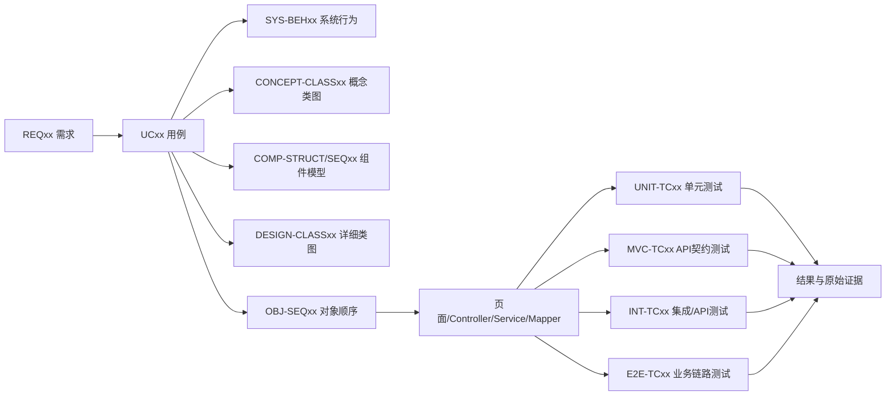

# Kinda Goods 需求追溯矩阵

> 基线日期：2026-08-29
> 范围：`REQ01`–`REQ25` / `UC01`–`UC25`
> 说明：测试编号只登记仓库中可以定位到实际文件和方法的入口；`MVC` 是 Controller 的 MockMvc/API 契约测试，不等同于纯 Unit；`INT` 是 Spring Boot HTTP/数据库集成测试；`E2E` 是 Compose + MySQL + Playwright 真浏览器测试。

## 1 对应关系

## 2 全量追溯表

表中“测试明细”按 `编号：实际文件#方法；验证内容` 编写，因此可以从编号直接定位到源码，而不是只停留在“对应某个测试类”。

| 需求 / 用例                   | 六类图模型                                                                            | 主要代码模块                                                                                                                                                 | 测试明细（编号、入口、验证内容）                                                                                                                                                                                                                                                                                                                                                                                                                                                                                                                                                                                                                                                                                                                                                                                                                                                                                                                                                                                                                                                                                                                                                                                                                                                                                                                                                                                                                                                              | 结果 / 证据                                                                                                                                                      |
| ----------------------------- | ------------------------------------------------------------------------------------- | ------------------------------------------------------------------------------------------------------------------------------------------------------------ | --------------------------------------------------------------------------------------------------------------------------------------------------------------------------------------------------------------------------------------------------------------------------------------------------------------------------------------------------------------------------------------------------------------------------------------------------------------------------------------------------------------------------------------------------------------------------------------------------------------------------------------------------------------------------------------------------------------------------------------------------------------------------------------------------------------------------------------------------------------------------------------------------------------------------------------------------------------------------------------------------------------------------------------------------------------------------------------------------------------------------------------------------------------------------------------------------------------------------------------------------------------------------------------------------------------------------------------------------------------------------------------------------------------------------------------------------------------------------------------------- | ---------------------------------------------------------------------------------------------------------------------------------------------------------------- |
| REQ01 / UC01 注册、登录和鉴权 | SYS-BEH01 / CONCEPT-CLASS01 / COMP-STRUCT01 / COMP-SEQ01 / DESIGN-CLASS01 / OBJ-SEQ01 | `LoginView.vue`、`Register.vue`；`AuthController`、`AuthServiceImpl`、`JwtAuthInterceptor`                                                                   | `UNIT-TC01-001`：`backend/src/test/java/com/segroup8/platform/service/impl/AuthServiceImplTest.java#register_shouldEncodePasswordAndInsertUser`、`#login_shouldUpgradeLegacyPasswordAndReturnToken`、`#login_shouldThrowWhenPasswordInvalid`、`#register_shouldRejectDuplicateUsername`、`#login_shouldRejectBannedUser`；BCrypt、JWT、错误密码、重复用户名和封禁规则。 `MVC-TC01-001`：`backend/src/test/java/com/segroup8/platform/controller/AuthControllerWebMvcTest.java#register_shouldReturnUnifiedSuccess`、`#register_shouldRejectInvalidBody`、`#login_shouldReturnTokenAndRole`、`#login_shouldRejectInvalidBody`；响应和参数契约。 `INT-TC01-001`：`backend/src/test/java/com/segroup8/platform/integration/IdentityUc01IntegrationTest.java#registerLoginRoleBoundaryAndBanMustShareOnePersistedChain`、`#duplicateInvalidAndWrongPasswordRequestsMustNotCreateDirtyUsers`；注册、登录、越权、封禁/解禁和无脏数据。 `E2E-TC01-001`：`frontend/e2e/domain-a/uc01-auth.spec.ts#register, login, role boundary, ban and refresh persistence`。                                                                                                                                                                                                                                                                                                                                                                                                                             | `LOCAL_E2E_PASS`；`../../04_tests/UC01/evidence/result-summary.json`、`../../04_tests/UC01/evidence/playwright-results.json`。共享 JWT 平台测试不重复计入 UC01。 |
| REQ02 / UC02 资料和地址       | SYS-BEH02 / CONCEPT-CLASS02 / COMP-STRUCT02 / COMP-SEQ02 / DESIGN-CLASS02 / OBJ-SEQ02 | `Profile.vue`、`AddressManager.vue`；`UserController`、`UserServiceImpl`、`AddressMapper`                                                                    | `UNIT-TC02-001`：`backend/src/test/java/com/segroup8/platform/service/impl/UserServiceImplTest.java#getCurrentUserProfile_shouldMapUserInfo`、`#createAddress_whenDefault_shouldClearPreviousDefault`、`#deleteAddress_shouldThrowWhenAddressNotOwned`；资料映射、默认地址唯一性和所有权。 `MVC-TC02-001`：`backend/src/test/java/com/segroup8/platform/controller/UserControllerWebMvcTest.java#profile_shouldReturnCurrentUser`、`#me_shouldReturnCurrentUser`、`#updateProfile_shouldReturnSuccess`、`#createAddress_shouldReturnSuccess`、`#createAddress_shouldRejectInvalidPhone`、`#listAddresses_shouldReturnOnlyServiceResult`、`#deleteAddress_shouldReturnSuccess`、`#updateAddress_shouldReturnSuccess`；API 契约。 `INT-TC02-001`：`backend/src/test/java/com/segroup8/platform/integration/ProfileAddressUc02IntegrationTest.java#profileAndAddressCrudMustPersistAndKeepOneDefaultPerUser`、`#addressOwnershipMustPreventCrossUserUpdateAndDelete`；真实 CRUD、默认值和越权。 `E2E-TC02-001`：`frontend/e2e/domain-a/uc02-profile-address.spec.ts#updates profile, maintains one default address and isolates ownership`。                                                                                                                                                                                                                                                                                                                                            | `LOCAL_E2E_PASS`；`../../04_tests/UC02/evidence/result-summary.json`、`../../04_tests/UC02/evidence/playwright-results.json`。                                   |
| REQ03 / UC03 商家申请         | SYS-BEH03 / CONCEPT-CLASS03 / COMP-STRUCT03 / COMP-SEQ03 / DESIGN-CLASS03 / OBJ-SEQ03 | `MerchantApplyView.vue`、`AdminMerchantReviewView.vue`；`MerchantApplicationController`、`MerchantApplicationServiceImpl`                                    | `UNIT-TC03-001`：`backend/src/test/java/com/segroup8/platform/service/impl/MerchantApplicationServiceImplTest.java#approve_shouldUpgradeRoleAndInsertNotification`、`#submit_shouldRejectDuplicatePendingApplication`、`#reject_shouldPersistReasonAndNotifyApplicant`；升级、重复申请、驳回和通知。 `MVC-TC03-001`：`backend/src/test/java/com/segroup8/platform/controller/MerchantApplicationControllerWebMvcTest.java#submit_shouldReturnSuccess`、`#getMyApplication_shouldReturnRecord`、`#page_shouldReturnAdminApplicationQueue`、`#reject_shouldRequireReason`、`#reject_shouldReturnSuccessAndRecordAudit`、`#approve_shouldReturnSuccessAndRecordAudit`。 `INT-TC03-001`：`backend/src/test/java/com/segroup8/platform/integration/MerchantApplicationUc03IntegrationTest.java#submitApproveUpgradeShopNotificationAndAuditMustBeConsistent`；申请、审核、角色/店铺、通知和审计一致。 `INT-TC03-002`：`backend/src/test/java/com/segroup8/platform/integration/MerchantApplicationNotificationFailureIntegrationTest.java#notificationStorageFailureMustNotRollbackApprovalCoreState`；通知失败不回滚审核核心状态。 `E2E-TC03-001`：`frontend/e2e/domain-a/uc03-merchant-application.spec.ts#submit, review, role/shop upgrade and rejection persistence`。                                                                                                                                                                                                            | `LOCAL_E2E_PASS`；`../../04_tests/UC03/evidence/result-summary.json`、`../../04_tests/UC03/evidence/playwright-results.json`。                                   |
| REQ04 / UC04 封禁解禁审计     | SYS-BEH04 / CONCEPT-CLASS04 / COMP-STRUCT04 / COMP-SEQ04 / DESIGN-CLASS04 / OBJ-SEQ04 | `AdminUserList.vue`；`AdminUserController`、`AdminUserServiceImpl`、`AdminAuditLogServiceImpl`                                                               | `UNIT-TC04-001`：`backend/src/test/java/com/segroup8/platform/service/impl/AdminUserServiceImplTest.java#banUser_shouldUpdateStatusToBanned`、`#banUser_shouldThrowWhenCurrentUserNotAdmin`、`#unbanUser_shouldRestoreNormalStatus`、`#banUser_shouldRejectSelfBan`；状态和权限边界。 `UNIT-TC04-002`：`backend/src/test/java/com/segroup8/platform/service/impl/AdminAuditLogServiceImplTest.java#record_shouldInsertAuditLog`。 `MVC-TC04-001`：`backend/src/test/java/com/segroup8/platform/controller/AdminUserControllerWebMvcTest.java#pageUsers_shouldReturnAdminUserPage`、`#pageAuditLogs_shouldReturnAdminAuditPage`、`#ban_shouldReturnSuccessAndRecordAudit`、`#unban_shouldReturnSuccessAndRecordAudit`。 `INT-TC04-001`：`backend/src/test/java/com/segroup8/platform/integration/UserGovernanceUc04IntegrationTest.java#banLoginFailureUnbanRecoveryPermissionAndAuditMustBeConsistent`；登录阻断/恢复和审计。 `E2E-TC04-001`：`frontend/e2e/domain-a/uc04-ban-unban.spec.ts#ban blocks login, unban restores login and audit is queryable`。                                                                                                                                                                                                                                                                                                                                                                                                                      | `LOCAL_E2E_PASS`；`../../04_tests/UC04/evidence/result-summary.json`、`../../04_tests/UC04/evidence/playwright-results.json`。                                   |
| REQ05 / UC05 举报拉黑信用     | SYS-BEH05 / CONCEPT-CLASS05 / COMP-STRUCT05 / COMP-SEQ05 / DESIGN-CLASS05 / OBJ-SEQ05 | `CreditView.vue`、`AdminReportView.vue`；`ReportBlockController`、`ReportBlockServiceImpl`、`CreditServiceImpl`                                              | `UNIT-TC05-001`：`backend/src/test/java/com/segroup8/platform/service/impl/ReportBlockServiceImplTest.java#submitReport_shouldRejectSelfReport`、`#submitReport_shouldInsertPendingReport`、`#submitReport_shouldRejectDuplicateActiveReport`、`#blockUser_shouldRejectSelfBlock`、`#blockUser_shouldRejectDuplicateBlock`、`#adminAuditReport_shouldRejectDuplicateReview`；举报/拉黑资格、重复和审核幂等。 `UNIT-TC05-002`：`backend/src/test/java/com/segroup8/platform/service/impl/CreditServiceImplTest.java#adminAdjust_shouldRejectUnsupportedRole`、`#adminAdjust_shouldWriteScoreLog`；信用角色和流水。 `MVC-TC05-001`：`backend/src/test/java/com/segroup8/platform/controller/ReportBlockControllerWebMvcTest.java#submitReport_shouldReturnSuccess`、`#block_shouldRejectMissingTarget`、`#block_shouldReturnSuccess`、`#reportAndBlockQueries_shouldReturnSuccess`、`#unblock_shouldReturnSuccess`、`#myCredit_shouldReturnSuccess`、`#userCredit_shouldReturnSuccess`、`#adminListReports_shouldReturnSuccess`、`#creditAdjust_shouldReturnSuccessAndDelegate`、`#auditReport_shouldRequireAdmin`、`#adminEndpoint_shouldRejectNonAdmin`。 `INT-TC05-001`：`backend/src/test/java/com/segroup8/platform/integration/ReportBlockCreditUc05IntegrationTest.java#reportBlockCredit_shouldPersistOwnershipAuditAndIdempotency`。 `E2E-TC05-001`：`frontend/e2e/domain-a/uc05-governance.spec.ts#report, bilateral block state, credit audit and refresh persistence`。 | `LOCAL_E2E_PASS`；`../../04_tests/UC05/evidence/result-summary.json`、`../../04_tests/UC05/evidence/playwright-results.json`。                                   |
| REQ06 / UC06 搜索筛选详情     | SYS-BEH06 / CONCEPT-CLASS06 / COMP-STRUCT06 / COMP-SEQ06 / DESIGN-CLASS06 / OBJ-SEQ06 | `ProductListView.vue`、`ProductDetailView.vue`；`microservices/catalog-service/CatalogController`、`CatalogService`                                          | `INT-TC06-001`：`microservices/catalog-service/src/test/java/com/segroup8/catalog/CatalogApiIntegrationTest.java#combinedSearchAndPublicDetailUseTheDatabase`、`#filtersSortsEmptyAndExceptionPaths`；搜索、详情、过滤、空结果和异常分页。 `E2E-TC06-001`：`frontend/e2e/domain-b/uc06-catalog.spec.ts#searches, filters, opens matching detail and confirms persisted API fields`、`#shows a real empty result and rejects invalid pagination at the API boundary`。                                                                                                                                                                                                                                                                                                                                                                                                                                                                                                                                                                                                                                                                                                                                                                                                                                                                                                                                                                                                                      | `CI_E2E_PASS / LOCAL_ARTIFACT_MISSING`；服务/API 原始结果已归档，CI 全量 E2E job 通过                                                                            |
| REQ07 / UC07 卖家商品生命周期 | SYS-BEH07 / CONCEPT-CLASS07 / COMP-STRUCT07 / COMP-SEQ07 / DESIGN-CLASS07 / OBJ-SEQ07 | `SellerProductList.vue`、`SellerProductEdit.vue`；`ProductController`、`ProductServiceImpl`、商品 Mapper                                                     | `UNIT-TC07-001`：`backend/src/test/java/com/segroup8/platform/service/impl/ProductServiceImplTest.java#createSellerProduct_shouldPersistWithCurrentSellerShopId`、`#adjustSellerProductStock_shouldThrowWhenResultNegative`、`#pageSellerProducts_shouldUseCurrentSellerShopIdAndReturnPageVO`；卖家归属、库存边界和工作台隔离。该类当前未声明 `UC07` tag，按方法语义登记为共享回归。 `E2E-TC07-001`：`frontend/e2e/domain-b/uc07-product-lifecycle.spec.ts#creates, edits, shelves, adjusts stock and deletes a product with persistence checks`; `#denies the buyer access to the seller workbench`；创建、编辑、库存、上下架、删除和买家越权。                                                                                                                                                                                                                                                                                                                                                                                                                                                                                                                                                                                                                                                                                                                                                                                                                                          | `CI_E2E_PASS / LOCAL_ARTIFACT_MISSING`；服务/API 结果已归档，CI 全量 E2E job 通过。                                                                              |
| REQ08 / UC08 店铺设置装修     | SYS-BEH08 / CONCEPT-CLASS08 / COMP-STRUCT08 / COMP-SEQ08 / DESIGN-CLASS08 / OBJ-SEQ08 | `PublicShopView.vue`、`SellerShopSetting.vue`、`SellerShopDecoration.vue`；`ShopController`、`ShopServiceImpl`                                               | `INT-TC08-001`：`microservices/shop-service/src/test/java/com/segroup8/shop/ShopApiIntegrationTest.java#viewSettingsAndDecorationUseTheDatabase`、`#decorationRuleRejectsUnknownTemplate`、`#closedShopAndUnknownSellerAreRejected`、`#malformedAndOversizedDecorationAreRejected`；查看、装修、店铺状态、卖家归属和输入边界。 `E2E-TC08-001`：`frontend/e2e/domain-b/uc08-shop.spec.ts#publishes decoration, reloads it and confirms the persisted JSON`; `#keeps shop maintenance inaccessible to a different role`。                                                                                                                                                                                                                                                                                                                                                                                                                                                                                                                                                                                                                                                                                                                                                                                                                                                                                                                                                                    | `CI_E2E_PASS / LOCAL_ARTIFACT_MISSING`；Shop API 原始结果已归档，CI 全量 E2E job 通过。                                                                          |
| REQ09 / UC09 商品风险审核     | SYS-BEH09 / CONCEPT-CLASS09 / COMP-STRUCT09 / COMP-SEQ09 / DESIGN-CLASS09 / OBJ-SEQ09 | `AdminProductRiskAuditView.vue`；`ProductRiskAuditController`、`ProductRiskAuditServiceImpl`、outbox                                                         | `INT-TC09-001`：`microservices/risk-service/src/test/java/com/segroup8/risk/RiskApiIntegrationTest.java#submitReviewAndRejectUseTheDatabase`、`#forbiddenWordRuleIsDeterministicWithoutLlm`、`#approvalCreatesPendingOutboxDelivery`、`#rejectReasonAndSingleDecisionAreEnforced`；审核、敏感词、outbox、理由和单次决策。 `E2E-TC09-001`：`frontend/e2e/domain-b/uc09-risk-audit.spec.ts#lists and rejects a deterministic high-risk product, then persists the decision`; `#rejects a forged ordinary-user administrator request`。                                                                                                                                                                                                                                                                                                                                                                                                                                                                                                                                                                                                                                                                                                                                                                                                                                                                                                                                                       | `CI_E2E_PASS / LOCAL_ARTIFACT_MISSING`；Risk API 原始结果已归档，CI 全量 E2E job 通过。                                                                          |
| REQ10 / UC10 浏览搜索热词     | SYS-BEH10 / CONCEPT-CLASS10 / COMP-STRUCT10 / COMP-SEQ10 / DESIGN-CLASS10 / OBJ-SEQ10 | `BrowseHistoryView.vue`；`SearchBehaviorServiceImpl`、`BrowseHistoryServiceImpl`、行为 API                                                                   | `INT-TC10-001`：`microservices/behavior-service/src/test/java/com/segroup8/behavior/BehaviorApiIntegrationTest.java#browseSearchHotAndDeleteUseTheDatabase`、`#keywordRuleNormalizesAndRejectsBlank`、`#browseHistoryDeduplicatesAndOrdersNewestFirst`、`#historyDeletionIsUserScoped`、`#hotKeywordsAreRankedLimitedAndValidated`；浏览/搜索记录、规范化、去重排序、用户隔离和热词。 `E2E-TC10-001`：`frontend/e2e/domain-b/uc10-behavior.spec.ts#records browsing and search, views history/hot words, deletes history and persists the deletion`; `#isolates another user's history and requires authentication`。                                                                                                                                                                                                                                                                                                                                                                                                                                                                                                                                                                                                                                                                                                                                                                                                                                                                      | `CI_E2E_PASS / LOCAL_ARTIFACT_MISSING`；Behavior API 原始结果已归档，CI 全量 E2E job 通过。                                                                      |
| REQ11 / UC11 购物车结算拆单   | SYS-BEH11 / CONCEPT-CLASS11 / COMP-STRUCT11 / COMP-SEQ11 / DESIGN-CLASS11 / OBJ-SEQ11 | `CartView.vue`；`OrderController`、`OrderServiceImpl`、库存/优惠券 Mapper                                                                                    | `UNIT-TC11-001`：`backend/src/test/java/com/segroup8/platform/service/impl/OrderServiceImplTest.java#payMyOrder_shouldSplitCartItemsIntoIndependentPaidOrders`；共享 Domain-C 回归，按方法语义覆盖支付拆单。 `INT-TC11-001`：`backend/src/test/java/com/segroup8/platform/integration/OrderCreateUc11IntegrationTest.java#createsOrderFromServerPrice_mergesItems_andPersistsResponseConsistently`；服务端计价、重复项合并。 `INT-TC11-002`：`#rejectsInvalidProductAddressSelfPurchaseAndBlockRelationships_withoutSideEffects`；商品/地址/自购/拉黑边界。 `INT-TC11-003`：`#rejectsInvalidRequestParameters_beforeWritingBusinessData`；DTO 参数。 `INT-TC11-004`：`#appliesEligibleVoucher_andKeepsOrderInventoryAndVoucherConsistent`；合法店铺券。 `INT-TC11-005`：`#rejectsUnclaimedThresholdAndShopMismatchVouchers_andRollsBackEverything`；无资格券回滚。 `INT-TC11-006`：`#laterItemPersistenceFailure_rollsBackOrderInventoryAndOccupiedVoucher`；事务回滚。 `INT-TC11-007`：`#duplicateIdempotencyKey_replaysResponseAndCreatesOnlyOneOrder`；幂等回放。 `E2E-TC11-001`：`frontend/e2e/domain-c/uc11-checkout-order.spec.ts#persists cart checkout and renders the same order after refresh`。                                                                                                                                                                                                                                                            | `LOCAL_E2E_PASS`；`../../04_tests/UC11/evidence/result-summary.json`、`../../04_tests/UC11/evidence/raw-reports/playwright/playwright-results.json`。            |
| REQ12 / UC12 支付取消         | SYS-BEH12 / CONCEPT-CLASS12 / COMP-STRUCT12 / COMP-SEQ12 / DESIGN-CLASS12 / OBJ-SEQ12 | `OrderView.vue`；`OrderServiceImpl`、`IdempotencyInterceptor`、账户/优惠券服务                                                                               | `UNIT-TC12-001`：`backend/src/test/java/com/segroup8/platform/service/impl/OrderServiceImplTest.java#cancelMyOrder_shouldRestoreStockWhenUnpaidEvenIfOrderStatusNotPendingPay`；未付款取消恢复库存。 `UNIT-TC12-002`：`backend/src/test/java/com/segroup8/platform/interceptor/IdempotencyInterceptorTest.java#shouldAllowFirstRequestAndReplayDuplicateResult`、`#shouldReturnSuccessEnvelopeWhenDuplicateStillProcessing`、`#shouldIgnoreWhenHeaderMissing`；幂等首请求、处理中回放和缺失 header。 `INT-TC12-001`：`backend/src/test/java/com/segroup8/platform/integration/OrderPayCancelUc12IntegrationTest.java#coinPaymentSplitsDiscountAndPreservesAccountAndLedgerConservation`、`#onlyPendingPaymentOrderCanBePaid`、`#insufficientBalanceRollsBackOrderBalanceVoucherAndLedger`、`#unpaidCancellationRestoresStockAndReleasesVoucher`、`#paidCancellationNeverUsesUnpaidRestoreRules_andCompletedOrderIsRejected`、`#nonBuyerCannotPayOrCancel_andNoStateChanges`、`#duplicatePaymentAndCancellationReplayWithoutDuplicateSideEffects`、`#concurrentPayAndCancelAllowsAtMostOneBusinessSideEffect`。 `E2E-TC12-001`：`frontend/e2e/domain-c/uc12-pay-cancel.spec.ts#pays and cancels persisted orders through the browser`。                                                                                                                                                                                                                                               | `LOCAL_E2E_PASS`；`../../04_tests/UC12/evidence/result-summary.json`、`../../04_tests/UC12/evidence/raw-reports/playwright/playwright-results.json`。            |
| REQ13 / UC13 发货物流收货     | SYS-BEH13 / CONCEPT-CLASS13 / COMP-STRUCT13 / COMP-SEQ13 / DESIGN-CLASS13 / OBJ-SEQ13 | `MerchantOrdersView.vue`、`OrderDetailView.vue`；`LogisticsServiceImpl`、`OrderServiceImpl`                                                                  | `UNIT-TC13-001`：`backend/src/test/java/com/segroup8/platform/service/impl/OrderServiceImplTest.java#shipSellerOrder_shouldPersistNotificationForBuyer`；发货后通知买家。 `INT-TC13-001`：`backend/src/test/java/com/segroup8/platform/integration/NewProductFulfillmentUc13IntegrationTest.java#sellerShipsNewProduct_createsOneInitialTrace_andBothPartiesCanQuery`、`#nonSellerAndNonPendingShipAreRejected_andMergedOrderIsUnchanged`、`#receiveSettlesOnce_andConcurrentManualAutomaticConfirmationCannotDuplicateLedger`、`#repeatedShippingDoesNotCreateAnotherInitialTrace`；发货、物流、收货结算、权限和幂等。 `E2E-TC13-001`：`frontend/e2e/domain-c/uc13-fulfillment.spec.ts#seller ships, buyer views logistics and confirms receipt`。                                                                                                                                                                                                                                                                                                                                                                                                                                                                                                                                                                                                                                                                                                                                     | `LOCAL_E2E_PASS`；`../../04_tests/UC13/evidence/result-summary.json`、`../../04_tests/UC13/evidence/raw-reports/playwright/playwright-results.json`。            |
| REQ14 / UC14 退款退货仲裁     | SYS-BEH14 / CONCEPT-CLASS14 / COMP-STRUCT14 / COMP-SEQ14 / DESIGN-CLASS14 / OBJ-SEQ14 | `AfterSaleView.vue`、`AdminOrderView.vue`；`OrderServiceImpl`、`AdminOrderController`、退款/审计服务                                                         | `UNIT-TC14-001`：`backend/src/test/java/com/segroup8/platform/service/impl/OrderServiceImplTest.java#approveRefundBySeller_shouldPersistDecisionUserAndRemark`；卖家审核记录。 `MVC-TC14-001`：`backend/src/test/java/com/segroup8/platform/controller/AdminOrderControllerWebMvcTest.java#approveRefund_shouldFailWhenRemarkTooLong`、`#afterSaleLogs_shouldReturnSuccessList`；备注校验和日志查询契约。 `INT-TC14-001`：`backend/src/test/java/com/segroup8/platform/integration/OrderRefundUc14IntegrationTest.java#buyerApply_sellerReject_reapply_adminApprove_recordsCompleteOrderedAuditLog`、`#adminReject_recordsDecisionWithoutRefundSideEffects`、`#pendingShipOnlyRefund_autoApproves_refundsBuyer_andRestoresStock`、`#refundModes_enforceOnlyRefundAndReturnRefundBoundaries_withoutMutatingRejectedRequests`、`#buyerSellerAndAdminPermissions_rejectUnrelatedActors_andLeaveStateUnchanged`、`#settledRefund_returnsBuyerFunds_debitsSeller_andKeepsRefundLedgerConserved`、`#concurrentSellerAndAdminApproval_producesExactlyOneRefundAndOneApprovalLog`；退款模式、权限、资金/库存和并发幂等。 `INT-TC14-002`：`backend/src/test/java/com/segroup8/platform/integration/OrderAfterSaleIntegrationTest.java#buyerApply_thenAdminApprove_thenLogsShouldExist`；兼容性审计回归。 `E2E-TC14-001`：`frontend/e2e/domain-c/uc14-after-sale.spec.ts#buyer applies and seller approves, then admin arbitrates`。                                                        | `LOCAL_E2E_PASS`；`../../04_tests/UC14/evidence/result-summary.json`、`../../04_tests/UC14/evidence/raw-reports/playwright/playwright-results.json`。            |
| REQ15 / UC15 评价追评回复     | SYS-BEH15 / CONCEPT-CLASS15 / COMP-STRUCT15 / COMP-SEQ15 / DESIGN-CLASS15 / OBJ-SEQ15 | `MyReviewsView.vue`、`MerchantReviewsView.vue`；`ReviewController`、`ReviewService`、`ReviewMapper`                                                          | `UNIT-TC15-001`：`backend/src/test/java/com/segroup8/platform/service/impl/ReviewServiceTest.java#orderReview_writesOneOriginalForEveryOrderItem_andCompletesOrder`、`#duplicateOriginalReview_isRejected`、`#invalidItemInBatch_isRejectedBeforeAnyInsert_andOrderStaysPendingReview`；首评批量、重复和事务。 `MVC-TC15-001`：`backend/src/test/java/com/segroup8/platform/controller/ReviewControllerWebMvcTest.java#sellerReply_requiresOwnershipAndValidContent`、`#myReviews_areScopedToCurrentUser`、`#sellerReviews_withoutOwnedProducts_returnsEmptyWithoutQueryingUnscopedReviews`。 `INT-TC15-001`：`backend/src/test/java/com/segroup8/platform/integration/ReviewFlowIntegrationTest.java#buyerOriginal_sellerReply_buyerFollowup_persistsAndAllowsOnlyOneFollowup`、`#secondItemDatabaseFailure_rollsBackFirstReview_andLeavesOrderPendingReview`、`#buyerAndSellerPagination_filterBeforePaging_andNeverLeakOtherUsersData`。 `E2E-TC15-001`：`frontend/e2e/domain-c/uc15-review.spec.ts#buyer reviews, seller replies, buyer follows up and state persists`。                                                                                                                                                                                                                                                                                                                                                                                                         | `LOCAL_E2E_PASS`；`../../04_tests/UC15/evidence/result-summary.json`、`../../04_tests/UC15/evidence/raw-reports/playwright/playwright-results.json`。            |
| REQ16 / UC16 二手发布管理     | SYS-BEH16 / CONCEPT-CLASS16 / COMP-STRUCT16 / COMP-SEQ16 / DESIGN-CLASS16 / OBJ-SEQ16 | `SecondhandPublishView.vue`、`SecondhandSellerView.vue`；`SecondhandProductController`、`SecondhandProductServiceImpl`                                       | `UNIT-TC16-001`：`backend/src/test/java/com/segroup8/platform/service/impl/SecondhandProductServiceImplTest.java#pagePublicProducts_shouldThrowWhenPriceRangeInvalid`、`#createSellerProduct_shouldThrowWhenOriginPriceLowerThanSalePrice`、`#pageSellerProducts_shouldFilterByCurrentUser`；字段、价格和本人列表。 `MVC-TC16-001`：`backend/src/test/java/com/segroup8/platform/controller/SecondhandProductControllerUc16WebMvcTest.java#sellerCreate_shouldValidateRequestAndReturnProduct`、`#publicList_shouldRecordKeywordAndDelegateQuery`。 `INT-TC16-001`：`backend/src/test/java/com/segroup8/platform/integration/SecondhandProductManagementIntegrationTest.java#realCategoryCreateEditShelfAndReload_arePersistedAcrossHttpAndDatabase`、`#nonOwnerCannotEditShelfOrDelete_andProductRemainsUnchanged`、`#soldProductCannotBeEditedRelistedOrDeleted`、`#ownerDeleteRemovesProductFromSellerPublicAndDetailQueries`、`#invalidNameImagesCategoryConditionNegotiableAndPrices_doNotWriteProducts`。 `E2E-TC16-001`：`frontend/e2e/domain-d/uc16-product-management.spec.ts#persists publish, edit, shelf changes and delete while rejecting a non-owner`。                                                                                                                                                                                                                                                                                                               | `LOCAL_E2E_PASS`；`../../04_tests/UC16/evidence/result-summary.json`、`../../04_tests/UC16/evidence/raw-reports/playwright/playwright-results.json`。            |
| REQ17 / UC17 二手直接购买     | SYS-BEH17 / CONCEPT-CLASS17 / COMP-STRUCT17 / COMP-SEQ17 / DESIGN-CLASS17 / OBJ-SEQ17 | `SecondhandDetailView.vue`、`SecondhandOrdersView.vue`；`SecondhandProductServiceImpl`、`OrderServiceImpl`                                                   | `UNIT-TC17-001`：`backend/src/test/java/com/segroup8/platform/service/impl/SecondhandProductServiceImplTest.java#buySecondhandProduct_shouldThrowWhenBuyerIsSeller`、`#buySecondhandProduct_shouldCreateOrderWhenSuccess`、`#buySecondhandProduct_shouldGenerateUniqueOrderNumbersForRapidPurchases`；自购、建单和订单号。 `MVC-TC17-001`：`backend/src/test/java/com/segroup8/platform/controller/SecondhandProductControllerUc17WebMvcTest.java#buy_shouldAcceptAddressAndReturnPendingOrder`。 `INT-TC17-001`：`backend/src/test/java/com/segroup8/platform/integration/SecondhandDirectPurchaseIntegrationTest.java#availableProductAndOwnedAddressCreateOnePendingOrderAtomically`、`#offShelfSoldAndSelfOwnedProductsAreRejectedWithoutOrders`、`#missingAndForeignAddressesAreRejectedBeforeProductReservation`、`#twoConcurrentBuyersProduceExactlyOneOrderAndOneWinner`、`#orderInsertFailureRollsBackReservedProduct`、`#unpaidCancellationRelistsProductWhilePaymentMovesOrderToPendingShipment`、`#duplicateClickCreatesOneDealAndNegotiatedPriceHonorsEffectiveWindow`。 `E2E-TC17-001`：`frontend/e2e/domain-d/uc17-direct-purchase.spec.ts#creates one pending order through the real UI and rejects a repeated purchase`。                                                                                                                                                                                                                                           | `LOCAL_E2E_PASS`；`../../04_tests/UC17/evidence/result-summary.json`、`../../04_tests/UC17/evidence/raw-reports/playwright/playwright-results.json`。            |
| REQ18 / UC18 二手议价         | SYS-BEH18 / CONCEPT-CLASS18 / COMP-STRUCT18 / COMP-SEQ18 / DESIGN-CLASS18 / OBJ-SEQ18 | `SecondhandDetailView.vue`、`ChatView.vue`；`SecondhandTradeController`、`SecondhandTradeServiceImpl`                                                        | `UNIT-TC18-001`：`backend/src/test/java/com/segroup8/platform/service/impl/SecondhandTradeServiceImplTest.java#confirmBargain_shouldCreatePendingPayOrderWhenSellerAccepts`、`#rejectBargain_shouldUpdateStatusAndNotifyBuyer`、`#rejectBargain_shouldThrowWhenAlreadyHandled`；确认、拒绝和重复处理。 `MVC-TC18-001`：`backend/src/test/java/com/segroup8/platform/controller/SecondhandTradeControllerUc18WebMvcTest.java#bargainApplyConfirmAndReject_shouldExposeStableRoutes`。 `INT-TC18-001`：`backend/src/test/java/com/segroup8/platform/integration/SecondhandNegotiationIntegrationTest.java#applicationPersistsAndBothParticipantsCanListIt`、`#invalidNonNegotiableSelfAndRepeatedApplicationsAreRejected`、`#unrelatedSellerCannotConfirmOrReject`、`#confirmationCreatesOnePendingPaymentOrderAtConfirmedPrice`、`#rejectionEndsApplicationWithoutCreatingOrder`、`#concurrentConfirmAndRejectProduceExactlyOneDecision`、`#chatAndNotificationFailuresDoNotRollbackCoreDecision`。 `E2E-TC18-001`：`frontend/e2e/domain-d/uc18-bargain.spec.ts#buyer applies, seller confirms in chat, and buyer receives a pending-payment order`。                                                                                                                                                                                                                                                                                                                                 | `LOCAL_E2E_PASS`；`../../04_tests/UC18/evidence/result-summary.json`、`../../04_tests/UC18/evidence/raw-reports/playwright/playwright-results.json`。            |
| REQ19 / UC19 二手拍卖         | SYS-BEH19 / CONCEPT-CLASS19 / COMP-STRUCT19 / COMP-SEQ19 / DESIGN-CLASS19 / OBJ-SEQ19 | `SecondhandDetailView.vue`、`SecondhandSellerView.vue`；`SecondhandTradeController`、`SecondhandTradeServiceImpl`                                            | `UNIT-TC19-001`：`backend/src/test/java/com/segroup8/platform/service/impl/SecondhandTradeServiceImplTest.java#placeBid_shouldRejectBidLowerThanMinimumIncrement`、`#placeBid_shouldRejectEndedAuction`、`#settleExpiredAuctions_shouldCreateOnlyOneOrderForAlreadySettledAuction`；出价边界、结束状态和结算幂等。 `MVC-TC19-001`：`backend/src/test/java/com/segroup8/platform/controller/SecondhandTradeControllerUc19WebMvcTest.java#auctionCreateQueryAndBid_shouldExposeSellerAndBuyerRoutes`。 `INT-TC19-001`：`backend/src/test/java/com/segroup8/platform/integration/SecondhandAuctionLifecycleIntegrationTest.java#sellerCanCreateAfterHistoricalAuctionButDuplicateAndNonOwnerAreRejected`；创建和归属。 `INT-TC19-002`：`#legalBidsPersistLogsAndReleaseThePreviousBidderFunds`；合法竞价与退款。 `INT-TC19-003`：`#nonexistentFutureClosedExpiredAndSelfBidsAreRejected`；时间和自购边界。 `INT-TC19-004`：`#concurrentBidsLeaveExactlyOneLeaderAndOneFundHold`；并发只保留一个领先者和冻结。 `INT-TC19-005`：`#onlySellerCanCloseAndNoBidAuctionFlowsWithoutAnOrder`；结束权限和流拍。 `INT-TC19-006`：`#sellerCloseCreatesOnePaidPendingShipmentOrderAndItem`；成交订单。 `INT-TC19-007`：`#failedSettlementRollsBackAndCanRetryWithoutDuplicateOrder`；结算失败回滚与重试。 `E2E-TC19-001`：`frontend/e2e/domain-d/uc19-auction.spec.ts#seller creates an auction, two buyers bid, and the winner receives one settled order`。                    | `LOCAL_E2E_PASS`；`../../04_tests/UC19/evidence/result-summary.json`、`../../04_tests/UC19/evidence/raw-reports/playwright/playwright-results.json`。            |
| REQ20 / UC20 二手履约         | SYS-BEH20 / CONCEPT-CLASS20 / COMP-STRUCT20 / COMP-SEQ20 / DESIGN-CLASS20 / OBJ-SEQ20 | `SecondhandSoldView.vue`、`SecondhandOrdersView.vue`；`OrderController`、`OrderServiceImpl`、`LogisticsServiceImpl`                                          | `UNIT-TC20-001`：`backend/src/test/java/com/segroup8/platform/service/impl/OrderServiceImplTest.java#shipSellerOrder_shouldPersistNotificationForBuyer`、`#shipSellerOrder_shouldRejectLegacyMergedOrder`；共享 Domain-C 服务状态机/兼容性回归。 `MVC-TC20-001`：`backend/src/test/java/com/segroup8/platform/controller/OrderControllerUc20WebMvcTest.java#shipAndConfirmReceive_shouldExposeStableRoutes`。 `INT-TC20-001`：`backend/src/test/java/com/segroup8/platform/integration/SecondhandFulfillmentLifecycleIntegrationTest.java#shipmentRequiresSellerOwnershipPaymentAndPendingShipmentState`；发货前置条件。 `INT-TC20-002`：`#repeatedShipmentIsIdempotentAndCreatesOneInitialTrace`；发货幂等。 `INT-TC20-003`：`#onlyBuyerCanConfirmAndRepeatedReceiptSettlesExactlyOnce`；收货权限和一次结算。 `INT-TC20-004`：`#notificationFailuresDoNotRollbackShipmentOrReceipt`；通知故障隔离。 `INT-TC20-005`：`#settlementFailureRollsBackReceiptAndRetryDoesNotDuplicateCredit`；结算回滚与重试。 `INT-TC20-006`：`#bargainOrderCreationFailureRestoresNegotiationAndProduct`；议价建单失败回滚。 `INT-TC20-007`：`backend/src/test/java/com/segroup8/platform/integration/SecondhandOrderFlowIntegrationTest.java#secondhandSellerCanViewShipAndPushLogistics`；既有物流可见性回归。 `E2E-TC20-001`：`frontend/e2e/domain-d/uc20-fulfillment.spec.ts#seller ships, buyer sees logistics and confirms receipt with one settlement`。                       | `LOCAL_E2E_PASS`；`../../04_tests/UC20/evidence/result-summary.json`、`../../04_tests/UC20/evidence/raw-reports/playwright/playwright-results.json`。            |
| REQ21 / UC21 优惠券生命周期   | SYS-BEH21 / CONCEPT-CLASS21 / COMP-STRUCT21 / COMP-SEQ21 / DESIGN-CLASS21 / OBJ-SEQ21 | `SellerVoucher.vue`、`AdminVoucherView.vue`；`VoucherController`、`VoucherService`                                                                           | `UNIT-TC21-001`：`backend/src/test/java/com/segroup8/platform/service/UC21VoucherLifecycleRulesTest.java#unitUc21001_discountMustNotExceedThreshold`；优惠规则。 `UNIT-TC21-002`：`backend/src/test/java/com/segroup8/platform/service/VoucherServiceTest.java#create_shouldUseRealShopIdInsteadOfSellerUserId`；店铺归属。 `INT-TC21-001`：`backend/src/test/java/com/segroup8/platform/integration/VoucherLifecycleUc21IntegrationTest.java#sellerAndAdminManageOwnedVoucherLifecycle`、`#otherSellerCannotManageVoucherAndUsedVoucherCannotBeDeleted`、`#invalidRulesAreRejectedWithoutWritingVoucher`、`#closedVoucherCannotBeClaimed`；生命周期、权限、参数和关闭状态。 `E2E-TC21-001`：`frontend/e2e/domain-e/uc21-voucher-lifecycle.spec.ts#seller creates, edits and closes a voucher through the real UI`。                                                                                                                                                                                                                                                                                                                                                                                                                                                                                                                                                                                                                                                                 | `LOCAL_E2E_PASS`；`../../04_tests/UC21/evidence/result-summary.json`、`../../04_tests/UC21/evidence/raw-reports/playwright/playwright-results.json`。            |
| REQ22 / UC22 领券核销         | SYS-BEH22 / CONCEPT-CLASS22 / COMP-STRUCT22 / COMP-SEQ22 / DESIGN-CLASS22 / OBJ-SEQ22 | `CouponCenterView.vue`、`ProductDetailView.vue`；`VoucherService`、`OrderServiceImpl`                                                                        | `UNIT-TC22-001`：`backend/src/test/java/com/segroup8/platform/service/UC22VoucherThresholdTest.java#unitUc22001_shopSubtotalBelowThresholdMustNotOccupyVoucher`；门槛失败不占券。 `UNIT-TC22-002`：`backend/src/test/java/com/segroup8/platform/service/VoucherServiceTest.java#occupyForOrder_shouldCalculateSellerDiscountFromMatchingShopSubtotal`；匹配店铺小计折扣。 `INT-TC22-001`：`backend/src/test/java/com/segroup8/platform/integration/VoucherClaimUc22IntegrationTest.java#claimIsPersistedAndDuplicateClaimIsRejected`、`#closedNotStartedEndedAndSoldOutVouchersDoNotCreateUserVoucher`；领券持久化、幂等和状态边界。 `INT-TC22-002`：`backend/src/test/java/com/segroup8/platform/integration/VoucherCheckoutUc22IntegrationTest.java#claimedVoucherIsUsedOnceByPaidOrder`、`#failedCheckoutDoesNotOccupyVoucherAndCanceledOrderReleasesIt`；支付核销、失败和取消释放。 `E2E-TC22-001`：`frontend/e2e/domain-e/uc22-claim-checkout.spec.ts#buyer claims and uses a voucher in a paid order through the real UI`。                                                                                                                                                                                                                                                                                                                                                                                                                                                 | `LOCAL_E2E_PASS`；`../../04_tests/UC22/evidence/result-summary.json`、`../../04_tests/UC22/evidence/raw-reports/playwright/playwright-results.json`。            |
| REQ23 / UC23 钱包账户结算     | SYS-BEH23 / CONCEPT-CLASS23 / COMP-STRUCT23 / COMP-SEQ23 / DESIGN-CLASS23 / OBJ-SEQ23 | `MerchantFinanceView.vue`；`FinanceController`、`EscrowSettlementService`、账户/流水 Mapper                                                                  | `UNIT-TC23-001`：`backend/src/test/java/com/segroup8/platform/service/settlement/UC23AccountIsolationTest.java#unitUc23001_personalAndBusinessAccountsRemainIsolated`；账户隔离。 `UNIT-TC23-002`：`backend/src/test/java/com/segroup8/platform/service/settlement/EscrowSettlementServiceTest.java#sellerVoucherCreditsSellerWithGrossAmountMinusDiscount`、`#platformVoucherCreditsSellerWithFullGrossAmount`；两类优惠券结算策略。 `MVC-TC23-001`：`backend/src/test/java/com/segroup8/platform/controller/FinanceControllerUc23WebMvcTest.java#dashboardReturnsBothIsolatedBalancesForCurrentUser`、`#rechargeCreditsOnlyThePersonalAccount`、`#invalidRechargeIsRejectedBeforeTheServiceWrites`、`#businessRecordsRequireOfficialSellerAndKeepTheirTradeMetadata`。 `INT-TC23-001`：`backend/src/test/java/com/segroup8/platform/integration/FinanceSettlementUc23IntegrationTest.java#walletInitializesRechargesAndReturnsOnlyTheOwnersPersonalRecords`、`#confirmedNewProductOrderSettlesOnceIntoTheSellerBusinessAccount`、`#transactionRecordFailureRollsBackTheBalanceUpdate`、`#concurrentPersonalCreditsDoNotLoseMoneyOrLedgerRows`、`#refundMovesTheSettledAmountBackWithoutChangingTheCombinedBalance`。 `E2E-TC23-001`：`frontend/e2e/domain-e/uc23-wallet-settlement.spec.ts#buyer recharges and seller receives one persisted business settlement`。                                                                                                             | `LOCAL_E2E_PASS`；`../../04_tests/UC23/evidence/result-summary.json`、`../../04_tests/UC23/evidence/raw-reports/playwright/playwright-results.json`。            |
| REQ24 / UC24 会话消息         | SYS-BEH24 / CONCEPT-CLASS24 / COMP-STRUCT24 / COMP-SEQ24 / DESIGN-CLASS24 / OBJ-SEQ24 | `ChatView.vue`；`ChatController`、`ChatServiceImpl`、消息/通知服务                                                                                           | `UNIT-TC24-001`：`backend/src/test/java/com/segroup8/platform/service/impl/ChatServiceImplTest.java#createConversation_shouldAllowSecondhandSellerToContactBuyer`；合法会话创建。 `UNIT-TC24-002`：`backend/src/test/java/com/segroup8/platform/service/impl/UC24ChatAuthorizationTest.java#unitUc24001_nonParticipantCannotReadMessages`、`#unitUc24002_nonParticipantCannotSendMessage`；非参与者权限。 `MVC-TC24-001`：`backend/src/test/java/com/segroup8/platform/controller/ChatControllerUc24WebMvcTest.java#currentUserCreatesAndListsTheSameConversation`、`#participantReadsAndSendsMessageWithRealtimeDelivery`、`#realtimeFailureDoesNotTurnAPersistedMessageIntoAnApiFailure`、`#blankAndOversizedMessagesAreRejectedBeforeTheServiceWrites`。 `INT-TC24-001`：`backend/src/test/java/com/segroup8/platform/integration/ChatFlowUc24IntegrationTest.java#duplicateCreationReturnsOneConversationToBothParticipantsOnly`、`#bidirectionalHistoryReadStateNotificationsAndIsolationPersist`、`#invalidContentAndEitherDirectionBlockLeaveNoMessage`、`#realtimeFailureKeepsTheMessageAndNotificationCommitted`。 `E2E-TC24-001`：`frontend/e2e/domain-e/uc24-chat.spec.ts#buyer and seller exchange persisted messages while outsider and blocks are isolated`。                                                                                                                                                                                                       | `LOCAL_E2E_PASS`；`../../04_tests/UC24/evidence/result-summary.json`、`../../04_tests/UC24/evidence/raw-reports/playwright/playwright-results.json`。            |
| REQ25 / UC25 通知实时推送     | SYS-BEH25 / CONCEPT-CLASS25 / COMP-STRUCT25 / COMP-SEQ25 / DESIGN-CLASS25 / OBJ-SEQ25 | `NotificationView.vue`、`realtimeClient.js`；`NotificationController`、`NotificationServiceImpl`、`RealtimeHandshakeInterceptor`、`RealtimeWebSocketHandler` | `UNIT-TC25-001`：`backend/src/test/java/com/segroup8/platform/service/impl/UC25NotificationOwnershipAndPushTest.java#markRead_shouldRejectNotificationOwnedByAnotherUser`、`#createNotification_shouldPersistThenPushOnlyToOwner`；通知所有权、先持久化后推送。 `UNIT-TC25-002`：`backend/src/test/java/com/segroup8/platform/realtime/RealtimeHandshakeInterceptorTest.java#beforeHandshake_shouldAcceptValidTokenAndExposeUserId`、`#beforeHandshake_shouldRejectMissingToken`、`#beforeHandshake_shouldRejectTamperedToken`、`#beforeHandshake_shouldRejectExpiredToken`；WebSocket JWT 握手。 `MVC-TC25-001`：`backend/src/test/java/com/segroup8/platform/controller/NotificationControllerUc25WebMvcTest.java#list_shouldUseCurrentUserAndScope`、`#markRead_shouldUseCurrentUserAndNotificationId`、`#markAllRead_shouldPassOptionalScope`、`#foreignNotification_shouldKeepUnifiedNotFoundResponse`。 `INT-TC25-001`：`backend/src/test/java/com/segroup8/platform/integration/NotificationFlowUc25IntegrationTest.java#list_shouldIsolateCurrentUserAndApplyBuyerOrSellerScope`、`#markRead_shouldUpdateOwnedNotificationAndHideForeignOrMissingOnes`、`#markAllRead_shouldSupportScopedAndUnscopedUpdates`、`#create_shouldPushOnlyOwnerAndKeepRecordWhenPushFails`。 `E2E-TC25-001`：`frontend/e2e/domain-e/uc25-notification.spec.ts#buyer receives, reads and recovers missed notifications in real Edge`。                                                          | `LOCAL_E2E_PASS`；`../../04_tests/UC25/evidence/result-summary.json`、`../../04_tests/UC25/evidence/raw-reports/playwright/playwright-results.json`。            |

## 3 测试证据汇总

| 范围         | 当前可核验证据                                                                                                              | 结论                                                                          |
| ------------ | --------------------------------------------------------------------------------------------------------------------------- | ----------------------------------------------------------------------------- |
| UC01–UC05    | 每个 UC 的 `result-summary.json`、Surefire/API 结果和独立 Playwright 结果                                                   | 测试入口、方法级追溯和本地浏览器证据均可定位                                  |
| UC06–UC10    | 各微服务 API/数据库集成结果、                                                                                               | 测试入口、方法级追溯和浏览器证据均可定位                                      |
| UC11–UC25    | 每个 UC 的 `result-summary.json`、后端测试结果和独立 Playwright 结果                                                        | 测试入口、方法级追溯和本地浏览器证据均可定位                                  |
| 静态覆盖门禁 | `scripts/ci/verify-uc-e2e-coverage.mjs` 检查 UC01–UC25 的规范 spec                                                          | 只证明测试入口齐全，不单独证明测试运行通过                                    |
| 最新 main CI | `09db0eed` 对应的 Kinda Goods CI/CD run；后端、前端、Domain A–E、全 UC Playwright、镜像发布和 K3s jobs 的结果按现有报告记录 | CI 证据：<https://github.com/Isabella-Apus/SEGroup8/actions/runs/33185345952> |
