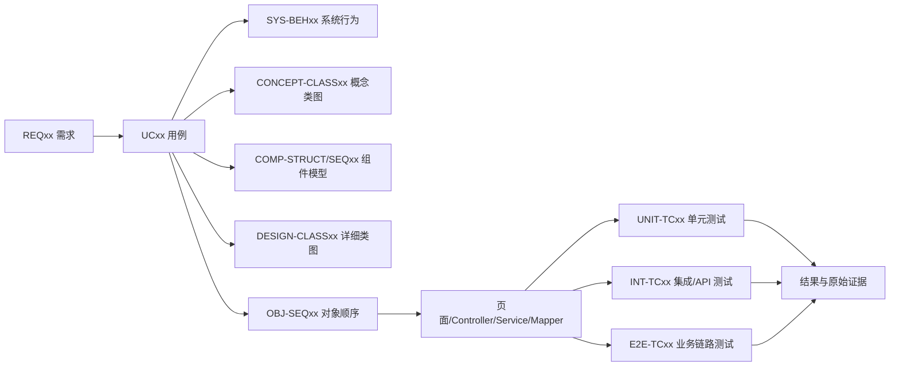

# Kinda Goods 需求追溯矩阵

> 基线日期：2026-08-28
> 范围：`REQ01`–`REQ25` / `UC01`–`UC25`
> 结果口径：只有仓库中存在可核对的原始报告或运行记录时才写“通过”；“部分”表示已有相关测试但缺少该用例完整主流程或异常分支；“待补”表示没有找到专项自动化证据。

## 1 对应关系

## 2 全量追溯表

| 需求 / 用例 | 六类图模型 | 主要代码模块 | 测试编号与现有测试 | 结果 / 证据 |
|---|---|---|---|---|
| REQ01 / UC01 注册、登录和鉴权 | SYS-BEH01 / CONCEPT-CLASS01 / COMP-STRUCT01 / COMP-SEQ01 / DESIGN-CLASS01 / OBJ-SEQ01 | `LoginView.vue`、`Register.vue`；`AuthController`、`AuthServiceImpl`、`JwtAuthInterceptor` | UNIT-TC01-001 `AuthServiceImplTest` 3 项；INT-TC01-001 `RealtimeHandshakeInterceptorTest` 的 Token 分支；E2E-TC01-001 `frontend/e2e/domain-a/uc01-auth.spec.ts` | **LOCAL_E2E_PASS**：已归档 Playwright JSON，1/1 通过、unexpected 0；路径 `../../04_tests/UC01/evidence/playwright-results.json`。最新 main 全量 E2E CI 同时通过：https://github.com/Isabella-Apus/SEGroup8/actions/runs/33185345952/job/98897601611 |
| REQ02 / UC02 资料和地址 | SYS-BEH02 / CONCEPT-CLASS02 / COMP-STRUCT02 / COMP-SEQ02 / DESIGN-CLASS02 / OBJ-SEQ02 | `Profile.vue`、`AddressManager.vue`；`UserController`、`UserServiceImpl`、`AddressMapper` | UNIT-TC02-001 `UserServiceImplTest` 3 项，含默认地址和越权删除；E2E-TC02-001 `frontend/e2e/domain-a/uc02-profile-address.spec.ts` | **LOCAL_E2E_PASS**：已归档 Playwright JSON，1/1 通过、unexpected 0；路径 `../../04_tests/UC02/evidence/playwright-results.json`。最新 main 全量 E2E CI 同时通过：https://github.com/Isabella-Apus/SEGroup8/actions/runs/33185345952/job/98897601611 |
| REQ03 / UC03 商家申请 | SYS-BEH03 / CONCEPT-CLASS03 / COMP-STRUCT03 / COMP-SEQ03 / DESIGN-CLASS03 / OBJ-SEQ03 | `MerchantApplyView.vue`、`AdminMerchantReviewView.vue`；`MerchantApplicationServiceImpl` | UNIT-TC03-001 `MerchantApplicationServiceImplTest.approve_shouldUpgradeRoleAndInsertNotification`；E2E-TC03-001 `frontend/e2e/domain-a/uc03-merchant-application.spec.ts` | **LOCAL_E2E_PASS**：已归档 Playwright JSON，1/1 通过、unexpected 0；路径 `../../04_tests/UC03/evidence/playwright-results.json`。最新 main 全量 E2E CI 同时通过：https://github.com/Isabella-Apus/SEGroup8/actions/runs/33185345952/job/98897601611 |
| REQ04 / UC04 封禁解禁审计 | SYS-BEH04 / CONCEPT-CLASS04 / COMP-STRUCT04 / COMP-SEQ04 / DESIGN-CLASS04 / OBJ-SEQ04 | `AdminUserList.vue`；`AdminUserServiceImpl`、`AdminAuditLogServiceImpl` | UNIT-TC04-001 `AdminUserServiceImplTest` 2 项；UNIT-TC04-002 `AdminAuditLogServiceImplTest` 1 项；E2E-TC04-001 `frontend/e2e/domain-a/uc04-ban-unban.spec.ts` | **LOCAL_E2E_PASS**：已归档 Playwright JSON，1/1 通过、unexpected 0；路径 `../../04_tests/UC04/evidence/playwright-results.json`。最新 main 全量 E2E CI 同时通过：https://github.com/Isabella-Apus/SEGroup8/actions/runs/33185345952/job/98897601611 |
| REQ05 / UC05 举报拉黑信用 | SYS-BEH05 / CONCEPT-CLASS05 / COMP-STRUCT05 / COMP-SEQ05 / DESIGN-CLASS05 / OBJ-SEQ05 | `CreditView.vue`、`AdminReportView.vue`；`ReportBlockServiceImpl`、`CreditServiceImpl` | E2E-TC05-001 举报审核与信用分；INT-TC05-001 拉黑权限；E2E-TC05-001 `frontend/e2e/domain-a/uc05-governance.spec.ts` | **LOCAL_E2E_PASS**：已归档 Playwright JSON，1/1 通过、unexpected 0；路径 `../../04_tests/UC05/evidence/playwright-results.json`。最新 main 全量 E2E CI 同时通过：https://github.com/Isabella-Apus/SEGroup8/actions/runs/33185345952/job/98897601611 |
| REQ06 / UC06 搜索筛选详情 | SYS-BEH06 / CONCEPT-CLASS06 / COMP-STRUCT06 / COMP-SEQ06 / DESIGN-CLASS06 / OBJ-SEQ06 | `ProductListView.vue`、`ProductDetailView.vue`；`CatalogController`、`CatalogService` | E2E-TC06-001 `t0601_combinedSearchAndPublicDetail`；E2E-TC06-002 `t0602_filtersSortsEmptyAndExceptionPaths`；E2E-TC06-001 `frontend/e2e/domain-b/uc06-catalog.spec.ts` | **CI_E2E_PASS / LOCAL_ARTIFACT_MISSING**：服务/API 原始结果已归档；最新 main 的全 UC Playwright Job 通过（https://github.com/Isabella-Apus/SEGroup8/actions/runs/33185345952/job/98897601611），但仓库未保存本用例独立 Playwright JSON。 |
| REQ07 / UC07 卖家商品生命周期 | SYS-BEH07 / CONCEPT-CLASS07 / COMP-STRUCT07 / COMP-SEQ07 / DESIGN-CLASS07 / OBJ-SEQ07 | `SellerProductList.vue`、`SellerProductEdit.vue`；`ProductController`、`ProductServiceImpl` | E2E-TC07-001~04 `CatalogApiAndE2ETest` 的 UC07 场景；UNIT-TC07-001 `ProductServiceImplTest`；E2E-TC07-001 `frontend/e2e/domain-b/uc07-product-lifecycle.spec.ts` | **CI_E2E_PASS / LOCAL_ARTIFACT_MISSING**：服务/API 原始结果已归档；最新 main 的全 UC Playwright Job 通过（https://github.com/Isabella-Apus/SEGroup8/actions/runs/33185345952/job/98897601611），但仓库未保存本用例独立 Playwright JSON。 |
| REQ08 / UC08 店铺设置装修 | SYS-BEH08 / CONCEPT-CLASS08 / COMP-STRUCT08 / COMP-SEQ08 / DESIGN-CLASS08 / OBJ-SEQ08 | `PublicShopView.vue`、`SellerShopSetting.vue`、`SellerShopDecoration.vue`；`ShopServiceImpl` | E2E-TC08-001~03 `ShopApiAndE2ETest`；E2E-TC08-001 `frontend/e2e/domain-b/uc08-shop.spec.ts` | **CI_E2E_PASS / LOCAL_ARTIFACT_MISSING**：服务/API 原始结果已归档；最新 main 的全 UC Playwright Job 通过（https://github.com/Isabella-Apus/SEGroup8/actions/runs/33185345952/job/98897601611），但仓库未保存本用例独立 Playwright JSON。 |
| REQ09 / UC09 商品风险审核 | SYS-BEH09 / CONCEPT-CLASS09 / COMP-STRUCT09 / COMP-SEQ09 / DESIGN-CLASS09 / OBJ-SEQ09 | `AdminProductRiskAuditView.vue`；`ProductRiskAuditServiceImpl` | E2E-TC09-001~03 `RiskApiAndE2ETest`；E2E-TC09-001 `frontend/e2e/domain-b/uc09-risk-audit.spec.ts` | **CI_E2E_PASS / LOCAL_ARTIFACT_MISSING**：服务/API 原始结果已归档；最新 main 的全 UC Playwright Job 通过（https://github.com/Isabella-Apus/SEGroup8/actions/runs/33185345952/job/98897601611），但仓库未保存本用例独立 Playwright JSON。 |
| REQ10 / UC10 浏览搜索热词 | SYS-BEH10 / CONCEPT-CLASS10 / COMP-STRUCT10 / COMP-SEQ10 / DESIGN-CLASS10 / OBJ-SEQ10 | `BrowseHistoryView.vue`；`SearchBehaviorServiceImpl`、`BrowseHistoryServiceImpl` | E2E-TC10-001~04 `BehaviorApiAndE2ETest`；E2E-TC10-001 `frontend/e2e/domain-b/uc10-behavior.spec.ts` | **CI_E2E_PASS / LOCAL_ARTIFACT_MISSING**：服务/API 原始结果已归档；最新 main 的全 UC Playwright Job 通过（https://github.com/Isabella-Apus/SEGroup8/actions/runs/33185345952/job/98897601611），但仓库未保存本用例独立 Playwright JSON。 |
| REQ11 / UC11 购物车结算拆单 | SYS-BEH11 / CONCEPT-CLASS11 / COMP-STRUCT11 / COMP-SEQ11 / DESIGN-CLASS11 / OBJ-SEQ11 | `CartView.vue`；`OrderController`、`OrderServiceImpl` | UNIT-TC11-001 `payMyOrder_shouldSplitCartItemsIntoIndependentPaidOrders`；E2E-TC11-001 `frontend/e2e/domain-c/uc11-checkout-order.spec.ts` | **LOCAL_E2E_PASS**：已归档 Playwright JSON，1/1 通过、unexpected 0；路径 `../../04_tests/UC11/evidence/raw-reports/playwright/playwright-results.json`。最新 main 全量 E2E CI 同时通过：https://github.com/Isabella-Apus/SEGroup8/actions/runs/33185345952/job/98897601611 |
| REQ12 / UC12 支付取消 | SYS-BEH12 / CONCEPT-CLASS12 / COMP-STRUCT12 / COMP-SEQ12 / DESIGN-CLASS12 / OBJ-SEQ12 | `OrderView.vue`；`OrderServiceImpl`、`IdempotencyInterceptor` | UNIT-TC12-001 `cancelMyOrder_shouldRestoreStock...`；UNIT-TC12-002 `IdempotencyInterceptorTest` 3 项；E2E-TC12-001 `frontend/e2e/domain-c/uc12-pay-cancel.spec.ts` | **LOCAL_E2E_PASS**：已归档 Playwright JSON，1/1 通过、unexpected 0；路径 `../../04_tests/UC12/evidence/raw-reports/playwright/playwright-results.json`。最新 main 全量 E2E CI 同时通过：https://github.com/Isabella-Apus/SEGroup8/actions/runs/33185345952/job/98897601611 |
| REQ13 / UC13 发货物流收货 | SYS-BEH13 / CONCEPT-CLASS13 / COMP-STRUCT13 / COMP-SEQ13 / DESIGN-CLASS13 / OBJ-SEQ13 | `MerchantOrdersView.vue`、`OrderDetailView.vue`；`LogisticsServiceImpl`、`OrderServiceImpl` | UNIT-TC13-001 `shipSellerOrder_shouldPersistNotificationForBuyer`；INT-TC13-001 `deliveredToAutoConfirmShouldSettle...`；E2E-TC13-001 `frontend/e2e/domain-c/uc13-fulfillment.spec.ts` | **LOCAL_E2E_PASS**：已归档 Playwright JSON，1/1 通过、unexpected 0；路径 `../../04_tests/UC13/evidence/raw-reports/playwright/playwright-results.json`。最新 main 全量 E2E CI 同时通过：https://github.com/Isabella-Apus/SEGroup8/actions/runs/33185345952/job/98897601611 |
| REQ14 / UC14 退款退货仲裁 | SYS-BEH14 / CONCEPT-CLASS14 / COMP-STRUCT14 / COMP-SEQ14 / DESIGN-CLASS14 / OBJ-SEQ14 | `AfterSaleView.vue`、`AdminOrderView.vue`；`OrderServiceImpl`、`AdminOrderController` | INT-TC14-001 `buyerApply_thenAdminApprove_thenLogsShouldExist`；INT-TC14-002 `refundSplitShouldHandleOnlyRefundAndTimeoutAutoRefund`；WebMvc 3 项；E2E-TC14-001 `frontend/e2e/domain-c/uc14-after-sale.spec.ts` | **LOCAL_E2E_PASS**：已归档 Playwright JSON，1/1 通过、unexpected 0；路径 `../../04_tests/UC14/evidence/raw-reports/playwright/playwright-results.json`。最新 main 全量 E2E CI 同时通过：https://github.com/Isabella-Apus/SEGroup8/actions/runs/33185345952/job/98897601611 |
| REQ15 / UC15 评价追评回复 | SYS-BEH15 / CONCEPT-CLASS15 / COMP-STRUCT15 / COMP-SEQ15 / DESIGN-CLASS15 / OBJ-SEQ15 | `MyReviewsView.vue`、`MerchantReviewsView.vue`；`OrderController`、`OrderServiceImpl`、`ReviewController`、`ReviewMapper` | E2E-TC15-001 首评追评回复；UNIT-TC15-001 非订单方与重复操作；E2E-TC15-001 `frontend/e2e/domain-c/uc15-review.spec.ts` | **LOCAL_E2E_PASS**：已归档 Playwright JSON，1/1 通过、unexpected 0；路径 `../../04_tests/UC15/evidence/raw-reports/playwright/playwright-results.json`。最新 main 全量 E2E CI 同时通过：https://github.com/Isabella-Apus/SEGroup8/actions/runs/33185345952/job/98897601611 |
| REQ16 / UC16 二手发布管理 | SYS-BEH16 / CONCEPT-CLASS16 / COMP-STRUCT16 / COMP-SEQ16 / DESIGN-CLASS16 / OBJ-SEQ16 | `SecondhandPublishView.vue`、`SecondhandSellerView.vue`；`SecondhandProductServiceImpl` | UNIT-TC16-001 发布字段校验；UNIT-TC16-002 本人列表；UI-TC16-01 发布和管理走查；E2E-TC16-001 `frontend/e2e/domain-d/uc16-product-management.spec.ts` | **LOCAL_E2E_PASS**：已归档 Playwright JSON，1/1 通过、unexpected 0；路径 `../../04_tests/UC16/evidence/raw-reports/playwright/playwright-results.json`。最新 main 全量 E2E CI 同时通过：https://github.com/Isabella-Apus/SEGroup8/actions/runs/33185345952/job/98897601611 |
| REQ17 / UC17 二手直接购买 | SYS-BEH17 / CONCEPT-CLASS17 / COMP-STRUCT17 / COMP-SEQ17 / DESIGN-CLASS17 / OBJ-SEQ17 | `SecondhandDetailView.vue`、`SecondhandOrdersView.vue`；`SecondhandProductServiceImpl`、`OrderServiceImpl` | UNIT-TC17-001 自购拦截；UNIT-TC17-002 购买成功建单；UI-TC17-01 购买支付走查；E2E-TC17-001 `frontend/e2e/domain-d/uc17-direct-purchase.spec.ts` | **LOCAL_E2E_PASS**：已归档 Playwright JSON，1/1 通过、unexpected 0；路径 `../../04_tests/UC17/evidence/raw-reports/playwright/playwright-results.json`。最新 main 全量 E2E CI 同时通过：https://github.com/Isabella-Apus/SEGroup8/actions/runs/33185345952/job/98897601611 |
| REQ18 / UC18 二手议价 | SYS-BEH18 / CONCEPT-CLASS18 / COMP-STRUCT18 / COMP-SEQ18 / DESIGN-CLASS18 / OBJ-SEQ18 | `SecondhandDetailView.vue`、`ChatView.vue`；`SecondhandTradeServiceImpl` | UNIT-TC18-001 同意建单；UNIT-TC18-002 拒绝；UNIT-TC18-003 重复处理；UI-TC18-01；E2E-TC18-001 `frontend/e2e/domain-d/uc18-bargain.spec.ts` | **LOCAL_E2E_PASS**：已归档 Playwright JSON，1/1 通过、unexpected 0；路径 `../../04_tests/UC18/evidence/raw-reports/playwright/playwright-results.json`。最新 main 全量 E2E CI 同时通过：https://github.com/Isabella-Apus/SEGroup8/actions/runs/33185345952/job/98897601611 |
| REQ19 / UC19 二手拍卖 | SYS-BEH19 / CONCEPT-CLASS19 / COMP-STRUCT19 / COMP-SEQ19 / DESIGN-CLASS19 / OBJ-SEQ19 | `SecondhandDetailView.vue`、`SecondhandSellerView.vue`；`SecondhandTradeServiceImpl` | UNIT-TC19-001 低价；UNIT-TC19-002 结束后出价；UNIT-TC19-003 结算幂等；INT-TC19-001 历史拍卖后新建；E2E-TC19-001 `frontend/e2e/domain-d/uc19-auction.spec.ts` | **LOCAL_E2E_PASS**：已归档 Playwright JSON，1/1 通过、unexpected 0；路径 `../../04_tests/UC19/evidence/raw-reports/playwright/playwright-results.json`。最新 main 全量 E2E CI 同时通过：https://github.com/Isabella-Apus/SEGroup8/actions/runs/33185345952/job/98897601611 |
| REQ20 / UC20 二手履约 | SYS-BEH20 / CONCEPT-CLASS20 / COMP-STRUCT20 / COMP-SEQ20 / DESIGN-CLASS20 / OBJ-SEQ20 | `SecondhandSoldView.vue`、`SecondhandOrdersView.vue`；`OrderServiceImpl`、`LogisticsServiceImpl` | INT-TC20-001 `secondhandSellerCanViewShipAndPushLogistics`；UI-TC20-01 发货收货走查；E2E-TC20-001 `frontend/e2e/domain-d/uc20-fulfillment.spec.ts` | **LOCAL_E2E_PASS**：已归档 Playwright JSON，1/1 通过、unexpected 0；路径 `../../04_tests/UC20/evidence/raw-reports/playwright/playwright-results.json`。最新 main 全量 E2E CI 同时通过：https://github.com/Isabella-Apus/SEGroup8/actions/runs/33185345952/job/98897601611 |
| REQ21 / UC21 优惠券生命周期 | SYS-BEH21 / CONCEPT-CLASS21 / COMP-STRUCT21 / COMP-SEQ21 / DESIGN-CLASS21 / OBJ-SEQ21 | `SellerVoucher.vue`、`AdminVoucherView.vue`；`VoucherController`、`VoucherService` | E2E-TC21-001 `uc21SellerAndAdminManageVoucherLifecycle`；UNIT-TC21-001 `VoucherServiceTest`；E2E-TC21-001 `frontend/e2e/domain-e/uc21-voucher-lifecycle.spec.ts` | **LOCAL_E2E_PASS**：已归档 Playwright JSON，1/1 通过、unexpected 0；路径 `../../04_tests/UC21/evidence/raw-reports/playwright/playwright-results.json`。最新 main 全量 E2E CI 同时通过：https://github.com/Isabella-Apus/SEGroup8/actions/runs/33185345952/job/98897601611 |
| REQ22 / UC22 领券核销 | SYS-BEH22 / CONCEPT-CLASS22 / COMP-STRUCT22 / COMP-SEQ22 / DESIGN-CLASS22 / OBJ-SEQ22 | `CouponCenterView.vue`、`ProductDetailView.vue`；`VoucherService`、`OrderServiceImpl` | E2E-TC22-001 `uc22BuyerClaimsAndUsesVoucherAtCheckout`；UNIT-TC22-001 店铺小计折扣；E2E-TC22-001 `frontend/e2e/domain-e/uc22-claim-checkout.spec.ts` | **LOCAL_E2E_PASS**：已归档 Playwright JSON，1/1 通过、unexpected 0；路径 `../../04_tests/UC22/evidence/raw-reports/playwright/playwright-results.json`。最新 main 全量 E2E CI 同时通过：https://github.com/Isabella-Apus/SEGroup8/actions/runs/33185345952/job/98897601611 |
| REQ23 / UC23 钱包账户结算 | SYS-BEH23 / CONCEPT-CLASS23 / COMP-STRUCT23 / COMP-SEQ23 / DESIGN-CLASS23 / OBJ-SEQ23 | `MerchantFinanceView.vue`；`FinanceController`、`EscrowSettlementService` | E2E-TC23-001 `uc23RechargeWalletBusinessAccountAndRecords`；UNIT-TC23-001~02 结算策略；E2E-TC23-001 `frontend/e2e/domain-e/uc23-wallet-settlement.spec.ts` | **LOCAL_E2E_PASS**：已归档 Playwright JSON，1/1 通过、unexpected 0；路径 `../../04_tests/UC23/evidence/raw-reports/playwright/playwright-results.json`。最新 main 全量 E2E CI 同时通过：https://github.com/Isabella-Apus/SEGroup8/actions/runs/33185345952/job/98897601611 |
| REQ24 / UC24 会话消息 | SYS-BEH24 / CONCEPT-CLASS24 / COMP-STRUCT24 / COMP-SEQ24 / DESIGN-CLASS24 / OBJ-SEQ24 | `ChatView.vue`；`ChatController`、`ChatServiceImpl` | E2E-TC24-001 `uc24ConversationAndMessageArePersisted`；UNIT-TC24-001 会话创建；E2E-TC24-001 `frontend/e2e/domain-e/uc24-chat.spec.ts` | **LOCAL_E2E_PASS**：已归档 Playwright JSON，1/1 通过、unexpected 0；路径 `../../04_tests/UC24/evidence/raw-reports/playwright/playwright-results.json`。最新 main 全量 E2E CI 同时通过：https://github.com/Isabella-Apus/SEGroup8/actions/runs/33185345952/job/98897601611 |
| REQ25 / UC25 通知实时推送 | SYS-BEH25 / CONCEPT-CLASS25 / COMP-STRUCT25 / COMP-SEQ25 / DESIGN-CLASS25 / OBJ-SEQ25 | `NotificationView.vue`、`realtimeClient.js`；`NotificationServiceImpl`、`RealtimeWebSocketHandler` | E2E-TC25-001 `uc25NotificationReadAndRealtimePush`；UNIT-TC25-001 握手有效/无效 Token；E2E-TC25-001 `frontend/e2e/domain-e/uc25-notification.spec.ts` | **LOCAL_E2E_PASS**：已归档 Playwright JSON，1/1 通过、unexpected 0；路径 `../../04_tests/UC25/evidence/raw-reports/playwright/playwright-results.json`。最新 main 全量 E2E CI 同时通过：https://github.com/Isabella-Apus/SEGroup8/actions/runs/33185345952/job/98897601611 |

## 3 测试证据汇总

| 范围 | 当前可核验证据 | 结论 |
|---|---|---|
| UC01–UC05 | 每个 UC 均有独立 Playwright JSON，1/1 通过 | 本地证据归档完整 |
| UC06–UC10 | 服务/API 结果已归档；仓库无独立 Playwright JSON | 最新 main 全 UC E2E CI 通过，但需补下载/归档每 UC 浏览器原始产物 |
| UC11–UC25 | 每个 UC 均有独立 Playwright JSON，1/1 通过 | 本地证据归档完整 |
| 静态覆盖门禁 | 25/25 均存在规范命名的 Playwright spec | 只证明测试入口齐全，不单独证明运行通过 |
| 最新 main CI | `09db0eed` 的 Kinda Goods CI/CD run 成功；后端、前端、Domain A–E、全 UC Playwright、镜像发布及 K3s 部署 jobs 成功 | CI 证据：https://github.com/Isabella-Apus/SEGroup8/actions/runs/33185345952 |

## 4 中期检查剩余缺口

| 优先级 | 缺口 | 当前状态 | Done 条件 |
|---|---|---|---|
| P0 | UC06–UC10 的独立 Playwright JSON 未进入仓库证据目录 | `CI_E2E_PASS / LOCAL_ARTIFACT_MISSING` | 从成功 CI 下载并按 UC 拆分归档，或在当前基线本地重跑并保留 JSON/日志/截图 |
| P0 | 6 个目标微服务尚未全部成为独立部署单元 | `TARGET / NOT_IMPLEMENTED` | 每个服务具备 module/JAR、Dockerfile、镜像、Helm、独立 schema/账号、契约测试和恢复证据 |
| P1 | 旧聚合文档与单 UC 文档并存 | 本分支重构处理中 | 以 `02_docs/UC01`–`UC25` 为唯一单用例来源，旧文档只读归档 |
| P1 | 中期四份总文档包含旧分支表述 | 本分支更新处理中 | 四份总文档与 `09db0eed`、当前测试证据和六服务 TARGET 状态一致 |

> 结论：25 个用例的测试入口和最新 main CI 全量 E2E 均已通过，但“全部任务完成”仍不成立，因为 UC06–UC10 的逐 UC 原始浏览器产物未归档，且六个目标业务微服务尚未全部实现与独立部署。
