# Kinda Goods 软件概要设计说明书

> 文档基线：2026-08-28，代码基线 `09db0eed`
> 覆盖范围：`UC01`–`UC25`
> 编号规则：组件结构图使用 `COMP-STRUCTxx`，组件顺序图使用 `COMP-SEQxx`。
> 状态口径：`CURRENT` 表示仓库中可运行实现，`TARGET` 表示后续微服务边界。目标设计不得作为已部署证据。

## 1 架构与职责

前端使用 Vue 3，原系统后端使用 Spring Boot、MyBatis-Plus 和 MySQL。当前 `microservices/` 已实现 Domain B 的 `catalog-service`、`shop-service`、`risk-service` 和 `behavior-service` 四个独立原型模块；其他业务仍由单体承载。目标架构收敛为 6 个可独立构建、测试和部署的业务服务。API 网关、数据库和前端不计入业务微服务数量。

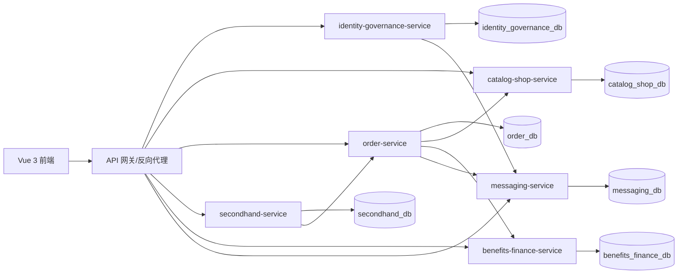

## 2 组件边界

| 组件 | 主要职责 | 核心数据 |
|---|---|---|
| `identity-governance-service` | UC01–UC05：身份、资料、商家申请、封禁、举报拉黑和信用治理 | 身份治理相关表 |
| `catalog-shop-service` | UC06–UC10：类目商品、店铺、风险审核和行为统计 | 目录、商品、店铺、风险与行为表 |
| `order-service` | UC11–UC15、UC20：新品订单、支付、物流、售后、评价和履约 | 订单、明细、售后、物流与评价表 |
| `secondhand-service` | UC16–UC19：二手发布、直购入口、议价与拍卖 | 二手商品、议价与拍卖表 |
| `benefits-finance-service` | UC21–UC23：优惠券、钱包和资金结算 | 券、余额与资金流水表 |
| `messaging-service` | UC24–UC25：会话、消息、通知与实时推送 | 会话、消息与通知表 |

服务只能写自己管理的表。跨服务读取使用 API，跨服务写操作使用 API 或事件；调用失败时由发起方回滚、重试或记录待补偿任务。详细边界、接口和表归属分别见 `../architecture/microservice-boundaries.md`、`../architecture/service-api-catalog.md` 和 `../architecture/database-ownership.md`。当前六个目标服务尚未全部实现，不能据此声称微服务阶段完成。

## 3 分用例组件顺序模型

每个用例另有与本节顺序图配套的组件结构图，统一位于 `../UCxx/component.mmd`；顺序图的独立 Mermaid 源位于 `../UCxx/component-sequence.mmd`。结构图表达职责和依赖，顺序图表达一次场景交互，两者不互相替代。

## UC01 注册、登录和角色鉴权

### COMP-SEQ01

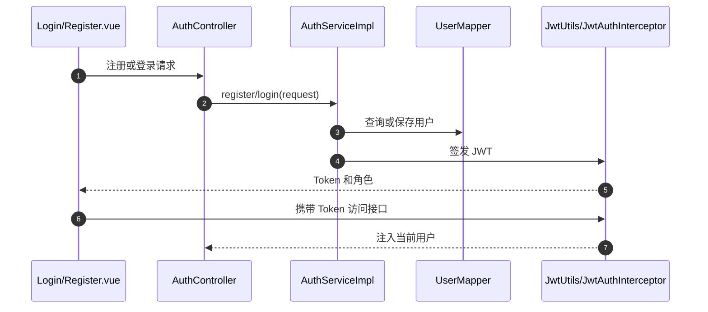

## UC02 用户资料和地址

### COMP-SEQ02

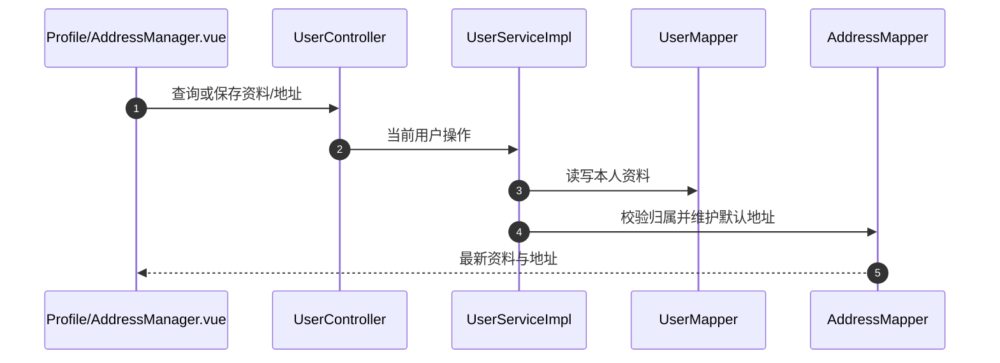

## UC03 商家申请、通过和拒绝

### COMP-SEQ03

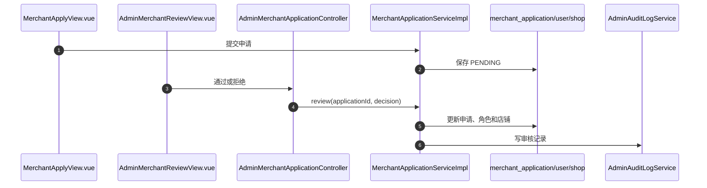

## UC04 用户封禁、解禁及审计

### COMP-SEQ04

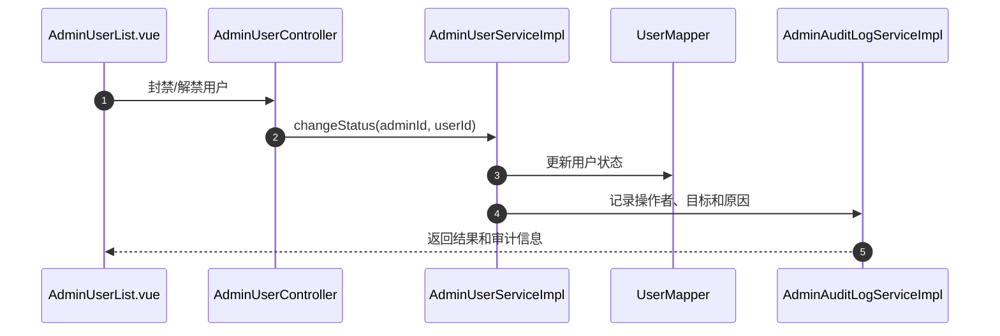

## UC05 举报、拉黑、信用分和审计

### COMP-SEQ05

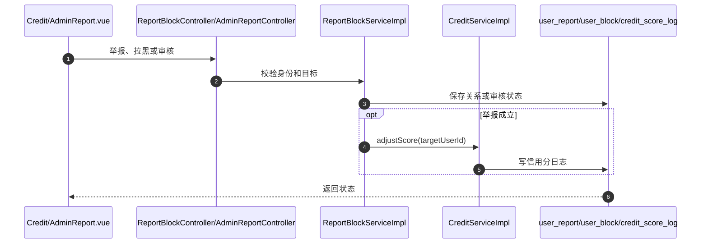

## UC06 商品列表、搜索筛选和详情

### COMP-SEQ06

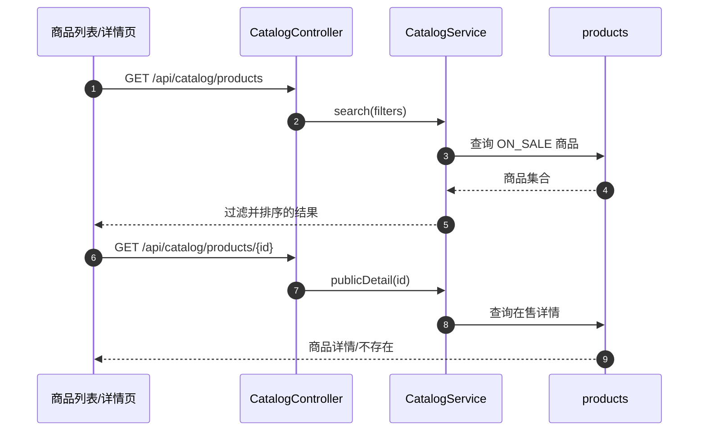

## UC07 卖家商品新增、编辑、上下架和库存调整

### COMP-SEQ07

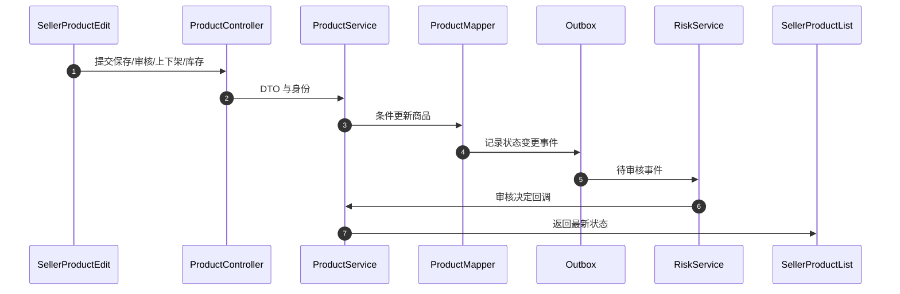

## UC08 店铺查看、设置和装修

### COMP-SEQ08

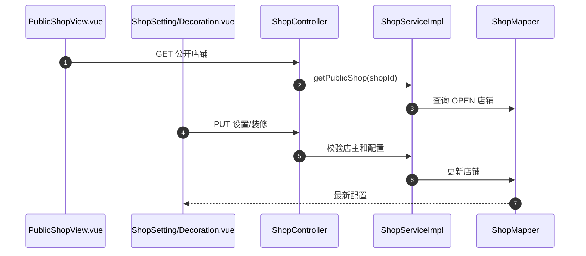

## UC09 商品风险审核

### COMP-SEQ09

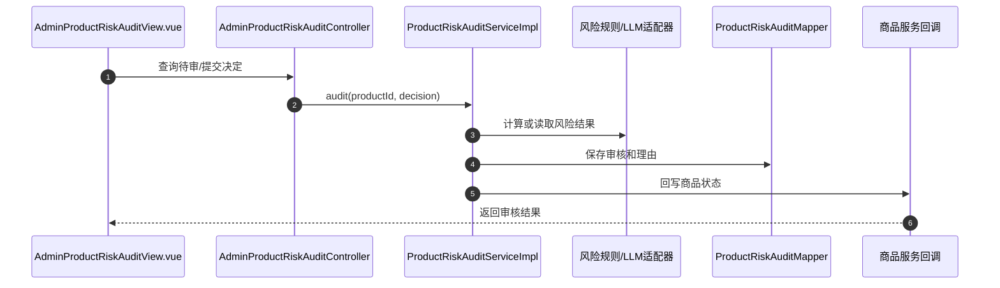

## UC10 浏览记录、搜索历史和热词

### COMP-SEQ10

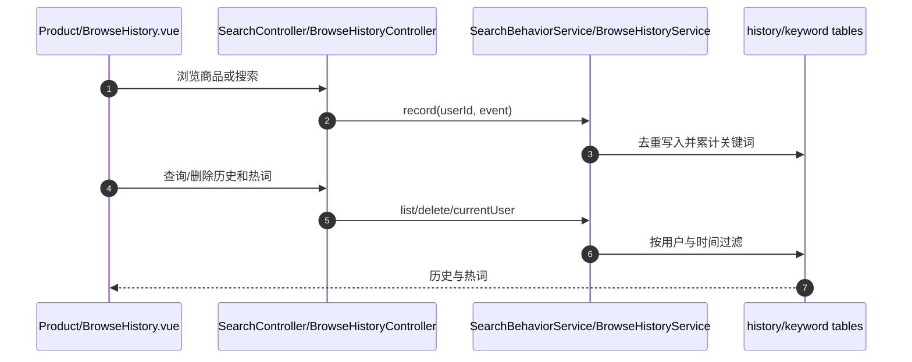

## UC11 购物车结算和订单拆分

### COMP-SEQ11

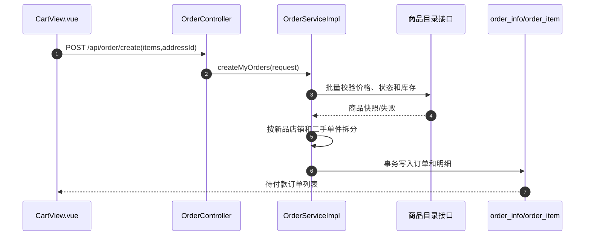

## UC12 支付和取消

### COMP-SEQ12

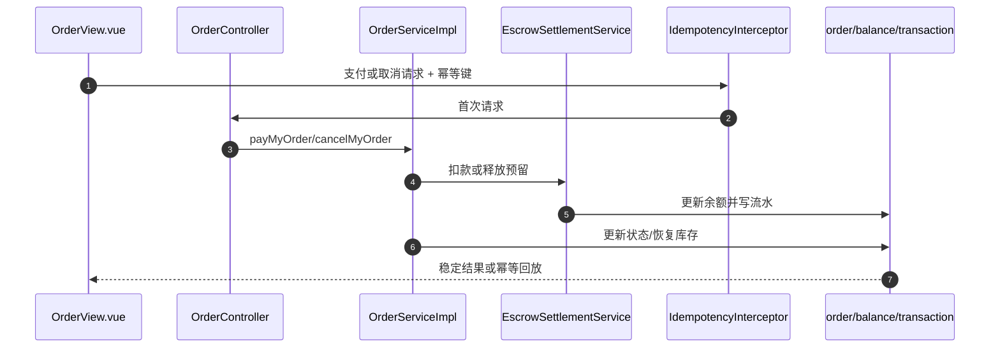

## UC13 发货、物流、收货和完成

### COMP-SEQ13

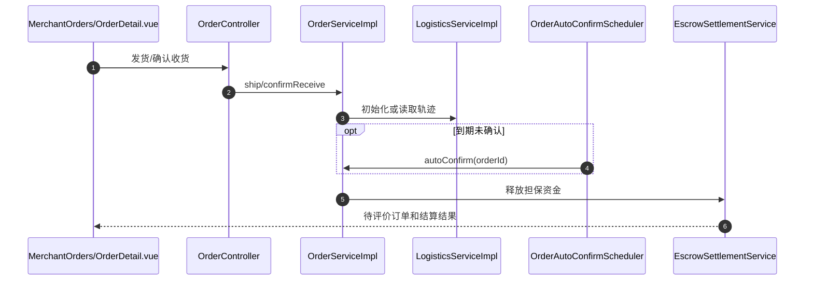

## UC14 退款、退货及仲裁

### COMP-SEQ14

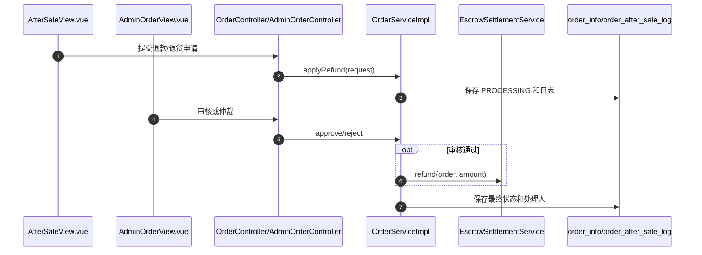

## UC15 评价、追评和卖家回复

### COMP-SEQ15

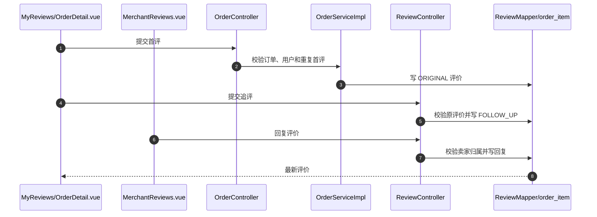

## UC16 二手商品发布和管理

### COMP-SEQ16

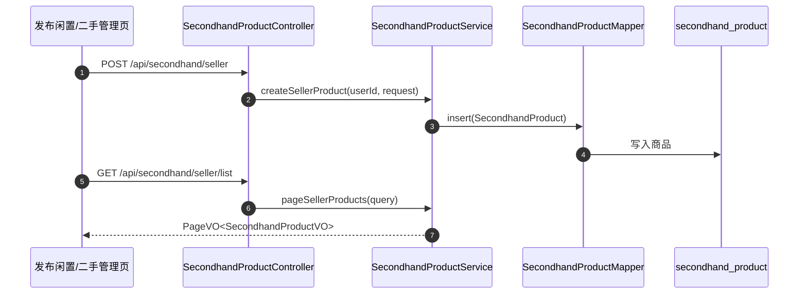

## UC17 二手直接购买及禁止自购

### COMP-SEQ17

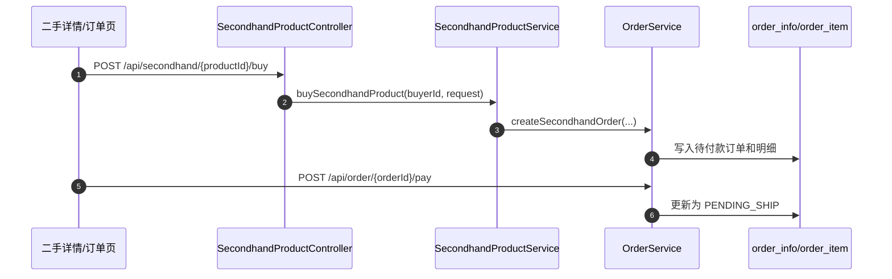

## UC18 议价申请、确认和拒绝

### COMP-SEQ18

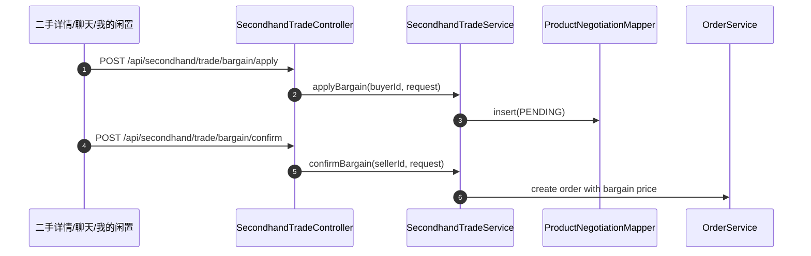

## UC19 拍卖、出价和结束

### COMP-SEQ19

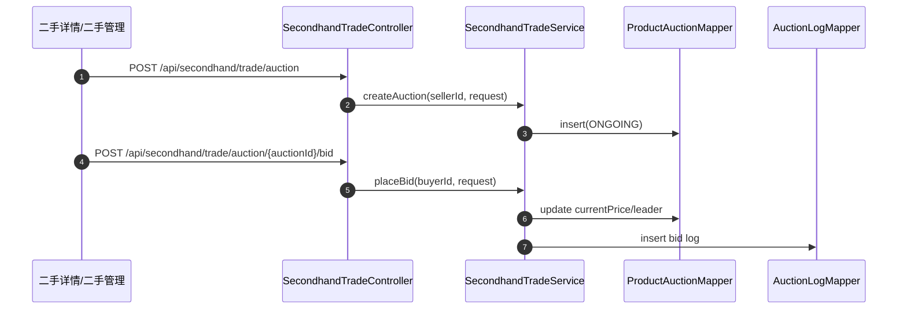

## UC20 二手成交后的订单履约

### COMP-SEQ20

```mermaid
sequenceDiagram
  autonumber
  participant UI as 二手卖出/订单页
  participant OrderAPI as OrderController
  participant OrderSvc as OrderService
  participant Logistics as LogisticsService
  participant DB as order_info/logistics_trace
  UI->>OrderAPI: GET /api/order/seller/list?productType=SECONDHAND
  OrderAPI->>OrderSvc: pageSellerOrders(query)
  UI->>OrderAPI: POST /api/order/{orderId}/ship
  OrderAPI->>OrderSvc: shipSellerOrder(orderId, request)
  OrderSvc->>Logistics: create first trace
  OrderSvc->>DB: orderStatus=SHIPPED
  UI->>OrderAPI: POST /api/order/{orderId}/confirm-receive
  OrderSvc->>DB: orderStatus=RECEIVED
```

## UC21 卖家/管理员优惠券生命周期

### COMP-SEQ21

```mermaid
sequenceDiagram
  autonumber
  participant UI as SellerVoucher/AdminVoucher.vue
  participant API as VoucherController
  participant Svc as VoucherService
  participant Shop as ShopMapper
  participant DB as VoucherMapper
  UI->>API: 创建/编辑/关闭/删除
  API->>Svc: 传入当前用户和请求
  Svc->>Shop: 解析卖家真实店铺
  Svc->>DB: 校验所有权并写入 voucher
  DB-->>UI: 最新优惠券状态
```

## UC22 领券及结算使用

### COMP-SEQ22

```mermaid
sequenceDiagram
  autonumber
  participant UI as CouponCenter/ProductDetail.vue
  participant API as VoucherController
  participant Voucher as VoucherService
  participant Order as OrderServiceImpl
  participant DB as voucher/user_voucher/order_info
  UI->>API: 领取优惠券
  API->>Voucher: claim(userId, voucherId)
  Voucher->>DB: 写 user_voucher
  UI->>Order: 提交订单(voucherId)
  Order->>Voucher: occupyForOrder(orderContext)
  Voucher->>DB: 校验并核销
  Order->>DB: 保存优惠金额和应付金额
```

## UC23 充值、个人钱包、商家账户和结算

### COMP-SEQ23

```mermaid
sequenceDiagram
  autonumber
  participant UI as Wallet/MerchantFinance.vue
  participant API as FinanceController
  participant Svc as EscrowSettlementService
  participant Balance as BalanceMapper
  participant Tx as TransactionRecordMapper
  participant Order as OrderServiceImpl
  UI->>API: 充值或查询账户
  API->>Svc: recharge/dashboard/records
  Svc->>Balance: 乐观锁更新个人余额
  Svc->>Tx: 写充值流水
  Order->>Svc: 订单完成后结算
  Svc->>Balance: 更新个人或经营余额
  Svc->>Tx: 写关联订单流水
```

## UC24 会话和消息

### COMP-SEQ24

```mermaid
sequenceDiagram
  autonumber
  participant UI as ChatView.vue
  participant API as ChatController
  participant Svc as ChatServiceImpl
  participant Conv as ChatConversationMapper
  participant Msg as ChatMessageMapper
  participant RT as RealtimePushService
  UI->>API: 创建/查询会话
  API->>Svc: 校验参与者和来源
  Svc->>Conv: 查询或插入会话
  UI->>API: 发送消息
  API->>Svc: sendMessage(currentUser, request)
  Svc->>Msg: 持久化消息
  Svc->>RT: 推送接收者
```

## UC25 通知、已读和实时推送

### COMP-SEQ25

```mermaid
sequenceDiagram
  autonumber
  participant Biz as 订单/议价/审核模块
  participant Svc as NotificationServiceImpl
  participant DB as NotificationMapper
  participant RT as RealtimePushService
  participant WS as RealtimeWebSocketHandler
  participant UI as NotificationView.vue
  Biz->>Svc: create(userId, event)
  Svc->>DB: INSERT notification
  Svc->>RT: pushToUser(userId)
  RT->>WS: 发送实时事件
  UI->>Svc: 查询/单条已读/全部已读
  Svc->>DB: 按当前用户更新
  DB-->>UI: 最新通知列表
```

## 4 跨组件失败处理

| 场景 | 处理方式 |
|---|---|
| 订单读取商品失败 | 终止下单并返回稳定错误码，不写订单 |
| 优惠券核销后订单保存失败 | 同一事务回滚；跨服务模式记录补偿任务并释放用户券 |
| 通知或 WebSocket 推送失败 | 核心业务继续提交，通知先落库并记录推送失败 |
| 风险审核回调商品服务失败 | 保留审核记录和回调状态，重试后按版本号更新商品 |
| 拍卖结算创建订单失败 | 保留待结算状态和冻结资金，定时任务按幂等键重试 |
| 服务超时或不可用 | 客户端收到明确的降级结果；调用方记录 TraceId 和依赖服务名 |
