# Kinda Goods 软件详细设计说明书

> 文档基线：2026-08-28，代码基线 `09db0eed`
> 覆盖范围：`UC01`–`UC25`
> 编号规则：详细设计类图使用 `DESIGN-CLASSxx`，对象顺序图使用 `OBJ-SEQxx`。
> 维护说明：对象级模型按当前单体实现和已合入测试更新；目标微服务对象边界只在架构文档中描述，不冒充已迁移代码。

## 1 分层与对象职责

- Controller 解析 HTTP 请求，读取当前用户并返回统一响应。
- Service/ServiceImpl 执行业务规则、权限判断和事务控制。
- Mapper 只访问所属业务表，不承载跨业务规则。
- DTO 承载输入，Entity 映射持久化数据，VO 承载对外结果。
- 定时任务处理自动确认、自动退款、拍卖结算和幂等记录清理。

## 2 核心类图

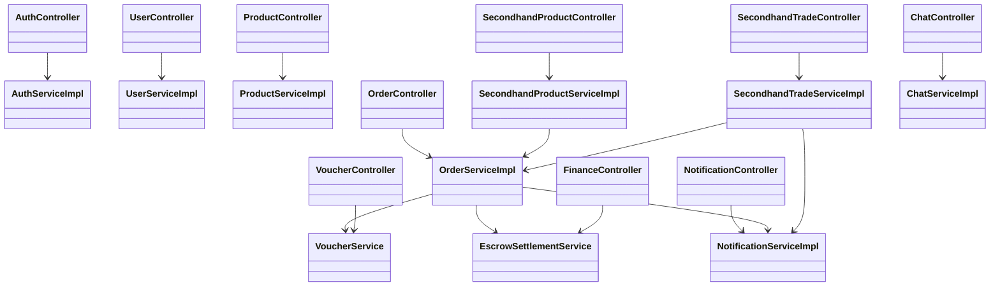

## 3 状态与事务约束

| 对象 | 主要状态/约束 |
|---|---|
| `OrderInfo` | `PENDING_PAY -> PENDING_SHIP -> SHIPPED -> RECEIVED -> COMPLETED`；取消和退款进入关闭分支；`version` 防并发覆盖 |
| `Product` | 草稿、待审核、在售、下架、驳回、归档；库存不得小于 0 |
| `SecondhandProduct` | 在售、下架、售出；条件更新避免重复购买 |
| `ProductNegotiation` | `APPLIED -> CONFIRMED/REJECTED -> USED`；确认价有有效期 |
| `ProductAuction` | `ONGOING -> ENDED/FLOW/CLOSED`；出价和结算按版本号及结算订单号幂等 |
| `UserVoucher` | 未使用、已占用/已使用、过期；订单失败需释放或回滚 |
| `Balance` | 个人余额与经营余额分列；更新与资金流水处于同一事务 |

## 4 分用例对象顺序模型

每个用例另有与本节顺序图配套的详细设计类图，统一位于 `../UCxx/object.mmd`；对象顺序图的独立 Mermaid 源位于 `../UCxx/object-sequence.mmd`。类图表达静态职责与依赖，顺序图表达对象协作。

## UC01 注册、登录和角色鉴权

### OBJ-SEQ01

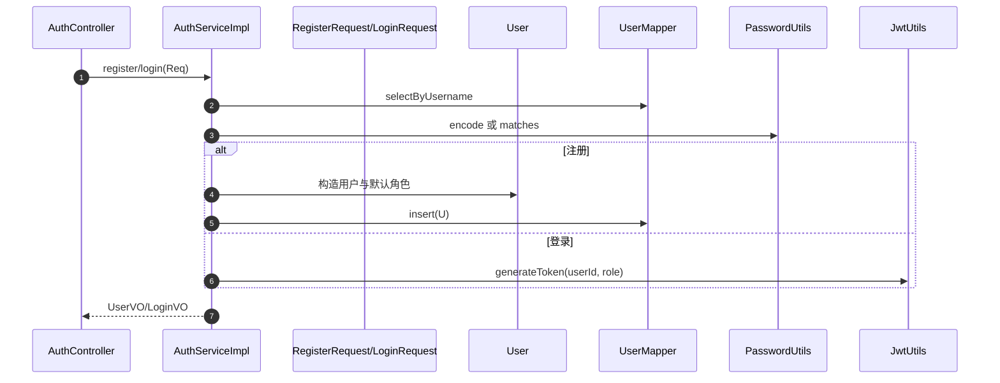

## UC02 用户资料和地址

### OBJ-SEQ02

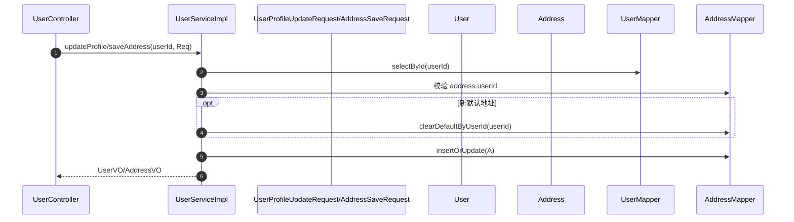

## UC03 商家申请、通过和拒绝

### OBJ-SEQ03

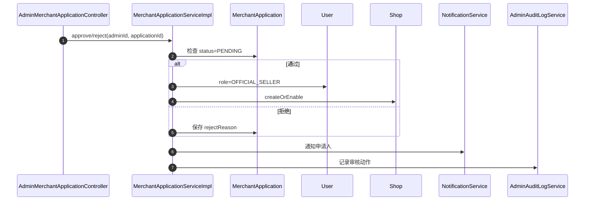

## UC04 用户封禁、解禁及审计

### OBJ-SEQ04

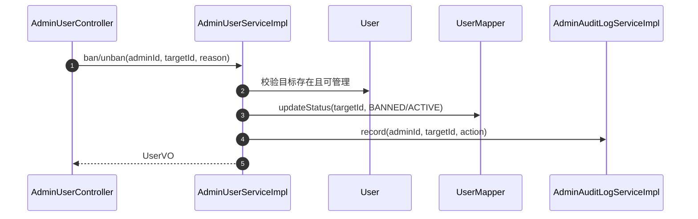

## UC05 举报、拉黑、信用分和审计

### OBJ-SEQ05

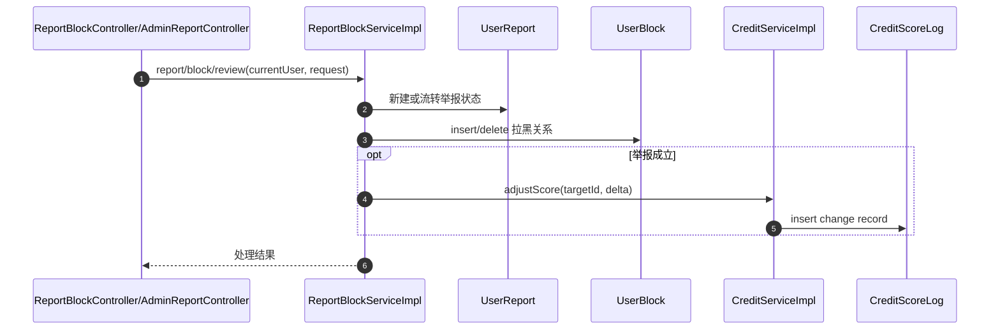

## UC06 商品列表、搜索筛选和详情

### OBJ-SEQ06

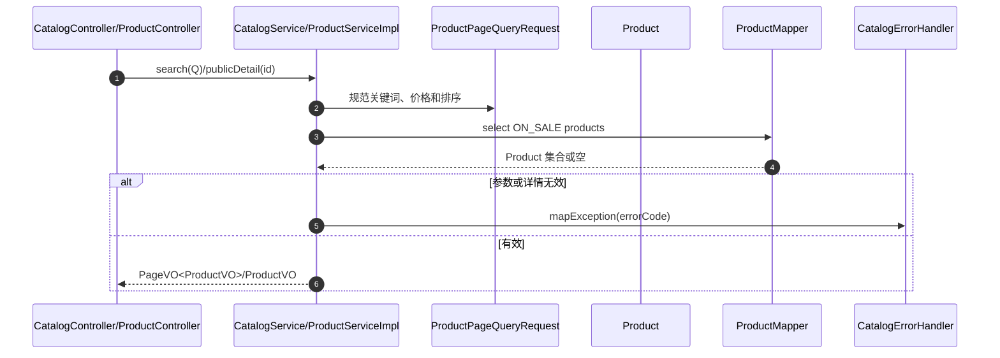

## UC07 卖家商品新增、编辑、上下架和库存调整

### OBJ-SEQ07

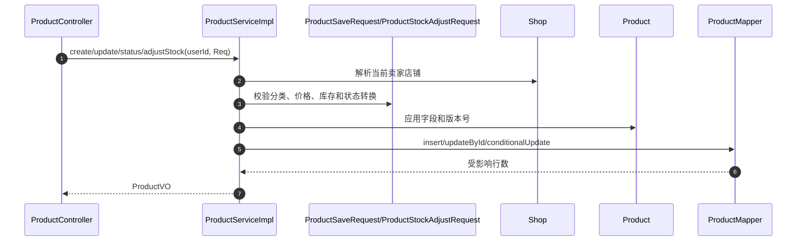

## UC08 店铺查看、设置和装修

### OBJ-SEQ08

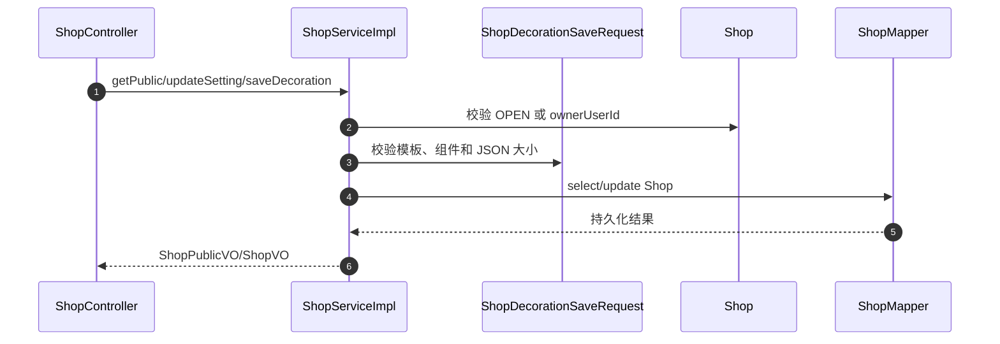

## UC09 商品风险审核

### OBJ-SEQ09

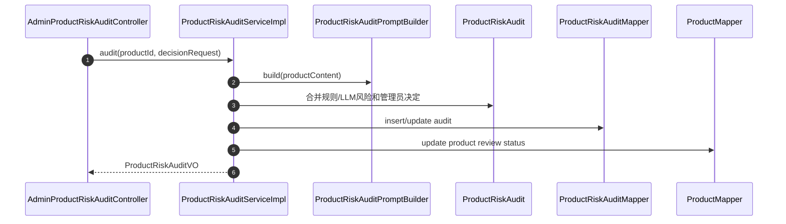

## UC10 浏览记录、搜索历史和热词

### OBJ-SEQ10

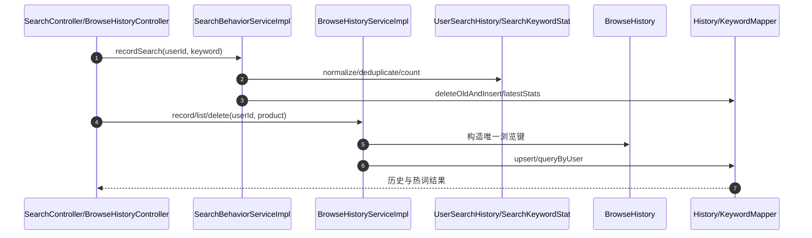

## UC11 购物车结算和订单拆分

### OBJ-SEQ11

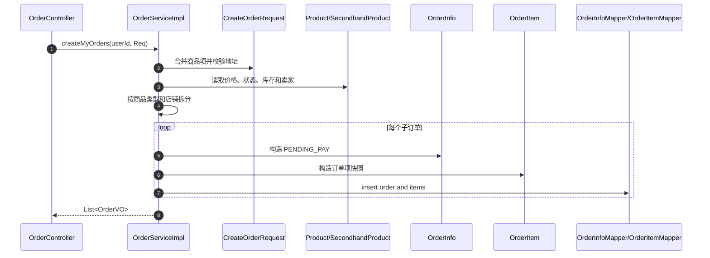

## UC12 支付和取消

### OBJ-SEQ12

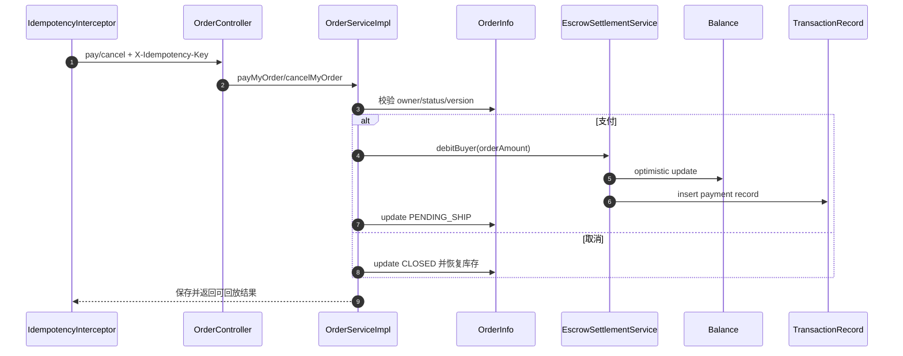

## UC13 发货、物流、收货和完成

### OBJ-SEQ13

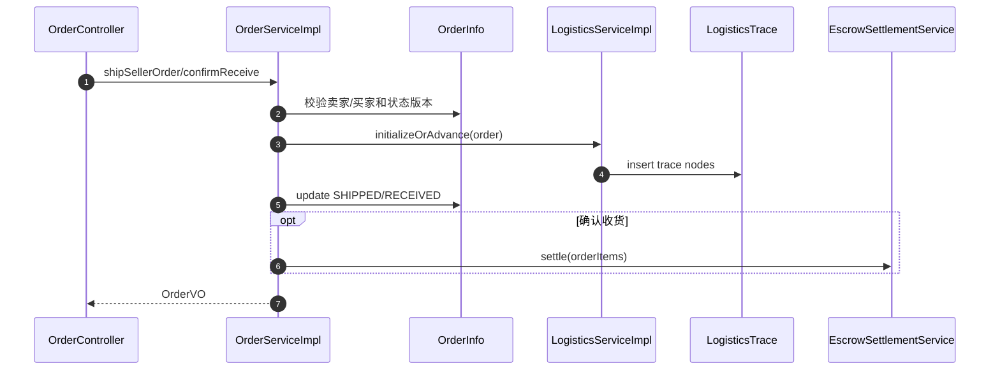

## UC14 退款、退货及仲裁

### OBJ-SEQ14

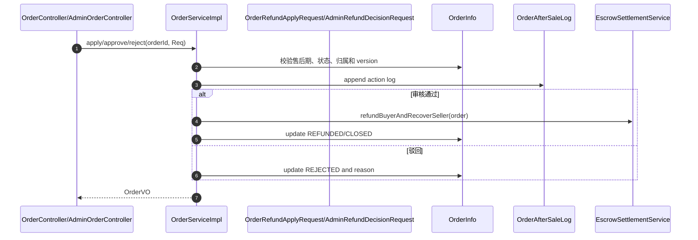

## UC15 评价、追评和卖家回复

### OBJ-SEQ15

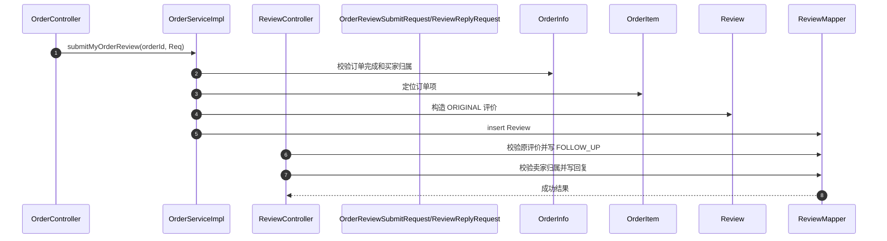

## UC16 二手商品发布和管理

### OBJ-SEQ16

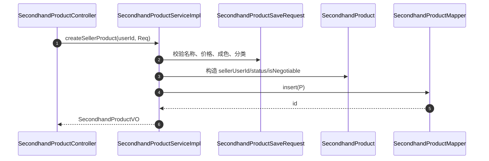

## UC17 二手直接购买及禁止自购

### OBJ-SEQ17

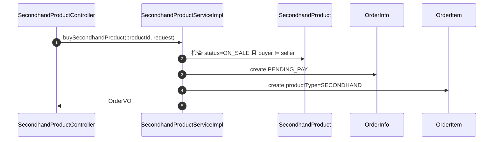

## UC18 议价申请、确认和拒绝

### OBJ-SEQ18

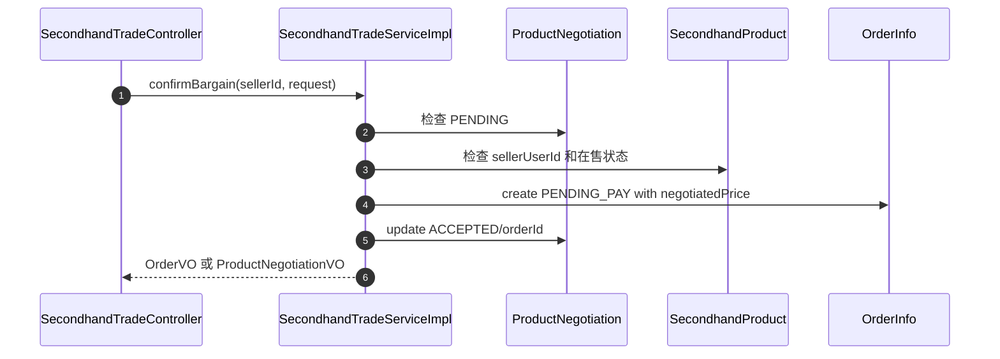

## UC19 拍卖、出价和结束

### OBJ-SEQ19

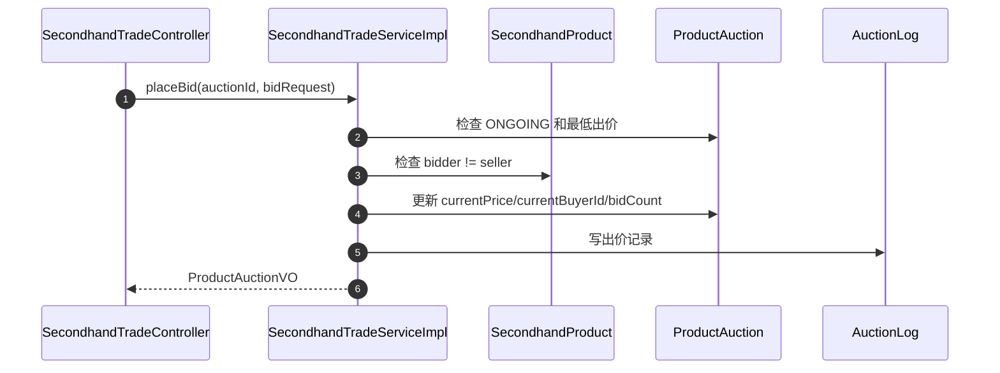

## UC20 二手成交后的订单履约

### OBJ-SEQ20

```mermaid
sequenceDiagram
  autonumber
  participant C as OrderController
  participant S as OrderServiceImpl
  participant O as OrderInfo
  participant I as OrderItem
  participant L as LogisticsTrace
  C->>S: shipSellerOrder(orderId, request)
  S->>O: 检查 PENDING_SHIP
  S->>I: 检查 seller owns SECONDHAND item
  S->>L: insert first trace
  S->>O: update SHIPPED
  C->>S: confirmReceive(orderId)
  S->>O: update RECEIVED
```

## UC21 卖家/管理员优惠券生命周期

### OBJ-SEQ21

```mermaid
sequenceDiagram
  autonumber
  participant C as VoucherController
  participant S as VoucherService
  participant Req as VoucherSaveRequest
  participant Shop as Shop
  participant V as Voucher
  participant M as VoucherMapper
  C->>S: create/update/close/delete(userId, role, Req)
  S->>Shop: 解析 sellerUserId 对应 shopId
  S->>Req: 校验面额、门槛、数量和时间
  S->>V: 校验 issuer/scope/owner/status
  S->>M: insert/update/deleteById
  S-->>C: VoucherVO
```

## UC22 领券及结算使用

### OBJ-SEQ22

```mermaid
sequenceDiagram
  autonumber
  participant C as VoucherController
  participant VS as VoucherService
  participant V as Voucher
  participant UV as UserVoucher
  participant OS as OrderServiceImpl
  participant O as OrderInfo
  C->>VS: claim(userId, voucherId)
  VS->>V: 校验状态、时间、库存和范围
  VS->>UV: insert unique user-voucher
  OS->>VS: occupyForOrder(userId, voucherId, items)
  VS->>UV: 条件更新为已使用/占用
  VS-->>OS: discountAmount
  OS->>O: 保存优惠额和应付额
```

## UC23 充值、个人钱包、商家账户和结算

### OBJ-SEQ23

```mermaid
sequenceDiagram
  autonumber
  participant C as FinanceController
  participant S as EscrowSettlementService
  participant Req as FinanceRechargeRequest
  participant B as Balance
  participant BM as BalanceMapper
  participant T as TransactionRecord
  participant TM as TransactionRecordMapper
  C->>S: recharge/dashboard/settle(userId, Req/order)
  S->>Req: 校验金额精度和范围
  S->>B: 选择 personal 或 business 字段
  S->>BM: optimisticUpdate(balance, version)
  S->>T: 构造 tradeType/relatedOrderId
  S->>TM: insert(T)
  S-->>C: FinanceDashboardVO/FinanceRecordVO
```

## UC24 会话和消息

### OBJ-SEQ24

```mermaid
sequenceDiagram
  autonumber
  participant C as ChatController
  participant S as ChatServiceImpl
  participant Req as ChatConversationCreateRequest/ChatMessageSendRequest
  participant Conv as ChatConversation
  participant Msg as ChatMessage
  participant CM as ChatConversationMapper
  participant MM as ChatMessageMapper
  C->>S: createConversation/sendMessage(userId, Req)
  S->>Conv: 校验 user1/user2/source 和参与关系
  S->>CM: selectUnique 或 insert
  S->>Msg: 校验非空内容和接收者
  S->>MM: insert(Msg)
  S->>CM: update lastMessage/time
  S-->>C: ChatConversationVO/ChatMessageVO
```

## UC25 通知、已读和实时推送

### OBJ-SEQ25

```mermaid
sequenceDiagram
  autonumber
  participant C as NotificationController
  participant S as NotificationServiceImpl
  participant N as Notification
  participant M as NotificationMapper
  participant P as RealtimePushService
  participant W as RealtimeWebSocketHandler
  C->>S: list/read/readAll(currentUser)
  S->>M: query/update by userId
  S->>N: 创建业务通知并先持久化
  S->>P: pushToUser(userId, event)
  P->>W: sendMessage(sessionSet)
  alt 推送失败
    P-->>S: 记录失败，不回滚 N
  end
  S-->>C: NotificationVO/成功结果
```

## 5 异常、幂等与日志

| 机制 | 设计 |
|---|---|
| 统一异常 | `GlobalExceptionHandler` 把业务异常、参数错误、资源不存在和数据冲突转换为 `{code,message,data}` |
| 身份上下文 | `JwtAuthInterceptor` 解析 JWT，`UserContext` 保存当前请求用户；Service 继续校验资源归属 |
| 幂等 | `IdempotencyInterceptor` 使用用户、方法、路径和 `X-Idempotency-Key` 识别重复写请求；成功响应可回放 |
| 并发 | 订单、余额和拍卖使用版本号或条件更新；受影响行数为 0 时返回并发冲突 |
| TraceId | `TraceIdInterceptor` 接收或生成 `X-Trace-Id`，响应头和日志保持一致 |
| 日志脱敏 | 日志记录业务编号、错误码和 TraceId，不记录密码、JWT、密钥或聊天正文 |

## 6 定时任务

| 任务 | 扫描条件 | 幂等措施 |
|---|---|---|
| 自动确认收货 | 物流已到达且 `auto_confirm_deadline <= now` | 条件更新订单状态和版本号 |
| 售后超时处理 | 退款处理中且超过规则期限 | 检查退款状态后写一次售后日志 |
| 拍卖结算 | `ONGOING` 且 `end_time <= now` | 检查 `settled_order_id`，订单号和版本号防重复 |
| 幂等记录清理 | 幂等记录已过期 | 按过期时间批量删除 |
