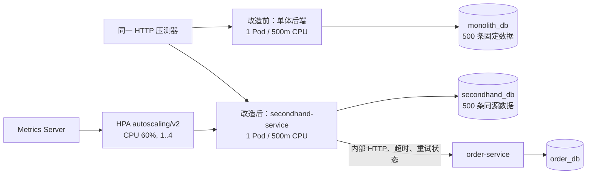

# 云原生与性能实验交付报告

## 1. 结论与验收边界

本次实验在分支 `experiment/cloud-native-performance` 上完成，运行编号为
`20260830-2300-ef71f1fe`。实验使用一台 4 vCPU、7.1 GiB 内存的 K3s
v1.36.3 单节点服务器，并在独立命名空间
`segroup8-cloud-exp-20260830-2300-ef71f1fe` 中运行。原有 `segroup8`
命名空间未被替换、扩容或写入实验数据。

验收状态：

| 项目 | 状态 | 结论 |
|---|---|---|
| HPA 扩缩容 | **通过** | 调优轮次完整观察到 `1→4→2→1`；资源、时间线和请求指标齐全 |
| 依赖故障最低课程要求 | **通过** | 停止订单服务后，二手购买返回 HTTP 202/`RETRY`；二手服务存活、就绪和无关查询保持可用 |
| 依赖恢复增强目标 | **未通过** | 订单恢复后 180 秒内仍为 `RETRY`，没有生成订单；已保留原始失败证据和根因分析 |
| 改造前后性能 | **完成** | 3 个公开接口、单体/微服务各 3 轮、相同数据和压力脚本；包含吞吐、平均、P95、错误率、CPU、内存 |

这里有意把“课程要求通过”和“增强恢复失败”分开。不能因为健康检查为 UP
就声称业务恢复成功，也不能用探索性过载结果代替稳定态性能结果。

## 2. 实验拓扑与公平性控制



公平性控制如下：

- 单体与微服务位于同一节点，数据库位于同一 MySQL 实例的不同 schema。
- 两边各插入 ID `900001..900500` 的 500 条同源二手商品，详情固定查询
  `900001`。
- 正式性能对比时删除 HPA，固定为单体 1 副本对微服务 1 副本；两边均为
  CPU request 100m / limit 500m、内存 request 256Mi / limit 768Mi。
- 使用同一无第三方依赖的 HTTP 压测器；并发 5、预热 3 秒、测量 20 秒；
  奇数轮先单体，偶数轮先微服务，降低时间顺序偏差。
- 每个窗口开始前同时检查 Deployment available 和 readiness；每 2 秒采集
  目标 Pod 的 CPU/内存。
- 正式资源采样峰值：单体 500m/247Mi，微服务 497m/234Mi；两边均实际触及
  相同 CPU 上限。

运行包没有因 Docker Hub 超时而重新构建一个来源不明的镜像。实验将已构建
JAR 挂载到服务器已缓存且固定摘要的 Java 基础镜像中，并记录双重身份：

| 构件 | 固定值 |
|---|---|
| 单体镜像标签 | `backend:sha-bb72290cff96c78ab189468b82db1f8ba3cd9323` |
| 单体镜像摘要 | `sha256:c15925877511353f870b7f811ba81af3a53dccac3acbfddddbf29b928a2a8f5a` |
| 二手 JAR SHA-256 | `52717f94e705d42e3668b994794205463ae9861725099656a7679fd196216e1e` |
| 订单 JAR SHA-256 | `4bcc3686fcd28432c8ef006298eb44f8d0a67b35d9fa7d862e81ea0e0e24909f` |
| 实验起始提交 | `ef71f1fe2349` |

该挂载方式只用于本次隔离实验，不替代三个微服务各自流水线生产的不可变候选镜像。

## 3. HPA 实验

配置为 CPU 平均利用率 60%，最小 1、最大 4；扩容每 15 秒最多增加 2 个
Pod，缩容稳定窗口 60 秒、每 15 秒最多减少 50%。调优后的正式轮次结果：

| 并发 | 时长 | 初始→峰值→最终 | 吞吐 | 平均 | P95 | 错误率 |
|---:|---:|---:|---:|---:|---:|---:|
| 10 | 90 s | `1→4→1` | 2.67 req/s | 3674.80 ms | 4770.67 ms | 2.44% |

时间线实际呈现 `1→4→2→1`。扩容时有一段只有 1 个新旧 Pod 就绪，负载停止
后才逐步恢复 4/4；Pod 没有重启。因此机制验证通过，但当前参数仍存在突发流量
下扩容赶不上请求的风险。建议最终系统把 `minReplicas` 调为 2，并优化列表查询、
预热 JVM，再用分阶段升压脚本复测。

探索性边界实验使用并发 60，共 3 轮，三轮均从 1 扩到 4 并缩回 1；但错误率
分别为 99.90%、100%、100%。这组只证明扩缩容会触发和系统的过载边界，存放在
`hpa-overload-60/`，不作为“性能良好”的证据。

## 4. 依赖故障实验

故障链路选择 `secondhand-service → order-service`，因为它既能验证公开购买接口，
又能验证真实跨服务依赖，且订单不可用不应拖垮二手浏览。

实验过程：

1. 将隔离命名空间中的 `order-service` 从 1 副本缩到 0。
2. 使用合法买家 JWT 调用 `POST /api/secondhand/900500/buy`。
3. 得到 HTTP 202，业务状态为 `RETRY`；这是受控降级，不是 500 或连接异常透传。
4. 同期 `/actuator/health/liveness` 和 `/actuator/health/readiness` 均为 UP，
   无关二手列表接口仍返回业务数据。
5. 恢复订单服务到 1/1，轮询 180 秒；请求始终停在 `RETRY`，重复购买仍为 202，
   订单库匹配记录为 0。

因此，课程要求的“停止一个依赖、采用超时/受控返回、其他服务不崩”已经满足；
增强目标“依赖恢复后自动补偿并且恰好生成一单”没有满足。

根因证据显示当前两个独立实现的内部契约没有真正对齐：二手侧发送轻量交易命令并
期待 `{code,message,data}` 信封，订单侧内部接口仍要求收货人/商品快照字段并直接
返回 `OrderView`；此外本实验设置了 1 秒读取超时。单元级 Mock 契约测试只模拟了
二手侧期望的响应，没有用真实订单服务做 provider/consumer 联合契约，因此之前未
发现。修复应作为独立业务改造：先冻结一份共享 OpenAPI/DTO，订单 provider contract
和二手 consumer contract 共用该文件，再补真实双服务恢复测试；不能在实验报告里用
手工改库伪造恢复成功。

## 5. 改造前后性能

正式结果采用三轮中位数；错误率按三轮总请求加权。单位为 req/s 和 ms。

| 接口 | 架构 | 吞吐 | 平均 | P95 | 错误率 |
|---|---|---:|---:|---:|---:|
| 普通列表 | 单体 | 1.00 | 2971.30* | 4263.64* | 55.13% |
| 普通列表 | 微服务 | 23.69 | 210.63 | 302.73 | 0% |
| 关键字+价格排序 | 单体 | 2.09 | 2355.80 | 2884.43 | 0% |
| 关键字+价格排序 | 微服务 | 47.64 | 104.86 | 185.21 | 0% |
| 详情 | 单体 | 27.29 | 183.08 | 301.28 | 0% |
| 详情 | 微服务 | 205.79 | 24.27 | 77.20 | 0% |

`*` 普通列表的单体前两轮为 100% 超时，平均/P95 只能来自第三轮成功样本，不能
视为三轮中位数。该接口最重要的结论是错误率差异，不是延迟倍率。

最有代表性的 4 个结果：

1. 详情吞吐从 27.29 提升到 205.79 req/s，约 **7.54 倍**。
2. 详情平均延迟从 183.08 降到 24.27 ms，下降约 **86.74%**。
3. 关键字查询吞吐从 2.09 提升到 47.64 req/s，约 **22.74 倍**；P95 从
   2884.43 降到 185.21 ms，下降约 **93.58%**。
4. 普通列表微服务三轮 0 错误；单体三轮加权错误率 55.13%。

这些结果只适用于本次代码、500 条数据、单节点和给定压力。不能外推为任意生产
规模下微服务都必然更快。探索性并发 20 时单体触发 3 次探针重启，已原样保存于
`performance-exploratory-overload-20/`，不混入正式表。

## 6. 一次部署失败是如何查出来的

第一次执行环境准备脚本时，日志只出现 containerd 的弃用警告，命名空间也没有创建。
先用 `kubectl get namespace` 证明失败发生在写入集群之前，再查看脚本停止位置，发现它
卡在“读取单体镜像摘要”的管道。脚本启用了 `set -euo pipefail`，其中 `awk` 找到目标
后提前 `exit`，导致仍在输出的 `ctr images list` 收到 SIGPIPE；`pipefail` 把这个正常的
提前结束当成整条管道失败。修复为让 `awk` 读到结尾再输出摘要后，第二次部署创建了
命名空间，MySQL、单体、订单、二手依次通过 rollout 和 readiness。两次日志都保留，
所以可以从“症状→失败边界→根因→修复→验证”完整复盘，而不是只写“重试后成功”。

## 7. 证据导航与复现

原始证据入口：`04_tests/cloud-native-experiments/20260830-2300-ef71f1fe/`。

| 目录 | 内容 |
|---|---|
| `environment/` | 服务器规格、Kubernetes 资源、构件身份、两次部署日志、数据条数 |
| `performance/raw/` | 正式 18 份逐请求延迟 JSON 与控制台摘要 |
| `performance/resources/` | 正式每 2 秒 CPU/内存采样 |
| `performance-exploratory-overload-20/` | 被明确降级为探索性失败的并发 20 结果 |
| `hpa/` | 调优正式轮次的时间线、资源、事件、HPA 描述和原始请求数据 |
| `hpa-overload-60/` | 三轮过载边界实验 |
| `dependency-fault/` | 故障响应、健康检查、数据库状态、恢复时间线、两侧日志与事件 |

复现脚本位于 `scripts/experiments/cloud-native/`。在 K3s 节点准备好两个 JAR 并放到
`$HOST_ROOT/jars/` 后依次执行：

```bash
GIT_COMMIT=<commit> bash scripts/experiments/cloud-native/prepare_environment.sh <run-id> <host-root>
CONCURRENCY=5 DURATION=20 WARMUP=3 bash scripts/experiments/cloud-native/run_performance_comparison.sh <host-root>/state.env
ROUNDS=1 CONCURRENCY=10 DURATION=90 WARMUP=3 bash scripts/experiments/cloud-native/run_hpa_experiment.sh <host-root>/state.env
bash scripts/experiments/cloud-native/run_dependency_fault_experiment.sh <host-root>/state.env
bash scripts/experiments/cloud-native/cleanup_environment.sh <host-root>/state.env
```

生成的 Secret、渲染后清单和数据库密码不进入 Git；证据中也没有 SSH 密码、JWT 或
数据库密码。

## 8. 提交前验证

- `bash -n scripts/experiments/cloud-native/*.sh`：通过。
- `python -m py_compile scripts/experiments/cloud-native/http_benchmark.py`：通过。
- 164 个仓库内证据文件均写入 `sha256-manifest.txt`；所有 JSON 均可解析。
- `mvn -B --no-transfer-progress -f microservices/pom.xml -pl order-service,secondhand-service -am clean test`：
  非沙箱运行 BUILD SUCCESS；security-contract 5、secondhand-service 20、
  order-service 14，共 39 个测试，0 failure、0 error、0 skipped。
- 同一 Maven 命令在受限沙箱内曾因 Windows `Access is denied` 导致 testCompile
  看不到已生成 class；非沙箱重跑成功，故归类为执行环境问题，不归类为代码测试失败。
- 实验命名空间清理后，服务器只剩原 `segroup8` 业务命名空间；原后端、前端、
  MySQL 均 Running，首页和 `/api/secondhand/list` 均为 HTTP 200。
